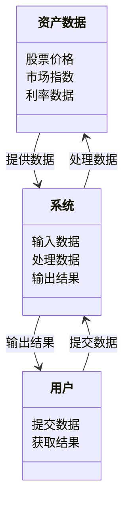
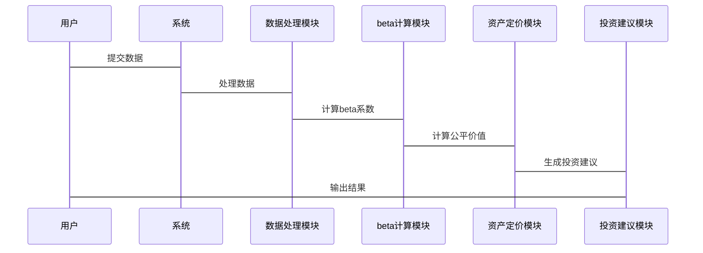

                 


# 《威廉·夏普的资本资产定价模型(CAPM)在价值投资中的应用》

> 关键词：资本资产定价模型(CAPM), 价值投资, 资产定价, 投资组合优化, beta系数, 无风险利率, 市场期望回报率

> 摘要：本文深入探讨了威廉·夏普提出的资本资产定价模型(CAPM)在价值投资中的应用。通过分析CAPM的核心概念、数学模型以及其在资产定价和投资组合优化中的具体应用，结合实际案例和系统架构设计，详细讲解了如何利用CAPM模型进行有效的投资决策。本文还探讨了CAPM的局限性，并提出了相应的改进与扩展建议。

---

# 第1章: 资本资产定价模型(CAPM)概述

## 1.1 资本资产定价模型的定义

### 1.1.1 资本资产定价模型的基本概念

资本资产定价模型（Capital Asset Pricing Model，简称CAPM）是现代金融理论中的一个基础模型，用于计算资产或投资组合的期望回报率。CAPM的核心思想是：资产的期望回报率与其承担的系统性风险（beta）成正比关系，而与非系统性风险无关。

### 1.1.2 CAPM的核心假设

CAPM基于以下假设：
1. **市场有效**：市场是充分有效的，所有信息都反映在资产价格中。
2. **投资者理性**：所有投资者都理性决策，追求效用最大化。
3. **无摩擦市场**：市场没有交易成本、税收和短路约束。
4. **同质期望**：所有投资者对资产的预期相同。
5. **单一时间框架**：模型仅考虑单一时间周期内的回报。

### 1.1.3 CAPM的理论基础与历史背景

CAPM是由威廉·夏普在1964年提出，是基于哈里·马科维茨的投资组合理论发展而来。CAPM不仅为资产定价提供了一种科学的方法，还为金融市场的风险与收益关系提供了理论基础。

### 1.1.4 CAPM的局限性与改进

CAPM的主要局限性包括：
1. **假设过于严格**：如市场有效性和无摩擦市场等假设在现实中难以成立。
2. **beta系数的局限**：CAPM仅考虑系统性风险，忽略了非系统性风险的影响。
3. **难以处理异象**：CAPM无法解释市场中的某些异常现象，如小公司效应和动量效应。

## 1.2 CAPM的数学模型与公式

### 1.2.1 CAPM的核心公式

CAPM的核心公式为：
$$ E(r_i) = R_f + \beta_i (E(r_m) - R_f) $$

其中：
- \( E(r_i) \) 是资产i的期望回报率。
- \( R_f \) 是无风险利率。
- \( \beta_i \) 是资产i的beta系数。
- \( E(r_m) \) 是市场期望回报率。

### 1.2.2 各变量的定义与解释

1. **无风险利率（R_f）**：通常是指政府债券的收益率，因为它被认为是无风险的。
2. **市场期望回报率（E(r_m））**：市场指数（如股票指数）的期望回报率。
3. **beta系数（β_i）**：衡量资产i相对于市场的系统性风险。beta=1表示与市场同步波动，beta<1表示波动性低于市场，beta>1表示波动性高于市场。

### 1.2.3 CAPM的图形化解释

CAPM可以通过图形化的方式展示资产的预期回报率与其系统性风险之间的关系。在图形中，横轴代表beta系数，纵轴代表预期回报率。市场组合的beta系数为1，预期回报率等于市场期望回报率。资产的位置由其beta系数和预期回报率决定。

### 1.2.4 beta系数的计算公式

beta系数的计算公式为：
$$ \beta_i = \frac{Cov(r_i, r_m)}{Var(r_m)} $$

其中：
- \( Cov(r_i, r_m) \) 是资产i和市场回报率之间的协方差。
- \( Var(r_m) \) 是市场回报率的方差。

## 1.3 CAPM的局限性与改进

### 1.3.1 CAPM的主要假设

CAPM基于以下假设：
1. **市场有效**：市场是充分有效的，所有信息都反映在资产价格中。
2. **投资者理性**：所有投资者都理性决策，追求效用最大化。
3. **无摩擦市场**：市场没有交易成本、税收和短路约束。
4. **同质期望**：所有投资者对资产的预期相同。
5. **单一时间框架**：模型仅考虑单一时间周期内的回报。

### 1.3.2 CAPM的局限性分析

1. **假设过于严格**：如市场有效性和无摩擦市场等假设在现实中难以成立。
2. **beta系数的局限**：CAPM仅考虑系统性风险，忽略了非系统性风险的影响。
3. **难以处理异象**：CAPM无法解释市场中的某些异常现象，如小公司效应和动量效应。

### 1.3.3 对CAPM的改进与扩展

为了克服CAPM的局限性，人们提出了多种改进与扩展：
1. **多因子模型**：如Fama-French三因子模型，考虑更多的风险因素。
2. **行为金融学**：通过引入行为因素，解释市场中的异象。
3. **时间变异性模型**：考虑风险溢价随时间变化的情况。

## 1.4 本章小结

本章介绍了CAPM的基本概念、数学公式和核心假设，并分析了其在实际应用中的局限性。通过对CAPM的局限性分析，我们了解了为什么需要对其改进与扩展，以及如何在实际投资中更好地应用CAPM。

---

# 第2章: 资本资产定价模型(CAPM)的数学模型与公式

## 2.1 CAPM的数学推导

### 2.1.1 马科维茨的现代投资组合理论

马科维茨的投资组合理论认为，最优投资组合是使风险最小化的同时实现收益最大化。CAPM是在这一理论基础上发展起来的。

### 2.1.2 CAPM的推导过程

1. **市场组合**：市场组合是所有资产以市场权重配置的投资组合，其beta系数为1。
2. **无风险资产**：无风险资产的风险系数为0，预期回报率为无风险利率。
3. **风险溢价**：资产的预期回报率与市场回报率之间的差异即为风险溢价。

通过以上分析，我们可以推导出CAPM公式：
$$ E(r_i) = R_f + \beta_i (E(r_m) - R_f) $$

### 2.1.3 CAPM的经济意义

CAPM表明，资产的预期回报率不仅取决于其自身的风险，还取决于市场整体的风险。无风险资产和市场组合是构建CAPM模型的基础。

## 2.2 CAPM的beta系数计算

### 2.2.1 beta系数的定义

beta系数衡量的是资产相对于市场的系统性风险。beta=1表示资产的系统性风险与市场相同，beta<1表示低于市场，beta>1表示高于市场。

### 2.2.2 beta系数的计算公式

$$ \beta_i = \frac{Cov(r_i, r_m)}{Var(r_m)} $$

### 2.2.3 beta系数的计算步骤

1. 计算资产i与市场回报率的协方差。
2. 计算市场回报率的方差。
3. 将协方差除以方差，得到beta系数。

### 2.2.4 beta系数的实例计算

假设资产i的回报率为[5%, 7%, 3%, 6%, 4%]，市场回报率为[3%, 5%, 2%, 4%, 3%]。

首先计算协方差：
$$ Cov(r_i, r_m) = \frac{1}{n-1} \sum_{i=1}^{n} (r_i - \bar{r_i})(r_m - \bar{r_m}) $$

然后计算方差：
$$ Var(r_m) = \frac{1}{n-1} \sum_{i=1}^{n} (r_m - \bar{r_m})^2 $$

最后计算beta系数：
$$ \beta_i = \frac{Cov(r_i, r_m)}{Var(r_m)} $$

## 2.3 CAPM的alpha系数与市场异象

### 2.3.1 alpha系数的定义

alpha系数是资产的实际回报率与CAPM模型预测回报率之间的差异。alpha系数衡量的是资产的超额收益。

### 2.3.2 市场异象与CAPM的挑战

市场异象是指市场中存在的一些与CAPM模型预测不符的现象，如小公司效应和动量效应。这些异象表明CAPM模型在实际中的局限性。

### 2.3.3 如何利用alpha系数进行投资

如果一个资产的alpha系数为正，说明该资产的实际回报率高于CAPM模型预测的回报率，可能是值得投资的资产。

## 2.4 本章小结

本章详细推导了CAPM的数学模型，重点讲解了beta系数的计算方法，并通过实例展示了如何计算beta系数。此外，还介绍了alpha系数和市场异象，分析了CAPM模型在实际应用中的局限性。

---

# 第3章: 资本资产定价模型(CAPM)与价值投资的结合

## 3.1 价值投资的基本原理

### 3.1.1 价值投资的定义

价值投资是一种投资策略，强调以低于内在价值的价格购买资产。价值投资者认为市场有时会低估某些资产的价值，长期来看，这些资产会回归其内在价值。

### 3.1.2 价值投资的核心理念

价值投资的核心理念包括：
1. **安全边际**：购买价格远低于内在价值的资产。
2. **长期投资**：关注长期回报，而不是短期波动。
3. **基本面分析**：通过分析财务报表等基本面因素，评估资产的价值。

### 3.1.3 价值投资与CAPM的联系

CAPM提供了一种科学的资产定价方法，可以帮助价值投资者确定资产的公平价值，从而找到被市场低估的资产。

## 3.2 CAPM在价值投资中的应用

### 3.2.1 资产定价与价值评估

通过CAPM模型，投资者可以计算出资产的公平价值，即其应有的理论价格。如果资产的实际市场价格低于公平价值，说明该资产被低估，适合进行价值投资。

### 3.2.2 投资组合优化与CAPM

CAPM可以帮助投资者构建最优投资组合，使在给定风险水平下实现最大收益，或在给定收益水平下实现最小风险。

### 3.2.3 风险调整后的收益评估

通过CAPM，投资者可以评估资产的风险调整后的收益，从而更好地进行投资决策。

## 3.3 CAPM与价值投资的结合案例

### 3.3.1 案例背景介绍

假设我们有一个股票组合，需要评估其是否被市场低估。

### 3.3.2 案例分析与计算

1. 计算市场期望回报率。
2. 计算资产的beta系数。
3. 使用CAPM公式计算资产的公平价值。
4. 比较资产的公平价值与其市场价格，确定是否存在价值低估。

### 3.3.3 案例总结与启示

通过案例分析，我们发现CAPM可以帮助投资者识别被低估的资产，从而指导价值投资决策。

## 3.4 本章小结

本章探讨了CAPM在价值投资中的应用，通过结合资产定价和投资组合优化，帮助投资者找到被低估的资产，实现超额收益。

---

# 第4章: 资本资产定价模型(CAPM)的系统分析与架构设计

## 4.1 系统分析

### 4.1.1 问题场景介绍

我们需要设计一个基于CAPM的资产定价系统，帮助投资者进行价值投资决策。

### 4.1.2 项目介绍

项目目标是开发一个基于CAPM模型的资产定价系统，实现资产的公平价值计算、风险评估和投资建议生成。

### 4.1.3 系统功能设计

系统主要功能包括：
1. 数据输入与处理。
2. beta系数计算。
3. 资产定价计算。
4. 投资建议生成。
5. 结果展示与报告生成。

### 4.1.4 领域模型（Mermaid类图）



## 4.2 系统架构设计

### 4.2.1 系统架构图

```mermaid
client
    / | \
   /  |  \
  service1 service2 service3
  |    |     |
  service层
  |    |     |
  DAO层
  |    |     |
  数据库
```

### 4.2.2 系统接口设计

系统接口主要分为：
1. 数据输入接口。
2. 数据处理接口。
3. 结果输出接口。

### 4.2.3 系统交互流程



## 4.3 本章小结

本章从系统架构的角度，详细设计了基于CAPM的资产定价系统的架构，包括功能设计、接口设计和交互流程设计。

---

# 第5章: 项目实战——基于CAPM的资产定价系统开发

## 5.1 环境安装与配置

### 5.1.1 安装Python环境

安装Python 3.x版本，建议使用Anaconda或Miniconda。

### 5.1.2 安装必要的库

安装以下Python库：
- pandas
- numpy
- matplotlib
- scikit-learn

### 5.1.3 数据获取与准备

从金融数据源（如Yahoo Finance）获取股票价格和市场指数数据。

## 5.2 系统核心实现源代码

### 5.2.1 数据处理模块

```python
import pandas as pd
import numpy as np

# 获取数据
data = pd.read_csv('stock_data.csv')

# 计算市场回报率
market_return = data['Market'].pct_change().dropna()
```

### 5.2.2 beta系数计算模块

```python
def calculate_beta(stock_returns, market_returns):
    # 计算协方差
    cov = np.cov(stock_returns, market_returns)[0, 1]
    # 计算方差
    var = np.var(market_returns)
    # 计算beta
    beta = cov / var
    return beta

beta = calculate_beta(stock_returns, market_returns)
```

### 5.2.3 资产定价模块

```python
def calculate_expected_return(risk_free_rate, beta, market_return):
    expected_return = risk_free_rate + beta * (market_return - risk_free_rate)
    return expected_return

risk_free_rate = 0.05  # 无风险利率
market_return = np.mean(market_returns)
expected_return = calculate_expected_return(risk_free_rate, beta, market_return)
```

### 5.2.4 投资建议模块

```python
if expected_return > actual_return:
    print("资产被低估，建议买入")
elif expected_return < actual_return:
    print("资产被高估，建议卖出")
else:
    print("资产价格合理，建议持有")
```

## 5.3 代码应用解读与分析

### 5.3.1 数据处理模块解读

数据处理模块负责获取和整理数据，包括股票价格和市场指数数据。

### 5.3.2 beta系数计算模块解读

beta系数计算模块通过协方差和方差计算资产的系统性风险系数。

### 5.3.3 资产定价模块解读

资产定价模块基于CAPM公式，计算资产的公平价值。

### 5.3.4 投资建议模块解读

投资建议模块根据资产的实际回报率与预期回报率的差异，给出买入、卖出或持有的建议。

## 5.4 实际案例分析

### 5.4.1 案例背景

假设我们有一个股票组合，需要评估其是否被市场低估。

### 5.4.2 数据处理

从Yahoo Finance获取股票价格和市场指数数据，清洗数据，计算回报率。

### 5.4.3 beta系数计算

使用协方差和方差计算beta系数。

### 5.4.4 资产定价计算

使用CAPM公式计算资产的公平价值。

### 5.4.5 投资建议生成

根据实际回报率与预期回报率的差异，生成投资建议。

### 5.4.6 结果展示

展示计算结果，包括beta系数、预期回报率和投资建议。

## 5.5 本章小结

本章通过实际案例，详细讲解了如何使用CAPM模型进行资产定价，并基于Python开发了一个简单的资产定价系统。

---

# 第6章: 最佳实践、小结与注意事项

## 6.1 最佳实践

### 6.1.1 数据质量的重要性

确保数据的准确性和完整性，选择可靠的金融数据源。

### 6.1.2 模型假设的合理性

在实际应用中，需要考虑模型的假设是否合理，如市场有效性和无摩擦市场等。

### 6.1.3 结合其他因素

在进行投资决策时，除了CAPM模型，还应考虑其他因素，如公司基本面和市场情绪等。

## 6.2 小结

### 6.2.1 本文的核心内容

本文详细探讨了CAPM在价值投资中的应用，从理论到实践，系统地讲解了如何利用CAPM模型进行资产定价和投资组合优化。

### 6.2.2 本文的主要贡献

本文不仅提供了CAPM模型的理论知识，还通过实际案例和系统设计，展示了如何将CAPM应用于实际投资决策中。

## 6.3 注意事项

### 6.3.1 模型的局限性

CAPM的假设在实际中可能不成立，导致模型结果的偏差。

### 6.3.2 数据的准确性

数据的准确性和完整性对模型结果有重要影响。

### 6.3.3 市场环境的变化

市场环境的变化可能会影响模型的有效性，需要及时调整模型参数。

## 6.4 拓展阅读

### 6.4.1 推荐书籍

1. 《投资学》——曼努埃尔·H·Merton
2. 《价值投资实战》——本杰明·格雷厄姆

### 6.4.2 推荐论文

1. William F. Sharpe, "The Theory of Portfolio Investment," 1964.
2. Eugene F. Fama, "The Structure of Security Prices," 1970.

## 6.5 本章小结

本章总结了CAPM在价值投资中的应用，并提出了实际应用中的注意事项和建议。通过本文的学习，读者可以更好地理解和应用CAPM模型进行投资决策。

---

# 作者：AI天才研究院/AI Genius Institute & 禅与计算机程序设计艺术 /Zen And The Art of Computer Programming

---

通过以上内容，我们可以看到，CAPM在价值投资中的应用是一个复杂但重要的课题。通过理解和应用CAPM模型，投资者可以更好地评估资产的价值，做出更科学的投资决策。希望本文能为读者提供有价值的参考和启发。

