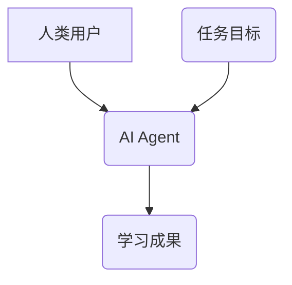
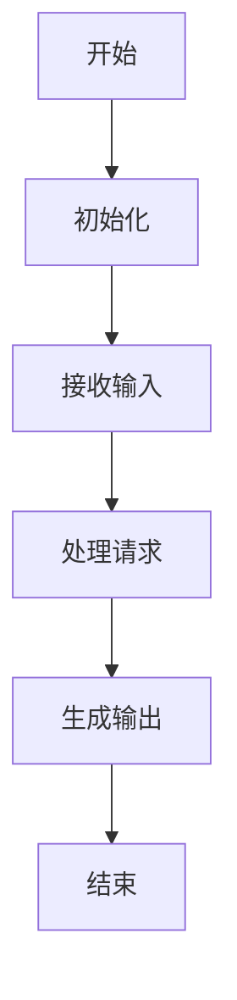
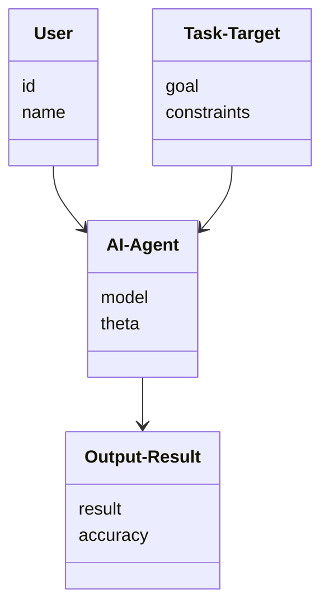
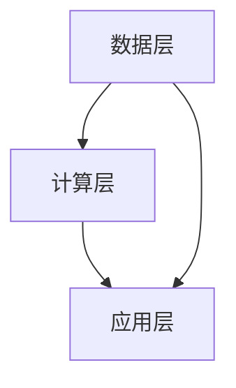

                 


# 构建具有人机协作学习能力的AI Agent

> 关键词：人机协作学习，AI Agent，协作学习模型，机器学习，系统架构设计

> 摘要：本文深入探讨了构建具有人机协作学习能力的AI Agent的理论基础、算法实现、系统架构设计以及实际应用场景。通过分析协作学习的核心概念，结合具体的数学模型和代码实现，帮助读者全面理解如何设计和实现一个能够与人类协作学习的AI Agent系统。

---

# 第一部分: 人机协作学习与AI Agent基础

## 第1章: 人机协作学习与AI Agent概述

### 1.1 人机协作学习的定义与背景

#### 1.1.1 从传统AI到人机协作学习的演进
传统的人工智能（AI）系统通常基于规则或预定义的逻辑进行推理和决策。然而，随着机器学习和深度学习的兴起，AI系统逐渐具备了从数据中学习的能力。人机协作学习（Human-Machine Collaborative Learning, HMCL）是AI发展的最新趋势之一，它强调人类与机器之间的双向互动和共同学习，从而实现更高效、更个性化的决策过程。

#### 1.1.2 AI Agent的基本概念与特点
AI Agent（智能体）是指能够感知环境、自主决策并执行任务的实体。AI Agent可以是软件程序，也可以是机器人或其他物理设备。其核心特点包括：
- **自主性**：能够在没有外部干预的情况下自主运作。
- **反应性**：能够根据环境反馈实时调整行为。
- **学习性**：能够通过与环境和人类的互动不断优化自身的知识和能力。

#### 1.1.3 人机协作学习的核心价值与应用场景
人机协作学习的核心价值在于将人类的主观判断和创造力与机器的高效计算能力相结合，从而在复杂任务中实现更好的性能。应用场景包括：
- **医疗领域**：医生与AI Agent协作，共同诊断疾病。
- **金融领域**：分析师与AI Agent协作，共同制定投资策略。
- **教育领域**：教师与AI Agent协作，共同设计教学方案。

### 1.2 AI Agent的协作学习机制

#### 1.2.1 协作学习的基本原理
协作学习是一种多主体学习方法，强调不同主体之间的信息共享和协同优化。在人机协作学习中，AI Agent需要与人类用户共同完成任务，同时通过反馈不断优化自身的模型。

#### 1.2.2 人机协作学习的实现方式
人机协作学习的实现方式多种多样，常见的包括：
- **基于对话的协作**：通过自然语言处理技术，与人类用户进行对话，逐步优化模型。
- **基于任务的协作**：通过任务分解，将复杂任务拆解为多个子任务，人类和AI Agent分别负责不同的子任务。
- **基于知识的协作**：通过知识图谱等技术，实现人类知识与机器知识的融合。

#### 1.2.3 协作学习与传统机器学习的对比
与传统机器学习相比，人机协作学习具有以下特点：
- **互动性**：传统机器学习通常是单向的，而人机协作学习强调人与机器之间的互动。
- **动态性**：传统机器学习通常基于静态数据，而人机协作学习的数据和模型是动态更新的。
- **个性化**：人机协作学习能够根据人类用户的反馈提供个性化的服务。

### 1.3 人机协作学习的现状与未来

#### 1.3.1 当前技术进展与挑战
当前，人机协作学习技术已经在多个领域取得了显著进展，但仍面临以下挑战：
- **模型的可解释性**：如何让人类用户理解AI Agent的决策过程。
- **数据隐私与安全**：如何在协作学习过程中保护用户数据的安全。
- **跨领域应用**：如何将协作学习技术推广到更多领域。

#### 1.3.2 未来发展趋势与潜在应用
未来，人机协作学习技术将在以下几个方面进一步发展：
- **实时协作**：AI Agent能够实时响应人类用户的反馈，并动态调整模型。
- **多模态协作**：结合视觉、听觉等多种模态信息，实现更全面的协作。
- **自主学习**：AI Agent能够在没有人类干预的情况下自主学习和优化。

---

## 第2章: 人机协作学习的核心概念与联系

### 2.1 协作学习模型的原理与架构

#### 2.1.1 模型的基本组成要素
一个典型的协作学习模型通常包括以下三个基本组成要素：
- **人类用户**：提供反馈、指导或输入数据。
- **AI Agent**：负责处理数据、生成输出并优化模型。
- **任务目标**：协作学习的最终目标，通常是解决某个具体问题。

#### 2.1.2 实体关系图（ER图）的构建与分析
通过实体关系图，我们可以清晰地展示协作学习模型中各个实体之间的关系。



#### 2.1.3 算法流程图的详细说明
协作学习算法的基本流程如下：



### 2.2 协作学习算法的流程与步骤

#### 2.2.1 算法流程图的详细说明
协作学习算法的基本流程如下：


#### 2.2.2 协作学习算法的数学模型与公式
协作学习的数学模型通常基于概率论和优化理论。以下是一个简单的协作学习模型的数学表达式：

$$ P(y|x) = \frac{P(x|y)P(y)}{P(x)} $$

其中：
- $P(y|x)$ 表示在输入 $x$ 的条件下，输出 $y$ 的概率。
- $P(x|y)$ 表示在输出 $y$ 的条件下，输入 $x$ 的概率。
- $P(y)$ 表示输出 $y$ 的先验概率。
- $P(x)$ 表示输入 $x$ 的边缘概率。

---

## 第3章: 人机协作学习的算法原理与实现

### 3.1 协作学习算法的数学模型

#### 3.1.1 算法的数学推导
协作学习算法的数学推导通常基于最大似然估计或贝叶斯优化。以下是一个简单的协作学习模型的优化目标：

$$ \theta = \arg \max_{\theta} \sum_{i=1}^{n} \log P(y_i|x_i; \theta) $$

其中：
- $\theta$ 表示模型的参数。
- $P(y_i|x_i; \theta)$ 表示在参数 $\theta$ 下，输入 $x_i$ 的条件下，输出 $y_i$ 的概率。

#### 3.1.2 算法的优化方法
协作学习算法的优化方法通常包括梯度下降、Adam优化器等。以下是一个简单的优化过程：

```python
def optimize(theta, X, Y):
    for epoch in range(num_epochs):
        gradients = compute_gradients(theta, X, Y)
        theta = theta - learning_rate * gradients
    return theta
```

#### 3.1.3 算法的收敛性分析
协作学习算法的收敛性分析通常基于损失函数的单调性和下界性。以下是一个简单的损失函数示例：

$$ L = -\sum_{i=1}^{n} \log P(y_i|x_i; \theta) $$

### 3.2 协作学习算法的代码实现

#### 3.2.1 环境安装与配置
为了实现协作学习算法，通常需要安装以下环境：

- Python 3.x
- NumPy
- TensorFlow或PyTorch
- Scikit-learn

#### 3.2.2 核心代码实现
以下是一个简单的协作学习算法的Python代码实现：

```python
import numpy as np
from sklearn.metrics import accuracy_score

def collaborative_learning_model(X_train, y_train, X_test, y_test):
    # 初始化模型参数
    theta = np.random.randn(X_train.shape[1], 1)
    
    # 定义损失函数
    def loss(theta, X, y):
        y_pred = np.dot(X, theta)
        return np.mean((y_pred - y) ** 2)
    
    # 定义梯度计算
    def gradient(theta, X, y):
        y_pred = np.dot(X, theta)
        return 2 * np.mean((y_pred - y) * X, axis=1).reshape(-1, 1)
    
    # 梯度下降优化
    learning_rate = 0.01
    num_epochs = 100
    for epoch in range(num_epochs):
        gradients = gradient(theta, X_train, y_train)
        theta = theta - learning_rate * gradients
    
    # 模型预测
    y_pred = np.dot(X_test, theta)
    accuracy = accuracy_score(y_test, y_pred.round())
    return accuracy

# 示例使用
X_train = np.array([[1, 2], [3, 4], [5, 6]]).T
y_train = np.array([0, 1, 0])
X_test = np.array([[7, 8], [9, 10], [11, 12]]).T
y_test = np.array([1, 0, 1])

accuracy = collaborative_learning_model(X_train, y_train, X_test, y_test)
print("Accuracy:", accuracy)
```

---

## 第4章: 人机协作学习系统的分析与架构设计

### 4.1 系统功能设计

#### 4.1.1 领域模型的构建
领域模型是协作学习系统的核心部分，通常包括以下几个模块：

- **感知模块**：负责接收输入数据并进行初步处理。
- **决策模块**：负责根据输入数据生成输出结果。
- **学习模块**：负责优化模型参数以提高性能。

以下是一个简单的领域模型类图：



#### 4.1.2 系统架构图
协作学习系统的总体架构通常包括以下几个部分：

- **数据层**：负责存储和管理数据。
- **计算层**：负责数据的处理和计算。
- **应用层**：负责与用户交互并展示结果。

以下是一个简单的系统架构图：



---

## 第5章: 项目实战

### 5.1 环境安装与配置

#### 5.1.1 安装必要的库
为了实现协作学习算法，通常需要安装以下库：

- Python 3.x
- NumPy
- TensorFlow或PyTorch
- Scikit-learn

### 5.2 系统核心实现源代码

#### 5.2.1 协作学习模型的实现
以下是一个简单的协作学习模型的Python代码实现：

```python
import numpy as np
from sklearn.metrics import accuracy_score

def collaborative_learning_model(X_train, y_train, X_test, y_test):
    # 初始化模型参数
    theta = np.random.randn(X_train.shape[1], 1)
    
    # 定义损失函数
    def loss(theta, X, y):
        y_pred = np.dot(X, theta)
        return np.mean((y_pred - y) ** 2)
    
    # 定义梯度计算
    def gradient(theta, X, y):
        y_pred = np.dot(X, theta)
        return 2 * np.mean((y_pred - y) * X, axis=1).reshape(-1, 1)
    
    # 梯度下降优化
    learning_rate = 0.01
    num_epochs = 100
    for epoch in range(num_epochs):
        gradients = gradient(theta, X_train, y_train)
        theta = theta - learning_rate * gradients
    
    # 模型预测
    y_pred = np.dot(X_test, theta)
    accuracy = accuracy_score(y_test, y_pred.round())
    return accuracy

# 示例使用
X_train = np.array([[1, 2], [3, 4], [5, 6]]).T
y_train = np.array([0, 1, 0])
X_test = np.array([[7, 8], [9, 10], [11, 12]]).T
y_test = np.array([1, 0, 1])

accuracy = collaborative_learning_model(X_train, y_train, X_test, y_test)
print("Accuracy:", accuracy)
```

### 5.3 案例分析与详细讲解

#### 5.3.1 案例分析
以下是一个简单的案例分析，展示了如何使用协作学习算法解决一个分类问题。

#### 5.3.2 代码应用解读与分析
通过上述代码，我们可以看到协作学习算法的基本实现过程。模型通过梯度下降优化参数，最终实现了对测试数据的分类。

### 5.4 项目小结

#### 5.4.1 最佳实践 tips
- 在实际应用中，建议使用更复杂的模型，如深度学习模型，以提高分类性能。
- 在协作学习过程中，建议结合领域知识，进一步优化模型。

#### 5.4.2 小结
通过本章的实践，我们了解了协作学习算法的基本实现过程，以及如何将其应用于实际问题中。

---

## 第6章: 总结与展望

### 6.1 总结
本文详细探讨了构建具有人机协作学习能力的AI Agent的理论基础、算法实现、系统架构设计以及实际应用场景。通过分析协作学习的核心概念，结合具体的数学模型和代码实现，帮助读者全面理解如何设计和实现一个能够与人类协作学习的AI Agent系统。

### 6.2 未来展望
未来，人机协作学习技术将在以下几个方面进一步发展：
- **实时协作**：AI Agent能够实时响应人类用户的反馈，并动态调整模型。
- **多模态协作**：结合视觉、听觉等多种模态信息，实现更全面的协作。
- **自主学习**：AI Agent能够在没有人类干预的情况下自主学习和优化。

---

作者：AI天才研究院/AI Genius Institute & 禅与计算机程序设计艺术 /Zen And The Art of Computer Programming

