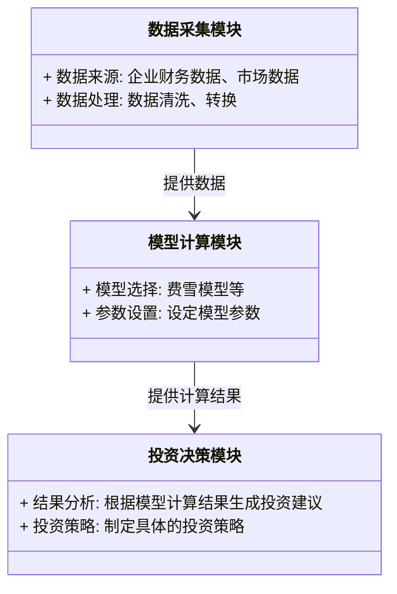
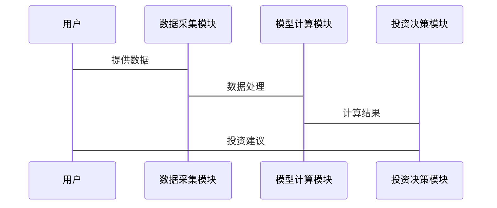

                 


# 费雪的成长型投资案例研究

**关键词：** 成长型投资，费雪投资模型，十倍股，投资策略，投资分析

**摘要：** 本文系统地介绍并分析了菲利普·费雪的成长型投资理念及其在实际投资中的应用。文章首先概述了费雪的投资背景及其核心思想，接着详细分析了成长型投资的关键要素，包括企业成长性评估和财务指标分析。随后，本文深入探讨了费雪投资模型的数学结构和算法实现，并结合具体案例展示了模型的应用。最后，总结了成长型投资的优缺点及其在现代投资环境中的适应性，为投资者提供了实用的指导和建议。

---

## 第一部分：费雪投资理念概述

### 第1章：费雪投资理念概述

#### 1.1 费雪的成长型投资背景

##### 1.1.1 费雪的生平与投资经历

菲利普·费雪（Philip A. Fisher）是20世纪著名的投资专家，被誉为“成长型投资之父”。他于1903年出生于美国加利福尼亚州，1926年进入投资行业，生涯中管理过多个投资基金，取得了卓越的投资业绩。费雪的投资理念以长期增长为导向，注重选择那些具有强大竞争优势和持续增长潜力的企业。

##### 1.1.2 成长型投资的定义与核心理念

成长型投资是一种投资策略，旨在通过投资于具有持续增长潜力的企业，实现长期资本增值。与价值投资不同，成长型投资更关注企业的未来盈利能力和市场扩展能力，而非仅仅依赖于当前的估值。

费雪的成长型投资理念的核心在于：选择那些能够在较长一段时间内实现收入和利润快速增长的企业。他提出了“十倍股”概念，即那些在未来几年内有可能增长10倍以上的股票。

##### 1.1.3 费雪投资理念的演变与影响

费雪的投资理念在其职业生涯中不断发展和演变。早期，他注重企业的财务健康状况和行业地位；后期，他更加强调企业的创新能力和市场适应性。费雪的投资理念对后来的成长型投资策略产生了深远影响，成为现代投资理论的重要组成部分。

#### 1.2 成长型投资的核心要素

##### 1.2.1 企业成长性分析

企业成长性分析是成长型投资的核心，主要包括对企业未来收入和利润增长的预测。费雪认为，投资者应关注企业的市场份额、竞争优势、管理团队等因素，以评估其未来的增长潜力。

##### 1.2.2 行业地位与竞争优势

企业的行业地位和竞争优势是决定其成长性的关键因素。费雪强调，投资者应选择那些在行业内具有领先地位，并能够持续创新和改进的企业。

##### 1.2.3 财务健康状况评估

财务健康状况评估是成长型投资的重要组成部分。费雪认为，企业的财务状况包括盈利能力、资产负债情况、现金流等指标，是评估企业成长潜力的重要依据。

#### 1.3 费雪投资理念的现代应用

##### 1.3.1 现代投资环境的变化

随着经济全球化和科技的进步，现代投资环境发生了巨大变化。互联网、人工智能等新技术的发展为成长型投资提供了更多机会，同时也带来了新的挑战。

##### 1.3.2 费雪理念在新兴市场的适应性

在新兴市场，成长型投资的机会更加丰富，但也面临更多的不确定性和风险。费雪的理念需要结合新兴市场的特点进行调整，例如更加注重企业的创新能力和发展潜力。

##### 1.3.3 数字化投资工具对成长型投资的影响

数字化投资工具的出现，使得成长型投资的分析更加高效和精准。投资者可以利用大数据和人工智能技术，进行更加全面的企业分析和市场预测。

#### 1.4 本章小结

本章系统地介绍了费雪的成长型投资理念及其核心要素，分析了其在现代投资环境中的应用和演变。通过对企业成长性、行业地位和财务状况的分析，投资者可以更好地识别具有长期增长潜力的企业。

---

## 第二部分：成长型投资的核心概念与分析框架

### 第2章：成长型投资的核心概念

#### 2.1 费雪的成长型投资模型

##### 2.1.1 费雪投资模型的构成要素

费雪的成长型投资模型主要包括以下几个构成要素：
1. **企业成长性分析**：评估企业的收入和利润增长率。
2. **行业地位与竞争优势**：分析企业在行业中的地位及其竞争优势。
3. **财务健康状况评估**：评估企业的财务状况，包括盈利能力、资产负债情况等。

##### 2.1.2 模型的数学表达与公式推导

费雪的投资模型可以通过以下数学公式进行表达：
$$
\text{投资价值} = \text{未来现金流的现值}
$$

其中，未来现金流的现值可以通过对企业未来收入和利润的预测进行计算。

##### 2.1.3 模型的优缺点分析

**优点**：费雪模型能够帮助投资者识别具有长期增长潜力的企业，具有较强的前瞻性和指导性。

**缺点**：由于模型基于对未来增长的预测，具有较大的不确定性，容易受到市场波动和企业实际表现的影响。

#### 2.2 成长型企业的特征分析

##### 2.2.1 成长型企业与周期性企业的对比

| 特征 | 成长型企业 | 周期性企业 |
|------|------------|------------|
| 收入增长 | 快速增长 | 波动较大 |
| 利润率 | 高且稳定 | 波动较大 |
| 市场地位 | 领先地位 | 竞争激烈 |

##### 2.2.2 成长型企业财务指标分析

1. **收入增长率**：企业的收入增长率是评估其成长潜力的重要指标。
2. **净利润率**：净利润率反映了企业的盈利能力。
3. **资产负债率**：资产负债率反映了企业的财务健康状况。

##### 2.2.3 成长型企业市场表现分析

成长型企业通常具有较高的市盈率和市净率，但其股价表现具有较大的波动性。

#### 2.3 费雪的“十倍股”投资策略

##### 2.3.1 十倍股的定义与特征

十倍股是指那些在未来几年内有可能增长10倍以上的股票。这些股票通常来自具有强大竞争优势和持续增长潜力的企业。

##### 2.3.2 十倍股的筛选标准

1. **行业领先地位**：企业在行业内具有领先地位。
2. **强大的竞争优势**：企业具有独特的竞争优势，例如技术、品牌、成本优势等。
3. **财务健康状况**：企业具有健康的财务状况，包括良好的盈利能力、合理的资产负债率等。

##### 2.3.3 十倍股投资的风险与收益

**收益**：十倍股投资的收益潜力巨大，但需要较长的持有时间。

**风险**：十倍股投资的风险较高，由于市场波动和企业实际表现的影响，投资回报具有较大的不确定性。

#### 2.4 本章小结

本章详细分析了费雪的成长型投资模型的核心概念，包括企业成长性分析、行业地位与竞争优势、财务健康状况评估等。通过对比成长型企业与周期性企业的特征，投资者可以更好地识别具有长期增长潜力的企业。

---

## 第三部分：成长型投资的数学模型与算法实现

### 第3章：成长型投资的数学模型

#### 3.1 费雪投资模型的数学推导

##### 3.1.1 模型假设与变量定义

假设：
- 企业的收入和利润能够以恒定的速度增长。
- 投资者要求的回报率为固定值。

变量：
- \( r \): 投资者要求的回报率
- \( g \): 企业的收入增长率
- \( P_0 \): 当前股价
- \( P_n \): n年后的股价

##### 3.1.2 模型的数学公式

费雪模型的数学公式为：
$$
P_0 = \frac{E_1}{(r - g)}
$$

其中，\( E_1 \) 为第一年的预期收益。

##### 3.1.3 模型的验证与优化

通过历史数据验证模型的有效性，并根据实际情况对模型进行优化，例如考虑通货膨胀、税率等因素。

#### 3.2 成长型企业价值评估的算法实现

##### 3.2.1 算法原理与步骤

1. **数据采集**：收集企业的财务数据，包括收入、利润、增长率等。
2. **模型计算**：使用费雪模型计算企业的内在价值。
3. **结果分析**：根据计算结果，评估企业的投资价值。

##### 3.2.2 算法的代码实现

```python
def calculate_intrinsic_value(revenue_growth, profit_margin, required_return):
    # 计算内在价值
    intrinsic_value = (profit_margin * (1 + revenue_growth)) / (required_return - revenue_growth)
    return intrinsic_value

# 示例数据
revenue_growth = 0.2  # 收入增长率
profit_margin = 0.3  # 利润率
required_return = 0.1  # 投资者要求的回报率

intrinsic_value = calculate_intrinsic_value(revenue_growth, profit_margin, required_return)
print("内在价值:", intrinsic_value)
```

##### 3.2.3 算法的优缺点分析

**优点**：算法简单易懂，计算效率高。

**缺点**：假设条件过于理想化，实际应用中需要考虑更多因素。

#### 3.3 投资组合优化的数学模型

##### 3.3.1 投资组合优化的目标函数

$$
\text{最大化} \quad \sum_{i=1}^n r_i w_i
$$

其中，\( r_i \) 为第i只股票的预期收益，\( w_i \) 为第i只股票的投资权重。

##### 3.3.2 约束条件与求解方法

约束条件：
$$
\sum_{i=1}^n w_i = 1
$$

求解方法：使用拉格朗日乘数法或其他优化算法。

##### 3.3.3 模型的实例应用

通过具体案例分析，展示如何利用数学模型优化投资组合。

#### 3.4 本章小结

本章详细讲解了成长型投资的数学模型，包括费雪模型的数学推导和算法实现。通过代码示例和实例分析，读者可以更好地理解和应用这些模型进行投资决策。

---

## 第四部分：成长型投资的系统分析与架构设计

### 第4章：成长型投资系统的架构设计

#### 4.1 系统功能模块划分

##### 4.1.1 数据采集模块

- 数据来源：企业财务数据、市场数据等。
- 数据处理：数据清洗、转换等。

##### 4.1.2 模型计算模块

- 模型选择：选择适合的数学模型进行计算。
- 参数设置：设定模型的参数值。

##### 4.1.3 投资决策模块

- 结果分析：根据模型计算结果，生成投资建议。
- 投资策略：制定具体的投资策略。

#### 4.2 系统架构设计

##### 4.2.1 分层架构设计

- 数据层：存储企业数据。
- 业务逻辑层：实现数据处理和模型计算。
- 用户界面层：展示结果和投资建议。

##### 4.2.2 模块之间的交互关系

使用mermaid的类图展示模块之间的交互关系：



##### 4.2.3 系统的可扩展性设计

通过模块化设计，确保系统的可扩展性，方便未来功能的添加和优化。

#### 4.3 系统接口设计

##### 4.3.1 系统接口设计

定义系统的输入和输出接口，确保模块之间的数据交互顺畅。

##### 4.3.2 系统交互设计

使用mermaid的序列图展示系统的交互流程：



#### 4.4 本章小结

本章详细分析了成长型投资系统的架构设计，包括功能模块划分、系统架构设计和系统接口设计。通过mermaid图的展示，读者可以更好地理解系统的整体结构和各模块之间的关系。

---

## 第五部分：成长型投资的项目实战

### 第5章：成长型投资的项目实战

#### 5.1 环境安装与配置

##### 5.1.1 投资分析工具的安装

安装必要的投资分析工具，例如Python编程环境、数据分析库（Pandas、NumPy等）。

##### 5.1.2 数据源的选择与获取

选择合适的数据源，例如股票数据、行业报告等，并获取相关数据。

#### 5.2 核心实现源代码

##### 5.2.1 数据分析代码

```python
import pandas as pd

# 获取企业数据
data = pd.read_csv('enterprise_data.csv')

# 计算收入增长率
data['收入增长率'] = (data['收入'] / data['收入'].shift(1)) - 1

# 计算净利润率
data['净利润率'] = data['净利润'] / data['收入']
```

##### 5.2.2 投资决策代码

```python
def calculate_intrinsic_value(revenue_growth, profit_margin, required_return):
    # 计算内在价值
    intrinsic_value = (profit_margin * (1 + revenue_growth)) / (required_return - revenue_growth)
    return intrinsic_value

# 示例数据
revenue_growth = 0.2  # 收入增长率
profit_margin = 0.3  # 利润率
required_return = 0.1  # 投资者要求的回报率

intrinsic_value = calculate_intrinsic_value(revenue_growth, profit_margin, required_return)
print("内在价值:", intrinsic_value)
```

#### 5.3 代码应用解读与分析

通过具体的代码示例，展示如何利用Python进行成长型投资的分析和决策。

#### 5.4 实际案例分析

##### 5.4.1 案例选择与分析

选择一个具体的成长型企业作为案例，分析其投资价值。

##### 5.4.2 投资决策过程

详细描述投资决策的整个过程，包括数据收集、模型计算、结果分析等。

##### 5.4.3 投资结果与反思

总结投资结果，并进行反思，分析可能存在的问题和改进方向。

#### 5.5 本章小结

本章通过具体的项目实战，展示了如何利用Python和相关工具进行成长型投资的分析和决策。通过案例分析，读者可以更好地理解理论知识，并能够将其应用到实际投资中。

---

## 第六部分：成长型投资的最佳实践与小结

### 第6章：成长型投资的最佳实践

#### 6.1 投资策略与风险管理

##### 6.1.1 成长型投资策略

1. **长期投资**：注重企业的长期增长潜力。
2. **分散投资**：通过投资多个成长型企业分散风险。
3. **定期调整**：根据市场变化和企业表现进行投资组合的调整。

##### 6.1.2 风险管理

1. **风险评估**：评估投资中的各种风险因素。
2. **风险控制**：制定有效的风险控制措施。

#### 6.2 长期投资的重要性

长期投资是成长型投资的核心策略。通过长期持有优质成长型企业，投资者可以分享企业的长期增长收益。

#### 6.3 阅读与学习建议

##### 6.3.1 经典书籍

1. 《股票做买卖》（The Intelligent Investor）——本杰明·格雷厄姆
2. 《投资之道》（The Art of Investment）——菲利普·费雪

##### 6.3.2 在线资源

1. 投资论坛和社区：如雪球、东方财富网等。
2. 专业投资报告：如券商研究报告、行业分析报告等。

#### 6.4 本章小结

本章总结了成长型投资的最佳实践，包括投资策略、风险管理、长期投资的重要性以及阅读和学习建议。通过这些最佳实践，投资者可以更好地进行成长型投资，并实现长期资本增值。

---

## 作者：AI天才研究院/AI Genius Institute & 禅与计算机程序设计艺术 /Zen And The Art of Computer Programming

---

以上是《费雪的成长型投资案例研究》的技术博客文章的详细目录和内容概述。每一部分都按照逻辑顺序展开，确保内容详实、结构清晰。通过理论分析和实际案例的结合，读者可以深入理解费雪的成长型投资理念，并能够将其应用到实际投资中。

