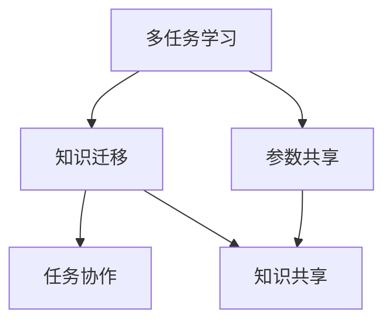

                 


# AI Agent的多任务学习与知识迁移

> 关键词：AI Agent, 多任务学习, 知识迁移, 神经网络, 知识表示, 深度学习

> 摘要：AI Agent的多任务学习与知识迁移是当前人工智能领域的重要研究方向。本文从AI Agent的基本概念出发，详细探讨了多任务学习与知识迁移的核心原理、算法实现、系统架构设计以及实际应用场景。通过理论与实践相结合的方式，本文旨在为AI Agent的多任务学习与知识迁移提供一个全面且深入的技术指南。

---

## 第一部分: AI Agent的多任务学习与知识迁移背景介绍

### 第1章: AI Agent的基本概念与背景

#### 1.1 AI Agent的定义与特点
- **1.1.1 什么是AI Agent**  
  AI Agent（人工智能代理）是一种能够感知环境、自主决策并执行任务的智能实体。它具备目标导向性、自主性、反应性和社会性等核心特点。

- **1.1.2 AI Agent的核心特点**  
  - **目标导向性**：AI Agent的行为以实现特定目标为导向。  
  - **自主性**：能够在没有外部干预的情况下自主运行。  
  - **反应性**：能够实时感知环境并做出响应。  
  - **社会性**：能够与其他AI Agent或人类进行交互与协作。

- **1.1.3 AI Agent的应用场景**  
  - 智能助手（如Siri、Alexa）  
  - 自动驾驶系统  
  - 智能推荐系统  
  - 机器人控制  

#### 1.2 多任务学习的定义与背景
- **1.2.1 多任务学习的基本概念**  
  多任务学习（Multi-Task Learning, MTL）是指通过在一个统一的框架下同时学习多个相关任务，以提升模型的泛化能力。通过共享不同任务之间的特征和参数，MTL可以提高模型的效率和性能。

- **1.2.2 多任务学习的必要性**  
  - 单一任务学习的局限性：在实际应用中，单一任务学习往往难以应对复杂多变的环境。  
  - 资源利用的高效性：MTL可以通过共享参数减少训练数据和计算资源的需求。  
  - 提高模型的泛化能力：通过学习多个任务，模型能够更好地理解任务之间的关联性。

- **1.2.3 多任务学习的应用领域**  
  - 自然语言处理（如机器翻译、文本分类）  
  - 计算机视觉（如图像分类、目标检测）  
  - 机器人控制（如导航、抓取）  

#### 1.3 知识迁移的定义与作用
- **1.3.1 知识迁移的基本概念**  
  知识迁移（Knowledge Transfer）是指将一个领域或任务中学到的知识和经验，应用到另一个相关领域或任务中的过程。它是实现跨任务协作和提升模型适应性的关键技术。

- **1.3.2 知识迁移的核心作用**  
  - 提高模型的泛化能力：通过迁移已有的知识，模型可以更快地适应新任务。  
  - 减少数据需求：在目标任务数据不足时，可以通过迁移源任务的知识来弥补。  
  - 提升任务协作能力：通过知识迁移，AI Agent可以在多个任务之间共享知识，实现协同工作。

- **1.3.3 知识迁移的实现方式**  
  - 参数迁移：直接将源任务的模型参数迁移到目标任务中。  
  - 知识表示迁移：通过构建统一的知识表示，将源任务的知识转化为目标任务可理解的形式。  
  - 网络结构迁移：将源任务的网络结构迁移到目标任务，并根据目标任务的特点进行微调。

---

### 第2章: AI Agent的多任务学习与知识迁移问题背景

#### 2.1 AI Agent面临的挑战
- **2.1.1 多任务学习中的数据需求**  
  多任务学习需要同时处理多个任务的数据，这可能导致数据量庞大且复杂，增加了模型训练的难度。  

- **2.1.2 知识迁移的复杂性**  
  不同任务之间的知识可能存在差异，如何有效地提取和迁移这些知识是当前的难点。  

- **2.1.3 AI Agent的性能瓶颈**  
  在复杂环境中，AI Agent需要快速适应变化，同时处理多个任务，这对模型的实时性和灵活性提出了更高的要求。

#### 2.2 多任务学习与知识迁移的结合
- **2.2.1 多任务学习与知识迁移的关系**  
  多任务学习通过共享参数实现了任务间的关联，而知识迁移则通过共享知识进一步增强了任务间的协作。

- **2.2.2 结合两者的必要性**  
  - 提高模型的泛化能力：通过多任务学习和知识迁移的结合，模型可以更好地适应不同任务的需求。  
  - 提升任务协作能力：通过知识迁移，AI Agent可以在多个任务之间共享知识，实现协同工作。  

- **2.2.3 结合两者的潜在优势**  
  - 减少数据需求：通过知识迁移，可以在目标任务数据不足时，利用源任务的知识进行补充。  
  - 提高模型的效率：通过多任务学习，可以减少重复计算，提高训练效率。  

#### 2.3 本章小结
- **2.3.1 核心问题总结**  
  本文主要探讨了AI Agent在多任务学习与知识迁移中的核心问题，包括多任务学习的必要性、知识迁移的实现方式以及两者结合的潜在优势。  

- **2.3.2 下文展开的方向**  
  下文将从核心概念与联系、算法原理、系统架构设计等多个方面，详细探讨AI Agent的多任务学习与知识迁移的实现方法。  

---

## 第二部分: AI Agent的多任务学习与知识迁移核心概念与联系

### 第3章: 多任务学习的核心原理

#### 3.1 多任务学习的基本原理
- **3.1.1 多任务学习的定义**  
  多任务学习（MTL）是一种通过在一个统一的框架下同时学习多个相关任务，以提升模型的泛化能力的技术。  

- **3.1.2 多任务学习的核心原理**  
  MTL的核心思想是通过共享不同任务之间的特征和参数，实现多个任务的同时优化。  

- **3.1.3 多任务学习的关键技术**  
  - 参数共享：通过共享参数，减少模型的参数数量，提高训练效率。  
  - 任务权重调整：根据任务的重要性，动态调整任务的权重，以实现更好的任务平衡。  
  - 任务间关系建模：通过建模任务之间的关系，进一步优化模型的性能。  

#### 3.2 知识迁移的核心原理
- **3.2.1 知识迁移的定义**  
  知识迁移（Knowledge Transfer）是指将一个领域或任务中学到的知识和经验，应用到另一个相关领域或任务中的过程。  

- **3.2.2 知识迁移的核心机制**  
  知识迁移的核心机制包括知识表示、知识提取和知识应用。通过这些机制，可以实现不同任务之间的知识共享与协作。  

- **3.2.3 知识迁移的关键技术**  
  - 知识表示：通过构建统一的知识表示，将源任务的知识转化为目标任务可理解的形式。  
  - 知识提取：通过特征提取或模型微调，提取源任务中的关键知识。  
  - 知识应用：将提取的知识应用到目标任务中，提升目标任务的性能。  

#### 3.3 多任务学习与知识迁移的联系
- **3.3.1 多任务学习与知识迁移的关系**  
  多任务学习通过参数共享实现了任务间的关联，而知识迁移则通过知识共享进一步增强了任务间的协作。  

- **3.3.2 多任务学习如何促进知识迁移**  
  多任务学习通过共享参数，使得不同任务之间的知识可以自然地流动，从而为知识迁移提供了基础。  

- **3.3.3 知识迁移如何增强多任务学习**  
  知识迁移通过提取和共享任务间的知识，进一步优化了多任务学习的性能，使得模型能够更好地适应不同任务的需求。  

---

### 第4章: 多任务学习与知识迁移的对比分析

#### 4.1 多任务学习与知识迁移的对比

| 对比维度               | 多任务学习（MTL）                  | 知识迁移（KT）                     |
|------------------------|------------------------------------|------------------------------------|
| 核心目标               | 同时优化多个任务                  | 将一个任务的知识应用到另一个任务 |
| 实现方式               | 参数共享                          | 知识表示共享                      |
| 适用场景               | 多个相关任务同时学习              | 不同任务之间知识共享              |
| 优势                   | 提高模型的泛化能力                 | 减少数据需求，提高任务协作能力    |

---

#### 4.2 多任务学习与知识迁移的联系



---

#### 4.3 本章小结
- **4.3.1 核心概念总结**  
  通过对比分析，我们可以看出多任务学习与知识迁移在实现方式和目标上有明显的区别，但也存在紧密的联系。  

- **4.3.2 下文展开的方向**  
  下文将从算法原理、数学模型、系统架构设计等多个方面，详细探讨AI Agent的多任务学习与知识迁移的实现方法。  

---

## 第三部分: AI Agent的多任务学习与知识迁移算法原理

### 第5章: 多任务学习算法的实现

#### 5.1 多任务学习算法的基本原理
- **5.1.1 算法的基本思路**  
  MTL通过共享参数的方式，同时优化多个任务的损失函数。每个任务的损失函数通过共享参数进行优化，从而实现多个任务的同时学习。  

- **5.1.2 算法的核心步骤**  
  ```mermaid
  graph TD
      Start --> Initialize Parameters
      Initialize Parameters --> Train Model
      Train Model --> Compute Loss for Each Task
      Compute Loss for Each Task --> Update Parameters
      Update Parameters --> Check Convergence
      Check Convergence --> End or Continue Training
  ```

- **5.1.3 算法的数学模型**  
  多任务学习的损失函数可以表示为：
  $$ \mathcal{L}(\theta) = \sum_{i=1}^{n} \lambda_i \mathcal{L}_i(\theta) $$
  其中，$\theta$ 是模型的参数，$\lambda_i$ 是任务 $i$ 的权重系数，$\mathcal{L}_i$ 是任务 $i$ 的损失函数。  

#### 5.2 知识迁移算法的实现
- **5.2.1 算法的基本思路**  
  知识迁移的核心思想是通过提取源任务的知识，并将其应用到目标任务中。通过构建统一的知识表示，可以实现知识的共享与迁移。  

- **5.2.2 算法的核心步骤**  
  ```mermaid
  graph TD
      Start --> Extract Knowledge from Source Task
      Extract Knowledge --> Apply Knowledge to Target Task
      Apply Knowledge --> Fine-tune Model
      Fine-tune Model --> End
  ```

- **5.2.3 算法的数学模型**  
  知识迁移的损失函数可以表示为：
  $$ \mathcal{L}(\theta, \theta') = \alpha \mathcal{L}_\text{source}(\theta) + (1-\alpha) \mathcal{L}_\text{target}(\theta') $$
  其中，$\theta$ 和 $\theta'$ 分别是源任务和目标任务的模型参数，$\alpha$ 是权重系数。  

---

### 第6章: 知识迁移算法的实现

#### 6.1 知识迁移算法的基本原理
- **6.1.1 算法的基本思路**  
  知识迁移的核心思想是通过构建统一的知识表示，将源任务的知识迁移到目标任务中。通过知识表示的共享，可以实现不同任务之间的知识共享与协作。  

- **6.1.2 算法的核心步骤**  
  ```mermaid
  graph TD
      Start --> Build Knowledge Representation
      Build Knowledge Representation --> Transfer Knowledge to Target Task
      Transfer Knowledge --> Fine-tune Model
      Fine-tune Model --> End
  ```

- **6.1.3 算法的数学模型**  
  知识迁移的损失函数可以表示为：
  $$ \mathcal{L}_\text{transfer}(\theta, \theta') = \alpha \mathcal{L}_\text{source}(\theta) + (1-\alpha) \mathcal{L}_\text{target}(\theta') $$

---

## 第四部分: AI Agent的多任务学习与知识迁移系统架构设计

### 第7章: 系统分析与架构设计

#### 7.1 项目场景介绍
- 项目目标：设计一个能够同时处理多个任务的AI Agent，通过多任务学习与知识迁移技术，提升模型的泛化能力和任务协作能力。  

#### 7.2 系统功能设计
- **功能模块**：  
  - 数据预处理模块：负责数据的清洗、归一化等预处理工作。  
  - 模型训练模块：负责多任务学习和知识迁移的模型训练。  
  - 知识表示模块：负责构建统一的知识表示，实现知识的共享与迁移。  
  - 任务协作模块：负责不同任务之间的协作与知识共享。  

- **领域模型（类图）**：  
  ```mermaid
  classDiagram
      class AI_Agent {
          - tasks: List[Task]
          - knowledge_base: KnowledgeBase
          - model: Model
          + add_task(task: Task)
          + remove_task(task: Task)
          + train_model()
          + get_knowledge(task: Task): Knowledge
      }
      class Task {
          - name: String
          - data: List[Data]
          - model: Model
          + execute()
      }
      class KnowledgeBase {
          - knowledge: List[Knowledge]
          + add_knowledge(knowledge: Knowledge)
          + get_knowledge(task: Task): Knowledge
      }
      class Model {
          - parameters: List[Parameter]
          + train(data: List[Data], label: List[Label]): Model
          + predict(data: List[Data]): List[Prediction]
      }
      AI_Agent --> Task
      AI_Agent --> KnowledgeBase
      AI_Agent --> Model
  ```

#### 7.3 系统架构设计
- **系统架构图**：  
  ```mermaid
  graph TD
      AI_Agent --> Data_Preprocessing
      Data_Preprocessing --> Model_Training
      Model_Training --> Knowledge_Representation
      Knowledge_Representation --> Task_Collaboration
  ```

#### 7.4 系统接口设计
- **接口描述**：  
  - 数据预处理接口：负责接收原始数据并返回预处理后的数据。  
  - 模型训练接口：负责接收预处理后的数据并返回训练好的模型。  
  - 知识表示接口：负责构建统一的知识表示并返回知识库。  
  - 任务协作接口：负责协调不同任务之间的协作并返回协作结果。  

#### 7.5 系统交互设计
- **交互流程图**：  
  ```mermaid
  graph TD
      User --> AI_Agent
      AI_Agent --> Data_Preprocessing
      Data_Preprocessing --> Model_Training
      Model_Training --> Knowledge_Representation
      Knowledge_Representation --> Task_Collaboration
      Task_Collaboration --> User
  ```

---

## 第五部分: AI Agent的多任务学习与知识迁移项目实战

### 第8章: 项目实战

#### 8.1 环境安装与配置
- **所需工具**：Python、TensorFlow、Keras、Mermaid、Latex  
- **安装命令**：  
  ```bash
  pip install tensorflow
  pip install keras
  pip install mermaid
  pip install latex
  ```

#### 8.2 系统核心实现
- **核心代码示例**：  
  ```python
  import tensorflow as tf
  from tensorflow import keras
  import numpy as np

  # 定义多任务学习模型
  def multi_task_model(input_shape, num_tasks):
      inputs = keras.Input(shape=input_shape)
      x = keras.layers.Dense(64, activation='relu')(inputs)
      task_outputs = []
      for _ in range(num_tasks):
          output = keras.layers.Dense(1, name=f'task_{_}_output')(x)
          task_outputs.append(output)
      model = keras.Model(inputs=inputs, outputs=task_outputs)
      return model

  # 定义知识迁移模型
  def knowledge_transfer_model(input_shape, source_model):
      inputs = keras.Input(shape=input_shape)
      x = keras.layers.Dense(64, activation='relu')(inputs)
      output = keras.layers.Dense(1, name='target_output')(x)
      model = keras.Model(inputs=inputs, outputs=output)
      # 知识迁移：共享部分参数
      source_model.trainable = False
      model.compile(optimizer='adam', loss='mse')
      return model
  ```

#### 8.3 实际案例分析
- **案例描述**：  
  以一个简单的多任务学习与知识迁移案例为例，假设我们有两个任务：任务A和任务B。任务A的目标是分类，任务B的目标是回归。通过多任务学习，模型可以在一个统一的框架下同时优化这两个任务，并通过知识迁移进一步提升模型的性能。  

- **案例实现**：  
  ```python
  # 案例实现
  input_shape = (10,)
  num_tasks = 2
  model = multi_task_model(input_shape, num_tasks)
  model.summary()
  # 知识迁移
  source_model = multi_task_model(input_shape, 1)
  target_model = knowledge_transfer_model(input_shape, source_model)
  target_model.summary()
  ```

#### 8.4 项目小结
- **8.4.1 核心代码总结**  
  通过上述代码示例，我们可以看到多任务学习与知识迁移的实现过程。多任务学习通过共享参数实现了多个任务的同时优化，而知识迁移通过共享知识进一步提升了模型的性能。  

- **8.4.2 项目实现的关键点**  
  - 多任务学习的核心是参数共享。  
  - 知识迁移的核心是知识表示的共享与应用。  

---

## 第六部分: 小结与展望

### 第9章: 小结与展望

#### 9.1 小结
- **核心内容总结**  
  本文从AI Agent的基本概念出发，详细探讨了多任务学习与知识迁移的核心原理、算法实现、系统架构设计以及实际应用场景。通过理论与实践相结合的方式，本文为AI Agent的多任务学习与知识迁移提供了一个全面且深入的技术指南。  

#### 9.2 展望
- **未来研究方向**  
  - 提出更高效的多任务学习算法，进一步优化模型的泛化能力。  
  - 研究更灵活的知识迁移方法，实现跨领域任务的知识共享与协作。  
  - 探讨多任务学习与知识迁移的结合，进一步提升AI Agent的智能水平。  

---

## 第七部分: 最佳实践 tips

### 第10章: 最佳实践 tips

#### 10.1 实践建议
- **数据预处理**：确保数据的质量和一致性，为模型训练提供良好的基础。  
- **任务选择**：选择相关性较高的任务，以实现更好的多任务学习效果。  
- **知识表示**：构建统一的知识表示，确保知识的共享与迁移的高效性。  
- **模型优化**：通过合理的参数设置和模型调优，进一步提升模型的性能。  

---

## 作者信息

**作者：AI天才研究院/AI Genius Institute & 禅与计算机程序设计艺术 /Zen And The Art of Computer Programming**

