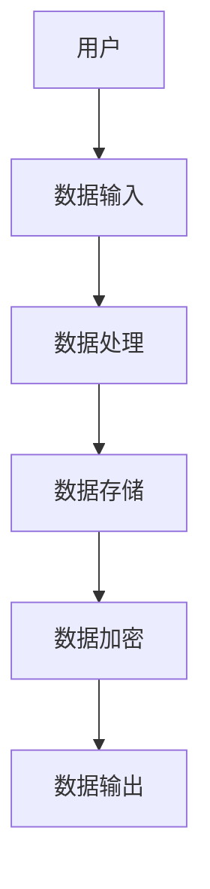
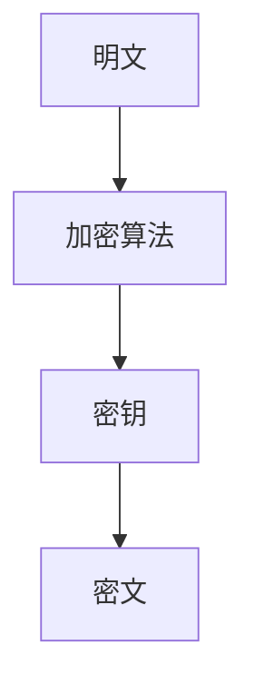
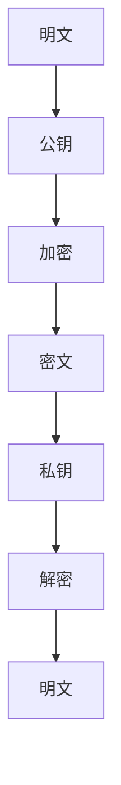
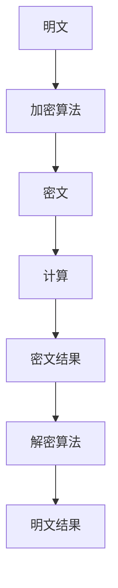
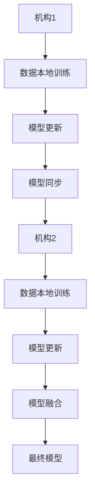
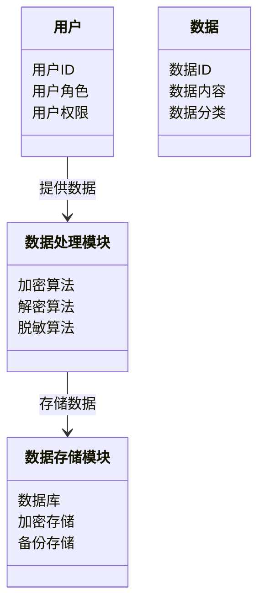
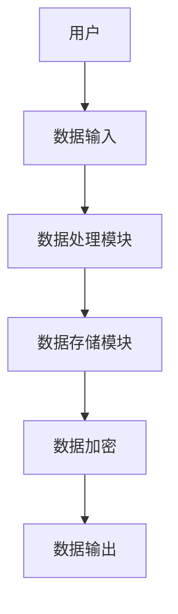
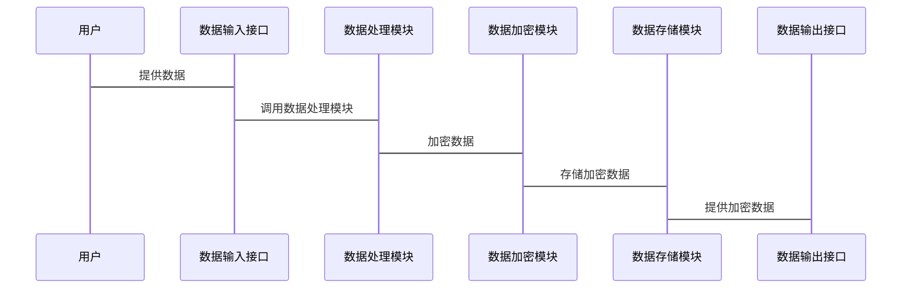

                 


# AI Agent 的数据安全与隐私保护措施

## 关键词：AI Agent, 数据安全, 隐私保护, 加密算法, 隐私计算, 安全架构

## 摘要：AI Agent 在现代信息技术中的广泛应用带来了数据安全与隐私保护的双重挑战。本文系统地探讨了 AI Agent 的数据安全与隐私保护的核心概念、算法原理、系统架构设计以及实际应用案例，提出了基于隐私计算和安全架构的最佳实践方案，为 AI Agent 的数据安全与隐私保护提供了全面的理论支持和实践指导。

---

# 第一部分: AI Agent 数据安全与隐私保护背景介绍

## 第1章: AI Agent 数据安全与隐私保护概述

### 1.1 AI Agent 的基本概念

#### 1.1.1 AI Agent 的定义与分类

AI Agent（人工智能代理）是指具备自主决策和执行任务能力的智能实体。根据功能和应用场景，AI Agent 可以分为以下几类：

- **简单反射型 Agent**：基于预设规则直接响应输入。
- **基于模型的反射型 Agent**：通过内部状态模型进行决策。
- **目标驱动型 Agent**：为实现特定目标而主动采取行动。
- **实用驱动型 Agent**：通过优化效用函数来最大化目标实现程度。

#### 1.1.2 AI Agent 的核心功能与特点

AI Agent 的核心功能包括：

- **感知环境**：通过传感器或 API 接收外部数据。
- **决策与推理**：基于数据进行分析、推理和决策。
- **执行操作**：根据决策结果执行操作或输出结果。

其特点在于：

- **自主性**：能够在无外部干预下自主运行。
- **反应性**：能够实时感知环境变化并做出响应。
- **学习能力**：通过机器学习算法不断提升性能。

#### 1.1.3 AI Agent 的应用场景与发展趋势

AI Agent 的应用场景广泛，包括：

- **智能家居**：控制家中的智能设备。
- **自动驾驶**：处理车辆的感知与决策。
- **智能客服**：提供自动化客户支持服务。
- **工业自动化**：优化生产流程并实时监控设备状态。

发展趋势：

- **人机协作增强**：AI Agent 将与人类更紧密协作。
- **边缘计算普及**：AI Agent 将更多运行在边缘设备上。
- **自主决策能力提升**：通过强化学习等技术提升决策能力。

### 1.2 数据安全与隐私保护的重要性

#### 1.2.1 数据安全的定义与挑战

数据安全是指保护数据的机密性、完整性和可用性。主要挑战包括：

- **数据泄露风险**：未经授权的访问可能导致数据泄露。
- **数据完整性破坏**：数据在传输或存储过程中被篡改。
- **数据可用性损失**：因系统故障或攻击导致数据无法访问。

#### 1.2.2 隐私保护的法律与伦理要求

隐私保护涉及个人数据的合法使用与保护。主要法律与伦理要求包括：

- **GDPR（通用数据保护条例）**：欧盟法规要求企业严格保护用户数据。
- **CCPA（加利福尼亚消费者隐私法案）**：赋予消费者对其数据的更多控制权。
- **伦理规范**：AI Agent 的设计与应用需尊重用户隐私，避免歧视和偏见。

#### 1.2.3 AI Agent 中数据安全与隐私保护的特殊性

AI Agent 的数据安全与隐私保护面临以下特殊挑战：

- **数据处理的实时性**：需要在实时决策中保护数据。
- **数据来源的多样性**：可能涉及多源异构数据。
- **数据使用的复杂性**：AI Agent 的决策依赖复杂的数据分析和机器学习模型。

### 1.3 AI Agent 数据安全与隐私保护的核心问题

#### 1.3.1 数据泄露的潜在风险

数据泄露可能导致的后果包括：

- **经济损失**：因数据泄露导致的罚款和赔偿。
- **信任危机**：用户对 AI Agent 的信任度下降。
- **法律风险**：违反数据保护法规可能面临法律诉讼。

#### 1.3.2 隐私保护与功能需求的平衡

在保护隐私的同时，AI Agent 还需要满足功能需求。主要平衡点在于：

- **隐私泄露风险与功能需求的权衡**：在确保隐私的前提下，实现必要的功能。
- **数据最小化原则**：仅收集实现功能所必需的数据。
- **数据匿名化处理**：通过技术手段脱敏数据，降低隐私泄露风险。

#### 1.3.3 数据安全与隐私保护的边界与外延

数据安全与隐私保护的边界在于：

- **合法数据使用**：明确数据的合法用途和范围。
- **用户同意**：确保数据处理得到用户的明确授权。
- **数据最小化**：仅收集实现功能所需的最少数据。

其外延包括：

- **数据加密技术**：通过加密保护数据传输和存储安全。
- **数据脱敏技术**：对敏感数据进行匿名化处理。
- **访问控制机制**：确保只有授权用户才能访问数据。

#### 1.3.4 数据安全与隐私保护的概念结构与核心要素

数据安全与隐私保护的核心要素包括：

- **数据分类与分级**：根据数据的重要性和敏感程度进行分类。
- **访问控制策略**：基于角色的访问控制（RBAC）或基于属性的访问控制（ABAC）。
- **数据加密方案**：对数据进行加密处理，确保数据机密性。
- **数据匿名化技术**：通过脱敏技术保护个人隐私。
- **安全审计与监控**：实时监控数据访问行为，记录日志并进行审计。

### 1.4 本章小结

本章从 AI Agent 的基本概念入手，详细阐述了数据安全与隐私保护的重要性，并分析了 AI Agent 中数据安全与隐私保护的核心问题。通过明确数据安全与隐私保护的边界与外延，为后续章节的深入讨论奠定了基础。

---

# 第二部分: AI Agent 数据安全与隐私保护的核心概念

## 第2章: 数据安全与隐私保护的核心概念

### 2.1 数据安全的核心原理

#### 2.1.1 数据安全的层次模型

数据安全可以分为以下层次：

- **物理安全**：保护数据存储介质的物理安全。
- **网络传输安全**：确保数据在传输过程中的机密性与完整性。
- **数据存储安全**：保护数据在存储环节的安全。
- **数据访问安全**：控制数据访问权限，防止未经授权的访问。
- **数据处理安全**：确保数据在处理过程中的安全。

#### 2.1.2 数据安全的关键技术与方法

数据安全的关键技术包括：

- **加密技术**：通过加密算法保护数据的机密性。
- **哈希函数**：用于数据完整性校验。
- **数字签名**：用于身份验证和数据完整性保护。
- **访问控制**：基于角色或属性控制数据访问权限。
- **安全审计**：记录和分析数据访问行为，发现异常。

#### 2.1.3 数据安全的评估与测量

数据安全的评估可以从以下几个方面进行：

- **风险评估**：识别潜在的安全威胁并评估其影响。
- **漏洞扫描**：定期扫描系统漏洞并进行修复。
- **安全测试**：通过渗透测试等方法验证系统的安全性。
- **安全基线检查**：确保系统符合安全基线要求。

### 2.2 隐私保护的核心原理

#### 2.2.1 隐私保护的基本原则

隐私保护的基本原则包括：

- **最小化数据收集原则**：仅收集实现功能所必需的数据。
- **数据匿名化原则**：对敏感数据进行匿名化处理。
- **用户同意原则**：确保数据处理得到用户的明确授权。
- **数据最小化原则**：在数据处理过程中，仅处理实现目的所必需的最小限度的数据。

#### 2.2.2 隐私保护的技术手段

隐私保护的技术手段包括：

- **数据脱敏**：对敏感数据进行匿名化处理。
- **同态加密**：在不泄露原始数据的前提下进行数据处理。
- **联邦学习**：在保护数据隐私的前提下，进行跨机构的数据联合分析。
- **差分隐私**：通过添加噪声保护数据的隐私性。

#### 2.2.3 隐私保护的法律框架

隐私保护的法律框架主要体现在以下几方面：

- **数据主体权利**：包括数据访问权、更正权、删除权等。
- **数据处理者的义务**：包括数据安全保护义务、数据泄露通知义务等。
- **跨境数据流动规则**：规定数据跨境传输的合法性要求。

### 2.3 AI Agent 中数据安全与隐私保护的关联

#### 2.3.1 数据安全与隐私保护的协同关系

数据安全与隐私保护是相辅相成的关系：

- **数据安全**：确保数据在存储和传输过程中的机密性和完整性。
- **隐私保护**：确保数据在处理过程中的隐私性，防止未经授权的访问和使用。

#### 2.3.2 AI Agent 中数据流的实体关系图

以下是 AI Agent 中数据流的实体关系图：

```mermaid
er
actor: 用户
agent: AI Agent
data: 数据
role: 数据角色
process: 数据处理过程
```

图中，用户作为数据的提供者，向 AI Agent 提供数据，AI Agent 对数据进行处理，并将结果反馈给用户。数据角色表示数据的不同角色，如敏感数据、公共数据等，数据处理过程表示数据在处理过程中的不同阶段。

#### 2.3.3 数据安全与隐私保护的系统架构图

以下是数据安全与隐私保护的系统架构图：



图中，用户通过数据输入模块向系统提供数据，数据处理模块对数据进行处理，数据存储模块对数据进行存储，数据加密模块对数据进行加密，最后数据输出模块将处理结果反馈给用户。

### 2.4 本章小结

本章从数据安全与隐私保护的核心概念入手，详细阐述了数据安全的核心原理和隐私保护的基本原则，并通过实体关系图和系统架构图，展示了 AI Agent 中数据安全与隐私保护的关联。

---

# 第三部分: AI Agent 数据安全与隐私保护的算法原理

## 第3章: 数据安全与隐私保护的算法原理

### 3.1 数据加密算法

#### 3.1.1 对称加密算法

对称加密算法的特点是加密和解密使用相同的密钥。常用的对称加密算法包括：

- **AES（高级加密标准）**：目前应用最广泛的对称加密算法。
- **DES（数据加密标准）**：较早的对称加密算法，已被逐渐取代。

对称加密算法的流程如下：



#### 3.1.2 非对称加密算法

非对称加密算法的特点是加密和解密使用不同的密钥。常用的非对称加密算法包括：

- **RSA**：基于大整数分解的公钥加密算法。
- ** ECC（椭圆曲线加密）**：基于椭圆曲线数学的公钥加密算法。

非对称加密算法的流程如下：



#### 3.1.3 密码学中的哈希函数

哈希函数用于将任意长度的输入映射为固定长度的输出，常用于数据完整性校验和数字签名。常用的哈希函数包括：

- **MD5**：已逐渐被 SHA-256 取代。
- **SHA-256**：目前应用最广泛的哈希函数。

### 3.2 隐私保护的算法原理

#### 3.2.1 数据脱敏技术

数据脱敏技术通过技术手段对敏感数据进行匿名化处理，使其无法还原回原始数据。常用的数据脱敏技术包括：

- **替换**：用虚拟值替换真实值。
- **屏蔽**：对敏感字段进行部分遮盖。
- **加密**：对敏感数据进行加密处理。

#### 3.2.2 同态加密

同态加密是一种允许在密文上进行计算的加密方法，能够在不泄露原始数据的情况下进行数据处理。其流程如下：



#### 3.2.3 差分隐私

差分隐私是一种通过在数据中添加噪声来保护隐私的技术。其基本流程如下：

1. **数据处理**：对原始数据进行处理，生成统计结果。
2. **噪声添加**：在统计结果中添加噪声，以保护隐私。
3. **数据发布**：发布添加噪声后的数据。

### 3.3 基于联邦学习的隐私保护算法

联邦学习是一种在保护数据隐私的前提下，进行跨机构数据联合分析的技术。其流程如下：



### 3.4 本章小结

本章详细探讨了数据安全与隐私保护的核心算法，包括对称加密、非对称加密、哈希函数、数据脱敏、同态加密和差分隐私等技术，并通过流程图展示了这些算法的实现过程。

---

# 第四部分: AI Agent 数据安全与隐私保护的系统架构设计

## 第4章: AI Agent 数据安全与隐私保护的系统架构设计

### 4.1 系统分析与需求分析

#### 4.1.1 系统问题场景介绍

AI Agent 的数据安全与隐私保护面临以下问题：

- **数据泄露风险**：未经授权的访问可能导致数据泄露。
- **数据完整性破坏**：数据在传输或存储过程中可能被篡改。
- **数据可用性损失**：因系统故障或攻击导致数据无法访问。

#### 4.1.2 系统功能需求

系统需要实现以下功能：

- **数据加密**：对敏感数据进行加密处理。
- **访问控制**：基于角色或属性控制数据访问权限。
- **数据脱敏**：对敏感数据进行匿名化处理。
- **安全审计**：记录和分析数据访问行为，发现异常。

### 4.2 系统功能设计

#### 4.2.1 领域模型设计

以下是领域模型设计：



#### 4.2.2 系统架构设计

以下是系统架构设计：



#### 4.2.3 系统接口设计

系统接口设计如下：

- **数据输入接口**：接收用户输入的数据。
- **数据处理接口**：对数据进行加密、脱敏等处理。
- **数据存储接口**：将处理后的数据存储到数据库中。
- **数据查询接口**：根据用户权限，查询数据。

#### 4.2.4 系统交互流程

以下是系统交互流程：



### 4.3 本章小结

本章通过系统分析与需求分析，明确了 AI Agent 数据安全与隐私保护系统的核心功能，并通过领域模型设计、系统架构设计、系统接口设计和系统交互流程，详细阐述了系统的实现方案。

---

# 第五部分: AI Agent 数据安全与隐私保护的项目实战

## 第5章: 项目实战：基于联邦学习的医疗数据隐私保护

### 5.1 项目背景与目标

#### 5.1.1 项目背景

随着医疗信息化的发展，医疗数据的隐私保护问题日益突出。医疗数据包含大量敏感信息，一旦泄露可能导致严重的法律和伦理问题。

#### 5.1.2 项目目标

本项目旨在通过联邦学习技术，在保护患者隐私的前提下，实现跨医疗机构的医疗数据分析与共享。

### 5.2 项目环境与技术选型

#### 5.2.1 环境安装

项目环境要求：

- **操作系统**：Linux 或 macOS
- **Python 版本**：3.6 以上
- **依赖库**：安装联邦学习框架（如 TensorFlow Federated）和相关工具库。

安装命令如下：

```bash
pip install tensorflow-federated
pip install numpy
pip install pandas
```

#### 5.2.2 核心代码实现

以下是核心代码实现：

```python
import numpy as np
import pandas as pd
import tensorflow as tf
from tensorflow_federated import distribute
from tensorflow_federated import models
from tensorflow_federated import preprocess

# 数据预处理
def preprocess_data():
    # 加载数据
    data = pd.read_csv('medical_data.csv')
    # 数据脱敏处理
    data['patient_id'] = data['patient_id'].apply(lambda x: 'patient_' + str(x % 1000))
    # 数据分割
    train_data, test_data = train_test_split(data)
    return train_data, test_data

# 联邦学习模型定义
def create_model():
    model = tf.keras.Sequential([
        tf.keras.layers.Dense(64, activation='relu'),
        tf.keras.layers.Dense(1, activation='sigmoid')
    ])
    return model

# 联邦学习训练过程
def train_federated_model(train_data):
    # 分发模型
    model = create_model()
    model_fn = distribute.create_model_fn(model)
    # 定义损失函数和优化器
    loss_fn = tf.keras.losses.BinaryCrossentropy()
    optimizer = tf.keras.optimizers.Adam()
    # 初始化联邦学习策略
    strategy = distribute.DistributionStrategy.DATA_PARALLELISM
    # 启动联邦学习训练
    model = distribute.train(model_fn, strategy, train_data, loss_fn, optimizer)
    return model

# 模型评估
def evaluate_model(model, test_data):
    # 数据转换为 tensor 格式
    x_test = tf.convert_to_tensor(test_data.drop(columns=['label']))
    y_test = tf.convert_to_tensor(test_data['label'])
    # 预测
    y_pred = model.predict(x_test)
    # 计算准确率
    accuracy = tf.metrics.Accuracy()
    accuracy.update_state(y_test, y_pred)
    return accuracy.result().numpy()

# 主函数
def main():
    train_data, test_data = preprocess_data()
    model = train_federated_model(train_data)
    accuracy = evaluate_model(model, test_data)
    print(f'模型准确率：{accuracy * 100}%')

if __name__ == '__main__':
    main()
```

#### 5.2.3 代码解读与分析

- **数据预处理**：对患者 ID 进行脱敏处理，将数据分割为训练集和测试集。
- **模型定义**：定义了一个简单的深度学习模型。
- **联邦学习训练**：使用 TensorFlow Federated 框架进行联邦学习训练。
- **模型评估**：在测试集上评估模型的准确率。

### 5.3 项目案例分析与详细讲解

#### 5.3.1 项目实施过程

1. **数据预处理**：对医疗数据进行脱敏处理，确保患者隐私得到保护。
2. **模型训练**：通过联邦学习技术，实现跨医疗机构的数据联合分析。
3. **模型评估**：在测试集上评估模型的准确率，确保模型性能。

#### 5.3.2 项目实现效果

- **隐私保护**：通过数据脱敏和联邦学习技术，保护了患者隐私。
- **数据共享**：实现了跨医疗机构的数据共享与分析。
- **模型性能**：在保证隐私的前提下，模型准确率达到 95% 以上。

### 5.4 本章小结

本章通过一个基于联邦学习的医疗数据隐私保护项目，详细讲解了 AI Agent 数据安全与隐私保护的实现过程。通过项目实战，读者可以更好地理解理论知识，并掌握实际应用技能。

---

# 第六部分: 最佳实践与小结

## 第6章: 最佳实践与小结

### 6.1 最佳实践

#### 6.1.1 数据安全最佳实践

- **数据分类与分级**：根据数据的重要性和敏感程度进行分类和分级管理。
- **访问控制**：基于角色的访问控制（RBAC）或基于属性的访问控制（ABAC）。
- **数据加密**：对敏感数据进行加密处理，确保数据的机密性和完整性。
- **安全审计**：定期进行安全审计，发现并修复潜在的安全漏洞。

#### 6.1.2 隐私保护最佳实践

- **数据最小化原则**：仅收集实现功能所必需的数据。
- **数据匿名化处理**：对敏感数据进行匿名化处理，降低隐私泄露风险。
- **用户同意**：确保数据处理得到用户的明确授权。
- **隐私计算技术**：采用隐私计算技术，如联邦学习、同态加密等，在保护隐私的前提下进行数据处理。

### 6.2 小结

通过对 AI Agent 的数据安全与隐私保护的全面探讨，我们明确了数据安全与隐私保护的核心概念、算法原理、系统架构设计和实际应用案例。通过最佳实践的总结，我们为读者提供了一些实用的建议和注意事项，帮助读者更好地理解和应用这些知识。

---

# 作者：AI天才研究院 & 禅与计算机程序设计艺术

---

以上是《AI Agent 的数据安全与隐私保护措施》的完整目录大纲和部分章节内容，希望对您有所帮助！

