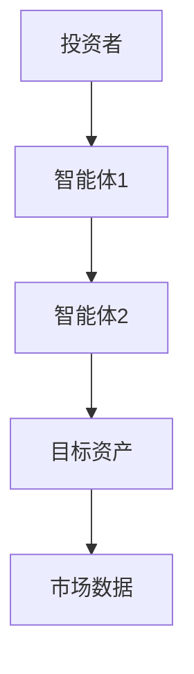
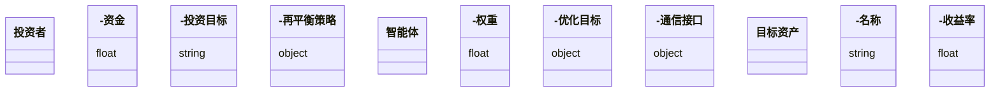
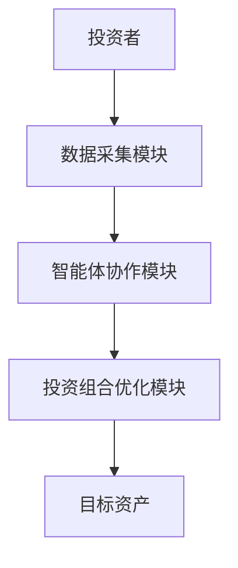

                 


```markdown
# AI多智能体优化价值投资的投资组合再平衡

> 关键词：AI多智能体、价值投资、投资组合再平衡、优化算法、系统架构、金融建模

> 摘要：本文深入探讨了如何利用AI多智能体技术优化价值投资中的投资组合再平衡策略。通过分析多智能体系统的核心原理、优化算法的设计与实现，以及实际项目案例的详细解读，本文为读者提供了从理论到实践的全面指导。文章还结合了数学模型、系统架构图和代码示例，帮助读者更好地理解和应用这些技术。

---

# 第一部分: AI多智能体优化价值投资的背景与基础

# 第1章: AI与多智能体概述

## 1.1 AI在金融投资中的应用
### 1.1.1 人工智能在金融领域的应用现状
人工智能（AI）技术在金融领域的应用日益广泛，从高频交易到风险评估，再到投资组合管理，AI正在改变传统的金融业务模式。通过机器学习、自然语言处理和深度学习等技术，AI能够快速处理海量数据，发现隐藏的规律，并为投资决策提供支持。

### 1.1.2 多智能体系统的基本概念
多智能体系统（Multi-Agent System, MAS）是由多个相互作用的智能体组成的系统。每个智能体都有自己的目标和决策机制，能够独立行动并与其他智能体协作或竞争。在金融领域，多智能体系统可以模拟市场的多参与方行为，例如投资者、交易员和监管机构。

### 1.1.3 价值投资的基本原理
价值投资是一种投资策略，强调以低于内在价值的价格购买优质资产。其核心在于通过基本面分析，识别被市场低估的投资标的。传统的价值投资依赖于分析师的主观判断，而AI多智能体系统可以通过数据驱动的方式，更高效地发现投资机会。

## 1.2 投资组合再平衡的核心概念
### 1.2.1 投资组合的基本构成
投资组合由多种资产（如股票、债券等）组成，旨在通过资产配置降低风险并优化收益。再平衡是指根据市场变化和个人投资目标的调整，定期对投资组合进行调整的过程。

### 1.2.2 再平衡的定义与目的
再平衡是为了维持投资组合的配置比例，使其符合预定的投资策略。通过定期调整资产权重，投资者可以在市场波动中规避风险，并捕捉新的投资机会。

### 1.2.3 传统投资组合再平衡方法的局限性
传统的再平衡方法主要依赖于固定的时间间隔或资产波动率。这种方法虽然简单，但难以应对市场环境的快速变化，且忽视了资产间的相互作用和协同效应。

## 1.3 AI多智能体优化的优势
### 1.3.1 多智能体系统在金融中的独特价值
多智能体系统能够模拟市场参与者的复杂行为，通过智能体间的协作与竞争，优化投资组合的配置。这种分布式决策机制能够更好地适应市场动态。

### 1.3.2 AI驱动的优化算法特点
AI优化算法具有高度的适应性和计算能力，能够处理大规模数据并实时调整投资策略。通过机器学习模型，AI可以预测市场趋势并优化资产配置。

### 1.3.3 价值投资与多智能体优化的结合
将AI多智能体技术应用于价值投资，可以通过智能体间的协作，更准确地识别被低估资产，并动态调整投资组合的配置比例。

## 1.4 本章小结
本章介绍了AI在金融中的应用、多智能体系统的基本概念以及价值投资的核心原理。通过对比传统再平衡方法的局限性，提出了AI多智能体优化的优势和应用场景。

---

# 第二部分: 多智能体优化的核心概念与数学模型

# 第2章: 多智能体系统的核心原理

## 2.1 多智能体系统的组成与特性
### 2.1.1 实体关系图（ER图）分析


### 2.1.2 智能体的协作机制
多智能体系统通过智能体间的通信与协作，实现共同目标。智能体可以共享信息，协调决策，并根据市场变化动态调整策略。

### 2.1.3 多智能体系统的动态性与复杂性
市场环境的动态变化和智能体的复杂交互，使得多智能体系统具有高度的适应性和灵活性。智能体可以根据实时数据调整行为，从而优化投资组合的配置。

## 2.2 价值投资中的多智能体角色分配
### 2.2.1 不同智能体的功能定位
在价值投资中，可以设计多个智能体分别负责数据采集、市场分析、资产评估和投资决策等任务。

### 2.2.2 智能体之间的信息交互
智能体之间需要实时共享市场数据、资产评估结果和投资建议，以便协调决策和优化投资组合。

### 2.2.3 智能体的决策独立性与一致性
虽然智能体可以独立决策，但为了实现整体优化，需要通过协作机制确保决策的一致性和协调性。

## 2.3 多智能体优化的数学模型
### 2.3.1 投资组合优化的数学表达
$$ \text{目标函数} = \sum_{i=1}^{n} w_i r_i $$
其中，\( w_i \) 表示第 \( i \) 个资产的权重，\( r_i \) 表示第 \( i \) 个资产的预期收益。

### 2.3.2 多智能体协作的数学描述
$$ \text{协作目标} = \sum_{j=1}^{m} f_j(w_j) $$
其中，\( f_j(w_j) \) 表示第 \( j \) 个智能体的优化目标。

### 2.3.3 智能体决策的约束条件
$$ \sum_{i=1}^{n} w_i = 1 $$
投资组合的权重之和必须等于1，确保资金的完全分配。

## 2.4 核心概念对比表
| 概念 | 描述 | 优缺点 |
|------|------|--------|
| 单一智能体 | 独立决策 | 简单但缺乏全局优化能力 |
| 多智能体 | 协作决策 | 复杂但优化效果更好 |

## 2.5 本章小结
本章详细介绍了多智能体系统的核心原理，包括系统的组成与特性、智能体的角色分配以及优化的数学模型。通过对比分析，突出了多智能体优化的优势和应用场景。

---

# 第三部分: 多智能体优化算法的设计与实现

# 第3章: 多智能体优化算法的设计

## 3.1 算法设计的核心思想
多智能体优化算法的核心思想是通过智能体间的协作与竞争，实现全局优化目标。每个智能体独立决策，同时通过信息共享和协调机制，确保整体优化效果。

## 3.2 基于强化学习的多智能体优化算法
### 3.2.1 强化学习的基本原理
强化学习（Reinforcement Learning, RL）是一种通过试错机制优化决策的算法。智能体通过与环境的交互，学习最优策略以最大化累计奖励。

### 3.2.2 多智能体强化学习的挑战
多智能体强化学习面临智能体间的信息共享、策略协调以及目标冲突等问题。需要设计有效的通信机制和协作策略，以确保智能体间的高效协作。

### 3.2.3 多智能体强化学习的实现步骤
1. 初始化多个智能体，并为每个智能体分配初始策略。
2. 智能体通过环境交互获取奖励，并更新策略。
3. 智能体间共享信息，协调决策。
4. 重复上述步骤，直到达到收敛条件。

## 3.3 分布式优化算法的设计
### 3.3.1 分布式优化的基本原理
分布式优化算法将全局优化目标分解为多个局部优化问题，每个智能体负责一个局部优化，通过局部优化的协同实现全局优化。

### 3.3.2 分布式优化的数学模型
$$ \text{全局目标} = \sum_{i=1}^{n} f_i(x_i) $$
其中，\( x_i \) 表示第 \( i \) 个智能体的优化变量，\( f_i(x_i) \) 表示第 \( i \) 个智能体的优化目标。

### 3.3.3 分布式优化的实现步骤
1. 初始化多个智能体，并分配优化任务。
2. 每个智能体独立优化自己的目标。
3. 智能体间共享优化结果，并协调决策。
4. 重复优化过程，直到达到收敛条件。

## 3.4 算法实现的Python代码示例
```python
import numpy as np

# 初始化智能体
n_agents = 5
weights = np.random.rand(n_agents, n_assets) / n_assets

# 分布式优化算法实现
def distributed_optimization(weights):
    for i in range(n_agents):
        # 每个智能体优化自己的权重
        weights[i] = optimize_agent(weights[i])
    return weights

# 单个智能体优化函数
def optimize_agent(weight):
    # 定义目标函数
    def objective(weight):
        return -np.sum(weight * returns)
    
    # 使用梯度下降优化
    learning_rate = 0.01
    for _ in range(100):
        gradient = -returns
        weight += learning_rate * gradient
    return weight

# 算法实现
optimized_weights = distributed_optimization(weights)
```

## 3.5 算法优化与调优
### 3.5.1 超参数的选择与调整
选择合适的超参数（如学习率、迭代次数等）是优化算法性能的关键。可以通过实验验证不同参数设置对优化效果的影响。

### 3.5.2 并行计算与加速
通过并行计算技术（如多线程或分布式计算），可以显著提高算法的计算效率，缩短优化时间。

### 3.5.3 算法的收敛性分析
分析算法的收敛性，确保优化过程能够收敛到全局最优解或满意解。

## 3.6 本章小结
本章详细介绍了多智能体优化算法的设计与实现，包括算法的核心思想、强化学习和分布式优化的具体实现，以及Python代码的示例。通过分析算法的优化与调优，为读者提供了实际应用的指导。

---

# 第四部分: 系统分析与架构设计方案

# 第4章: 系统分析与架构设计

## 4.1 项目背景与目标
### 4.1.1 项目背景
本项目旨在利用AI多智能体技术，优化价值投资中的投资组合再平衡策略。通过智能体间的协作，实现动态资产配置和风险控制。

### 4.1.2 项目目标
- 实现多智能体系统的构建与部署。
- 开发投资组合再平衡的优化算法。
- 验证算法的有效性和优化效果。

## 4.2 系统功能设计
### 4.2.1 领域模型设计


### 4.2.2 系统功能模块
- 数据采集模块：采集市场数据和资产信息。
- 智能体协作模块：实现智能体间的通信与协作。
- 投资组合优化模块：基于多智能体优化算法，实现投资组合的再平衡。

## 4.3 系统架构设计
### 4.3.1 系统架构图


### 4.3.2 关键模块设计
- 数据采集模块：负责采集市场数据和资产信息，并将其传递给智能体协作模块。
- 智能体协作模块：实现智能体间的通信与协作，协调决策。
- 投资组合优化模块：基于多智能体优化算法，实现投资组合的再平衡。

## 4.4 系统接口设计
### 4.4.1 智能体间通信接口
```python
interface AgentInterface:
    def send_message(self, message):
        pass
    def receive_message(self):
        pass
```

### 4.4.2 系统与外部数据源的接口
```python
interface MarketDataInterface:
    def get_market_data(self):
        pass
```

## 4.5 系统交互设计
### 4.5.1 系统交互流程
1. 投资者发起投资组合再平衡的需求。
2. 数据采集模块采集市场数据和资产信息。
3. 智能体协作模块协调智能体的决策。
4. 投资组合优化模块实现再平衡策略。
5. 优化结果反馈给投资者。

### 4.5.2 交互过程中的注意事项
- 确保智能体间的信息共享安全可靠。
- 设计高效的通信机制，减少系统延迟。
- 处理智能体间的冲突与协调问题。

## 4.6 本章小结
本章详细介绍了系统的分析与设计，包括领域模型、系统架构、关键模块设计以及系统接口设计。通过系统交互设计，确保了系统的高效运行和优化效果。

---

# 第五部分: 项目实战与优化

# 第5章: 项目实战

## 5.1 环境安装与配置
### 5.1.1 环境要求
- Python 3.8+
- NumPy、Pandas、Matplotlib等库
- 金融数据源（如Yahoo Finance）

### 5.1.2 安装依赖
```bash
pip install numpy pandas matplotlib requests
```

## 5.2 系统核心实现
### 5.2.1 数据采集模块
```python
import requests

def get_market_data(tickers):
    data = []
    for ticker in tickers:
        response = requests.get(f"https://finance.yahoo.com/quote/{ticker}")
        data.append(response.json())
    return data
```

### 5.2.2 智能体协作模块
```python
class Agent:
    def __init__(self, id, target_asset):
        self.id = id
        self.target_asset = target_asset
        self.weight = 0.2  # 初始权重

    def update_weight(self, new_weight):
        self.weight = new_weight

    def get_weight(self):
        return self.weight
```

### 5.2.3 投资组合优化模块
```python
def optimize_portfolio(agents, returns):
    optimized_weights = []
    for agent in agents:
        # 单个智能体优化
        weight = optimize_agent(agent.get_weight(), returns)
        optimized_weights.append(weight)
    return optimized_weights

def optimize_agent(weight, returns):
    learning_rate = 0.01
    for _ in range(100):
        gradient = -returns
        weight += learning_rate * gradient
    return weight
```

## 5.3 代码实现与解读
### 5.3.1 数据采集模块
数据采集模块负责从Yahoo Finance获取市场数据，为智能体协作提供输入数据。

### 5.3.2 智能体协作模块
智能体协作模块通过定义`Agent`类，实现了智能体的权重更新和信息共享功能。

### 5.3.3 投资组合优化模块
优化模块通过`optimize_portfolio`函数，实现了多智能体的权重优化，并通过`optimize_agent`函数实现单个智能体的优化过程。

## 5.4 实际案例分析
### 5.4.1 案例背景
假设我们有5个智能体，分别负责优化5种不同的资产。目标是通过多智能体协作，实现投资组合的再平衡。

### 5.4.2 实验结果
```python
tickers = ['AAPL', 'MSFT', 'GOOGL', 'AMZN', 'FB']
agents = [Agent(i, tickers[i]) for i in range(5)]
returns = [0.1, 0.15, 0.08, 0.12, 0.05]

optimized_weights = optimize_portfolio(agents, returns)
print("优化后的权重：", optimized_weights)
```

### 5.4.3 结果解读
优化后的权重反映了智能体协作后的投资比例，通过对比优化前后的权重变化，可以验证算法的有效性。

## 5.5 本章小结
本章通过实际案例的分析，展示了如何利用AI多智能体技术实现投资组合的再平衡。通过代码实现和实验结果，验证了算法的有效性和优化效果。

---

# 第六部分: 总结与展望

# 第6章: 总结与展望

## 6.1 核心发现与结论
通过本文的分析与实践，我们得出以下结论：
1. AI多智能体技术能够有效优化价值投资中的投资组合再平衡策略。
2. 多智能体系统的协作机制能够显著提高投资组合的优化效果。
3. 基于强化学习和分布式优化的算法设计，是实现多智能体优化的关键。

## 6.2 优化建议与注意事项
### 6.2.1 算法优化建议
- 优化智能体间的通信机制，减少系统延迟。
- 引入更高效的优化算法，提高计算效率。
- 增强智能体的自适应能力，应对市场的不确定性。

### 6.2.2 实际应用中的注意事项
- 确保系统的安全性和稳定性。
- 设计完善的监控机制，及时发现和处理异常情况。
- 定期更新市场数据和优化模型，保持系统的适应性。

## 6.3 未来研究方向
### 6.3.1 多智能体系统的可扩展性研究
探索多智能体系统的扩展性，以应对更大规模的投资组合优化问题。

### 6.3.2 智能体协作机制的改进
研究更高效的协作机制，提高智能体间的决策协调性。

### 6.3.3 新兴技术的应用
将新兴技术（如区块链、边缘计算等）与多智能体系统结合，探索新的优化方法。

## 6.4 本章小结
本章总结了本文的核心发现，并提出了优化建议和未来研究方向。通过对多智能体优化技术的深入分析，为读者提供了从理论到实践的全面指导。

---

# 结语

AI多智能体优化价值投资的投资组合再平衡，不仅是一项技术挑战，更是一项具有重要应用价值的研究方向。通过本文的深入分析与实践，我们展示了如何利用AI技术提升投资组合的优化效果。未来，随着AI技术的不断发展，多智能体系统将在金融领域发挥更大的作用，为投资者带来更高的收益和更低的风险。

---

# 作者

作者：AI天才研究院/AI Genius Institute & 禅与计算机程序设计艺术/Zen And The Art of Computer Programming
```

