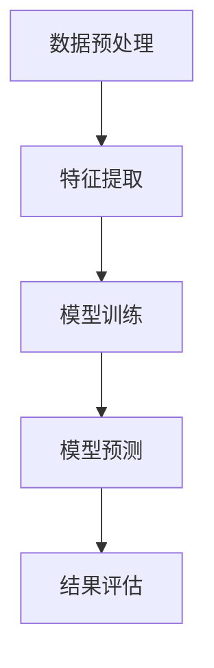
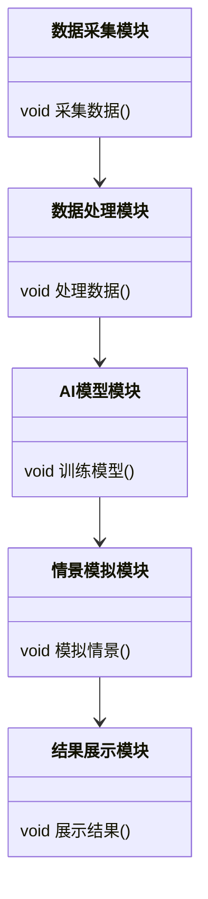
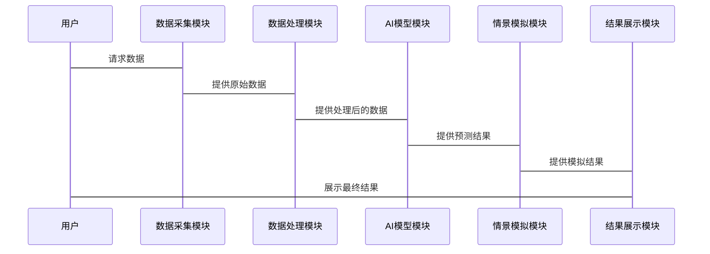

                 


```markdown
# AI驱动的企业财务战略情景模拟系统

> 关键词：AI技术、财务战略、情景模拟、系统设计、数学建模、算法实现

> 摘要：本文详细探讨了如何利用人工智能技术构建企业财务战略情景模拟系统，旨在帮助企业更好地应对复杂多变的市场环境。文章从背景、核心概念、算法原理、系统架构、项目实战等多维度展开，为企业提供了一套基于AI的财务战略模拟解决方案。

---

## 第1章: 背景介绍

### 1.1 问题背景
#### 1.1.1 企业财务战略的重要性
企业的财务战略是企业经营的核心之一，它决定了企业的资金分配、投资决策和风险管理。传统的财务战略依赖于人工分析和经验判断，难以应对日益复杂的市场环境和多样化的业务需求。

#### 1.1.2 传统财务战略的局限性
- 数据处理能力有限：传统方法难以处理海量数据。
- 模型静态：缺乏动态调整和预测能力。
- 人工干预过多：效率低下，容易出错。

#### 1.1.3 AI技术在财务领域的应用潜力
AI技术能够通过大数据分析、机器学习等方法，提供更精准的预测和决策支持，显著提升财务战略的效率和准确性。

### 1.2 问题描述
#### 1.2.1 财务战略模拟的核心目标
通过模拟不同的市场情景，评估企业的财务表现，优化资源配置，制定最优战略。

#### 1.2.2 情景模拟的必要性
- 提前预判风险和机会。
- 支持多维度的财务分析。
- 提高决策的科学性和可行性。

#### 1.2.3 现有解决方案的不足
传统方法难以实现动态调整和多情景模拟，且依赖人工经验，缺乏系统性和准确性。

### 1.3 问题解决
#### 1.3.1 AI驱动的解决方案
利用AI技术构建情景模拟系统，通过数据驱动的方式进行预测和优化。

#### 1.3.2 系统的核心功能
- 数据采集与处理。
- AI模型训练与预测。
- 情景模拟与分析。
- 结果展示与优化建议。

#### 1.3.3 系统的预期效果
显著提升财务战略的制定效率和准确性，帮助企业更好地应对市场变化。

### 1.4 系统的边界与外延
#### 1.4.1 系统的功能边界
- 数据范围：企业财务数据、市场数据等。
- 模拟范围：财务指标、市场情景等。
- 用户范围：财务人员、企业管理层等。

#### 1.4.2 系统的适用范围
适用于企业战略规划、投资决策、风险管理等领域。

#### 1.4.3 系统的扩展性
支持未来的数据源扩展、模型优化和功能扩展。

### 1.5 系统的概念结构与核心要素
#### 1.5.1 系统的整体架构
- 数据层：数据采集与存储。
- 模型层：AI模型训练与预测。
- 应用层：情景模拟与结果展示。

#### 1.5.2 核心要素的组成
- 数据采集模块：负责数据的获取和预处理。
- AI模型模块：负责模型的训练和预测。
- 情景模拟模块：负责模拟不同情景并分析结果。
- 结果展示模块：以可视化的方式呈现模拟结果。

#### 1.5.3 系统的逻辑流程
1. 数据采集与预处理。
2. 模型训练与优化。
3. 情景模拟与分析。
4. 结果展示与优化建议。

### 1.6 本章小结
本章详细介绍了企业财务战略情景模拟系统的背景、问题、解决方案以及系统架构，为后续章节的深入分析奠定了基础。

---

## 第2章: 核心概念与联系

### 2.1 核心概念原理
#### 2.1.1 AI模型的原理
AI模型通过机器学习算法，从历史数据中学习财务战略的规律，预测未来的财务表现。

#### 2.1.2 财务数据的处理
对财务数据进行清洗、转换和特征提取，以便AI模型能够有效处理。

#### 2.1.3 情景模拟的实现
通过生成多种市场情景，模拟企业在不同情况下的财务表现。

### 2.2 概念属性特征对比
| 概念       | 特征                   |
|------------|------------------------|
| AI模型     | 数据驱动、自适应、可扩展 |
| 财务数据    | 结构化、时序性、相关性 |
| 情景模拟    | 多维度、动态性、可调整 |

#### 2.2.1 AI模型的特征
- 数据驱动：依赖大量数据进行训练。
- 自适应：能够根据新数据调整模型。
- 可扩展：支持不同规模和类型的数据。

#### 2.2.2 财务数据的特征
- 结构化：数据通常以表格形式存储。
- 时序性：数据具有时间序列特性。
- 相关性：不同数据之间存在相关性。

#### 2.2.3 情景模拟的特征
- 多维度：考虑多种因素对财务的影响。
- 动态性：模拟不同时间点的财务变化。
- 可调整：支持参数调整以适应不同情景。

### 2.3 ER实体关系图
```mermaid
erDiagram
    actor 用户
    actor 管理员
    actor 专家
    database 系统数据库
    system 系统
    用户 --> 系统: 使用系统
    管理员 --> 系统: 管理系统
    专家 --> 系统: 提供模型
```

### 2.4 本章小结
本章通过对比分析和ER图展示了系统的核心概念及其联系，为后续章节的系统设计提供了理论基础。

---

## 第3章: 算法原理

### 3.1 算法原理讲解
#### 3.1.1 算法选择
基于时间序列的机器学习算法，如LSTM（长短期记忆网络），适合处理财务数据的时序性特征。

#### 3.1.2 算法流程
1. 数据预处理：清洗、特征提取。
2. 模型训练：使用LSTM进行训练。
3. 模型预测：基于训练好的模型进行预测。
4. 结果评估：评估模型的准确性和稳定性。

### 3.2 算法实现


### 3.3 算法的数学模型
#### 3.3.1 LSTM模型
LSTM是一种特殊的RNN（循环神经网络），用于处理长序列数据，适合时间序列预测。

#### 3.3.2 损失函数
使用均方误差（MSE）作为损失函数，公式如下：
$$ \text{MSE} = \frac{1}{n}\sum_{i=1}^{n}(y_i - \hat{y}_i)^2 $$

#### 3.3.3 优化算法
使用Adam优化器，结合学习率调整策略，确保模型收敛。

### 3.4 代码实现
```python
import numpy as np
import pandas as pd
from tensorflow.keras.models import Sequential
from tensorflow.keras.layers import LSTM, Dense

# 数据预处理
data = pd.read_csv('financial_data.csv')
features = data[['revenue', 'profit', 'market_value']]
labels = data['target']

# 划分训练集和测试集
train_features = features[:-100]
train_labels = labels[:-100]
test_features = features[-100:]
test_labels = labels[-100:]

# 构建模型
model = Sequential()
model.add(LSTM(64, input_shape=(None, 3)))
model.add(Dense(1))
model.compile(optimizer='adam', loss='mse')

# 训练模型
model.fit(train_features, train_labels, epochs=100, batch_size=32)

# 预测结果
predictions = model.predict(test_features)
```

### 3.5 本章小结
本章详细讲解了AI模型的算法原理，并通过代码示例展示了模型的实现过程，为系统的开发提供了技术基础。

---

## 第4章: 数学模型与公式

### 4.1 数学模型
#### 4.1.1 财务指标预测模型
$$ \hat{y}_t = \alpha \cdot y_{t-1} + \beta \cdot x_{t} + \epsilon $$

#### 4.1.2 情景模拟模型
$$ \text{Scenario}(s) = \{ y_t, x_t, \theta_t \} $$

### 4.2 公式推导
#### 4.2.1 LSTM的遗忘门
$$ f_t = \sigma(W_f \cdot [h_{t-1}, x_t] + b_f) $$

#### 4.2.2 LSTM的输入门
$$ i_t = \sigma(W_i \cdot [h_{t-1}, x_t] + b_i) $$

#### 4.2.3 LSTM的输出门
$$ o_t = \sigma(W_o \cdot [h_{t-1}, x_t] + b_o) $$

#### 4.2.4 LSTM的细胞状态
$$ c_t = f_t \cdot c_{t-1} + i_t \cdot \tanh(W_c \cdot [h_{t-1}, x_t] + b_c) $$

#### 4.2.5 LSTM的隐藏状态
$$ h_t = o_t \cdot \tanh(c_t) $$

### 4.3 本章小结
本章通过数学模型和公式推导，深入分析了AI模型的核心原理，为系统的实现提供了理论支持。

---

## 第5章: 系统分析与架构设计

### 5.1 系统分析
#### 5.1.1 项目背景
随着市场竞争的加剧，企业需要更高效的财务战略制定工具。

#### 5.1.2 系统功能设计
- 数据采集：从企业财务系统中获取数据。
- 数据处理：清洗、转换和特征提取。
- 模型训练：训练AI模型进行预测。
- 情景模拟：生成不同市场情景并模拟结果。
- 结果展示：以可视化形式呈现模拟结果。

#### 5.1.3 系统架构设计


### 5.2 系统架构
#### 5.2.1 系统架构图


#### 5.2.2 系统接口设计
- 数据接口：与企业财务系统对接。
- 模型接口：与AI模型训练框架对接。
- 展示接口：与前端展示工具对接。

#### 5.2.3 系统交互流程


### 5.3 本章小结
本章通过系统分析与架构设计，详细描述了系统的整体结构和各模块的交互流程，为系统的开发提供了指导。

---

## 第6章: 项目实战

### 6.1 环境安装
#### 6.1.1 安装Python
```bash
python --version
pip install --upgrade pip
```

#### 6.1.2 安装依赖库
```bash
pip install numpy pandas tensorflow keras matplotlib
```

### 6.2 系统核心实现
#### 6.2.1 数据采集与处理
```python
import pandas as pd
import numpy as np

# 数据采集
data = pd.read_csv('financial_data.csv')

# 数据处理
data_processed = data.dropna()
data_processed['revenue_growth'] = data_processed['revenue'].pct_change()
```

#### 6.2.2 AI模型实现
```python
from tensorflow.keras.models import Sequential
from tensorflow.keras.layers import LSTM, Dense

# 构建模型
model = Sequential()
model.add(LSTM(64, input_shape=(None, 3)))
model.add(Dense(1))
model.compile(optimizer='adam', loss='mse')

# 训练模型
model.fit(train_features, train_labels, epochs=100, batch_size=32)
```

#### 6.2.3 情景模拟实现
```python
# 模拟情景
simulation_results = model.predict(test_features)
```

### 6.3 实际案例分析
#### 6.3.1 案例背景
某企业面临市场波动，需要预测未来三个月的财务表现。

#### 6.3.2 数据分析
分析企业的历史财务数据，提取相关特征。

#### 6.3.3 模型预测
使用训练好的模型预测未来三个月的财务指标。

#### 6.3.4 结果展示
生成可视化图表和报告，展示预测结果和优化建议。

### 6.4 本章小结
本章通过实际案例分析，详细讲解了系统的实现过程和应用效果，为企业的实际应用提供了参考。

---

## 第7章: 系统优化与扩展

### 7.1 系统优化
#### 7.1.1 模型优化
- 调整模型参数：如学习率、批量大小。
- 尝试不同的模型结构：如多层LSTM、GRU等。

#### 7.1.2 数据优化
- 数据增强：增加数据的多样性和代表性。
- 数据清洗：进一步优化数据质量。

### 7.2 系统扩展
#### 7.2.1 新功能开发
- 支持更多财务指标的预测。
- 增加更多市场情景的模拟。

#### 7.2.2 系统集成
- 与其他企业系统（如ERP）集成。
- 支持多用户同时使用。

### 7.3 注意事项
- 数据隐私保护：确保数据的安全性和合规性。
- 模型解释性：提高模型的可解释性，便于用户理解和信任。
- 系统稳定性：确保系统的高可用性和容错能力。

### 7.4 本章小结
本章讨论了系统的优化与扩展方向，提出了具体的实现建议，为系统的进一步发展提供了方向。

---

## 第8章: 总结与展望

### 8.1 总结
本文详细探讨了AI驱动的企业财务战略情景模拟系统的构建与实现，从背景、核心概念、算法原理、系统架构到项目实战，全面介绍了系统的开发过程和应用效果。

### 8.2 未来展望
未来，随着AI技术的不断发展，财务战略情景模拟系统将更加智能化和个性化，为企业提供更精准的决策支持。

### 8.3 本章小结
本文总结了系统的开发成果，并展望了未来的发展方向，为企业在复杂市场环境下的财务战略制定提供了新的思路。

---

## 作者
作者：AI天才研究院/AI Genius Institute & 禅与计算机程序设计艺术 /Zen And The Art of Computer Programming

---

通过以上详细的目录大纲，您可以逐步撰写完整的文章内容，确保每一部分都充分展开，涵盖必要的理论和实践细节。
```

