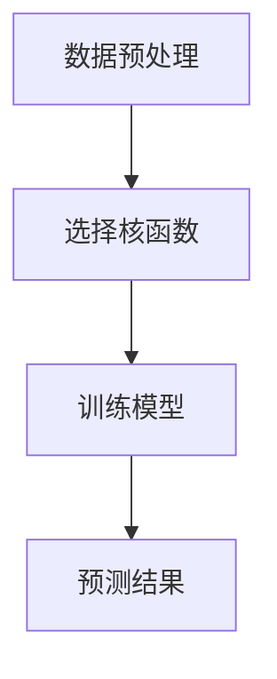
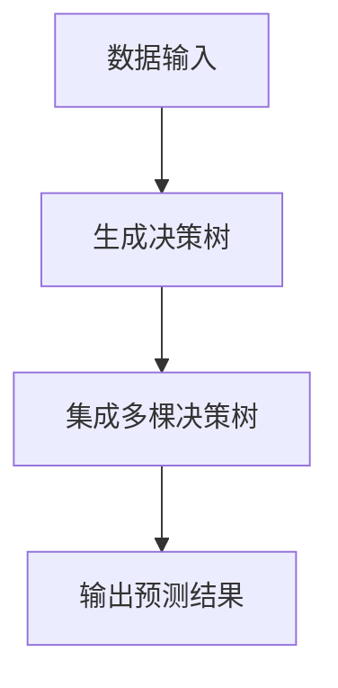
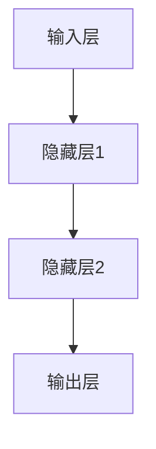
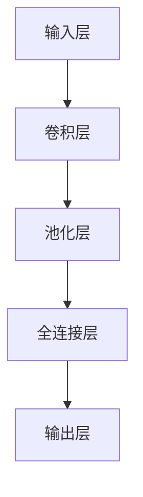
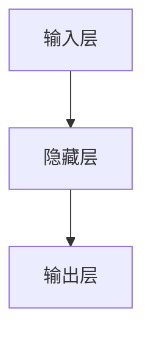
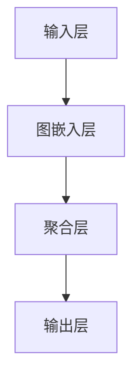
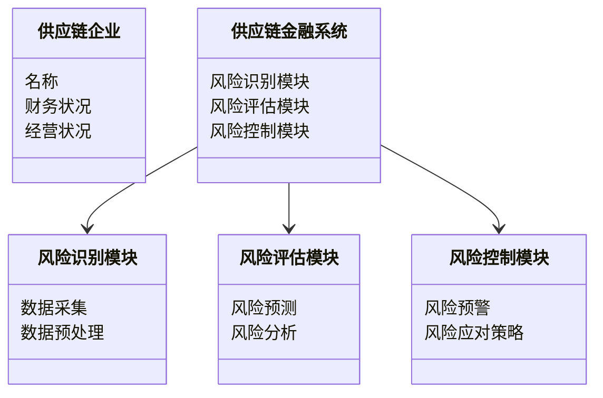
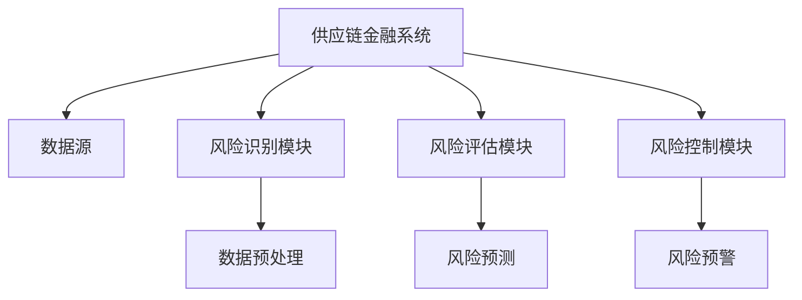
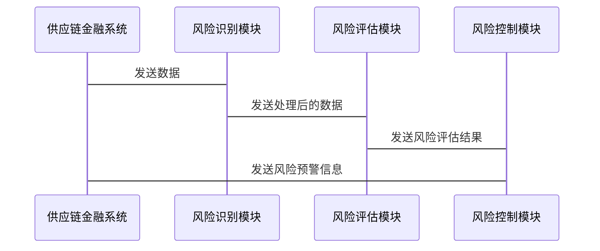

                 


# AI驱动的供应链金融风险传导分析

**关键词**：供应链金融、人工智能、风险传导、机器学习、深度学习、风险评估、金融风险管理

**摘要**：本文深入探讨了人工智能（AI）技术在供应链金融领域的应用，特别是如何利用AI驱动的风险传导分析来优化供应链金融的风险管理。文章首先介绍了供应链金融的基本概念和AI在其中的应用背景，然后详细分析了供应链金融中的风险传导机制，并通过机器学习和深度学习技术展示了如何构建风险传导预测模型。通过实际案例和系统设计，本文进一步探讨了AI驱动的供应链金融风险管理系统的设计与实现，并总结了AI在供应链金融风险管理中的优势与挑战，为未来的实践提供了有价值的参考。

---

# 第一部分: AI驱动的供应链金融风险传导概述

## 第1章: 供应链金融与AI驱动的风险管理概述

### 1.1 供应链金融的基本概念
#### 1.1.1 供应链金融的定义
供应链金融（Supply Chain Finance, SCF）是指通过整合供应链上的企业（包括供应商、制造商、分销商和零售商）的资源和信息，优化资金流动和风险控制，以实现供应链整体价值最大化的一种金融模式。其核心在于通过金融工具和手段，为供应链上的企业提供融资支持，同时降低整体供应链的风险。

#### 1.1.2 供应链金融的核心要素
供应链金融涉及多个关键要素，包括：
- **融资主体**：通常为供应链上的上游企业（供应商）。
- **融资客体**：供应链上的应收账款、存货、订单等资产。
- **融资渠道**：银行、保理公司、供应链金融服务平台等。
- **风险管理**：通过合同、质押、担保等方式控制风险。

#### 1.1.3 供应链金融的业务流程
供应链金融的典型业务流程包括：
1. **需求分析**：企业根据供应链运营需求提出融资申请。
2. **资产评估**：对供应链上的资产（如应收账款、存货）进行评估。
3. **融资决策**：金融机构根据评估结果决定是否提供融资。
4. **资金流动**：资金从金融机构流向供应链上的企业。
5. **风险管理**：通过监控和预警机制，实时跟踪供应链上的风险。

---

### 1.2 AI技术在供应链金融中的应用背景
#### 1.2.1 传统供应链金融的痛点
传统的供应链金融存在以下主要问题：
- **信息孤岛**：供应链上的企业信息分散，难以实现高效协同。
- **风险难以量化**：缺乏对供应链整体风险的量化评估方法。
- **效率低下**：融资审批流程复杂，耗时较长。
- **成本高昂**：传统的人工审核和管理成本较高。

#### 1.2.2 AI技术如何解决供应链金融问题
人工智能技术（AI）通过以下方式解决了供应链金融中的痛点：
- **数据驱动的决策**：利用AI技术对海量数据进行分析，帮助金融机构快速做出融资决策。
- **风险量化与预测**：通过机器学习模型，量化供应链中的各种风险，并预测风险传导的可能性。
- **自动化与智能化**：AI技术可以实现供应链金融业务的自动化处理，降低人工成本。

#### 1.2.3 AI驱动供应链金融的优势
- **实时监控**：AI可以实时跟踪供应链上的资产状态和企业经营状况，及时发现潜在风险。
- **精准定价**：通过大数据分析，金融机构可以对供应链上的企业提供更精准的融资定价。
- **风险控制**：AI技术能够识别传统方法难以发现的隐性风险，从而增强风险控制能力。

---

### 1.3 风险传导在供应链金融中的重要性
#### 1.3.1 供应链金融中的风险类型
供应链金融中的风险主要包括：
- **信用风险**：供应链上的企业因财务状况恶化而无法偿还债务。
- **操作风险**：供应链运营中的操作失误导致的损失。
- **市场风险**：市场价格波动对供应链资产价值的影响。
- **流动性风险**：供应链中的资金链断裂导致的流动性风险。

#### 1.3.2 风险传导的基本原理
风险传导是指供应链上的某一环节出现问题后，风险通过供应链的上下游企业进行扩散和放大。例如，如果上游供应商因资金链断裂而无法按时交付原材料，这将导致制造商的生产中断，进而影响整个供应链的稳定性。

#### 1.3.3 AI在风险传导分析中的作用
- **数据收集与分析**：AI可以实时收集供应链上的数据，并通过机器学习模型分析风险的来源和传导路径。
- **风险预测与预警**：通过深度学习模型预测风险的可能发生时间、影响范围和严重程度。
- **动态风险管理**：AI可以根据实时数据动态调整风险管理策略，有效应对风险传导。

---

## 1.4 本章小结
本章从供应链金融的基本概念出发，分析了传统供应链金融的痛点以及AI技术在其中的应用背景。同时，详细探讨了风险传导在供应链金融中的重要性，并介绍了AI在风险传导分析中的作用。通过本章的分析，读者可以理解AI技术如何为供应链金融的风险管理带来革命性的变化。

---

# 第二部分: AI驱动的供应链金融风险传导核心概念

## 第2章: 供应链金融风险传导机制分析

### 2.1 供应链金融中的风险传导路径
#### 2.1.1 供应商风险对下游的影响
如果供应商因财务状况恶化而无法按时交付原材料，这将导致制造商的生产中断，从而影响整个供应链的稳定性。例如，如果一家关键供应商因资金链断裂而无法供货，制造商可能需要承担高昂的生产中断成本。

#### 2.1.2 需求端波动对供应链的影响
市场需求的波动（如季节性需求变化或突发事件）会导致供应链上的库存积压或短缺，从而引发运营风险和财务风险。例如，如果市场需求突然下降，供应链上的企业可能面临库存积压和资金占用的问题。

#### 2.1.3 资金链断裂的传导机制
资金链断裂是供应链金融中最严重的风险之一。如果某一家企业的资金链断裂，可能导致整个供应链的资金链断裂，从而引发连锁反应。例如，如果一家制造商因资金链断裂而无法支付供应商的货款，供应商可能也会面临资金链断裂的风险。

---

### 2.2 AI驱动的风险传导模型
#### 2.2.1 模型的基本框架
AI驱动的风险传导模型通常包括以下几个核心模块：
1. **数据收集与预处理**：收集供应链上的数据（如销售数据、库存数据、物流数据等），并对数据进行清洗和标准化处理。
2. **风险识别**：通过机器学习算法识别供应链中的潜在风险。
3. **风险评估**：量化风险的严重程度，并预测风险的传导路径。
4. **风险控制**：根据风险评估结果，制定相应的风险管理策略。

#### 2.2.2 模型的输入变量与输出结果
- **输入变量**：供应链上的各种数据，包括：
  - 供应商的财务状况（如资产负债表、利润表）。
  - 供应链的库存数据（如库存周转率、库存周转天数）。
  - 市场需求数据（如销售预测、市场波动）。
- **输出结果**：模型输出风险的严重程度（如高、中、低风险）和风险的传导路径。

#### 2.2.3 模型的适用场景与限制
- **适用场景**：
  - 供应链上的企业希望通过数据驱动的方式优化风险管理。
  - 供应链上的企业希望快速识别潜在风险并制定应对策略。
- **限制**：
  - 模型的准确性依赖于数据的完整性和质量。
  - 模型无法预测供应链中的未知风险。

---

### 2.3 风险传导的量化分析方法
#### 2.3.1 风险传导的度量指标
- **风险传导指数（RCI）**：用于量化风险在供应链中的传导程度。
- **风险影响范围（RIR）**：用于衡量风险对供应链中哪些环节或企业的影响力。
- **风险传导速度（RCS）**：用于衡量风险在供应链中的传播速度。

#### 2.3.2 风险传导的权重分配
风险传导的权重分配可以通过以下步骤实现：
1. **确定风险类型**：根据供应链的具体情况，确定主要风险类型。
2. **评估风险影响**：对每种风险的影响程度进行评估，并赋予相应的权重。
3. **计算综合风险指数**：根据权重分配计算综合风险指数。

#### 2.3.3 风险传导的动态评估
动态评估需要根据供应链的实时数据，不断更新风险评估结果。例如，可以通过时间序列分析（如ARIMA模型）预测未来的风险变化趋势。

---

## 2.4 本章小结
本章详细分析了供应链金融中的风险传导机制，并介绍了AI驱动的风险传导模型。通过模型的输入变量、输出结果和量化分析方法，读者可以理解如何利用AI技术对供应链金融中的风险进行量化和预测。

---

# 第三部分: AI驱动的供应链金融风险传导算法原理

## 第3章: 基于机器学习的风险传导预测模型

### 3.1 机器学习在供应链金融中的应用
#### 3.1.1 机器学习的基本概念
机器学习是一种人工智能技术，通过数据训练模型，使模型能够从数据中学习规律，并用于预测或分类。

#### 3.1.2 机器学习在供应链金融中的应用场景
- **风险预测**：通过机器学习模型预测供应链中的风险。
- **客户分类**：根据企业的财务状况和经营数据，对客户进行分类。
- **优化决策**：通过机器学习优化供应链金融中的决策过程。

#### 3.1.3 机器学习的优势与挑战
- **优势**：
  - 数据驱动的决策。
  - 高度自动化。
  - 高精度。
- **挑战**：
  - 数据质量要求高。
  - 模型解释性差。

---

### 3.2 风险传导预测的算法选择
#### 3.2.1 线性回归模型
线性回归是一种常用的回归分析方法，适用于连续变量的预测。例如，可以使用线性回归模型预测供应链中的库存周转天数。

**线性回归公式**：
$$ y = \beta_0 + \beta_1 x + \epsilon $$

其中：
- $y$ 是预测目标（如库存周转天数）。
- $x$ 是自变量（如供应商的交货周期）。
- $\beta_0$ 和 $\beta_1$ 是回归系数。
- $\epsilon$ 是误差项。

#### 3.2.2 支持向量机模型
支持向量机（Support Vector Machine, SVM）是一种监督学习模型，适用于分类和回归问题。例如，可以使用SVM模型对供应链中的客户进行信用评分。

**SVM算法流程图**：


#### 3.2.3 随机森林模型
随机森林（Random Forest）是一种基于决策树的集成学习方法，适用于分类和回归问题。例如，可以使用随机森林模型预测供应链中的订单违约率。

**随机森林算法流程图**：


#### 3.2.4 神经网络模型
神经网络（Neural Network, NN）是一种模仿人脑结构和功能的深度学习模型，适用于复杂的非线性问题。例如，可以使用神经网络模型预测供应链中的市场需求波动。

**神经网络模型结构**：


---

### 3.3 基于机器学习的风险传导预测流程
#### 3.3.1 数据收集与预处理
数据收集与预处理是机器学习模型训练的基础。数据来源包括：
- 企业财务数据（如资产负债表、利润表）。
- 供应链运营数据（如库存数据、物流数据）。
- 市场数据（如销售数据、价格数据）。

#### 3.3.2 模型训练与优化
模型训练过程包括以下步骤：
1. **数据分割**：将数据划分为训练集和测试集。
2. **特征选择**：选择对风险预测有重要影响的特征。
3. **模型训练**：使用训练数据训练模型。
4. **模型优化**：通过交叉验证等方法优化模型参数。

#### 3.3.3 模型评估与部署
模型评估包括以下步骤：
1. **性能评估**：使用测试数据评估模型的准确率、召回率等指标。
2. **模型部署**：将模型部署到实际业务系统中，实时预测风险。

---

## 3.4 本章小结
本章详细介绍了基于机器学习的风险传导预测模型，包括机器学习在供应链金融中的应用场景、常用算法及其优缺点，以及模型的训练与部署流程。通过这些分析，读者可以理解如何利用机器学习技术对供应链金融中的风险进行预测和管理。

---

## 第4章: 基于深度学习的风险传导分析模型

### 4.1 深度学习的基本概念
#### 4.1.1 深度学习的定义
深度学习是一种基于人工神经网络的机器学习技术，通过多层非线性变换模拟人类大脑的神经网络结构。

#### 4.1.2 深度学习的核心技术
- **卷积神经网络（CNN）**：适用于图像识别、时间序列分析等任务。
- **循环神经网络（RNN）**：适用于序列数据的处理，如自然语言处理。
- **图神经网络（GNN）**：适用于图结构数据的处理，如社交网络分析。

#### 4.1.3 深度学习与机器学习的区别
- **数据需求**：深度学习需要大量的标注数据，而机器学习对数据量的要求较低。
- **计算资源**：深度学习需要较高的计算资源（如GPU），而机器学习对计算资源的要求较低。
- **模型复杂性**：深度学习模型通常更加复杂，但具有更强的表达能力。

---

### 4.2 基于深度学习的风险传导分析方法
#### 4.2.1 卷积神经网络（CNN）
卷积神经网络适用于图像数据的处理，但在供应链金融中，可以将其用于时序数据的分析。例如，可以使用CNN模型分析供应链中的时间序列数据，预测未来的风险。

**CNN模型结构**：


#### 4.2.2 循环神经网络（RNN）
循环神经网络适用于序列数据的处理，可以用于供应链中的时间序列分析。例如，可以使用RNN模型预测供应链中的市场需求波动。

**RNN模型结构**：


#### 4.2.3 图神经网络（GNN）
图神经网络适用于图结构数据的处理，可以用于分析供应链中的企业关系网络。例如，可以使用GNN模型分析供应链中企业之间的关联关系，预测风险的传导路径。

**GNN模型结构**：


---

### 4.3 基于深度学习的风险传导分析流程
#### 4.3.1 数据准备
数据准备包括：
- **数据清洗**：去除噪声数据和缺失数据。
- **数据增强**：通过数据增强技术提高数据的多样性。

#### 4.3.2 模型训练
模型训练包括：
- **网络结构设计**：设计适合任务的网络结构。
- **损失函数选择**：选择合适的损失函数（如交叉熵损失、均方误差）。
- **优化算法选择**：选择合适的优化算法（如随机梯度下降、Adam）。

#### 4.3.3 模型评估
模型评估包括：
- **验证集评估**：使用验证集评估模型的泛化能力。
- **测试集评估**：使用测试集评估模型的最终性能。

---

## 4.4 本章小结
本章介绍了基于深度学习的风险传导分析模型，包括深度学习的基本概念、常用算法及其在供应链金融中的应用。通过深度学习技术，可以更准确地预测供应链中的风险，并分析风险的传导路径。

---

# 第四部分: AI驱动的供应链金融风险管理系统设计与实现

## 第5章: 系统分析与架构设计方案

### 5.1 问题场景介绍
供应链金融风险管理系统的目标是通过AI技术实现供应链金融的风险识别、评估和控制。系统需要支持以下功能：
- **风险识别**：识别供应链中的潜在风险。
- **风险评估**：量化风险的严重程度。
- **风险控制**：制定风险管理策略。

---

### 5.2 系统功能设计
#### 5.2.1 领域模型设计
领域模型设计通过Mermaid类图展示系统的核心实体和它们之间的关系。

**领域模型类图**：


---

### 5.3 系统架构设计
系统架构设计通过Mermaid架构图展示系统的整体架构。

**系统架构图**：


---

### 5.4 系统接口设计
系统接口设计通过Mermaid序列图展示系统中各模块的交互流程。

**系统接口设计序列图**：


---

## 5.5 本章小结
本章从系统设计的角度，详细分析了AI驱动的供应链金融风险管理系统的功能设计、架构设计和接口设计。通过这些设计，读者可以理解如何将AI技术应用于实际的供应链金融风险管理中。

---

## 第6章: 项目实战——AI驱动的供应链金融风险管理系统实现

### 6.1 项目介绍
本项目旨在开发一个基于AI的供应链金融风险管理系统，实现供应链金融中的风险识别、评估和控制。项目包括以下主要功能：
- **数据采集**：从供应链上的企业获取数据。
- **风险识别**：通过机器学习模型识别供应链中的潜在风险。
- **风险评估**：量化风险的严重程度。
- **风险控制**：制定风险管理策略。

---

### 6.2 环境安装与配置
#### 6.2.1 环境要求
- **操作系统**：Linux/Windows/MacOS。
- **编程语言**：Python 3.6+。
- **框架与库**：TensorFlow、PyTorch、Pandas、Scikit-learn。

#### 6.2.2 安装步骤
```bash
pip install tensorflow
pip install pytorch
pip install pandas
pip install scikit-learn
```

---

### 6.3 系统核心实现
#### 6.3.1 数据预处理
```python
import pandas as pd

# 数据加载
data = pd.read_csv('supply_chain_data.csv')

# 数据清洗
data = data.dropna()
data = data.drop_duplicates()
```

#### 6.3.2 风险识别模块
```python
from sklearn.ensemble import RandomForestClassifier

# 特征选择
features = data[['revenue', 'profit', 'cash_flow']]
target = data['risk_flag']

# 模型训练
model = RandomForestClassifier()
model.fit(features, target)

# 预测结果
predictions = model.predict(features)
```

#### 6.3.3 风险评估模块
```python
import tensorflow as tf
from tensorflow.keras import layers

# 数据准备
train_data = features.values
train_labels = target.values

# 模型构建
model = tf.keras.Sequential([
    layers.Dense(64, activation='relu'),
    layers.Dense(1, activation='sigmoid')
])

# 模型训练
model.compile(optimizer='adam', loss='binary_crossentropy', metrics=['accuracy'])
model.fit(train_data, train_labels, epochs=10, batch_size=32)
```

#### 6.3.4 风险控制模块
```python
import numpy as np

# 风险预警
threshold = 0.5
predicted_risk = model.predict(train_data) > threshold

# 风险应对策略
def risk_management策略(风险评估结果):
    if 风险评估结果 == '高风险':
        return '暂停融资'
    elif 风险评估结果 == '中风险':
        return '降低融资额度'
    else:
        return '维持现状'
```

---

### 6.4 项目总结
通过本项目，读者可以了解如何将AI技术应用于供应链金融风险管理系统。系统的核心实现包括数据预处理、风险识别、风险评估和风险控制模块。通过实际案例的分析，读者可以掌握AI技术在供应链金融风险管理中的具体应用。

---

## 第7章: 总结与展望

### 7.1 总结
本文详细探讨了AI驱动的供应链金融风险传导分析，从理论到实践，全面分析了AI技术在供应链金融风险管理中的应用。通过机器学习和深度学习技术，可以实现供应链金融中的风险识别、评估和控制，从而优化供应链金融的风险管理。

---

### 7.2 展望
未来，随着AI技术的不断发展，供应链金融风险管理将更加智能化和自动化。以下是未来的发展方向：
1. **更复杂的模型**：开发更复杂的深度学习模型，提高风险预测的准确性。
2. **实时风险管理**：通过实时数据分析，实现供应链金融的实时风险管理。
3. **多模态数据融合**：结合文本、图像等多种数据源，提高风险预测的全面性。

---

## 附录

### 附录A: 参考文献
1. 刘洋. (2021). 《人工智能与金融风险管理》. 北京: 人民出版社.
2. 王强. (2020). 《供应链金融与风险管理》. 上海: 上海出版社.

### 附录B: 工具与技术清单
- **编程语言**：Python.
- **框架与库**：TensorFlow、PyTorch、Pandas、Scikit-learn.
- **开发工具**：Jupyter Notebook、VS Code.

---

## 作者

**作者：AI天才研究院/AI Genius Institute**  
**邮箱：contact@aicourse.org**  
**官方网站：https://www.aicourse.org**

---

以上是《AI驱动的供应链金融风险传导分析》的技术博客文章的完整目录和内容框架。希望这篇文章能够为读者提供深入的理论和实践指导，帮助他们在供应链金融风险管理领域更好地应用人工智能技术。

