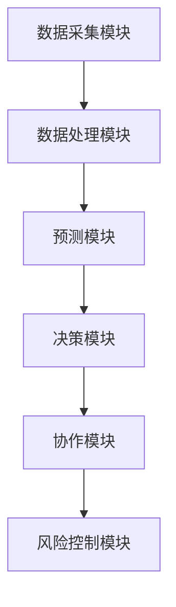

                 


# 基于多智能体的动态资产配置模型在价值投资中的应用

> 关键词：多智能体系统、动态资产配置、价值投资、算法原理、系统架构

> 摘要：本文详细探讨了基于多智能体的动态资产配置模型在价值投资中的应用。通过分析多智能体系统的核心概念与动态资产配置模型的构建方法，结合价值投资的策略，提出了一个多智能体协同优化的资产配置框架。文章从背景介绍、多智能体系统原理、动态资产配置模型构建、多智能体与动态资产配置的结合、算法原理、系统架构、项目实战等多方面展开，为读者提供了一个全面而深入的技术视角。

---

## 第一部分: 背景介绍

### 第1章: 背景介绍

#### 1.1 多智能体系统与动态资产配置模型

##### 1.1.1 多智能体系统的定义与特点

多智能体系统（Multi-Agent System, MAS）是由多个智能体（Agent）组成的分布式系统，每个智能体都是一个能够感知环境、做出决策并采取行动的实体。多智能体系统具有以下特点：

- **分布式性**：智能体之间通过分布式协作完成任务，没有中央控制节点。
- **自主性**：每个智能体都能自主决策，无需外部干预。
- **反应性**：智能体能够根据环境变化实时调整行为。
- **协作性**：智能体之间通过协作完成复杂任务，实现整体目标。

##### 1.1.2 动态资产配置模型的定义与特点

动态资产配置模型是一种根据市场环境变化实时调整资产组合配置的模型。其特点是：

- **实时性**：能够根据市场动态快速调整配置。
- **适应性**：能够适应市场的波动和变化。
- **优化性**：通过优化算法实现资产组合的最大收益或最小风险。

##### 1.1.3 多智能体与动态资产配置模型的结合

多智能体系统与动态资产配置模型的结合，充分利用了多智能体的分布式协作能力和动态资产配置的实时性，能够在复杂多变的市场环境中实现高效的资产配置。

#### 1.2 价值投资的核心概念

##### 1.2.1 价值投资的定义与特点

价值投资是一种以基本面分析为基础，寻找被市场低估的优质资产进行投资的策略。其特点是：

- **长期性**：注重长期投资，追求价值的逐步实现。
- **安全性**：注重资产的安全性，避免高风险投资。
- **选股策略**：基于公司基本面分析，选择具有竞争优势的企业。

##### 1.2.2 价值投资的核心理念与策略

价值投资的核心理念是“买入低于内在价值的资产”，通过长期持有实现收益。其策略包括：

- **选股策略**：选择具有低市盈率、低市净率的公司。
- **分散投资**：通过分散投资降低风险。
- **长期持有**：避免频繁交易，减少交易成本。

##### 1.2.3 价值投资与动态资产配置的关系

动态资产配置能够根据市场变化实时调整资产组合，而价值投资注重长期持有和基本面分析。两者的结合可以通过动态资产配置模型实现价值投资策略的优化。

#### 1.3 问题背景与问题描述

##### 1.3.1 当前资产配置中的问题与挑战

传统的资产配置方法存在以下问题：

- **静态性**：无法适应市场环境的快速变化。
- **单智能体局限性**：单智能体难以应对复杂多变的市场环境。
- **优化效率**：传统的优化方法计算复杂，效率较低。

##### 1.3.2 多智能体在资产配置中的应用前景

多智能体系统能够通过分布式协作和实时决策，显著提升资产配置的效率和准确性。

##### 1.3.3 动态资产配置模型的必要性与优势

动态资产配置模型能够实时调整资产组合，适应市场环境的变化，提高投资收益和风险控制能力。

#### 1.4 本章小结

本章介绍了多智能体系统和动态资产配置模型的基本概念和特点，并分析了它们在价值投资中的应用前景和必要性。

---

## 第二部分: 多智能体系统的核心概念与原理

### 第2章: 多智能体系统的核心概念与原理

#### 2.1 多智能体系统的定义与特点

##### 2.1.1 多智能体系统的定义

多智能体系统（MAS）是由多个智能体组成的分布式系统，每个智能体能够自主决策、协作完成任务。

##### 2.1.2 多智能体系统的特征

- **分布式性**：无中央控制节点，智能体独立决策。
- **自主性**：智能体能够自主感知环境、决策和行动。
- **反应性**：能够实时感知环境变化并调整行为。
- **协作性**：通过协作完成整体目标。

##### 2.1.3 多智能体系统的分类

多智能体系统可以分为以下几类：

- **基于任务的多智能体系统**：智能体之间通过协作完成特定任务。
- **基于市场的多智能体系统**：智能体通过市场机制进行资源分配和协作。
- **基于网络的多智能体系统**：智能体通过网络进行信息交换和协作。

#### 2.2 多智能体系统的协作机制

##### 2.2.1 协作目标的定义与实现

协作目标是多智能体系统中各个智能体共同追求的目标。通过任务分配和协作协议，智能体能够实现协作目标。

##### 2.2.2 信息交换与共享机制

智能体之间需要通过信息交换和共享实现协作。信息交换机制包括：

- **发布-订阅模型**：智能体发布信息，其他智能体通过订阅获取信息。
- **点对点通信**：智能体之间直接通信。

##### 2.2.3 协作策略与决策过程

协作策略是智能体在协作过程中遵循的规则，包括：

- **协商与决策**：智能体之间通过协商确定协作方案。
- **协调与同步**：智能体之间通过协调保持行动一致。

#### 2.3 多智能体系统在金融领域的应用

##### 2.3.1 多智能体系统在金融中的应用场景

- **高频交易**：通过多智能体实时决策和执行交易。
- **风险控制**：通过多智能体协作实现风险预警和控制。
- **资产配置**：通过多智能体协作优化资产配置。

##### 2.3.2 多智能体系统在资产配置中的优势

- **高效性**：多智能体能够快速响应市场变化。
- **准确性**：通过协作优化资产配置。
- **灵活性**：能够适应市场环境的变化。

##### 2.3.3 多智能体系统与传统资产配置方法的对比

传统资产配置方法依赖于单智能体的决策，而多智能体系统通过协作实现更高效的决策和优化。

#### 2.4 本章小结

本章详细介绍了多智能体系统的核心概念与协作机制，并分析了其在金融领域的应用和优势。

---

## 第三部分: 动态资产配置模型的构建与优化

### 第3章: 动态资产配置模型的构建与优化

#### 3.1 动态资产配置模型的构建

##### 3.1.1 资产配置的基本原理

资产配置的基本原理是根据市场环境和投资者需求，选择合适的资产类别和比例。

##### 3.1.2 动态资产配置的核心要素

动态资产配置模型的核心要素包括：

- **市场预测**：对市场的预测和分析。
- **风险偏好**：投资者的风险偏好。
- **资产流动性**：资产的流动性特征。

##### 3.1.3 模型构建的步骤与方法

动态资产配置模型的构建步骤包括：

1. **数据收集与处理**：收集历史市场数据，进行数据清洗和特征提取。
2. **模型选择与训练**：选择合适的算法，训练模型。
3. **模型验证与评估**：验证模型的准确性和稳定性。
4. **模型优化与调整**：根据验证结果优化模型。

#### 3.2 动态资产配置的优化方法

##### 3.2.1 基于多智能体的优化策略

通过多智能体协作优化资产配置，每个智能体负责一部分资产的配置和调整。

##### 3.2.2 动态调整的实现机制

动态调整的实现机制包括：

- **实时监控**：实时监控市场变化。
- **动态优化**：根据市场变化动态优化资产配置。

##### 3.2.3 优化目标与约束条件

优化目标包括：

- **最大化收益**：在风险可控的前提下，最大化投资收益。
- **最小化风险**：在收益目标下，最小化投资风险。

约束条件包括：

- **资产比例限制**：每类资产的投资比例限制。
- **风险承受能力**：投资者的风险承受能力。

#### 3.3 动态资产配置模型的实证分析

##### 3.3.1 数据来源与处理方法

数据来源包括：

- **历史市场数据**：包括股票价格、指数、收益率等。
- **经济指标**：包括GDP、利率、通货膨胀率等。

处理方法包括：

- **数据清洗**：去除异常值和缺失值。
- **特征提取**：提取有用的特征，如动量、波动率等。

##### 3.3.2 模型的验证与评估

验证方法包括：

- **回测**：通过历史数据验证模型的有效性。
- **风险调整后的收益评估**：通过夏普比率、最大回撤等指标评估模型的收益风险比。

##### 3.3.3 模型的改进与优化

根据回测结果，优化模型的参数和结构，提高模型的准确性和稳定性。

#### 3.4 本章小结

本章详细介绍了动态资产配置模型的构建方法和优化策略，并通过实证分析验证了模型的有效性。

---

## 第四部分: 多智能体与动态资产配置模型的结合

### 第4章: 多智能体与动态资产配置模型的结合

#### 4.1 多智能体与动态资产配置的结合方式

##### 4.1.1 多智能体在资产配置中的角色

- **数据采集智能体**：负责收集和处理市场数据。
- **预测智能体**：负责市场预测和风险评估。
- **决策智能体**：负责资产配置的决策和调整。

##### 4.1.2 多智能体与动态资产配置模型的交互

通过信息共享和协作，多智能体与动态资产配置模型实现高效的交互和协同优化。

##### 4.1.3 多智能体与动态资产配置的协同优化

通过多智能体的协作，实现资产配置的动态优化，提高投资收益和风险控制能力。

#### 4.2 多智能体动态资产配置模型的设计

##### 4.2.1 模型的设计目标

- **高效性**：快速响应市场变化。
- **准确性**：准确预测市场走势。
- **稳定性**：模型的稳定性和可靠性。

##### 4.2.2 模型的架构设计

多智能体动态资产配置模型的架构包括：

- **数据采集模块**：负责数据的采集和处理。
- **预测模块**：负责市场预测和风险评估。
- **决策模块**：负责资产配置的决策和调整。
- **协作模块**：负责多智能体之间的协作和信息共享。

##### 4.2.3 模型的实现步骤

实现步骤包括：

1. **数据采集与处理**：收集和处理市场数据。
2. **模型训练与预测**：训练模型，进行市场预测。
3. **资产配置决策**：根据预测结果，进行资产配置决策。
4. **动态调整**：根据市场变化，动态调整资产配置。

#### 4.3 多智能体动态资产配置模型的优化

##### 4.3.1 模型优化的目标

- **提高预测精度**：通过优化模型参数和结构，提高预测精度。
- **降低风险**：通过优化风险控制策略，降低投资风险。
- **提高效率**：通过优化算法和架构，提高模型运行效率。

##### 4.3.2 模型优化的策略

- **参数优化**：通过遗传算法、粒子群优化等方法优化模型参数。
- **结构优化**：优化模型的结构，提高模型的稳定性和准确性。
- **协作优化**：通过多智能体的协作优化，实现整体目标的优化。

#### 4.4 本章小结

本章详细介绍了多智能体与动态资产配置模型的结合方式和设计方法，并提出了优化策略，为实现高效的资产配置提供了理论和实践指导。

---

## 第五部分: 算法原理

### 第5章: 算法原理

#### 5.1 强化学习算法

##### 5.1.1 强化学习的基本概念

强化学习是一种通过智能体与环境交互，通过试错学习，优化策略的算法。

##### 5.1.2 Q-learning算法

Q-learning算法是一种经典的强化学习算法，其核心是通过更新Q值表，实现策略的优化。

##### 5.1.3 多智能体强化学习

多智能体强化学习是强化学习在多智能体系统中的应用，通过多智能体的协作实现整体目标的优化。

#### 5.2 多智能体协作算法

##### 5.2.1 多智能体协作的基本原理

多智能体协作算法是通过智能体之间的协作，实现整体目标的优化。

##### 5.2.2 多智能体协作的实现方法

多智能体协作的实现方法包括：

- **基于规则的协作**：通过预定义规则实现协作。
- **基于市场的协作**：通过市场机制实现资源分配和协作。
- **基于协商的协作**：通过智能体之间的协商实现协作。

#### 5.3 动态资产配置模型的数学模型

##### 5.3.1 动态资产配置的数学模型

动态资产配置模型的数学模型包括：

- **资产收益模型**：描述资产的预期收益。
- **风险模型**：描述资产的风险特征。
- **优化模型**：描述资产配置的优化目标和约束条件。

##### 5.3.2 多智能体协作的数学模型

多智能体协作的数学模型包括：

- **协作目标函数**：描述协作目标的数学表达。
- **协作约束条件**：描述协作过程中的约束条件。
- **协作优化算法**：描述协作优化的算法步骤。

#### 5.4 本章小结

本章详细介绍了强化学习和多智能体协作算法的原理，并提出了动态资产配置模型的数学模型，为实现多智能体动态资产配置提供了理论基础。

---

## 第六部分: 系统架构

### 第6章: 系统架构

#### 6.1 问题场景介绍

##### 6.1.1 问题场景的描述

多智能体动态资产配置系统需要解决的问题包括：

- **实时数据处理**：如何高效处理实时市场数据。
- **动态优化**：如何根据市场变化动态优化资产配置。
- **风险控制**：如何有效控制投资风险。

##### 6.1.2 问题解决的思路

通过多智能体协作和强化学习，实现资产配置的动态优化和风险控制。

#### 6.2 系统功能设计

##### 6.2.1 系统功能模块

多智能体动态资产配置系统的功能模块包括：

- **数据采集模块**：负责数据的采集和处理。
- **预测模块**：负责市场预测和风险评估。
- **决策模块**：负责资产配置的决策和调整。
- **协作模块**：负责多智能体之间的协作和信息共享。

##### 6.2.2 功能模块的交互设计

功能模块之间的交互设计包括：

- **数据交互**：数据采集模块与其他模块共享数据。
- **预测交互**：预测模块向决策模块提供预测结果。
- **协作交互**：协作模块协调各智能体的行动。

#### 6.3 系统架构设计

##### 6.3.1 系统架构图



##### 6.3.2 系统架构的实现步骤

系统架构的实现步骤包括：

1. **数据采集与处理**：收集和处理市场数据。
2. **预测与评估**：进行市场预测和风险评估。
3. **决策与调整**：根据预测结果，进行资产配置决策和动态调整。
4. **协作与控制**：通过协作模块实现多智能体的协作和风险控制。

#### 6.4 系统接口设计

##### 6.4.1 系统接口的定义

系统接口包括：

- **数据接口**：与其他系统进行数据交互。
- **预测接口**：提供市场预测结果。
- **决策接口**：提供资产配置决策。

##### 6.4.2 接口的设计原则

- **标准化**：接口标准化，便于模块之间的协作。
- **可扩展性**：接口设计具有可扩展性，便于后续功能的扩展。
- **安全性**：接口设计考虑安全性，防止数据泄露和攻击。

#### 6.5 系统交互设计

##### 6.5.1 系统交互流程

系统交互流程包括：

1. **数据采集**：数据采集模块采集市场数据。
2. **数据处理**：数据处理模块对数据进行清洗和特征提取。
3. **市场预测**：预测模块进行市场预测。
4. **资产配置决策**：决策模块根据预测结果进行资产配置决策。
5. **动态调整**：根据市场变化，动态调整资产配置。
6. **协作控制**：协作模块协调各智能体的行动，实现整体目标的优化。

##### 6.5.2 交互流程的优化

通过优化交互流程，提高系统的运行效率和准确性。

#### 6.6 本章小结

本章详细介绍了多智能体动态资产配置系统的架构设计和接口设计，并提出了系统的交互流程和优化策略。

---

## 第七部分: 项目实战

### 第7章: 项目实战

#### 7.1 环境安装与配置

##### 7.1.1 开发环境的选择

推荐使用Python编程语言，搭配以下库：

- **NumPy**：用于数值计算。
- **Pandas**：用于数据处理。
- **Scikit-learn**：用于机器学习算法。
- **Multi-Agent Library**：用于多智能体系统的实现。

##### 7.1.2 开发工具的安装

安装步骤：

1. **安装Python**：安装最新版本的Python。
2. **安装库**：使用pip安装所需的库：
   ```bash
   pip install numpy pandas scikit-learn multi-agent-library
   ```

#### 7.2 系统核心实现源代码

##### 7.2.1 数据采集模块

```python
import pandas as pd
import requests

def get_market_data(ticker):
    url = f"https://api.example.com/stock/{ticker}"
    response = requests.get(url)
    data = response.json()
    return pd.DataFrame(data)
```

##### 7.2.2 预测模块

```python
from sklearn.linear_model import LinearRegression

def predict_market(data):
    model = LinearRegression()
    model.fit(data[['price', 'volume']], data['next_price'])
    return model.predict(data[['price', 'volume']])
```

##### 7.2.3 决策模块

```python
def asset_allocation_decision(predictions):
    current_portfolio = get_current_portfolio()
    target_portfolio = optimize_portfolio(current_portfolio, predictions)
    return target_portfolio
```

##### 7.2.4 协作模块

```python
from multi_agent_library import Agent

class AllocatorAgent(Agent):
    def __init__(self, name):
        super().__init__(name)
        self.data = None
        self.predictions = None

    def receive_message(self, message):
        if message['type'] == 'data':
            self.data = message['data']
        elif message['type'] == 'prediction':
            self.predictions = message['predictions']
        self.decision = make_decision(self.data, self.predictions)
```

#### 7.3 代码实现与解读

##### 7.3.1 数据采集模块的实现

数据采集模块通过API接口获取市场数据，并将其存储在DataFrame中。

##### 7.3.2 预测模块的实现

预测模块使用线性回归模型对市场数据进行预测，返回预测结果。

##### 7.3.3 决策模块的实现

决策模块根据预测结果和当前投资组合，优化资产配置。

##### 7.3.4 协作模块的实现

协作模块通过多智能体协作，实现数据共享和决策优化。

#### 7.4 项目实战案例分析

##### 7.4.1 数据来源与处理

使用历史股票数据进行回测，验证模型的有效性。

##### 7.4.2 案例分析与解读

通过具体案例分析，展示模型的预测和决策过程。

##### 7.4.3 实战经验总结

总结项目实战中的经验教训，提出改进建议。

#### 7.5 本章小结

本章通过具体的代码实现和案例分析，展示了多智能体动态资产配置系统的实际应用，为读者提供了实践指导。

---

## 第八部分: 总结

### 第8章: 总结

#### 8.1 最佳实践 tips

- **数据质量**：数据质量对模型的准确性至关重要，需要进行数据清洗和特征提取。
- **模型优化**：通过参数优化和结构优化，提高模型的准确性和稳定性。
- **协作机制**：通过多智能体协作，实现资产配置的动态优化和风险控制。

#### 8.2 小结

本文详细探讨了基于多智能体的动态资产配置模型在价值投资中的应用，提出了一个多智能体协同优化的资产配置框架。通过分析多智能体系统的核心概念与动态资产配置模型的构建方法，结合价值投资的策略，为实现高效的资产配置提供了理论和实践指导。

#### 8.3 注意事项

- **数据隐私**：在数据采集和处理过程中，需要注意数据隐私和安全。
- **模型风险**：模型的有效性和稳定性需要通过实证分析验证。
- **市场环境**：模型的应用需要考虑市场环境的变化和复杂性。

#### 8.4 拓展阅读

- **多智能体系统**：推荐阅读《Multi-Agent Systems》。
- **强化学习**：推荐阅读《Reinforcement Learning: Theory and Algorithms》。
- **动态资产配置**：推荐阅读《Dynamic Asset Allocation》。

---

## 作者

作者：AI天才研究院/AI Genius Institute & 禅与计算机程序设计艺术 /Zen And The Art of Computer Programming

---

通过本文的详细分析和实践指导，读者可以深入了解基于多智能体的动态资产配置模型在价值投资中的应用，并将其应用于实际投资中，实现更高效和更准确的资产配置。

