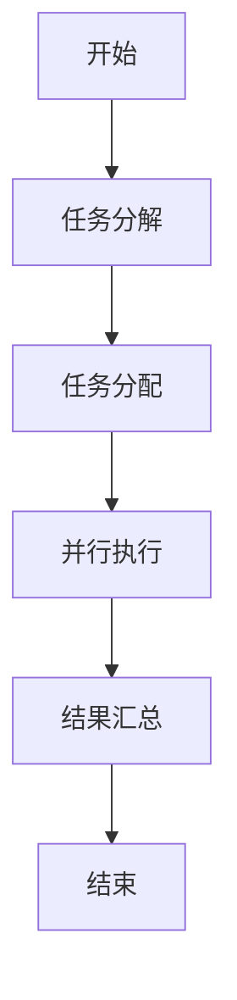
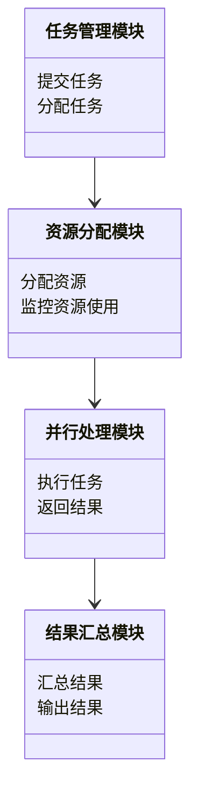
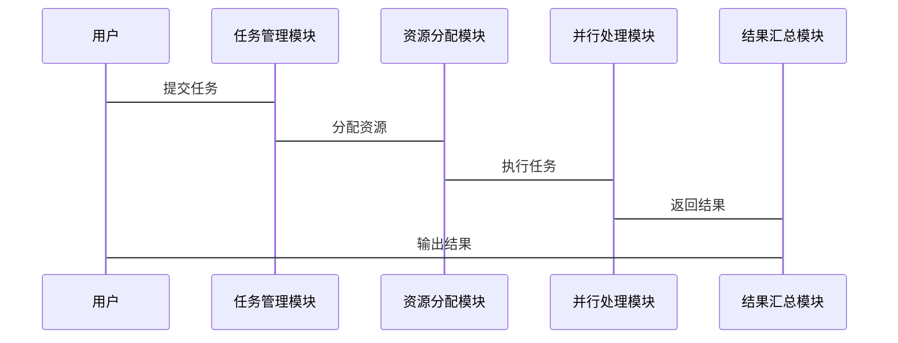

                 


# 多任务AI Agent：增强LLM的并行处理能力

## 关键词：多任务AI Agent, 并行处理, LLM, 大型语言模型, 任务调度, 并行计算

## 摘要

多任务AI Agent通过并行处理能力的增强，显著提升了大型语言模型（LLM）在复杂场景下的性能。本文系统地探讨了多任务AI Agent的核心概念、算法原理、系统设计以及实际应用，旨在为读者提供全面的技术洞察。

---

## 第一部分：多任务AI Agent的背景与概念

### 第1章：多任务AI Agent的背景与问题背景

#### 1.1 多任务AI Agent的背景

- **1.1.1 从单任务AI到多任务AI的演进**

  随着AI技术的发展，单任务AI逐渐暴露出其局限性，难以应对现实世界中复杂的多任务场景。多任务AI Agent的出现，标志着AI技术向更高效、更灵活方向的发展。

- **1.1.2 大语言模型（LLM）的发展与挑战**

  大语言模型在自然语言处理领域取得了显著成就，但其单任务处理的能力限制了其广泛应用。多任务处理成为提升LLM实用性的关键。

- **1.1.3 并行处理能力在AI中的重要性**

  并行处理技术能够显著提升计算效率，特别是在多任务场景下，通过并行处理可以实现资源的高效利用，提升整体性能。

#### 1.2 多任务AI Agent的核心概念

- **1.2.1 多任务处理的定义**

  多任务处理是指在同一时间段内处理多个任务的能力，能够有效提高系统的利用率和响应速度。

- **1.2.2 多任务AI Agent的特征**

  多任务AI Agent具有任务分解能力强、并行处理效率高、适应性好等特征，能够应对多种复杂场景。

- **1.2.3 多任务与并行处理的关系**

  多任务处理依赖于并行处理技术，通过并行计算实现多个任务的同时执行，从而提升整体效率。

#### 1.3 问题背景与问题描述

- **1.3.1 LLM在单任务处理中的局限性**

  单任务处理的LLM难以应对多种任务同时进行，导致资源浪费和效率低下。

- **1.3.2 多任务处理的需求场景**

  在实际应用中，多任务处理的需求日益增长，例如智能助手需要同时处理信息检索、日程管理等多个任务。

- **1.3.3 并行处理能力的提升目标**

  通过并行处理技术，提升LLM的多任务处理能力，满足复杂场景下的应用需求。

#### 1.4 问题解决与边界

- **1.4.1 多任务AI Agent的解决方案**

  通过任务分解和并行处理，优化LLM的多任务处理能力，实现资源的高效利用。

- **1.4.2 并行处理的边界与限制**

  并行处理受硬件资源和任务依赖关系的限制，需要合理设计任务调度机制。

- **1.4.3 多任务与单任务的平衡点**

  在实际应用中，需要根据具体需求权衡多任务与单任务处理的资源分配，确保系统高效运行。

#### 1.5 概念结构与核心要素

- **1.5.1 多任务AI Agent的组成要素**

  包括任务管理模块、并行处理模块、任务调度模块等，确保多任务处理的高效性。

- **1.5.2 并行处理的数学模型**

  并行处理可以通过数学模型描述，例如任务分解和并行计算效率的关系。

- **1.5.3 任务调度机制的核心要素**

  任务调度机制需要考虑任务优先级、资源分配和负载均衡等因素，确保并行处理的效率。

---

## 第二部分：多任务AI Agent的核心概念与联系

### 第2章：多任务AI Agent的核心概念与联系

#### 2.1 多任务处理的核心原理

- **2.1.1 任务分解与并行处理的关系**

  任务分解是并行处理的基础，通过将复杂任务分解为多个子任务，实现并行计算。

- **2.1.2 并行计算的数学模型**

  并行计算的效率可以通过公式 $E = \frac{1}{A} \cdot (1 - \frac{1}{P})$ 计算，其中 $A$ 是串行处理时间，$P$ 是并行处理的进程数。

- **2.1.3 多任务处理的优化策略**

  通过优化任务分解和负载均衡，提升并行处理的效率。

#### 2.2 任务分解与并行处理的对比

- **2.2.1 任务分解的特征与优势**

  任务分解能够提高并行处理的效率，减少任务间的依赖关系。

- **2.2.2 并行处理的特征与挑战**

  并行处理需要考虑资源分配和任务调度，存在通信开销和负载不均的问题。

- **2.2.3 任务分解与并行处理的对比表格**

  | 特征         | 任务分解          | 并行处理          |
  |--------------|-------------------|-------------------|
  | 定义         | 分解任务为子任务   | 同时执行多个任务   |
  | 目标         | 提高并行效率       | 提升处理速度       |
  | 优势         | 减少任务间依赖     | 资源利用高效       |
  | 挑战         | 分解复杂度高       | 负载均衡困难       |

#### 2.3 多任务AI Agent的ER实体关系图

- **2.3.1 实体关系图的构建**

  通过Mermaid图展示多任务AI Agent的实体关系，包括任务、资源、进程等。

```mermaid
er
  actor 用户
  entity 任务
  entity 资源
  entity 进程
  用户 --> 任务: 提交
  任务 --> 进程: 分配
  进程 --> 资源: 使用
```

- **2.3.2 实体关系图的属性与关系**

  用户提交任务，任务被分配给进程，进程使用资源完成任务。

- **2.3.3 实体关系图的优化建议**

  优化任务分配策略，提高资源利用率和并行效率。

---

## 第三部分：多任务AI Agent的算法原理

### 第3章：多任务AI Agent的算法原理

#### 3.1 并行计算的数学模型

- **3.1.1 并行计算的基本公式**

  并行计算的加速公式为 $A = S \cdot P$，其中 $A$ 是加速比，$S$ 是串行时间，$P$ 是进程数。

- **3.1.2 并行计算的加速**

  并行加速可以通过增加进程数和优化任务分解来实现。

#### 3.2 任务调度算法的优化

- **3.2.1 任务调度算法的选择**

  常见的任务调度算法包括轮转调度、优先级调度和负载均衡调度。

- **3.2.2 任务调度算法的优化**

  通过优化算法实现负载均衡，提高并行处理效率。

- **3.2.3 任务调度算法的实现步骤**

  1. 初始化任务队列。
  2. 分配任务到进程。
  3. 监控进程负载。
  4. 调整任务分配策略。

#### 3.3 并行计算的实现流程

- **3.3.1 并行计算的流程步骤**

  1. 任务分解。
  2. 任务分配。
  3. 并行执行。
  4. 结果汇总。

- **3.3.2 并行计算的流程图**



- **3.3.3 并行计算的代码实现**

  ```python
  import concurrent.futures

  def parallel_process(tasks):
      with concurrent.futures.ThreadPoolExecutor() as executor:
          futures = {executor.submit(task): task for task in tasks}
          for future in concurrent.futures.as_completed(futures):
              print(future.result())

  parallel_process(tasks_list)
  ```

#### 3.4 负载均衡策略

- **3.4.1 负载均衡的定义**

  负载均衡是指在多个进程之间分配任务，以确保资源利用均衡。

- **3.4.2 负载均衡的实现方法**

  通过动态调整任务分配策略，实现负载均衡。

- **3.4.3 负载均衡的优化策略**

  使用自适应算法，根据系统负载动态调整任务分配。

---

## 第四部分：多任务AI Agent的系统分析与架构设计

### 第4章：多任务AI Agent的系统分析与架构设计

#### 4.1 系统分析

- **4.1.1 系统分析的目的**

  分析系统需求和约束条件，确定系统的功能模块。

- **4.1.2 系统分析的方法**

  使用场景分析法和数据流分析法，确定系统的关键模块。

- **4.1.3 系统分析的结果**

  确定系统的功能模块，包括任务管理、资源分配和结果汇总。

#### 4.2 系统架构设计

- **4.2.1 系统架构的模块划分**

  包括任务管理模块、资源分配模块、并行处理模块和结果汇总模块。

- **4.2.2 系统架构的模块交互**

  各模块之间通过接口进行交互，确保系统的高效运行。

- **4.2.3 系统架构的模块设计**

  使用Mermaid图展示系统架构。



#### 4.3 系统接口设计

- **4.3.1 系统接口的定义**

  系统接口包括任务提交接口、资源分配接口和结果汇总接口。

- **4.3.2 系统接口的交互流程**

  使用Mermaid图展示系统接口的交互流程。



---

## 第五部分：多任务AI Agent的项目实战

### 第5章：多任务AI Agent的项目实战

#### 5.1 环境安装

- **5.1.1 系统环境要求**

  确保操作系统和硬件满足并行处理的需求。

- **5.1.2 软件环境要求**

  安装必要的开发工具和库，如Python、Concurrent.futures等。

- **5.1.3 环境安装步骤**

  安装Python和必要的库，配置开发环境。

#### 5.2 系统核心实现

- **5.2.1 任务管理模块的实现**

  使用Python编写任务管理模块，实现任务提交和分配功能。

- **5.2.2 资源分配模块的实现**

  通过动态分配资源，确保并行处理的高效性。

- **5.2.3 并行处理模块的实现**

  使用多线程或进程池实现并行计算。

- **5.2.4 结果汇总模块的实现**

  汇总并行处理的结果，输出最终结果。

#### 5.3 代码实现与解读

- **5.3.1 多任务处理的代码实现**

  ```python
  import concurrent.futures

  def task_function(n):
      return f"Task {n} completed."

  def parallel_execute(tasks):
      with concurrent.futures.ThreadPoolExecutor() as executor:
          futures = {executor.submit(task_function, n): n for n in tasks}
          for future in concurrent.futures.as_completed(futures):
              print(future.result())

  tasks = [1, 2, 3, 4, 5]
  parallel_execute(tasks)
  ```

- **5.3.2 代码实现的解读**

  使用线程池实现多任务并行处理，通过完成未来对象获取任务结果，确保高效执行。

#### 5.4 项目实战与案例分析

- **5.4.1 项目实战的背景**

  在实际项目中，多任务处理能够显著提升系统的处理能力。

- **5.4.2 项目实战的案例分析**

  通过具体案例分析，验证多任务处理的效率提升。

- **5.4.3 项目实战的结果与总结**

  总结项目实战的经验，提出改进建议。

---

## 第六部分：多任务AI Agent的高级主题与最佳实践

### 第6章：多任务AI Agent的高级主题与最佳实践

#### 6.1 高级主题

- **6.1.1 多任务处理的优化策略**

  通过优化任务分解和负载均衡，提升并行处理的效率。

- **6.1.2 并行计算的性能调优**

  调整并行粒度和资源分配策略，提升系统性能。

- **6.1.3 并行计算的扩展性优化**

  通过分布式计算和弹性资源分配，提升系统的扩展性。

#### 6.2 最佳实践

- **6.2.1 任务调度的优化建议**

  根据具体需求选择合适的任务调度算法，确保系统的高效运行。

- **6.2.2 并行处理的代码优化建议**

  使用高效的并行库和优化代码结构，提升系统性能。

- **6.2.3 多任务处理的注意事项**

  注意任务间的依赖关系和资源竞争，避免死锁和资源浪费。

#### 6.3 小结与展望

- **6.3.1 小结**

  多任务AI Agent通过并行处理显著提升了LLM的性能，为实际应用提供了有力支持。

- **6.3.2 展望**

  未来，多任务处理技术将进一步发展，推动AI技术向更高效、更智能的方向迈进。

---

## 作者：AI天才研究院/AI Genius Institute & 禅与计算机程序设计艺术 /Zen And The Art of Computer Programming

---

本文通过系统地分析多任务AI Agent的核心概念、算法原理、系统设计和实际应用，为读者提供了全面的技术洞察。希望本文能够为多任务AI Agent的研究和应用提供有价值的参考。

