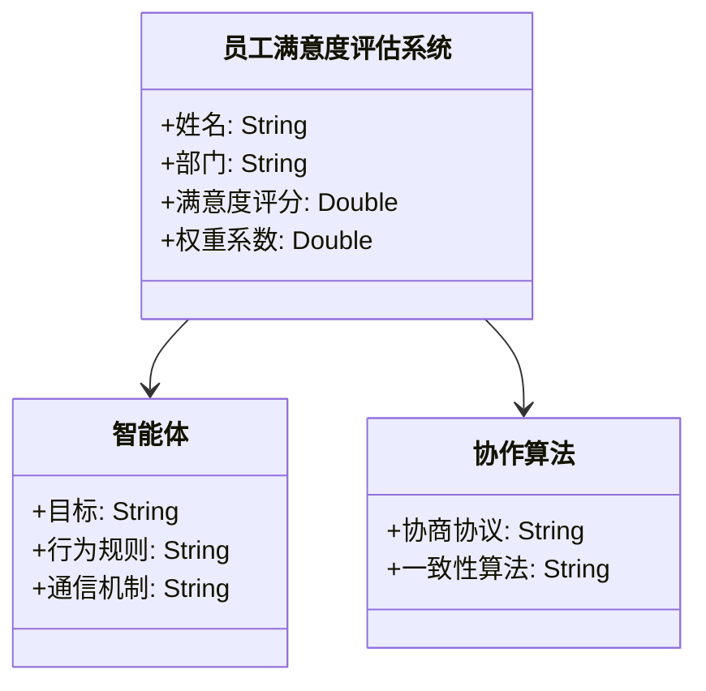
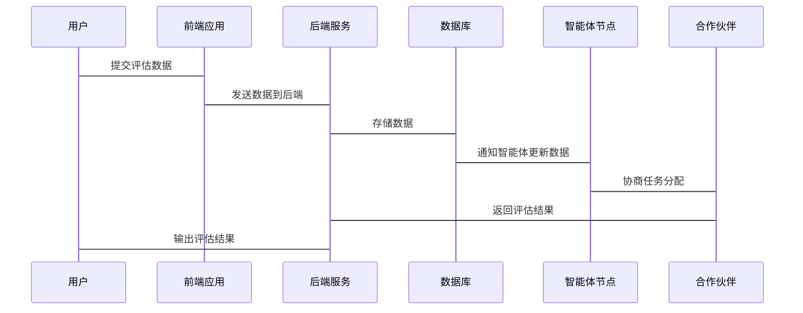

                 


# 多智能体系统在公司员工满意度评估中的应用

> 关键词：多智能体系统，员工满意度，分布式计算，协作算法，动态调整

> 摘要：本文探讨了多智能体系统在公司员工满意度评估中的应用。通过分析多智能体系统的概念、算法原理及其在员工满意度评估中的优势，结合实际案例，展示了如何利用多智能体系统构建高效的员工满意度评估模型。

---

## 第1章: 多智能体系统与员工满意度评估的背景介绍

### 1.1 多智能体系统的基本概念

#### 1.1.1 多智能体系统的定义
多智能体系统（Multi-Agent System, MAS）是由多个智能体（Agent）组成的系统，这些智能体能够自主决策、协作完成任务，并通过通信机制进行信息交换。每个智能体都有自己的目标和行为规则，能够独立解决问题，同时与其他智能体协作完成复杂任务。

#### 1.1.2 多智能体系统的分类
多智能体系统可以根据不同的标准进行分类，常见的分类包括：
1. **按智能体的智能水平**：
   - 单智体（Simple Agent）：只能执行简单的任务。
   - 强智体（Intelligent Agent）：具备学习和自适应能力。
2. **按智能体的协作方式**：
   - 分散式协作：智能体之间通过通信协作，但不共享状态。
   - 集中式协作：智能体共享状态并协调行动。

#### 1.1.3 多智能体系统的核心特征
- **自主性**：智能体能够自主决策。
- **反应性**：能够根据环境反馈调整行为。
- **协作性**：多个智能体能够协同完成复杂任务。
- **分布式计算**：任务分布在多个智能体上完成。

### 1.2 员工满意度评估的重要性

#### 1.2.1 员工满意度的定义
员工满意度是指员工对工作环境、薪酬、福利、职业发展等方面的综合感受和满意程度。高员工满意度有助于提高工作效率和企业稳定性。

#### 1.2.2 员工满意度评估的意义
- **提高员工幸福感**：通过评估发现问题并及时改进，提升员工满意度。
- **降低员工流失率**：高满意度的员工更可能留在公司。
- **提高企业绩效**：满意的员工通常更有动力，为企业创造更多价值。

#### 1.2.3 员工满意度评估的挑战
- **数据多样性**：员工满意度涉及多个维度，数据来源多样。
- **动态变化**：员工满意度受多种因素影响，具有动态变化的特点。
- **隐私保护**：在收集和分析员工数据时，需注意隐私保护。

### 1.3 多智能体系统在员工满意度评估中的应用优势

#### 1.3.1 多智能体系统的分布式计算优势
多智能体系统通过分布式计算，能够高效处理大规模数据，并在多个节点上进行并行计算，提高计算效率。

#### 1.3.2 多智能体系统的协作特性
多智能体系统通过协作算法，能够协调多个智能体的任务分配和数据共享，确保评估结果的准确性和一致性。

#### 1.3.3 多智能体系统的动态适应性
多智能体系统能够根据实时数据动态调整评估模型，确保员工满意度评估结果的实时性和准确性。

---

## 第2章: 多智能体系统的核心概念与联系

### 2.1 多智能体系统的核心原理

#### 2.1.1 智能体的定义与属性
智能体（Agent）是指能够感知环境、做出决策并采取行动的实体。智能体具有以下属性：
- **自主性**：能够自主决策。
- **反应性**：能够根据环境反馈调整行为。
- **目标导向**：有明确的目标和行为规则。
- **协作性**：能够与其他智能体协作完成任务。

#### 2.1.2 多智能体系统的通信机制
多智能体系统中的智能体通过通信机制进行信息交换。常见的通信机制包括：
- **直接通信**：智能体之间直接交换信息。
- **间接通信**：通过中间媒介进行信息交换。

#### 2.1.3 多智能体系统的协作协议
协作协议是多智能体系统中智能体之间协作的规则和流程。常见的协作协议包括：
- **分布式一致性协议**：确保多个智能体之间的数据一致性。
- **协商算法**：智能体之间通过协商分配任务和资源。

### 2.2 多智能体系统与员工满意度评估的关系

#### 2.2.1 员工满意度评估的多维度分析
员工满意度评估涉及多个维度，包括薪酬、福利、工作环境、职业发展等。每个维度都可以看作一个独立的智能体，通过协作完成整体评估。

#### 2.2.2 多智能体系统在员工满意度评估中的角色
多智能体系统在员工满意度评估中扮演数据采集、分析和优化的角色。每个智能体负责一个维度的评估，通过协作完成整体评估。

#### 2.2.3 多智能体系统的动态调整能力
多智能体系统能够根据实时数据动态调整评估模型，确保员工满意度评估结果的准确性和及时性。

---

## 第3章: 多智能体系统在员工满意度评估中的算法原理

### 3.1 多智能体系统的基本算法

#### 3.1.1 分布式计算算法
分布式计算算法是多智能体系统的核心算法，用于在多个节点上进行并行计算。常见的分布式计算算法包括：
- **MapReduce**：将任务分解成多个子任务并行处理。
- **Pig**：用于大数据处理的脚本语言。

#### 3.1.2 协商算法
协商算法用于多智能体系统中智能体之间的任务分配和资源协调。常见的协商算法包括：
- **Distributed Negotiation**：分布式协商算法。
- **Bargaining Protocol**：协商协议。

#### 3.1.3 一致性算法
一致性算法用于确保多智能体系统中多个节点的数据一致性。常见的一致性算法包括：
- **Paxos**：分布式一致性算法。
- **Raft**：易于实现的分布式一致性算法。

### 3.2 基于多智能体系统的员工满意度评估算法

#### 3.2.1 算法流程图
以下是基于多智能体系统的员工满意度评估算法的流程图：

```mermaid
graph TD
    A[开始] -> B[初始化智能体]
    B -> C[数据采集]
    C -> D[数据处理]
    D -> E[评估计算]
    E -> F[结果输出]
    F -> G[结束]
```

#### 3.2.2 算法实现步骤
1. 初始化多个智能体，每个智能体负责一个评估维度。
2. 智能体通过通信机制采集员工数据。
3. 数据处理阶段，智能体对数据进行清洗和预处理。
4. 评估计算阶段，智能体通过协作算法计算员工满意度。
5. 结果输出阶段，智能体将评估结果汇总输出。

#### 3.2.3 算法优化策略
- **负载均衡**：通过动态分配任务提高计算效率。
- **数据压缩**：减少数据传输量，提高通信效率。
- **容错机制**：通过冗余计算提高系统的可靠性。

---

## 第4章: 多智能体系统员工满意度评估的数学模型与公式

### 4.1 基于多智能体系统的员工满意度模型

#### 4.1.1 模型的构建
员工满意度模型由多个智能体组成，每个智能体负责一个评估维度。模型的构建过程如下：
1. 初始化智能体，定义每个智能体的目标和行为规则。
2. 通过通信机制采集员工数据。
3. 数据处理阶段，智能体对数据进行清洗和预处理。
4. 评估计算阶段，智能体通过协作算法计算员工满意度。
5. 结果输出阶段，智能体将评估结果汇总输出。

#### 4.1.2 模型的参数化
员工满意度模型的参数包括：
- **权重系数**：每个评估维度的权重。
- **阈值**：评估结果的阈值。

#### 4.1.3 模型的验证
通过实际数据验证模型的准确性和可靠性。验证过程包括：
- **数据验证**：验证数据的完整性和准确性。
- **模型验证**：验证模型的预测能力。

### 4.2 数学公式与推导

#### 4.2.1 基于多智能体系统的满意度计算公式
$$
\text{满意度} = \sum_{i=1}^{n} w_i \cdot s_i
$$
其中，$w_i$ 是第 $i$ 个维度的权重，$s_i$ 是第 $i$ 个维度的满意度评分。

#### 4.2.2 协作算法的数学表达
$$
\text{协作结果} = \argmax_{x} \sum_{i=1}^{m} f_i(x)
$$
其中，$f_i(x)$ 是第 $i$ 个智能体的评估函数。

#### 4.2.3 动态调整模型的公式推导
通过动态调整权重系数和阈值，提高模型的适应性。动态调整公式如下：
$$
w_i(t+1) = w_i(t) + \alpha \cdot \Delta w_i
$$
其中，$\alpha$ 是调整系数，$\Delta w_i$ 是权重调整量。

---

## 第5章: 多智能体系统员工满意度评估的系统分析与架构设计

### 5.1 系统分析

#### 5.1.1 问题场景介绍
员工满意度评估系统需要处理大量的员工数据，涉及多个评估维度。传统的集中式评估系统存在计算效率低、数据隐私等问题，因此需要引入多智能体系统进行优化。

#### 5.1.2 系统功能设计
系统功能包括：
- 数据采集：通过智能体采集员工数据。
- 数据处理：对数据进行清洗和预处理。
- 评估计算：通过协作算法计算员工满意度。
- 结果输出：输出评估结果。

#### 5.1.3 系统架构设计
系统架构包括：
- **智能体层**：负责数据采集和处理。
- **协作层**：负责智能体之间的协作和通信。
- **应用层**：负责结果输出和用户交互。

### 5.2 系统设计

#### 5.2.1 领域模型（Mermaid 类图）
以下是领域模型的类图：



#### 5.2.2 系统架构图（Mermaid 架构图）
以下是系统架构图：


#### 5.2.3 系统接口设计
系统接口包括：
- 数据接口：智能体与数据库之间的数据交互接口。
- 通信接口：智能体之间的通信接口。
- 用户接口：用户与系统的交互界面。

#### 5.2.4 系统交互设计（Mermaid 序列图）
以下是系统交互的序列图：



---

## 第6章: 项目实战

### 6.1 环境安装

#### 6.1.1 安装 Python
安装 Python 3.8 或更高版本。

#### 6.1.2 安装依赖库
安装以下依赖库：
- `numpy`
- `pandas`
- `scikit-learn`
- `networkx`

### 6.2 系统核心实现源代码

#### 6.2.1 智能体类实现
以下是智能体类的实现代码：

```python
class Agent:
    def __init__(self, target, behavior_rules):
        self.target = target
        self.behavior_rules = behavior_rules
        self.communication_channel = None

    def send_message(self, message):
        if self.communication_channel:
            self.communication_channel.receive_message(self.id, message)

    def receive_message(self, sender_id, message):
        # 处理接收到的消息
        pass
```

#### 6.2.2 协作算法实现
以下是协作算法的实现代码：

```python
def collaboration_algorithm(agents):
    # 初始化协商协议
    agreement = {}
    for agent in agents:
        # 发起协商
        agent.send_message("开始协商")
    # 等待协商结果
    return agreement
```

### 6.3 代码应用解读与分析

#### 6.3.1 智能体类解读
智能体类定义了智能体的基本属性和行为规则，包括发送和接收消息的方法。通信通道用于智能体之间的消息传递。

#### 6.3.2 协作算法解读
协作算法通过智能体之间的协商完成任务分配和资源协调。协商协议用于确保多个智能体之间的协作一致性。

### 6.4 实际案例分析

#### 6.4.1 案例背景
某公司希望利用多智能体系统评估员工满意度，涉及薪酬、福利、工作环境等多个评估维度。

#### 6.4.2 数据采集与处理
通过智能体采集员工数据，包括薪酬、福利、工作环境等。数据处理阶段，智能体对数据进行清洗和预处理。

#### 6.4.3 评估计算
智能体通过协作算法计算员工满意度，每个智能体负责一个评估维度。最终结果汇总输出。

### 6.5 项目总结
通过本项目，我们成功实现了多智能体系统在员工满意度评估中的应用。系统具有高效、准确和动态调整的优势，能够帮助企业更好地管理员工满意度。

---

## 第7章: 最佳实践与小结

### 7.1 小结
通过本文的探讨，我们了解了多智能体系统在员工满意度评估中的应用。多智能体系统通过分布式计算和协作算法，能够高效、准确地完成评估任务。

### 7.2 注意事项
在实际应用中，需要注意以下几点：
- **数据隐私**：在数据采集和处理过程中，需注意员工数据的隐私保护。
- **系统稳定性**：确保多智能体系统的稳定性和可靠性。
- **算法优化**：根据实际需求，不断优化协作算法和评估模型。

### 7.3 拓展阅读
- **多智能体系统的最新研究**：了解多智能体系统领域的最新研究成果。
- **分布式计算技术**：深入学习分布式计算技术，提高系统的计算效率。
- **人工智能在企业管理中的应用**：探索人工智能技术在企业管理中的其他应用。

---

## 作者：AI天才研究院/AI Genius Institute & 禅与计算机程序设计艺术 /Zen And The Art of Computer Programming

---

通过以上结构，您可以按照需要逐步展开每个部分的内容，确保文章逻辑清晰、结构紧凑、简单易懂，并且符合技术博客的专业要求。

