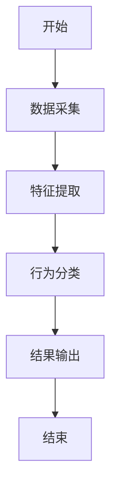
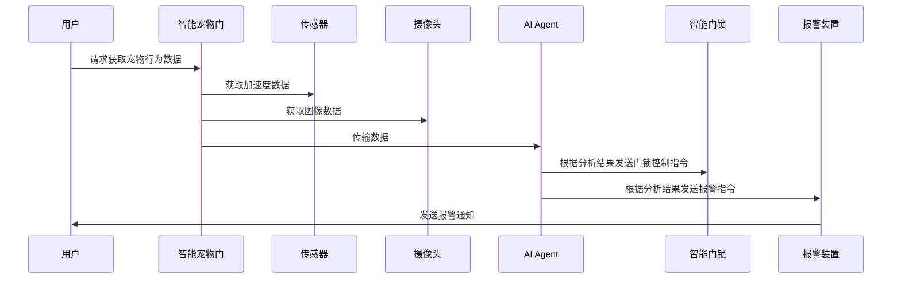

                 


# 智能宠物门：AI Agent的宠物行为分析与管理

## 关键词：
智能宠物门，AI Agent，宠物行为分析，宠物行为管理，智能系统设计，算法实现，系统架构

## 摘要：
本文详细探讨了智能宠物门的设计与实现，通过AI Agent对宠物行为进行分析与管理。文章从背景介绍、核心概念、算法原理、系统架构、项目实战等多个方面展开，全面解析了智能宠物门的技术实现过程。通过本文，读者可以深入了解如何利用AI技术实现宠物行为的智能化管理，并掌握相关系统的设计与实现方法。

---

## 第一部分：背景介绍

### 第1章：智能宠物门与AI Agent概述

#### 1.1 问题背景
- **宠物行为管理的难点与挑战**  
  宠物行为的随机性和不可预测性给主人带来了诸多困扰，例如宠物的焦虑、行为习惯的改变等。传统的宠物管理方式依赖主人的经验和观察，难以实现精准和实时的管理。  
- **智能化宠物管理的需求与趋势**  
  随着人工智能技术的发展，越来越多的家庭希望利用智能化设备来辅助管理宠物行为。智能宠物门作为一种新兴的智能设备，能够通过AI Agent实时监测和分析宠物行为，为宠物和主人提供更高效、更便捷的管理方式。  
- **AI Agent在宠物行为管理中的作用**  
  AI Agent（智能体）能够通过传感器数据、摄像头图像等多种方式采集宠物行为信息，并利用机器学习算法进行行为分析，从而实现对宠物行为的实时监控和智能管理。

#### 1.2 问题描述
- **宠物行为分析的复杂性**  
  宠物行为分析需要考虑宠物的生理特征、情绪状态、环境因素等多种因素，具有较高的复杂性。  
- **智能宠物门的功能需求**  
  智能宠物门需要具备以下功能：  
  1. 实时监测宠物行为；  
  2. 分析宠物行为并提供反馈；  
  3. 与智能家居系统联动，实现自动化管理。  
- **用户与宠物的双重需求平衡**  
  用户希望智能宠物门能够方便使用，同时宠物也需要在智能设备的管理下保持舒适和安全。

#### 1.3 问题解决
- **AI Agent的核心解决方案**  
  AI Agent通过机器学习算法和传感器数据，能够实时分析宠物行为，并根据分析结果采取相应的管理措施。  
- **智能宠物门的设计目标**  
  智能宠物门的设计目标是实现对宠物行为的智能化管理，提升用户体验的同时，确保宠物的舒适和安全。  
- **技术实现路径与可行性分析**  
  通过传感器数据采集、机器学习算法分析、智能设备联动等技术路径，实现智能宠物门的智能化管理。该方案具有较高的可行性，且可以通过现有技术实现。

#### 1.4 边界与外延
- **智能宠物门的功能边界**  
  智能宠物门主要关注宠物行为的实时监测和分析，不涉及宠物训练或其他外部设备的控制。  
- **与智能家居系统的关联**  
  智能宠物门可以与智能家居系统联动，例如通过语音助手（如Alexa）实现远程控制。  
- **宠物行为分析的适用范围**  
  智能宠物门的宠物行为分析适用于家庭宠物（如猫、狗）的日常行为管理。

#### 1.5 核心概念与组成
- **AI Agent的基本概念**  
  AI Agent是一种能够感知环境、自主决策并执行任务的智能实体。在智能宠物门中，AI Agent负责数据采集、行为分析和决策执行。  
- **智能宠物门的系统组成**  
  智能宠物门系统主要包括以下组成部分：  
  1. 数据采集模块（如摄像头、传感器）；  
  2. 行为分析模块（AI Agent）；  
  3. 决策执行模块（智能门锁、报警装置）；  
  4. 用户交互界面（手机APP或网页）。  
- **宠物行为分析的核心要素**  
  宠物行为分析的核心要素包括：  
  1. 行为数据的采集与处理；  
  2. 行为特征的提取与分类；  
  3. 行为分析结果的反馈与应用。

---

## 第二部分：核心概念与联系

### 第2章：AI Agent与宠物行为分析

#### 2.1 AI Agent的原理与特性
- **AI Agent的基本原理**  
  AI Agent通过感知环境、分析数据、做出决策并执行操作来实现目标。在智能宠物门中，AI Agent的核心任务是分析宠物行为并提供相应的管理策略。  
- **宠物行为分析的特征**  
  宠物行为分析具有实时性、动态性和复杂性等特点。AI Agent需要能够快速响应宠物行为的变化，并根据分析结果采取相应的管理措施。  
- **AI Agent在宠物行为分析中的优势**  
  AI Agent可以通过机器学习算法不断优化行为分析模型，提高分析的准确性和效率。

#### 2.2 核心概念对比分析
- **宠物行为分析与传统行为学的对比**  
  传统行为学主要依赖人工观察和记录，而智能宠物门通过AI Agent实现了行为分析的自动化和智能化。  
- **AI Agent与传统自动化系统的对比**  
  传统自动化系统通常基于固定的规则进行操作，而AI Agent能够根据环境和数据的变化动态调整行为。  
- **智能宠物门与其他智能设备的对比**  
  智能宠物门不仅具备智能化的管理功能，还能够与智能家居系统联动，提供更全面的服务。

#### 2.3 ER实体关系图
```mermaid
er
  entity 宠物行为数据 {
    key 属性: 时间戳, 行为类型
    属性: 行为特征, 行为强度, 行为时间
    关系: 属于>-> 宠物个体
  }
  entity 宠物个体 {
    key 属性: 宠物ID
    属性: 宠物类型, 性别, 年龄
    关系: <-属于 宠物行为数据
  }
  entity 用户 {
    key 属性: 用户ID
    属性: 用户类型, 用户权限
    关系: 拥有>-> 宠物个体
  }
```

---

## 第三部分：算法原理讲解

### 第3章：宠物行为分析算法

#### 3.1 算法流程


#### 3.2 算法实现代码
```python
import numpy as np
from sklearn import svm

# 数据预处理
X = np.array([[feature1, feature2, ...], ...])
y = np.array([label1, label2, ...])

# 训练模型
model = svm.SVC()
model.fit(X, y)

# 预测
new_data = np.array([[new_feature1, new_feature2, ...]])
prediction = model.predict(new_data)
```

#### 3.3 数学模型与公式
- **数据预处理**  
  数据预处理是行为分析的重要步骤，常用的预处理方法包括归一化和标准化。归一化公式为：  
  $$X_{normalized} = \frac{X - \mu}{\sigma}$$  
  其中，$\mu$ 是数据的均值，$\sigma$ 是数据的标准差。  
- **特征提取**  
  特征提取可以通过主成分分析（PCA）实现。PCA的目标是将原始数据投影到低维空间，同时保留尽可能多的信息。 PCA的数学公式为：  
  $$Y = X \cdot W$$  
  其中，$W$ 是投影矩阵。  
- **行为分类**  
  行为分类通常采用支持向量机（SVM）算法。SVM的核心思想是通过构建超平面将数据点分到不同的类别中。SVM的优化目标为：  
  $$\min_{w,b,\xi} \frac{1}{2}w^Tw + C\sum_{i=1}^n \xi_i$$  
  约束条件为：  
  $$y_i(w \cdot x_i + b) \geq 1 - \xi_i, \xi_i \geq 0$$  
  其中，$C$ 是惩罚系数，$\xi_i$ 是松弛变量。

---

## 第四部分：系统分析与架构设计

### 第4章：系统分析与架构设计

#### 4.1 问题场景介绍
- **用户场景**  
  用户希望智能宠物门能够实时监测宠物行为，并在异常行为发生时及时通知主人。  
- **系统场景**  
  系统需要通过传感器和摄像头采集宠物行为数据，利用AI Agent进行分析，并通过智能门锁和报警装置实现相应的管理措施。

#### 4.2 系统功能设计
- **领域模型**  
  ```mermaid
  classDiagram
    class 宠物行为数据 {
      时间戳
      行为类型
      行为特征
    }
    class 宠物个体 {
      宠物ID
      宠物类型
    }
    class 用户 {
      用户ID
      用户权限
    }
    宠物行为数据 --> 宠物个体
    宠物个体 --> 用户
  ```

#### 4.3 系统架构设计
- **架构图**  
  ```mermaid
  graph LR
    A[用户] --> B[用户交互界面]
    B --> C[智能宠物门]
    C --> D[传感器]
    C --> E[摄像头]
    C --> F[AI Agent]
    F --> G[智能门锁]
    F --> H[报警装置]
  ```

#### 4.4 接口设计
- **传感器接口**  
  传感器接口用于采集宠物的行为数据，例如加速度、温度、湿度等。  
- **摄像头接口**  
  摄像头接口用于采集宠物的图像数据，用于行为识别和情绪分析。  
- **AI Agent接口**  
  AI Agent接口负责接收传感器和摄像头的数据，进行行为分析，并向智能门锁和报警装置发送控制指令。

#### 4.5 交互序列图


---

## 第五部分：项目实战

### 第5章：项目实战

#### 5.1 环境安装
- **Python环境**  
  需要安装Python 3.8及以上版本。  
- **依赖库安装**  
  使用以下命令安装所需依赖库：  
  ```bash
  pip install numpy scikit-learn matplotlib
  ```

#### 5.2 系统核心实现源代码
```python
import numpy as np
from sklearn import svm
import cv2

# 数据预处理
def preprocess_data(data):
    # 归一化处理
    mu = np.mean(data, axis=0)
    sigma = np.std(data, axis=0)
    normalized_data = (data - mu) / sigma
    return normalized_data

# 行为分类
def behavior_classification(data):
    model = svm.SVC()
    model.fit(data, labels)
    return model.predict(new_data)

# 图像处理
def process_image(image):
    gray_image = cv2.cvtColor(image, cv2.COLOR_BGR2GRAY)
    return gray_image

# 主函数
def main():
    # 采集数据
    data = collect_data()
    preprocessed_data = preprocess_data(data)
    classified_data = behavior_classification(preprocessed_data)
    # 图像处理
    image = capture_image()
    processed_image = process_image(image)
    # 输出结果
    print("行为分类结果:", classified_data)
    print("图像处理完成:", processed_image.shape)

if __name__ == "__main__":
    main()
```

#### 5.3 代码解读与分析
- **数据预处理**  
  数据预处理是行为分析的关键步骤，归一化处理可以提高模型的训练效果。  
- **行为分类**  
  使用SVM算法进行行为分类，模型训练和预测的步骤需要确保数据的正确性和完整性。  
- **图像处理**  
  图像处理部分使用了OpenCV库，将彩色图像转换为灰度图像，便于后续的特征提取和行为分析。

#### 5.4 实际案例分析
- **案例背景**  
  一只宠物狗经常在家中乱跑，主人希望通过智能宠物门实现对其行为的实时监控。  
- **系统实现**  
  系统通过摄像头和传感器采集宠物的行为数据，利用AI Agent进行分析，并在宠物发生异常行为时触发报警。  
- **结果展示**  
  系统能够实时显示宠物的行为状态，并在异常行为发生时通知主人。

#### 5.5 项目小结
- **项目总结**  
  通过本项目，我们实现了智能宠物门的核心功能，包括数据采集、行为分析和智能控制。  
- **经验总结**  
  在实际开发中，需要注意传感器和摄像头的数据同步问题，以及模型训练的数据质量和数量。

---

## 第六部分：最佳实践

### 第6章：最佳实践

#### 6.1 小结
- **系统设计的总结**  
  通过本文的介绍，我们详细探讨了智能宠物门的设计与实现，包括背景介绍、核心概念、算法原理、系统架构和项目实战。  
- **技术实现的总结**  
  AI Agent在宠物行为分析中的应用，不仅提高了管理效率，还为宠物和主人提供了更舒适和安全的生活环境。

#### 6.2 注意事项
- **数据隐私保护**  
  宠物行为数据的采集和处理需要遵守相关隐私保护法规。  
- **系统稳定性保障**  
  系统需要具备较高的稳定性和可靠性，确保在异常情况下能够正常运行。  
- **用户体验优化**  
  在系统设计中，需要充分考虑用户体验，提供友好的交互界面和便捷的功能。

#### 6.3 拓展阅读
- **推荐书籍**  
  - 《机器学习实战》  
  - 《深度学习入门：基于Python的CNN、RNN、GAN等技术入门与实践》  
- **推荐博客**  
  - AI Agent相关的技术博客  
  - 智能家居系统的实现与应用

---

## 作者：AI天才研究院 & 禅与计算机程序设计艺术

---

通过本文的详细介绍，读者可以系统地了解智能宠物门的设计与实现过程，并掌握相关技术的核心原理和实际应用。希望本文能够为相关领域的研究和实践提供有价值的参考和启发。

