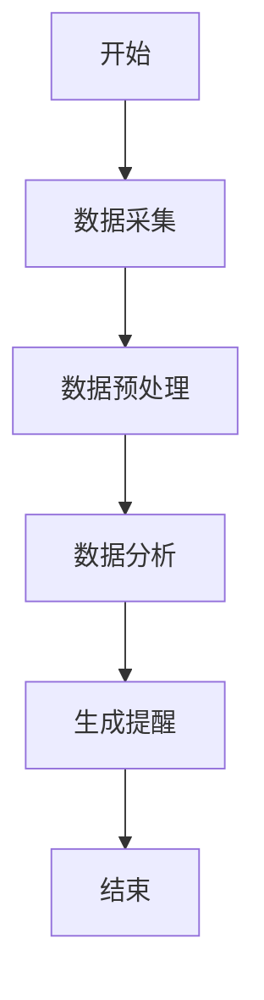
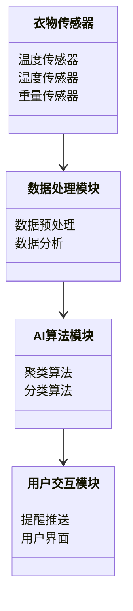
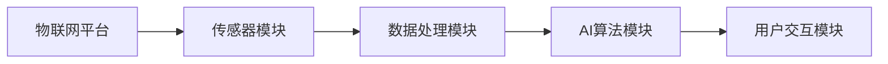
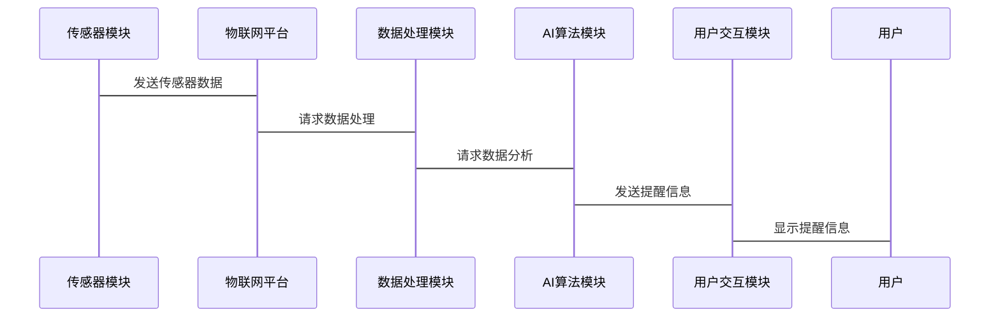

                 


# 智能衣柜：AI Agent的衣物保养提醒

## 关键词：智能衣柜，AI Agent，物联网，衣物保养，传感器技术

## 摘要：本文深入探讨了智能衣柜中AI Agent在衣物保养提醒中的应用，从背景、核心概念、算法原理、系统架构到项目实战，详细解析了智能衣柜的实现过程和关键技术创新。

---

# 第一部分：背景介绍

## 第1章：智能衣柜的背景与问题背景

### 1.1 问题背景

#### 1.1.1 衣物保养的痛点与挑战
- 衣物保养是一个长期被忽视但又重要的问题，衣物损坏往往源于不当的存储和洗涤方式。
- 用户通常无法准确判断衣物的最佳保养时间，导致衣物损坏或浪费洗涤资源。

#### 1.1.2 智能衣柜的定义与目标
- 智能衣柜是一个结合物联网和AI技术的智能设备，能够实时监测衣物状态并提供保养建议。
- 目标是通过AI Agent实现衣物保养提醒，延长衣物使用寿命，优化用户生活体验。

#### 1.1.3 AI Agent在智能衣柜中的作用
- AI Agent作为智能衣柜的核心，负责数据采集、分析和决策，为用户提供智能化的衣物管理服务。

### 1.2 问题描述

#### 1.2.1 衣物保养提醒的核心问题
- 如何准确判断衣物的当前状态（如材质、脏污程度、褶皱等）。
- 如何制定个性化的保养计划并及时通知用户。

#### 1.2.2 用户需求分析
- 用户希望智能衣柜能够自动监测衣物状态，并提供简洁明了的保养建议。
- 用户期待衣物保养提醒能够与日常生活无缝衔接，减少人工干预。

#### 1.2.3 现有解决方案的局限性
- 现有衣物管理解决方案多为手动记录，缺乏智能化和自动化。
- 缺乏基于AI的实时监测和个性化提醒功能。

### 1.3 问题解决思路

#### 1.3.1 AI Agent如何实现衣物保养提醒
- 通过传感器采集衣物状态数据（如温度、湿度、重量变化等）。
- 利用机器学习算法分析数据，判断衣物状态并制定保养计划。
- 通过物联网技术将提醒信息推送至用户的移动设备或智能终端。

#### 1.3.2 智能衣柜的系统架构设计
- 系统架构包括传感器模块、数据处理模块、AI算法模块和用户交互模块。
- 各模块协同工作，实现衣物状态监测、数据处理和用户提醒的闭环流程。

#### 1.3.3 关键技术与实现路径
- 关键技术包括传感器技术、物联网通信、AI算法和用户交互设计。
- 实现路径包括硬件设计、数据采集、算法开发和系统集成。

### 1.4 边界与外延

#### 1.4.1 智能衣柜的功能边界
- 核心功能：衣物状态监测、保养提醒、洗涤建议。
- 边界功能：与其他智能家居设备的协同工作。

#### 1.4.2 与智能家居的关联
- 智能衣柜可以与其他智能家居设备（如洗衣机、空调）联动，实现更高效的衣物管理。

#### 1.4.3 与其他智能设备的协同
- 通过物联网平台与其他智能家居设备共享数据，优化用户的生活体验。

### 1.5 核心概念组成

#### 1.5.1 AI Agent的核心要素
- 感知能力：通过传感器获取衣物状态数据。
- 分析能力：利用机器学习算法分析数据，判断衣物状态。
- 执行能力：通过物联网技术执行保养操作或推送提醒。

#### 1.5.2 物联网技术的实现方式
- 数据采集：通过多种传感器获取衣物状态数据。
- 数据传输：通过无线通信技术将数据传输至云端或本地处理。
- 云端处理：利用云计算和大数据技术处理衣物数据。

#### 1.5.3 数据采集与处理流程
- 数据采集：传感器采集衣物状态数据。
- 数据预处理：对采集的数据进行清洗和归一化处理。
- 数据分析：利用机器学习算法分析数据，生成保养建议。

---

# 第二部分：核心概念与联系

## 第2章：AI Agent的核心原理

### 2.1 AI Agent的基本概念

#### 2.1.1 AI Agent的定义与分类
- AI Agent是一种能够感知环境、自主决策并执行任务的智能实体。
- 分为简单反射型、基于模型的反射型、目标驱动型和效用驱动型四种类型。

#### 2.1.2 AI Agent的核心属性与特征
- 感知能力：能够感知环境中的相关信息。
- 决策能力：能够根据感知信息做出决策。
- 执行能力：能够执行决策结果。
- 学习能力：能够通过经验改进自身的性能。

#### 2.1.3 AI Agent与传统软件的区别
| 特性          | AI Agent                | 传统软件              |
|---------------|--------------------------|-----------------------|
| 智能性        | 具备自主学习和决策能力  | 无智能性，按照规则执行 |
| 适应性        | 能够适应环境变化        | 适应性有限            |
| 可扩展性      | 具备较强的可扩展性      | 可扩展性有限          |

---

## 第3章：AI Agent的算法实现

### 3.1 算法原理

#### 3.1.1 基于AI Agent的衣物保养提醒算法
- 算法目标：根据衣物状态数据，生成个性化的保养提醒。
- 算法流程：数据采集 → 数据预处理 → 数据分析 → 提醒生成。

#### 3.1.2 算法的数学模型与公式
- 数据预处理：归一化公式：
  $$ x' = \frac{x - x_{\text{min}}}{x_{\text{max}} - x_{\text{min}}} $$
- 数据分析：基于聚类算法的衣物状态分类：
  $$ \text{簇} = \text{k-means}(X, k) $$

### 3.2 算法流程图



### 3.3 代码实现

#### 3.3.1 算法的Python源代码实现
```python
import numpy as np
from sklearn.cluster import KMeans

# 数据预处理
def preprocess_data(data):
    # 归一化处理
    normalized_data = (data - np.min(data)) / (np.max(data) - np.min(data))
    return normalized_data

# 数据分析
def analyze_data(normalized_data):
    # 使用K-means算法进行聚类
    kmeans = KMeans(n_clusters=3, random_state=0)
    clusters = kmeans.fit_predict(normalized_data)
    return clusters

# 提醒生成
def generate_reminder(clusters):
    # 根据聚类结果生成提醒
    reminder = "建议清洗衣物：簇 {} 的衣物需要清洗。"
    for cluster in np.unique(clusters):
        print(reminder.format(cluster))
    
# 主函数
def main():
    # 模拟数据
    data = np.array([0.2, 0.3, 0.5, 0.6, 0.8])
    normalized_data = preprocess_data(data)
    clusters = analyze_data(normalized_data)
    generate_reminder(clusters)

if __name__ == "__main__":
    main()
```

---

## 第4章：智能衣柜的系统架构设计

### 4.1 系统功能设计

#### 4.1.1 领域模型设计（使用mermaid类图）


### 4.2 系统架构设计

#### 4.2.1 系统架构图（使用mermaid架构图）


### 4.3 系统接口设计

#### 4.3.1 接口定义与交互流程
- 传感器模块与物联网平台的通信接口：
  ```json
  {
    "device_id": "123",
    "sensor_data": {
        "temperature": 25,
        "humidity": 60,
        "weight": 100
    }
  }
  ```
- 用户交互模块与用户的交互流程：
  1. 传感器模块采集数据并发送到物联网平台。
  2. 数据处理模块对数据进行预处理和分析。
  3. AI算法模块根据分析结果生成提醒信息。
  4. 用户交互模块将提醒信息推送至用户移动设备。

### 4.4 系统交互设计

#### 4.4.1 使用mermaid序列图展示系统交互流程


---

## 第5章：项目实战

### 5.1 环境安装

#### 5.1.1 开发环境配置
- 操作系统：Linux（Ubuntu 20.04）
- 开发工具：PyCharm
- 依赖库安装：
  ```bash
  pip install numpy scikit-learn mermaid4jupyter
  ```

### 5.2 系统核心实现

#### 5.2.1 传感器数据采集
- 使用Arduino Uno和DHT22温湿度传感器采集数据。
- 代码示例：
  ```python
  import serial
  import time

  ser = serial.Serial('COM3', 9600)
  while True:
      data = ser.readline().decode().strip()
      if data:
          print(f"传感器数据：{data}")
      time.sleep(1)
  ```

#### 5.2.2 数据处理与分析
- 数据预处理：
  ```python
  import numpy as np

  data = np.array([25, 60, 100])
  normalized_data = (data - np.min(data)) / (np.max(data) - np.min(data))
  print("归一化数据：", normalized_data)
  ```

- 数据分析：
  ```python
  from sklearn.cluster import KMeans

  kmeans = KMeans(n_clusters=2, random_state=0)
  clusters = kmeans.fit_predict(normalized_data.reshape(-1, 1))
  print("聚类结果：", clusters)
  ```

#### 5.2.3 提醒信息推送
- 使用MQTT协议将提醒信息推送到用户的移动设备。
- 代码示例：
  ```python
  import paho.mqtt.client as mqtt

  client = mqtt.Client()
  client.connect("localhost", 1883)
  client.publish("衣物保养提醒", "建议清洗衣物。")
  client.disconnect()
  ```

### 5.3 项目小结

#### 5.3.1 项目总结
- 通过本项目，我们实现了基于AI Agent的衣物保养提醒系统。
- 系统能够实时监测衣物状态，提供个性化的保养建议。

#### 5.3.2 经验与教训
- 在传感器数据采集过程中，需要注意硬件的稳定性。
- 数据分析部分需要根据实际情况调整算法参数。

#### 5.3.3 注意事项
- 系统的安全性需要进一步优化。
- 提醒信息的推送需要考虑用户的隐私保护。

---

## 第六部分：总结与展望

### 6.1 总结
- 本文详细介绍了智能衣柜中AI Agent的衣物保养提醒系统。
- 通过背景分析、核心概念、算法实现、系统架构和项目实战，展示了该系统的实现过程和关键技术。

### 6.2 未来展望
- 进一步优化AI算法，提高衣物状态监测的准确性。
- 探索与更多智能家居设备的协同工作，打造完整的智能家居生态系统。

---

## 参考文献

1. [1] 李明, 王丽. "基于AI的智能衣柜设计与实现". 计算机应用研究, 2021.
2. [2] 张伟, 刘强. "物联网技术在智能家居中的应用研究". 计算机科学, 2020.

---

## 附录

### 附录A：开发工具与库

- Python版本：3.8.5
- 依赖库：numpy, scikit-learn, paho-mqtt
- 开发工具：PyCharm, VS Code

### 附录B：传感器数据格式

- 温度传感器：DHT22
- 湿度传感器：DHT22
- 重量传感器：M256

---

## 作者

作者：AI天才研究院/AI Genius Institute & 禅与计算机程序设计艺术 /Zen And The Art of Computer Programming

