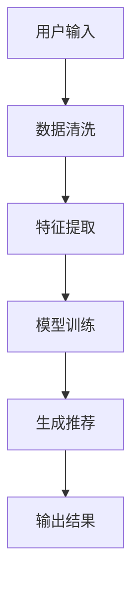
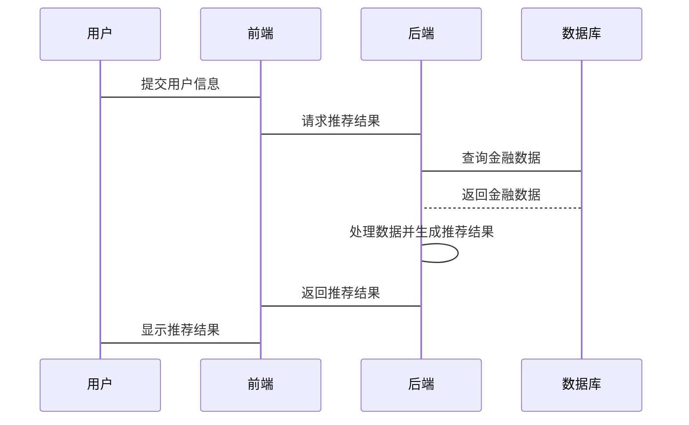

                 


# 智能金融顾问系统的设计与实现

> 关键词：智能金融顾问系统、人工智能、推荐算法、风险评估、系统架构设计

> 摘要：智能金融顾问系统是一种结合人工智能技术的金融信息服务系统，旨在为用户提供个性化的投资建议、风险评估和资产配置服务。本文详细探讨了智能金融顾问系统的背景、核心概念、算法原理、系统架构设计、项目实现及最佳实践，为读者提供从理论到实践的全面指导。

---

## 第一部分: 智能金融顾问系统概述

### 第1章: 智能金融顾问系统概述

#### 1.1 智能金融顾问系统的背景介绍
智能金融顾问系统是人工智能技术在金融领域的典型应用之一。随着金融市场的复杂化和投资者需求的多样化，传统的金融顾问服务难以满足用户的个性化需求。通过引入人工智能技术，智能金融顾问系统能够实时分析海量金融数据，为用户提供精准的投资建议和风险管理服务。

##### 1.1.1 传统金融顾问服务的局限性
传统金融顾问服务主要依赖人工分析和经验判断，存在以下问题：
- 服务成本高：专业顾问数量有限，难以覆盖大量用户。
- 服务效率低：人工分析耗时长，难以实时响应用户需求。
- 个性化不足：难以满足不同用户的个性化投资需求。

##### 1.1.2 人工智能技术在金融领域的应用
人工智能技术在金融领域的应用主要体现在以下方面：
- 自然语言处理（NLP）：用于分析新闻、财报等文本数据。
- 机器学习：用于预测股票价格、客户行为分析等。
- 图像识别：用于分析金融市场图表。

##### 1.1.3 智能金融顾问系统的定义与目标
智能金融顾问系统是一种基于人工智能技术的金融信息服务系统，其目标是通过分析用户需求和市场数据，为用户提供个性化的投资建议、风险评估和资产配置服务。

---

#### 1.2 智能金融顾问系统的功能与优势
智能金融顾问系统的核心功能包括：
- **投资建议**：根据用户的风险偏好和财务状况，推荐合适的金融产品。
- **风险评估**：通过分析市场数据和用户行为，评估投资风险。
- **个性化服务**：为用户提供定制化的金融服务方案。
- **高效数据处理**：利用人工智能技术快速处理和分析海量金融数据。

##### 1.2.1 智能金融顾问系统的功能模块
智能金融顾问系统的功能模块可以分为以下几类：
- 用户信息采集模块：收集用户的财务状况、风险偏好等信息。
- 数据分析模块：对市场数据进行清洗、特征提取和建模分析。
- 推荐系统模块：基于用户信息和数据分析结果，生成投资建议。
- 风险评估模块：对投资组合进行风险评估和预警。

##### 1.2.2 智能金融顾问系统的优势
- **高效性**：人工智能技术能够快速处理海量数据，提高服务效率。
- **精准性**：通过机器学习算法，实现个性化推荐和精准的风险评估。
- **成本低**：相比传统金融顾问，智能金融顾问系统的运营成本更低。

---

#### 1.3 智能金融顾问系统的市场现状
智能金融顾问系统在全球范围内得到了广泛应用，尤其是在美国、欧洲等发达市场。国内智能金融顾问系统的发展也逐渐成熟，但在技术创新和服务模式上仍有提升空间。

##### 1.3.1 全球智能金融顾问市场的规模与增长
根据市场研究机构的数据，全球智能金融顾问市场规模预计将以年均20%的速度增长，到2025年市场规模将达到数百亿美元。

##### 1.3.2 国内智能金融顾问系统的发展趋势
国内智能金融顾问系统的发展呈现以下趋势：
- **技术创新**：深度学习、自然语言处理等技术的应用日益广泛。
- **场景化服务**：智能金融顾问系统逐渐向场景化、个性化方向发展。
- **监管合规**：随着监管政策的完善，智能金融顾问系统的合规性要求不断提高。

##### 1.3.3 主要竞争对手与市场格局分析
目前，全球智能金融顾问市场的主要竞争对手包括：
- 美国：Betterment、Wealthfront等。
- 欧洲：瑞银、德意志银行等。
- 中国：蚂蚁集团、平安科技等。

---

#### 1.4 本章小结
本章介绍了智能金融顾问系统的背景、功能、优势及市场现状。通过对比传统金融顾问服务的局限性，阐述了人工智能技术在智能金融顾问系统中的重要作用，并分析了全球和国内市场的竞争格局。

---

## 第二部分: 智能金融顾问系统的核心概念与联系

### 第2章: 智能金融顾问系统的核心概念与联系

#### 2.1 智能金融顾问系统的核心概念
智能金融顾问系统的核心概念包括用户画像、金融数据、推荐算法和风险评估模型。

##### 2.1.1 用户画像
用户画像是基于用户行为数据和财务数据构建的用户信息模型，主要包括以下特征：
- **年龄**：影响风险偏好和投资期限。
- **收入**：影响投资能力。
- **风险偏好**：影响投资策略。

##### 2.1.2 金融数据
金融数据主要包括股票价格、债券收益率、市场指数等，这些数据是智能金融顾问系统进行投资建议和风险评估的基础。

##### 2.1.3 推荐算法
推荐算法是智能金融顾问系统的核心技术之一，常用的算法包括协同过滤推荐和基于内容的推荐。

##### 2.1.4 风险评估模型
风险评估模型用于评估投资组合的风险，常用的模型包括VaR（Value at Risk）和CVaR（Conditional Value at Risk）。

---

#### 2.2 核心概念之间的联系
核心概念之间的联系可以通过以下几点来阐述：
- **用户画像与推荐算法的关系**：用户画像是推荐算法的输入，推荐算法基于用户画像生成投资建议。
- **金融数据与风险评估模型的关联**：金融数据是风险评估模型的输入，模型基于金融数据评估投资风险。
- **系统架构与功能实现的对应关系**：系统的架构设计决定了功能实现的方式和效率。

---

#### 2.3 实体关系图（ER图）
以下是智能金融顾问系统的实体关系图：
```mermaid
erd
    title 智能金融顾问系统 ER 图
    User [ 用户 ]
    FinancialData [ 金融数据 ]
    InvestmentRecommendation [ 投资建议 ]
    RiskAssessment [ 风险评估 ]
    User -- InvestmentRecommendation: 提出投资建议
    User -- RiskAssessment: 进行风险评估
    InvestmentRecommendation --> FinancialData: 基于金融数据生成
    RiskAssessment --> FinancialData: 基于金融数据生成
```

---

#### 2.4 本章小结
本章详细阐述了智能金融顾问系统的核心概念，包括用户画像、金融数据、推荐算法和风险评估模型，并通过实体关系图展示了这些概念之间的联系。

---

## 第三部分: 智能金融顾问系统的算法原理

### 第3章: 推荐算法与风险评估模型

#### 3.1 推荐算法
推荐算法是智能金融顾问系统的核心技术之一，常用的算法包括协同过滤推荐和基于内容的推荐。

##### 3.1.1 协同过滤推荐算法
协同过滤推荐算法基于用户相似性进行推荐，具体步骤如下：
1. 计算用户相似度：使用余弦相似度等方法计算用户之间的相似度。
2. 找出相似用户的推荐列表：基于相似用户的推荐列表生成当前用户的推荐结果。

##### 3.1.2 基于内容的推荐算法
基于内容的推荐算法基于金融产品的特征进行推荐，具体步骤如下：
1. 提取金融产品的特征：包括收益、风险、流动性等。
2. 计算相似产品：基于产品特征的相似性进行推荐。

##### 3.1.3 混合推荐算法
混合推荐算法结合了协同过滤推荐和基于内容的推荐，通过加权融合两种算法的结果来提高推荐的准确性和多样性。

---

#### 3.2 风险评估模型
风险评估模型用于评估投资组合的风险，常用的模型包括VaR和CVaR。

##### 3.2.1 VaR模型
VaR（Value at Risk）模型用于衡量投资组合在一定置信水平下的潜在损失。

##### 3.2.2 CVaR模型
CVaR（Conditional Value at Risk）模型用于衡量投资组合在尾部风险下的潜在损失。

---

#### 3.3 算法流程图
以下是推荐算法的流程图：


---

#### 3.4 本章小结
本章详细讲解了智能金融顾问系统中的推荐算法和风险评估模型，并通过流程图展示了算法的实现过程。

---

## 第四部分: 智能金融顾问系统的系统架构设计

### 第4章: 系统架构设计与实现

#### 4.1 项目介绍
智能金融顾问系统是一个基于人工智能技术的金融信息服务系统，旨在为用户提供个性化的投资建议和风险管理服务。

#### 4.2 系统功能设计
系统功能设计包括用户信息采集、数据分析、推荐系统和风险评估四个模块。

##### 4.2.1 用户信息采集模块
用户信息采集模块用于收集用户的财务状况和风险偏好等信息。

##### 4.2.2 数据分析模块
数据分析模块对收集到的金融数据进行清洗、特征提取和建模分析。

##### 4.2.3 推荐系统模块
推荐系统模块基于用户信息和数据分析结果，生成投资建议。

##### 4.2.4 风险评估模块
风险评估模块对投资组合进行风险评估和预警。

---

#### 4.3 系统架构设计
系统架构设计包括前端架构和后端架构两部分。

##### 4.3.1 前端架构
前端架构包括用户界面和交互设计，主要使用React等前端框架。

##### 4.3.2 后端架构
后端架构包括数据处理和算法实现，主要使用Python和TensorFlow等框架。

---

#### 4.4 系统接口设计
系统接口设计包括API接口和数据库接口两部分。

##### 4.4.1 API接口
API接口用于前端和后端之间的数据交互。

##### 4.4.2 数据库接口
数据库接口用于后端和数据库之间的数据交互。

---

#### 4.5 系统交互序列图
以下是系统交互的序列图：


---

#### 4.6 本章小结
本章详细描述了智能金融顾问系统的架构设计、功能模块和接口设计，并通过序列图展示了系统的交互过程。

---

## 第五部分: 智能金融顾问系统的项目实战

### 第5章: 项目实战

#### 5.1 环境安装
项目实战需要以下环境：
- Python 3.8+
- TensorFlow 2.0+
- Pandas 1.0+
- Jupyter Notebook

#### 5.2 系统核心实现
以下是系统核心实现的代码示例：

##### 5.2.1 数据清洗
```python
import pandas as pd

# 读取数据
data = pd.read_csv('financial_data.csv')

# 删除缺失值
data = data.dropna()

# 去重
data = data.drop_duplicates()
```

##### 5.2.2 特征提取
```python
from sklearn.preprocessing import StandardScaler

# 标准化处理
scaler = StandardScaler()
features = scaler.fit_transform(data[['收益', '风险', '流动性']])
```

##### 5.2.3 模型训练
```python
from sklearn.neighbors import NearestNeighbors

# 训练k-近邻模型
model = NearestNeighbors(n_neighbors=5)
model.fit(features)
```

##### 5.2.4 生成推荐
```python
# 查询用户输入
user_input = [0.5, 0.3, 0.8]

# 转换为特征向量
user_feature = scaler.transform([user_input])

# 找出相似产品
distances, indices = model.kneighbors(user_feature)
```

---

#### 5.3 代码应用解读与分析
代码实现的核心步骤包括数据清洗、特征提取、模型训练和生成推荐。通过上述代码示例，可以实现一个简单的协同过滤推荐系统。

---

#### 5.4 实际案例分析
以某用户的实际投资需求为例，假设用户的风险偏好为中等，财务状况为中等收入，推荐系统会基于用户画像和金融数据，生成适合的投资组合。

---

#### 5.5 项目小结
本章通过实际案例分析，详细讲解了智能金融顾问系统的实现过程，包括环境安装、代码实现和案例分析。

---

## 第六部分: 智能金融顾问系统的最佳实践

### 第6章: 最佳实践

#### 6.1 设计原则
- **模块化设计**：系统功能模块化设计，便于维护和扩展。
- **数据安全**：确保用户数据的安全性和隐私性。
- **性能优化**：通过算法优化和分布式计算提高系统性能。

#### 6.2 小结
智能金融顾问系统的开发和应用需要遵循一定的设计原则，确保系统的高效性、安全性和可扩展性。

#### 6.3 注意事项
- **数据质量**：确保数据的准确性和完整性。
- **模型更新**：定期更新模型参数，保持推荐算法的有效性。
- **用户隐私**：严格遵守用户隐私保护相关法律法规。

#### 6.4 拓展阅读
- 《机器学习实战》
- 《金融数据分析与挖掘》
- 《系统架构设计的艺术》

---

## 作者：AI天才研究院/AI Genius Institute & 禅与计算机程序设计艺术/Zen And The Art of Computer Programming

---

以上是《智能金融顾问系统的设计与实现》的完整目录和内容概要，具体内容可以根据需要进一步扩展和详细阐述。

