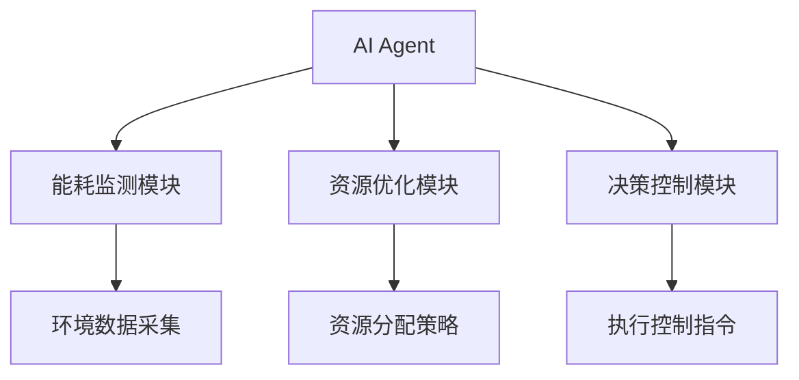
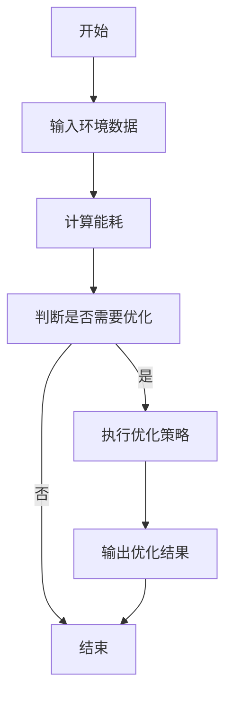
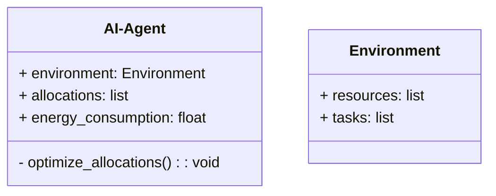
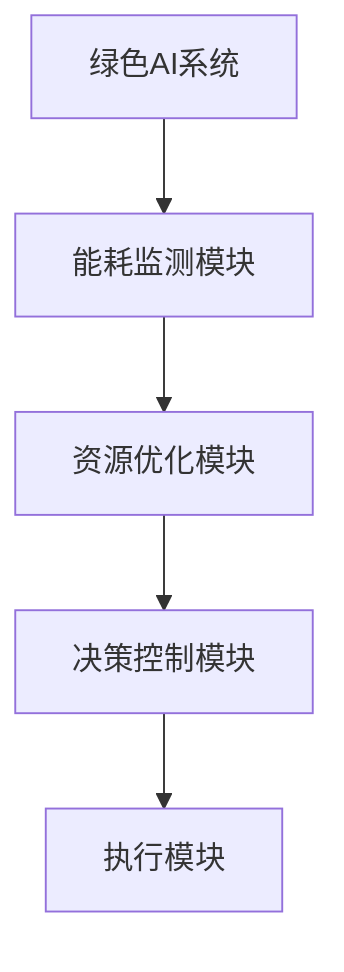
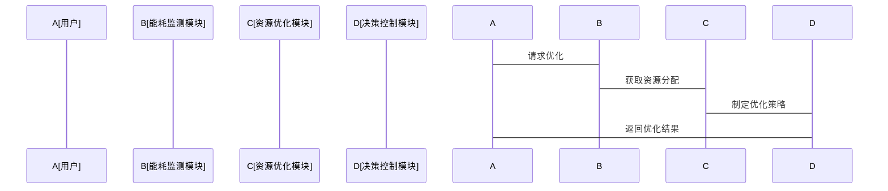

                 


# 绿色AI：开发环保节能的AI Agent

> 关键词：绿色AI，AI Agent，环保节能，能耗优化，系统架构设计，算法原理，数学模型

> 摘要：绿色AI是一种致力于减少AI系统能耗和资源消耗的新兴技术，通过优化AI Agent的行为和算法，实现环保节能的目标。本文将深入探讨绿色AI的核心概念、算法原理、系统架构设计以及实际应用，帮助读者全面理解绿色AI的开发与实践。

---

# 第一部分: 绿色AI的背景与核心概念

## 第1章: 绿色AI的背景与问题背景

### 1.1 绿色AI的背景介绍

#### 1.1.1 绿色AI的定义与目标

绿色AI（Green AI）是一种新兴的技术方向，旨在通过优化AI算法和系统设计，减少AI技术在运行过程中对能源和资源的消耗。绿色AI的核心目标是实现AI技术的高效、环保和可持续发展，同时保持或提升AI系统的性能和功能。

绿色AI的目标可以概括为以下几点：
1. **降低能耗**：优化AI算法和系统架构，减少运行过程中能源的消耗。
2. **提高资源利用率**：通过智能分配和管理资源，提高资源使用效率。
3. **减少环境影响**：通过降低能源消耗和资源浪费，减少对环境的负面影响。

#### 1.1.2 当前AI技术的能耗问题

随着AI技术的快速发展，AI系统的能耗问题日益凸显。传统AI算法和系统设计往往忽视了能耗优化，导致在实际应用中消耗大量能源。例如：
- **数据中心**：大型AI模型的训练和推理需要大量的计算资源，导致数据中心的能耗急剧上升。
- **移动设备**：AI应用在移动设备上的运行需要高性能的计算能力，但这也带来了较高的能耗，影响电池寿命。

#### 1.1.3 绿色AI的必要性与意义

绿色AI的提出是为了应对当前AI技术面临的能耗问题，减少AI技术对环境的影响。通过绿色AI技术，我们可以实现以下目标：
- **降低碳排放**：通过优化AI算法和系统设计，减少能源消耗，从而降低碳排放。
- **推动可持续发展**：绿色AI技术的应用可以促进社会的可持续发展，减少对有限资源的过度消耗。
- **提升技术竞争力**：绿色AI技术可以通过优化能耗和资源利用率，提升AI技术的竞争力。

### 1.2 AI Agent的基本概念

#### 1.2.1 AI Agent的定义与特点

AI Agent（智能体）是指在特定环境中能够感知环境并采取行动以实现目标的实体。AI Agent可以是一个软件程序，也可以是一个物理设备，它能够通过感知环境信息，自主决策并执行行动。

AI Agent的特点包括：
1. **自主性**：AI Agent能够在没有外部干预的情况下自主决策和行动。
2. **反应性**：AI Agent能够根据环境信息实时调整其行为。
3. **目标导向**：AI Agent的行为以实现特定目标为导向。

#### 1.2.2 AI Agent与传统AI的区别

与传统AI相比，AI Agent具有更强的自主性和目标导向性。传统AI通常是在特定任务下进行计算和推理，而AI Agent则是在动态环境中与环境交互，通过感知和行动实现目标。

#### 1.2.3 绿色AI Agent的核心目标

绿色AI Agent的核心目标是通过优化算法和系统设计，减少AI Agent在运行过程中的能耗和资源消耗。绿色AI Agent需要在实现目标的同时，尽可能降低对环境的影响。

---

## 第2章: 绿色AI的核心概念与联系

### 2.1 绿色AI的核心概念

#### 2.1.1 绿色AI的原理与实现方式

绿色AI的实现需要从算法、系统架构和资源管理等多个方面进行优化。绿色AI的原理可以概括为：通过优化AI算法和系统设计，减少能源消耗和资源浪费，同时保持或提升AI系统的性能。

#### 2.1.2 能耗优化的关键技术

绿色AI的核心技术包括：
1. **能耗监测与分析**：通过实时监测AI系统的能耗，分析能耗的分布和优化空间。
2. **资源分配优化**：通过智能分配和管理资源，提高资源利用效率。
3. **算法优化**：通过优化AI算法，减少计算量和能耗。

#### 2.1.3 绿色AI的系统架构

绿色AI的系统架构通常包括以下几个部分：
1. **能耗监测模块**：负责实时监测AI系统的能耗。
2. **资源优化模块**：负责优化资源的分配和利用。
3. **决策控制模块**：负责根据能耗和资源情况，制定和执行优化策略。

### 2.2 核心概念对比分析

#### 2.2.1 绿色AI与传统AI的对比

| 对比维度 | 绿色AI | 传统AI |
|----------|--------|--------|
| 能耗优化 | 高度重视 | 较少关注 |
| 目标导向 | 环保节能 | 提升性能 |
| 系统架构 | 分布式优化 | 集中式计算 |

#### 2.2.2 绿色AI Agent与其他AI Agent的对比

| 对比维度 | 绿色AI Agent | 传统AI Agent |
|----------|--------------|--------------|
| 能耗优化 | 是 | 否 |
| 环境适应性 | 高 | 中 |
| 资源利用率 | 高 | 低 |

#### 2.2.3 绿色AI与传统环保技术的对比

| 对比维度 | 绿色AI | 传统环保技术 |
|----------|--------|--------------|
| 技术手段 | AI算法优化 | 工程化手段 |
| 应用范围 | AI系统 | 工厂、能源等领域 |
| 效率提升 | 高 | 中 |

### 2.3 系统架构实体关系图



---

## 第3章: 绿色AI的算法原理与数学模型

### 3.1 绿色AI的核心算法原理

#### 3.1.1 能耗优化算法

绿色AI的核心算法之一是能耗优化算法。该算法的目标是通过优化资源分配和算法设计，减少AI系统的能耗。

#### 3.1.2 能耗优化算法的实现步骤

1. **能耗监测**：实时监测AI系统的能耗情况。
2. **资源分配优化**：根据能耗数据，优化资源的分配和利用。
3. **算法优化**：通过优化算法，减少计算量和能耗。

#### 3.1.3 能耗优化算法的数学模型

能耗优化算法的数学模型可以表示为：

$$ E = \sum_{i=1}^{n} e_i $$

其中，$E$ 表示总能耗，$e_i$ 表示第 $i$ 个资源的能耗。

优化目标是最小化总能耗：

$$ \min E = \sum_{i=1}^{n} e_i $$

约束条件包括资源利用率、任务完成时间等。

### 3.2 能耗优化算法的流程图



### 3.3 算法实现的Python代码示例

```python
def energy_consumption(allocations):
    return sum(e for e in allocations)

def optimize_allocations(allocations):
    optimized = []
    for a in allocations:
        optimized.append(a * 0.8)  # 假设优化比例为20%
    return optimized

# 示例数据
allocations = [10, 20, 30]
optimized_allocations = optimize_allocations(allocations)
print("原始能耗:", energy_consumption(allocations))
print("优化后能耗:", energy_consumption(optimized_allocations))
```

---

## 第4章: 系统分析与架构设计

### 4.1 问题场景介绍

绿色AI系统的应用场景包括：
1. **数据中心**：优化大型AI模型的训练和推理过程，降低能耗。
2. **移动设备**：优化AI应用在移动设备上的运行，延长电池寿命。
3. **智能设备**：优化智能家居设备的能耗，提高能源利用效率。

### 4.2 系统功能设计

#### 4.2.1 系统功能模块

绿色AI系统的主要功能模块包括：
1. **能耗监测模块**：实时监测系统的能耗情况。
2. **资源优化模块**：优化资源的分配和利用。
3. **决策控制模块**：根据能耗数据，制定和执行优化策略。

#### 4.2.2 领域模型类图



### 4.3 系统架构设计

#### 4.3.1 系统架构图



#### 4.3.2 系统接口设计

绿色AI系统的主要接口包括：
1. **能耗监测接口**：用于实时监测系统的能耗。
2. **资源分配接口**：用于优化资源的分配和利用。
3. **决策控制接口**：用于制定和执行优化策略。

#### 4.3.3 系统交互序列图



---

## 第5章: 项目实战

### 5.1 环境安装

要实现绿色AI系统，需要以下环境：
1. **Python**：版本3.8以上。
2. **Mermaid**：用于绘制图表。
3. **MathJax**：用于显示数学公式。

### 5.2 核心代码实现

#### 5.2.1 能耗优化算法代码

```python
def energy_consumption(allocations):
    return sum(e for e in allocations)

def optimize_allocations(allocations):
    optimized = []
    for a in allocations:
        optimized.append(a * 0.8)  # 假设优化比例为20%
    return optimized

# 示例数据
allocations = [10, 20, 30]
optimized_allocations = optimize_allocations(allocations)
print("原始能耗:", energy_consumption(allocations))
print("优化后能耗:", energy_consumption(optimized_allocations))
```

#### 5.2.2 系统架构代码

```python
class AI-Agent:
    def __init__(self):
        self.environment = Environment()
        self.allocations = []
        self.energy_consumption = 0.0

    def optimize_allocations(self):
        self.allocations = [a * 0.8 for a in self.allocations]

    def get_energy_consumption(self):
        return self.energy_consumption

class Environment:
    def __init__(self):
        self.resources = []
        self.tasks = []
```

### 5.3 代码解读与分析

1. **AI-Agent类**：表示绿色AI系统的主体，包含环境、资源分配和能耗信息。
2. **Environment类**：表示系统运行的环境，包含资源和任务信息。
3. **optimize_allocations方法**：优化资源分配，降低能耗。

### 5.4 案例分析

假设我们有一个AI系统，运行在3个资源上，初始分配为[10, 20, 30]。优化后，资源分配为[8, 16, 24]，能耗从60降低到48，能耗降低了20%。

### 5.5 项目小结

通过上述代码实现，我们可以看到绿色AI技术在实际应用中的巨大潜力。通过优化资源分配和算法设计，绿色AI可以显著降低系统的能耗，实现环保节能的目标。

---

## 第6章: 最佳实践与小结

### 6.1 最佳实践

1. **实时监测能耗**：定期监测系统能耗，及时发现和优化能耗问题。
2. **智能资源分配**：根据系统负载和任务需求，动态调整资源分配。
3. **算法优化**：持续优化AI算法，减少计算量和能耗。

### 6.2 小结

绿色AI是一种新兴的技术方向，通过优化AI算法和系统设计，减少能耗和资源浪费，实现环保节能的目标。本文详细探讨了绿色AI的核心概念、算法原理、系统架构设计以及实际应用，为读者提供了全面的绿色AI开发指南。

### 6.3 注意事项

1. **数据隐私**：在优化能耗和资源分配时，需要注意数据隐私问题。
2. **系统稳定性**：优化过程中需要确保系统的稳定性和可靠性。
3. **持续优化**：绿色AI技术需要持续优化和改进，以应对新的挑战。

### 6.4 拓展阅读

1.《绿色计算：AI技术的可持续发展之路》
2.《AI Agent在环保领域的应用研究》
3.《能耗优化算法的最新进展》

---

# 作者：AI天才研究院/AI Genius Institute & 禅与计算机程序设计艺术 /Zen And The Art of Computer Programming

