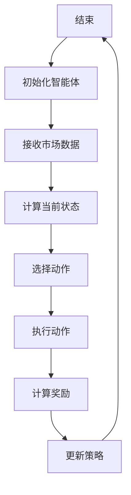
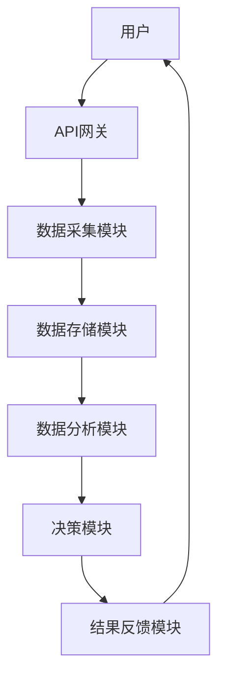
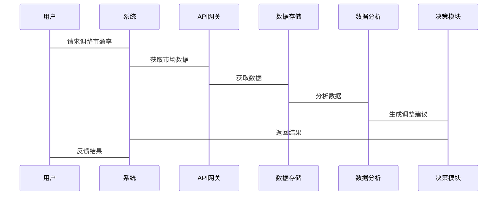

                 


# 运用AI智能体群体实现动态市盈率调整

## 关键词：AI智能体，动态市盈率，金融数据分析，强化学习，分布式系统

## 摘要：本文详细探讨了如何利用AI智能体群体实现动态市盈率调整。通过分析市盈率的基本概念和动态调整的必要性，结合AI智能体的核心概念，提出了基于强化学习的动态市盈率调整算法，并设计了相应的系统架构。文章还通过实际案例展示了算法的实现过程，并总结了项目经验与未来发展方向。

---

## 第一部分: 背景与核心概念

### 第1章: 动态市盈率调整的背景与意义

#### 1.1 市盈率的基本概念

##### 1.1.1 市盈率的定义与计算公式
市盈率（P/E ratio）是衡量股票价值的重要指标，计算公式为：
$$
\text{市盈率} = \frac{\text{股价}}{\text{每股收益}}
$$

##### 1.1.2 市盈率在投资分析中的作用
市盈率能够反映市场的预期和企业盈利能力，是投资者评估股票价值的重要工具。

##### 1.1.3 动态市盈率与静态市盈率的对比

| 特性         | 静态市盈率       | 动态市盈率       |
|--------------|------------------|------------------|
| 时间维度     | 固定时间段       | 实时动态调整     |
| 数据基础     | 历史数据         | 实时数据         |
| 应用场景     | 事后分析         | 事前预测与实时调整 |

#### 1.2 动态市盈率调整的必要性

##### 1.2.1 传统市盈率计算的局限性
传统市盈率计算基于历史数据，无法适应市场实时变化。

##### 1.2.2 动态市盈率调整的现实需求
实时调整市盈率能够更好地反映市场动态，辅助投资决策。

##### 1.2.3 AI技术在金融分析中的潜力
AI技术能够处理海量数据，具备实时分析和自适应调整的能力。

### 第2章: AI智能体群体的核心概念

#### 2.1 AI智能体的基本定义

##### 2.1.1 智能体的定义与特征
智能体是一种能够感知环境、做出决策并执行动作的实体，具有主动性、反应性和社会性。

##### 2.1.2 多智能体系统的概念
多智能体系统是指多个智能体协作完成复杂任务的系统，具备分布式计算和自主决策的特点。

##### 2.1.3 智能体之间的协作机制
智能体之间通过通信和协商实现协作，确保系统目标的实现。

#### 2.2 动态市盈率调整中的智能体角色

##### 2.2.1 数据采集智能体
负责实时收集市场数据，包括股价、 earnings等。

##### 2.2.2 数据分析智能体
对数据进行处理和分析，生成市盈率调整建议。

##### 2.2.3 战略决策智能体
根据分析结果做出最终的市盈率调整决策。

### 第3章: AI智能体群体与动态市盈率调整的关系

#### 3.1 智能体群体在金融数据分析中的优势

##### 3.1.1 分布式计算能力
多智能体能够并行处理数据，提高计算效率。

##### 3.1.2 实时数据处理能力
智能体能够实时感知市场变化，快速做出反应。

##### 3.1.3 自适应调整能力
系统能够根据市场反馈自动调整策略，具备自我优化能力。

#### 3.2 动态市盈率调整的核心问题

##### 3.2.1 数据实时性要求
动态市盈率调整需要实时数据支持。

##### 3.2.2 智能体协作机制
确保智能体之间高效协作，避免冲突和信息孤岛。

##### 3.2.3 系统稳定性与容错性
系统需要具备容错机制，确保在部分智能体故障时仍能正常运行。

---

## 第二部分: 算法原理与数学模型

### 第4章: 基于强化学习的动态市盈率调整算法

#### 4.1 强化学习的基本原理

##### 4.1.1 状态空间与动作空间
状态空间：系统当前的状态，如市场数据、市盈率等。
动作空间：智能体可执行的动作，如调整市盈率、保持不变等。

##### 4.1.2 奖励机制的设计
奖励函数：衡量智能体行为的好坏，如调整后的市盈率是否更接近目标值。

##### 4.1.3 策略优化方法
通过不断试错和学习，优化策略以最大化奖励。

#### 4.2 动态市盈率调整的强化学习模型

##### 4.2.1 状态表示方法
使用市场数据、历史市盈率等作为状态输入。

##### 4.2.2 动作选择策略
基于当前状态，选择最优动作。

##### 4.2.3 奖励函数设计
$$
\text{奖励} = \text{调整后市盈率与目标市盈率的差距}
$$

#### 4.3 强化学习算法流程图（Mermaid）



#### 4.4 算法实现代码示例

```python
import numpy as np
import gym

class MarketEnv(gym.Env):
    def __init__(self):
        super().__init__()
        self.observation_space = gym.spaces.Box(low=-np.inf, high=np.inf, shape=(4,))
        self.action_space = gym.spaces.Discrete(3)  # 0: 下调市盈率，1: 保持不变，2: 上调市盈率
    
    def step(self, action):
        # 模拟市场变化，简化处理
        reward = np.random.normal(0, 1)
        if action == 0:
            reward *= 0.8
        elif action == 2:
            reward *= 1.2
        return self.observation, reward, False, {}
    
    def reset(self):
        self.observation = np.random.randn(4)
        return self.observation

# 初始化环境和智能体
env = MarketEnv()
state = env.reset()

# 策略网络
import torch
import torch.nn as nn

class PolicyNetwork(nn.Module):
    def __init__(self):
        super().__init__()
        self.fc1 = nn.Linear(4, 64)
        self.fc2 = nn.Linear(64, 3)  # 动作空间大小
    
    def forward(self, x):
        x = torch.relu(self.fc1(x))
        x = torch.softmax(self.fc2(x), dim=-1)
        return x

# 训练过程
policy = PolicyNetwork()
optimizer = torch.optim.Adam(policy.parameters(), lr=0.001)

for _ in range(1000):
    state = env.reset()
    with torch.no_grad():
        action_probs = policy(torch.tensor(state))
    action = np.random.choice(3, p=action_probs.numpy()[0])
    next_state, reward, done, _ = env.step(action)
    
    if done:
        break
    
    optimizer.zero_grad()
    predicted_probs = policy(torch.tensor(state))
    loss = -torch.mean(torch.log(predicted_probs) * torch.tensor([action]))
    loss.backward()
    optimizer.step()
```

### 第5章: 数学模型与公式推导

#### 5.1 市盈率调整的数学模型

##### 5.1.1 市盈率调整公式
$$
\text{调整后的市盈率} = \frac{\text{当前股价}}{\text{调整后的每股收益}}
$$

##### 5.1.2 股价预测模型
使用时间序列模型（如ARIMA）预测股价：
$$
\hat{p}_t = \alpha p_{t-1} + \beta \epsilon_t
$$

##### 5.1.3 每股收益预测模型
使用回归模型预测每股收益：
$$
\hat{eps}_t = \gamma \text{收入}_t + \delta \text{成本}_t
$$

#### 5.2 强化学习算法的数学表达

##### 5.2.1 策略梯度方法
策略梯度方法通过优化策略函数来最大化期望奖励：
$$
\nabla \theta = \mathbb{E}_{\tau}[ \nabla \log \pi_\theta(a|s) Q(s,a) ]
$$

##### 5.2.2 Q-learning算法
Q-learning通过学习状态-动作值函数来优化决策：
$$
Q(s,a) = Q(s,a) + \alpha (r + \gamma \max Q(s',a') - Q(s,a))
$$

##### 5.2.3 策略网络的损失函数
$$
L = -\sum_{i} [r_i \log p_i + (1 - r_i) \log (1 - p_i)]
$$

---

## 第三部分: 系统分析与架构设计

### 第6章: 系统分析与需求分析

#### 6.1 问题场景介绍

##### 6.1.1 系统目标
实现动态市盈率调整，辅助投资者做出实时决策。

##### 6.1.2 功能需求
- 实时数据采集
- 市盈率计算与调整
- 系统监控与报警

#### 6.2 项目介绍

##### 6.2.1 项目目标
开发一个基于AI智能体的动态市盈率调整系统。

##### 6.2.2 项目范围
涵盖数据采集、分析、决策和反馈等环节。

### 第7章: 系统架构设计

#### 7.1 系统功能设计（领域模型）

```mermaid
classDiagram
    class MarketDataCollector {
        collect_data()
    }
    class DataAnalyzer {
        analyze_data()
    }
    class DecisionMaker {
        make_decision()
    }
    class MarketDataCollector<->DataAnalyzer
    class DataAnalyzer<->DecisionMaker
```

#### 7.2 系统架构图（Mermaid）



#### 7.3 系统接口设计

##### 7.3.1 API接口
- `/api/market_data`：获取市场数据
- `/api/adjust_pe`：调整市盈率

##### 7.3.2 交互流程
用户请求调整市盈率，系统通过API获取数据，分析并反馈结果。

#### 7.4 系统交互流程图（Mermaid）



---

## 第四部分: 项目实战

### 第8章: 项目实战

#### 8.1 环境安装

##### 8.1.1 安装Python和依赖
```bash
pip install numpy torch gym
```

##### 8.1.2 安装环境
```bash
conda install -n ai-env gym
```

#### 8.2 系统核心实现源代码

##### 8.2.1 数据采集模块

```python
import requests

def get_market_data():
    try:
        response = requests.get('https://api.market.com/stock_data')
        return response.json()
    except Exception as e:
        print(f"Error: {e}")
        return None
```

##### 8.2.2 数据分析模块

```python
import pandas as pd

def analyze_data(data):
    df = pd.DataFrame(data)
    df['市盈率'] = df['股价'] / df['每股收益']
    return df
```

##### 8.2.3 决策模块

```python
import numpy as np

def make_decision(data):
    current_pe = data['市盈率'].mean()
    target_pe = 15  # 假设目标市盈率为15
    if current_pe > target_pe:
        return '下调市盈率'
    elif current_pe < target_pe:
        return '上调市盈率'
    else:
        return '保持不变'
```

#### 8.3 代码应用解读与分析

##### 8.3.1 数据采集模块解读
从外部API获取市场数据，处理可能的网络异常。

##### 8.3.2 数据分析模块解读
计算市盈率，并存储在DataFrame中。

##### 8.3.3 决策模块解读
根据当前市盈率与目标市盈率的对比，做出调整决策。

#### 8.4 实际案例分析

##### 8.4.1 案例背景
假设当前市盈率为20，目标市盈率为15，系统会触发下调市盈率的动作。

##### 8.4.2 调整过程
1. 数据采集模块获取市场数据。
2. 数据分析模块计算市盈率。
3. 决策模块根据市盈率与目标值对比，做出调整决策。
4. 系统执行调整，并反馈结果。

#### 8.5 项目小结

##### 8.5.1 经验总结
- 数据采集的稳定性和准确性至关重要。
- 系统需要具备容错机制，确保在异常情况下仍能正常运行。
- 模型的实时性和准确性需要通过大量数据训练和验证。

##### 8.5.2 改进方向
- 引入更多的市场指标，如市净率、市销率等。
- 优化强化学习算法，提高决策的准确性。
- 增强系统的可解释性，方便用户理解和调整。

---

## 第五部分: 总结与展望

### 第9章: 总结与展望

#### 9.1 核心内容回顾
本文详细介绍了如何利用AI智能体群体实现动态市盈率调整，从理论到实践，系统地阐述了相关技术和实现方法。

#### 9.2 重点强调
- 强化学习在动态市盈率调整中的重要性。
- 系统架构设计的关键性。
- 实际应用中的经验和教训。

#### 9.3 未来展望
- 探索更先进的强化学习算法，如深度强化学习（DRL）。
- 研究多智能体协作机制，提升系统的整体性能。
- 结合区块链技术，确保数据安全和系统透明性。

### 第10章: 注意事项与最佳实践

#### 10.1 注意事项
- 确保数据来源的可靠性和准确性。
- 定期更新模型和算法，适应市场变化。
- 注意系统的稳定性和容错性。

#### 10.2 最佳实践
- 在实际应用中，建议结合多种技术手段，如机器学习和规则引擎，提升系统的鲁棒性。
- 定期进行压力测试，确保系统在高负载下的稳定性。
- 建立完善的监控体系，及时发现和处理系统异常。

---

## 作者：AI天才研究院 & 禅与计算机程序设计艺术

