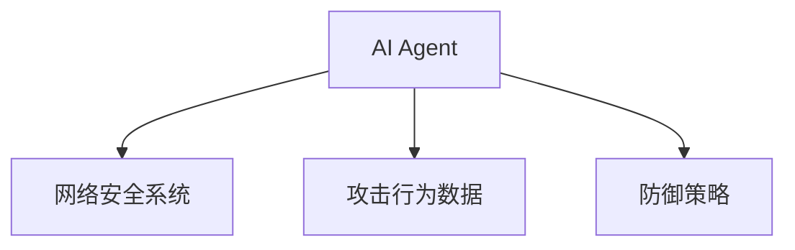
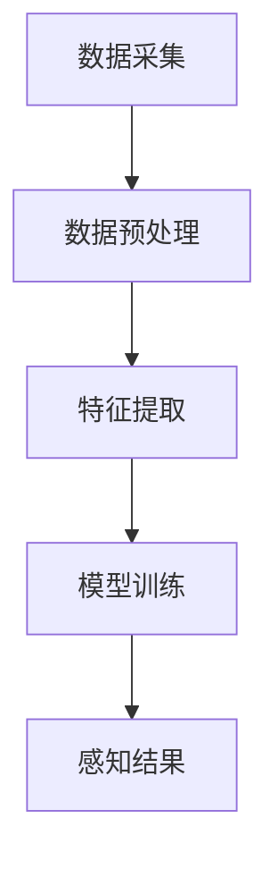
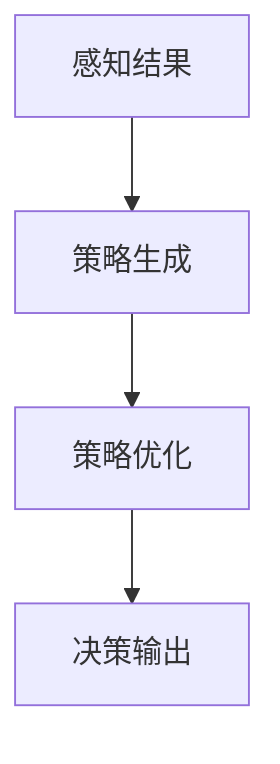
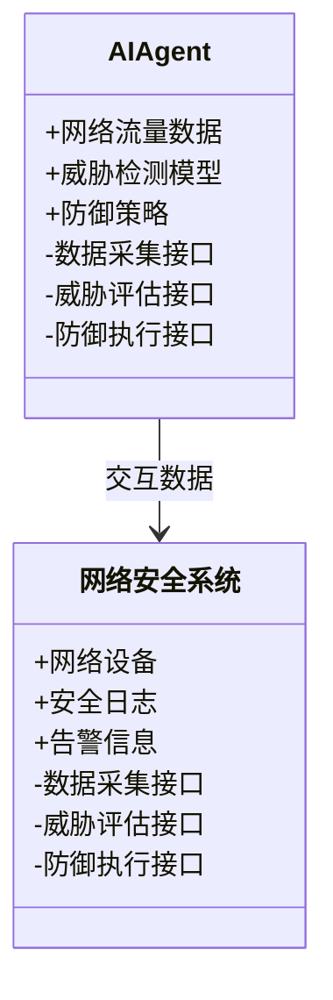
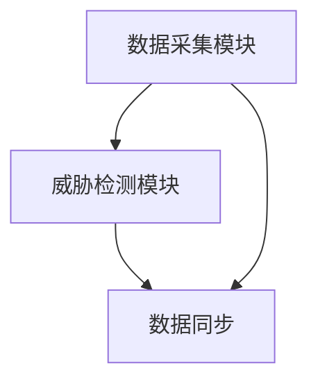

                 


# AI Agent在智能网络安全防御中的角色

**关键词**：AI Agent、智能网络安全、网络安全防御、机器学习、安全威胁检测

**摘要**：AI Agent作为智能网络安全防御的核心技术，通过其感知、决策和执行能力，显著提升了网络安全的智能化水平。本文系统地探讨了AI Agent的基本概念、核心原理、算法实现及其在网络安全防御中的应用，分析了其优势与挑战，并展望了未来的发展方向。

---

# 第1章 AI Agent的基本概念与网络安全背景

## 1.1 什么是AI Agent

### 1.1.1 AI Agent的定义与特点

AI Agent（人工智能代理）是一种能够感知环境、自主决策并执行任务的智能实体。其特点包括：

- **自主性**：能够在没有外部干预的情况下自主运行。
- **反应性**：能够实时感知环境变化并做出反应。
- **学习能力**：通过数据和经验不断优化自身行为。
- **目标导向**：具有明确的目标，并采取行动以实现这些目标。

AI Agent在网络安全中的角色类似于一个智能化的“保安”，能够实时监控网络环境，识别潜在威胁，并采取相应的防御措施。

### 1.1.2 AI Agent的核心要素与功能

AI Agent的核心要素包括：

- **感知能力**：通过传感器或数据源获取环境信息。
- **决策能力**：基于感知信息，分析并生成行动策略。
- **执行能力**：根据决策结果执行具体操作。

其功能主要体现在以下几个方面：

- **威胁检测**：实时监控网络流量，识别异常行为。
- **漏洞修复**：自动修复系统漏洞或配置问题。
- **响应策略**：根据威胁的严重性制定相应的应对措施。

### 1.1.3 AI Agent在网络安全中的定位与作用

AI Agent在网络安全中的定位是一个智能化的防御工具，其作用主要体现在以下几个方面：

- **自动化防御**：能够自动识别并应对网络安全威胁。
- **实时监控**：持续监测网络环境，确保安全状态。
- **智能决策**：基于历史数据和当前情况，做出最优决策。

---

## 1.2 智能网络安全防御的现状与挑战

### 1.2.1 当前网络安全的主要威胁与挑战

随着信息技术的飞速发展，网络安全威胁日益复杂。常见的威胁包括：

- **病毒与恶意软件**：如勒索软件、间谍软件等。
- **网络攻击**：如DDoS攻击、钓鱼攻击等。
- **数据泄露**：由于人为或技术漏洞导致的敏感数据泄露。

### 1.2.2 传统网络安全防御的局限性

传统的网络安全防御手段主要依赖于静态规则和手动操作，存在以下局限性：

- **响应速度慢**：面对快速变化的威胁，传统防御难以及时应对。
- **防御范围有限**：难以覆盖复杂的网络环境。
- **依赖人工干预**：需要大量人工操作和维护。

### 1.2.3 智能化网络安全防御的必要性

智能化网络安全防御通过引入AI Agent等技术，能够显著提升防御能力。其必要性体现在以下几个方面：

- **提升响应速度**：AI Agent能够快速识别并应对威胁。
- **增强防御能力**：通过智能化分析，能够发现更多潜在威胁。
- **降低人工成本**：减少对人工干预的依赖，提高效率。

---

## 1.3 AI Agent在网络安全中的角色与价值

### 1.3.1 AI Agent的智能化优势

AI Agent在网络安全中的智能化优势主要体现在以下几个方面：

- **自我学习**：能够通过机器学习算法不断优化自身的威胁识别能力。
- **动态适应**：能够根据环境变化动态调整防御策略。
- **高效决策**：能够在极短时间内做出决策，应对突发威胁。

### 1.3.2 AI Agent在网络安全中的应用场景

AI Agent在网络安全中的应用场景广泛，主要包括：

- **实时威胁检测**：通过分析网络流量，识别异常行为。
- **漏洞修复**：自动检测并修复系统漏洞。
- **智能响应**：根据威胁的严重性，采取相应的防御措施。

### 1.3.3 AI Agent的未来发展与潜力

随着人工智能技术的不断进步，AI Agent在网络安全中的潜力巨大。未来发展方向包括：

- **更强大的学习能力**：通过深度学习提升威胁识别的准确性。
- **多 Agent 协作**：多个AI Agent协同工作，形成更强大的防御体系。
- **与物联网结合**：在物联网环境下，AI Agent能够发挥更大的作用。

---

## 1.4 本章小结

本章从AI Agent的基本概念出发，探讨了其在网络安全中的定位与作用，并分析了智能化网络安全防御的必要性。通过对比传统防御手段的局限性，凸显了AI Agent在网络安全中的重要价值。接下来的章节将深入探讨AI Agent的核心原理与算法实现，以及其在实际应用中的系统架构与实现方案。

---

# 第2章 AI Agent的核心概念与网络安全防御的关系

## 2.1 AI Agent的核心概念体系

### 2.1.1 AI Agent的核心概念属性对比表

| 概念          | 属性                         |
|---------------|------------------------------|
| 感知能力      | 数据采集与分析能力           |
| 决策能力      | 策略生成与优化能力           |
| 执行能力      | 行为执行与反馈能力           |

### 2.1.2 AI Agent的实体关系图



---

## 2.2 AI Agent的核心原理与网络安全防御的联系

### 2.2.1 AI Agent的感知机制

AI Agent的感知机制主要通过数据采集与分析实现。常见的感知方法包括：

- **数据采集**：通过传感器或日志系统获取网络流量数据。
- **特征提取**：从数据中提取有意义的特征，如IP地址、流量大小等。
- **异常检测**：通过机器学习算法识别异常行为。

### 2.2.2 AI Agent的决策机制

AI Agent的决策机制基于感知到的信息，通过以下步骤实现：

- **模型训练**：使用历史数据训练分类模型。
- **策略生成**：根据当前情况生成防御策略。
- **策略优化**：通过反馈不断优化策略。

### 2.2.3 AI Agent的执行机制

AI Agent的执行机制主要通过以下步骤实现：

- **指令生成**：根据决策结果生成具体操作指令。
- **指令执行**：通过API或其他接口执行指令。
- **反馈收集**：收集执行结果并用于优化模型。

---

## 2.3 AI Agent与传统网络安全防御的区别

### 2.3.1 传统网络安全防御的局限性

传统网络安全防御手段主要依赖于静态规则和人工干预，存在以下问题：

- **响应速度慢**：难以应对快速变化的威胁。
- **防御范围有限**：难以覆盖复杂的网络环境。
- **依赖人工干预**：需要大量人工操作和维护。

### 2.3.2 AI Agent的智能化优势

AI Agent通过智能化分析和自主决策，显著提升了网络安全防御能力。其优势体现在以下几个方面：

- **自动化防御**：能够自动识别并应对威胁。
- **实时监控**：持续监测网络环境，确保安全状态。
- **智能决策**：基于历史数据和当前情况，做出最优决策。

### 2.3.3 两者的协同与融合

AI Agent与传统防御手段并非完全对立，而是可以协同工作。例如：

- **结合规则引擎**：利用传统规则过滤器进行初步筛选，再通过AI Agent进行深度分析。
- **混合防御策略**：结合AI Agent的智能分析和传统防御的快速响应，形成更强大的防御体系。

---

## 2.4 本章小结

本章详细探讨了AI Agent的核心概念与网络安全防御的关系，分析了其感知、决策和执行机制，并对比了与传统防御手段的差异。通过结合两者的优势，能够形成更强大的网络安全防御体系。接下来的章节将深入探讨AI Agent的算法原理与数学模型，以及其在实际应用中的系统架构与实现方案。

---

# 第3章 AI Agent的算法原理

## 3.1 AI Agent的感知算法

### 3.1.1 数据采集与预处理

AI Agent的感知算法首先需要采集网络环境中的数据，包括：

- **网络流量数据**：如IP地址、流量大小、包时间戳等。
- **日志数据**：如系统日志、安全日志等。

数据预处理步骤包括：

- **数据清洗**：去除噪声数据，确保数据质量。
- **特征提取**：从数据中提取有意义的特征，如攻击类型、流量模式等。

### 3.1.2 模型训练与特征提取

模型训练是AI Agent感知算法的核心步骤，通常采用监督学习方法。以下是具体的步骤：

1. **数据标注**：将数据分为正常和异常两类。
2. **特征工程**：提取关键特征，如时间序列特征、统计特征等。
3. **模型训练**：使用训练数据训练分类模型，如随机森林、支持向量机（SVM）等。

### 3.1.3 感知算法的实现流程图



---

## 3.2 AI Agent的决策算法

### 3.2.1 决策模型的构建

AI Agent的决策算法基于感知到的信息，通过以下步骤实现：

1. **威胁评估**：根据感知结果评估威胁的严重性。
2. **策略生成**：根据威胁评估结果生成防御策略。
3. **策略优化**：通过反馈不断优化策略。

### 3.2.2 策略生成与优化

策略生成与优化的过程可以分为以下几个步骤：

1. **威胁分类**：将威胁分为不同类别，如低风险、中风险、高风险。
2. **策略制定**：根据威胁类别制定相应的应对措施，如警告、阻断、隔离等。
3. **策略优化**：通过历史数据和反馈不断优化策略，提高防御效率。

### 3.2.3 决策算法的实现流程图



---

## 3.3 AI Agent的数学模型

### 3.3.1 感知模型的数学表达

感知模型通常采用分类算法，如随机森林或SVM。以随机森林为例，其数学表达如下：

$$
f(x) = \text{sign}(\sum_{i=1}^{n} w_i h_i(x))
$$

其中，$w_i$ 是树的权重，$h_i(x)$ 是树的预测值。

### 3.3.2 决策模型的数学表达

决策模型通常采用强化学习方法，其数学表达如下：

$$
Q(s, a) = r + \gamma \max_{a'} Q(s', a')
$$

其中，$Q(s, a)$ 是状态-动作对的价值，$r$ 是奖励，$\gamma$ 是折扣因子，$s'$ 是下一个状态。

---

## 3.4 本章小结

本章详细探讨了AI Agent的感知和决策算法，分析了其数学模型和实现流程。通过感知算法和决策算法的结合，AI Agent能够实现智能化的网络安全防御。接下来的章节将探讨AI Agent在实际应用中的系统架构与实现方案。

---

# 第4章 AI Agent的系统分析与架构设计

## 4.1 问题场景介绍

假设我们面临一个典型的网络安全威胁，如DDoS攻击。我们需要设计一个AI Agent系统来实时检测并应对此类攻击。

### 4.1.1 项目介绍

本项目旨在开发一个基于AI Agent的智能网络安全防御系统，能够实时检测并应对网络安全威胁。

### 4.1.2 系统功能设计

系统功能设计包括以下几个方面：

- **数据采集**：实时采集网络流量数据。
- **威胁检测**：通过AI算法检测异常行为。
- **威胁响应**：根据检测结果采取相应的防御措施。

### 4.1.3 系统功能设计的领域模型



---

## 4.2 系统架构设计

### 4.2.1 系统架构设计的总体思路

系统架构设计包括以下几个步骤：

1. **功能模块划分**：将系统划分为数据采集、威胁检测、威胁响应等功能模块。
2. **模块交互设计**：设计模块之间的交互接口和数据流。
3. **系统优化**：通过优化模块间的通信和数据处理，提高系统效率。

### 4.2.2 系统架构设计的详细方案

系统架构设计包括以下几个部分：

- **数据采集模块**：负责采集网络流量数据。
- **威胁检测模块**：负责分析数据，检测异常行为。
- **威胁响应模块**：负责根据检测结果采取相应的防御措施。

### 4.2.3 系统架构设计的mermaid架构图



---

## 4.3 系统接口设计

### 4.3.1 系统接口设计的总体思路

系统接口设计需要确保各个模块之间的数据交互高效且安全。

### 4.3.2 系统接口设计的详细方案

系统接口设计包括以下几个方面：

- **数据采集接口**：定义数据采集模块的接口和数据格式。
- **威胁评估接口**：定义威胁评估模块的接口和数据格式。
- **防御执行接口**：定义防御执行模块的接口和数据格式。

### 4.3.3 系统接口设计的mermaid交互图

```mermaid
sequenceDiagram
A[数据采集模块] ->+> B[威胁检测模块]: 请求数据
B ->+> C[威胁响应模块]: 发送威胁评估结果
C ->+> A[数据采集模块]: 反馈执行结果
```

---

## 4.4 本章小结

本章详细探讨了AI Agent在智能网络安全防御中的系统架构与设计，分析了其功能模块、模块交互和系统优化。通过合理的系统架构设计，能够显著提升AI Agent的性能和效率。接下来的章节将探讨AI Agent在实际应用中的项目实现与实战案例。

---

# 第5章 AI Agent的项目实战

## 5.1 项目实战：环境安装与系统核心实现

### 5.1.1 环境安装

以下是项目实战所需的环境配置：

- **操作系统**：Linux（推荐Ubuntu 20.04）
- **编程语言**：Python 3.8+
- **框架与库**：Scikit-learn、TensorFlow、Flask

安装命令如下：

```bash
pip install scikit-learn tensorflow flask
```

### 5.1.2 系统核心实现

以下是AI Agent的核心代码实现：

```python
import numpy as np
from sklearn.ensemble import RandomForestClassifier

class AIAgent:
    def __init__(self):
        self.model = RandomForestClassifier()

    def train(self, X, y):
        self.model.fit(X, y)

    def predict(self, X):
        return self.model.predict(X)

    def evaluate(self, X, y_true):
        y_pred = self.model.predict(X)
        accuracy = np.mean(y_pred == y_true)
        return accuracy
```

---

## 5.2 代码应用解读与分析

### 5.2.1 核心代码解读

上述代码实现了AI Agent的基本功能，包括：

- **模型训练**：使用随机森林算法训练分类模型。
- **模型预测**：对新数据进行分类预测。
- **模型评估**：计算模型的准确率。

### 5.2.2 代码实现分析

通过上述代码，AI Agent能够实现以下功能：

- **数据训练**：通过训练数据构建分类模型。
- **数据预测**：对未知数据进行分类，识别异常行为。
- **模型评估**：通过准确率评估模型的性能。

---

## 5.3 实际案例分析与详细讲解

### 5.3.1 实际案例分析

假设我们面临一个DDoS攻击，AI Agent通过分析网络流量数据，能够准确识别异常流量并采取相应的防御措施。

### 5.3.2 详细讲解

以下是AI Agent在实际案例中的应用流程：

1. **数据采集**：实时采集网络流量数据。
2. **数据预处理**：清洗数据并提取特征。
3. **模型训练**：使用训练数据训练分类模型。
4. **模型预测**：对新数据进行分类，识别异常行为。
5. **威胁响应**：根据预测结果采取相应的防御措施。

---

## 5.4 项目小结

本章通过实际案例分析，详细讲解了AI Agent在智能网络安全防御中的应用。通过代码实现和案例分析，进一步验证了AI Agent的有效性和实用性。接下来的章节将总结AI Agent的优势与挑战，并展望其未来的发展方向。

---

# 第6章 AI Agent的优势与挑战

## 6.1 AI Agent的优势

### 6.1.1 自动化防御能力

AI Agent能够自动识别并应对网络安全威胁，显著提升了防御效率。

### 6.1.2 实时监控能力

AI Agent能够实时监控网络环境，确保安全状态。

### 6.1.3 智能决策能力

AI Agent能够基于历史数据和当前情况，做出最优决策。

---

## 6.2 AI Agent的挑战

### 6.2.1 数据质量问题

AI Agent的性能依赖于数据质量，数据不足或噪声过多会影响其准确性。

### 6.2.2 模型鲁棒性问题

AI Agent的模型可能存在鲁棒性问题，容易受到对抗攻击或数据偏见的影响。

### 6.2.3 系统集成难度

AI Agent的系统集成需要考虑与其他安全系统的兼容性，增加了实施难度。

---

## 6.3 本章小结

本章总结了AI Agent在智能网络安全防御中的优势与挑战，分析了其未来发展中的关键问题。尽管AI Agent在网络安全中具有巨大潜力，但其实际应用仍面临诸多挑战，需要进一步研究与优化。

---

# 第7章 总结与展望

## 7.1 总结

AI Agent作为智能网络安全防御的核心技术，通过其感知、决策和执行能力，显著提升了网络安全的智能化水平。本文系统地探讨了AI Agent的基本概念、核心原理、算法实现及其在网络安全防御中的应用，分析了其优势与挑战。

---

## 7.2 展望

随着人工智能技术的不断进步，AI Agent在网络安全中的潜力巨大。未来发展方向包括：

- **更强大的学习能力**：通过深度学习提升威胁识别的准确性。
- **多 Agent 协作**：多个AI Agent协同工作，形成更强大的防御体系。
- **与物联网结合**：在物联网环境下，AI Agent能够发挥更大的作用。

---

# 作者

**作者：AI天才研究院/AI Genius Institute & 禅与计算机程序设计艺术 /Zen And The Art of Computer Programming**

