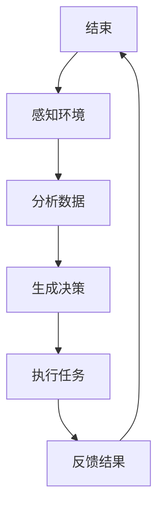
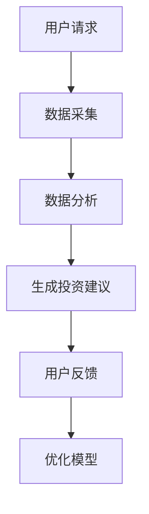
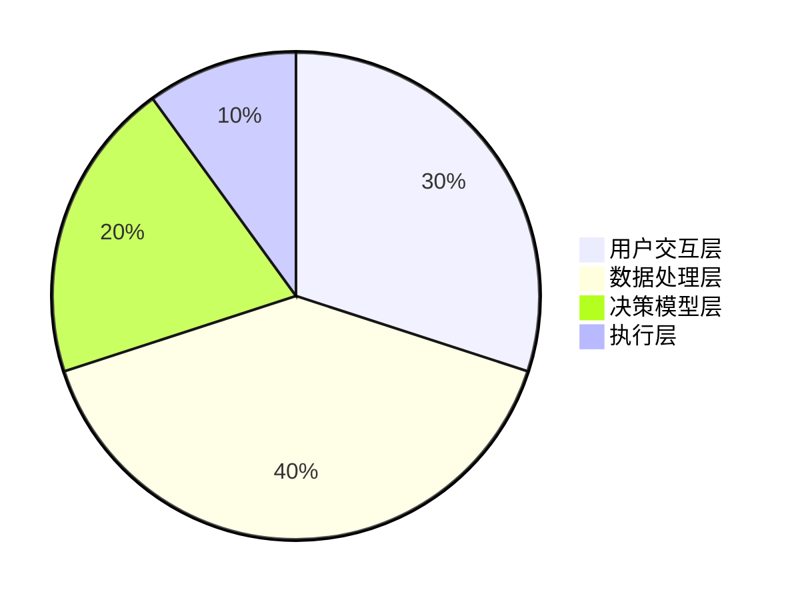
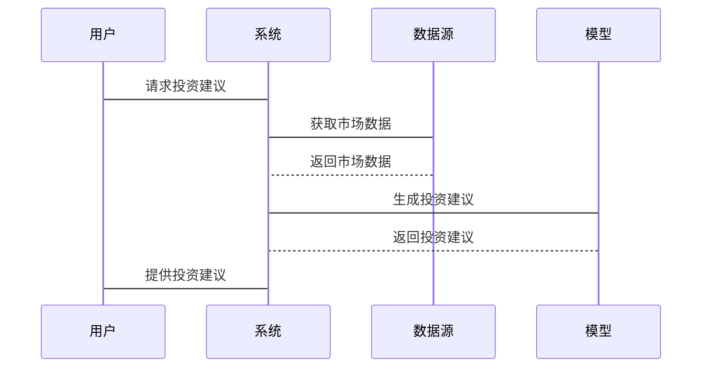

                 


# AI Agent在金融行业的创新应用

> 关键词：AI Agent, 金融行业, 人工智能, 强化学习, 自然语言处理, 机器学习

> 摘要：本文深入探讨AI Agent在金融行业的创新应用，涵盖AI Agent的核心概念、技术原理、系统架构设计及实际案例分析。通过详细讲解AI Agent在智能投顾、风险管理、 fraud detection等领域的应用，结合强化学习、自然语言处理等技术，展示AI Agent如何推动金融行业的数字化转型。

---

# 第1章: AI Agent 的基本概念与金融行业背景

## 1.1 AI Agent 的定义与核心特征

### 1.1.1 AI Agent 的定义
AI Agent（人工智能代理）是指能够感知环境、自主决策并执行任务的智能实体。它通过数据输入、算法处理和输出决策，实现自动化和智能化的操作。AI Agent的核心目标是通过模拟人类的决策过程，提高金融业务的效率和准确性。

### 1.1.2 AI Agent 的核心特征
AI Agent具有以下核心特征：
1. **自主性**：能够在无外部干预的情况下自主完成任务。
2. **反应性**：能够实时感知环境变化并做出相应调整。
3. **学习能力**：通过机器学习算法不断优化决策模型。
4. **交互性**：能够与用户或其他系统进行自然交互。
5. **可扩展性**：能够适应不同规模和复杂度的金融业务场景。

### 1.1.3 AI Agent 与传统金融技术的区别
与传统金融技术相比，AI Agent具有以下显著区别：
1. **智能化**：AI Agent能够自主决策，而传统技术通常需要人工干预。
2. **学习能力**：AI Agent能够通过数据不断优化性能，而传统技术通常依赖固定的规则。
3. **实时性**：AI Agent能够快速响应环境变化，而传统技术在处理复杂场景时往往效率较低。

## 1.2 金融行业的发展现状与挑战

### 1.2.1 金融行业的数字化转型趋势
随着科技的发展，金融行业正在经历数字化转型，传统金融机构纷纷引入AI、大数据和区块链等技术，以提高效率和客户体验。数字化转型已经成为金融机构生存和发展的关键。

### 1.2.2 传统金融业务的痛点与局限性
尽管数字化转型带来了许多好处，但传统金融业务仍然存在以下痛点：
1. **效率低下**：人工操作较多，处理速度较慢。
2. **成本高昂**：需要大量人力资源，运营成本较高。
3. **风险控制不足**：传统方法难以应对复杂多变的市场风险。
4. **客户体验不佳**：传统服务模式难以满足客户个性化需求。

### 1.2.3 AI Agent 在金融行业的创新价值
AI Agent的引入为金融行业带来了以下创新价值：
1. **提高效率**：通过自动化处理减少人工干预，提高业务处理速度。
2. **降低成本**：通过智能化决策减少人力资源需求，降低运营成本。
3. **增强风险控制**：利用AI Agent的实时感知和决策能力，提高风险预警和控制能力。
4. **提升客户体验**：通过智能化服务满足客户个性化需求，提升客户满意度。

## 1.3 AI Agent 在金融行业的应用前景

### 1.3.1 AI Agent 的潜在应用场景
AI Agent在金融行业有广泛的应用场景，包括智能投顾、风险管理、 fraud detection、信用评估、市场预测等。

### 1.3.2 金融行业采用 AI Agent 的优势
1. **高效性**：AI Agent能够快速处理大量数据，提供实时决策。
2. **准确性**：通过机器学习算法，AI Agent能够提高决策的准确性。
3. **可扩展性**：AI Agent能够适应不同规模和复杂度的金融业务场景。

### 1.3.3 AI Agent 应用的挑战与机遇
尽管AI Agent在金融行业具有广泛的应用前景，但其应用也面临一些挑战，例如数据隐私、模型可解释性、技术瓶颈等。这些挑战也为技术创新和改进提供了机遇。

---

# 第2章: AI Agent 的核心概念与工作原理

## 2.1 AI Agent 的核心概念

### 2.1.1 AI Agent 的基本构成
AI Agent的基本构成包括感知模块、决策模块和执行模块。感知模块负责收集环境数据，决策模块基于数据进行决策，执行模块负责执行决策并反馈结果。

### 2.1.2 AI Agent 的核心功能
AI Agent的核心功能包括数据采集、数据分析、决策制定和任务执行。这些功能通过模块化设计实现高度的可扩展性和灵活性。

### 2.1.3 AI Agent 的决策机制
AI Agent的决策机制基于机器学习算法，包括监督学习、无监督学习和强化学习等。通过不断学习和优化，AI Agent能够提高决策的准确性和效率。

## 2.2 AI Agent 的技术原理

### 2.2.1 机器学习算法在 AI Agent 中的应用
机器学习算法是AI Agent的核心技术之一，包括监督学习、无监督学习和强化学习。这些算法通过数据训练，生成决策模型，用于指导AI Agent的行动。

### 2.2.2 自然语言处理在 AI Agent 中的应用
自然语言处理技术使AI Agent能够理解和生成人类语言，实现与用户的自然交互。例如，在智能投顾场景中，AI Agent可以通过自然语言处理技术与用户进行对话，了解用户的投资需求。

### 2.2.3 强化学习在 AI Agent 中的应用
强化学习是一种通过试错机制优化决策模型的算法。AI Agent通过与环境的交互，不断优化决策策略，提高任务完成的效率和质量。

## 2.3 AI Agent 的核心算法与实现

### 2.3.1 基于强化学习的 AI Agent 算法
强化学习算法通过定义状态、动作和奖励函数，训练AI Agent在特定环境中的决策能力。例如，在金融交易场景中，AI Agent可以通过强化学习算法，优化买卖时机，提高投资收益。

### 2.3.2 基于监督学习的 AI Agent 算法
监督学习算法通过训练数据，生成分类或回归模型，用于指导AI Agent的决策。例如，在信用评估场景中，AI Agent可以通过监督学习算法，评估客户的信用风险。

### 2.3.3 基于生成式 AI 的创新应用
生成式AI技术（如GPT）在AI Agent中的应用，可以实现内容生成和创造性思维。例如，在金融报告生成场景中，AI Agent可以通过生成式AI技术，自动生成市场分析报告。

## 2.4 AI Agent 的实体关系与流程图

### 2.4.1 实体关系图（ER 图）
以下是AI Agent在金融行业中的实体关系图：

```mermaid
er
    actor: 用户
    system: AI Agent 系统
    model: 决策模型
    action: 动作
    state: 状态
    reward: 奖励
    事件: 事件
    ...
```

### 2.4.2 AI Agent 的工作流程图
以下是AI Agent的工作流程图：



---

# 第3章: AI Agent 的算法原理

## 3.1 强化学习算法在 AI Agent 中的应用

### 3.1.1 强化学习的基本原理
强化学习是一种通过试错机制优化决策模型的算法。AI Agent通过与环境的交互，不断优化决策策略，提高任务完成的效率和质量。

### 3.1.2 强化学习的核心要素
强化学习的核心要素包括状态、动作、奖励和策略。AI Agent通过感知状态、选择动作、获得奖励和优化策略，实现决策能力的提升。

### 3.1.3 强化学习在金融中的应用案例
在金融交易场景中，AI Agent可以通过强化学习算法，优化买卖时机，提高投资收益。

## 3.2 自然语言处理在 AI Agent 中的应用

### 3.2.1 自然语言处理的基本原理
自然语言处理技术使AI Agent能够理解和生成人类语言，实现与用户的自然交互。例如，在智能投顾场景中，AI Agent可以通过自然语言处理技术与用户进行对话，了解用户的投资需求。

### 3.2.2 自然语言处理的核心技术
自然语言处理的核心技术包括分词、词性标注、句法分析和语义理解。这些技术通过处理文本数据，提取有用的信息，指导AI Agent的决策。

### 3.2.3 自然语言处理在金融中的应用案例
在金融报告生成场景中，AI Agent可以通过自然语言处理技术，自动生成市场分析报告。

## 3.3 生成式 AI 在 AI Agent 中的应用

### 3.3.1 生成式 AI 的基本原理
生成式AI技术（如GPT）在AI Agent中的应用，可以实现内容生成和创造性思维。生成式AI通过生成文本、图像或其他形式的内容，提供创新的解决方案。

### 3.3.2 生成式 AI 的核心技术
生成式AI的核心技术包括变分自编码器（VAE）和生成对抗网络（GAN）。这些技术通过生成数据，提高AI Agent的创造力和创新能力。

### 3.3.3 生成式 AI 在金融中的应用案例
在金融创新场景中，AI Agent可以通过生成式AI技术，设计新的金融产品或优化现有产品。

---

# 第4章: AI Agent 的系统架构设计

## 4.1 问题场景介绍
在金融行业中，AI Agent可以应用于智能投顾、风险管理、 fraud detection等场景。本章以智能投顾系统为例，详细探讨AI Agent的系统架构设计。

## 4.2 系统功能设计

### 4.2.1 系统功能模块
智能投顾系统的功能模块包括用户交互模块、数据采集模块、决策模型模块和执行模块。这些模块通过协同工作，实现智能投资顾问的功能。

### 4.2.2 系统功能流程
以下是智能投顾系统的功能流程图：



## 4.3 系统架构设计

### 4.3.1 系统架构图
以下是智能投顾系统的架构图：



### 4.3.2 系统接口设计
智能投顾系统的接口设计包括用户接口、数据接口和模型接口。用户接口负责与用户交互，数据接口负责数据的采集和处理，模型接口负责与决策模型的交互。

### 4.3.3 系统交互图
以下是智能投顾系统的交互图：



---

# 第5章: AI Agent 的项目实战

## 5.1 环境安装与配置

### 5.1.1 安装Python
安装Python 3.x版本，确保环境兼容性。

### 5.1.2 安装必要的库
安装以下Python库：
- `numpy`
- `pandas`
- `scikit-learn`
- `tensorflow`

## 5.2 系统核心实现源代码

### 5.2.1 数据预处理代码
```python
import numpy as np
import pandas as pd

# 加载数据
data = pd.read_csv('financial_data.csv')

# 数据清洗
data.dropna(inplace=True)
data = pd.get_dummies(data)
```

### 5.2.2 AI Agent 核心算法代码
```python
import tensorflow as tf
from tensorflow.keras import layers

# 定义模型
model = tf.keras.Sequential([
    layers.Dense(64, activation='relu'),
    layers.Dense(1, activation='sigmoid')
])

# 编译模型
model.compile(optimizer='adam', loss='binary_crossentropy', metrics=['accuracy'])

# 训练模型
model.fit(X_train, y_train, epochs=10, batch_size=32)
```

### 5.2.3 与用户交互的代码
```python
def get_user_input():
    user_input = input("请输入您的需求：")
    return user_input

def generate_response(user_input, model):
    # 处理用户输入
    # ...
    return response

# 启动交互
while True:
    user_input = get_user_input()
    response = generate_response(user_input, model)
    print(response)
```

## 5.3 代码应用解读与分析

### 5.3.1 数据预处理代码解读
数据预处理代码通过加载数据、清洗数据和转换数据，为模型训练提供了高质量的数据输入。

### 5.3.2 AI Agent 核心算法代码解读
AI Agent的核心算法代码定义了一个简单的神经网络模型，并通过训练数据优化模型性能。该模型可以用于分类任务，如信用评估和市场预测。

### 5.3.3 与用户交互代码解读
与用户交互的代码实现了用户与AI Agent之间的实时对话，通过获取用户输入、生成响应和输出结果，提供智能化的服务。

## 5.4 实际案例分析与详细讲解

### 5.4.1 案例背景
以智能投顾系统为例，AI Agent通过与用户的交互，提供个性化的投资建议。

### 5.4.2 数据分析
通过分析用户的财务状况和市场数据，AI Agent生成个性化的投资策略。

### 5.4.3 模型优化
通过不断优化模型参数和调整算法，提高AI Agent的投资建议的准确性和可靠性。

## 5.5 项目小结

---

# 第6章: 总结与展望

## 6.1 本章总结
本文详细探讨了AI Agent在金融行业的创新应用，涵盖了AI Agent的核心概念、技术原理、系统架构设计及实际案例分析。通过深入分析AI Agent在智能投顾、风险管理、 fraud detection等领域的应用，展示了AI Agent在金融行业的重要价值。

## 6.2 未来展望
随着技术的进步，AI Agent在金融行业的应用前景广阔。未来，生成式AI和多模态AI将为AI Agent提供更多创新的可能性，推动金融行业的进一步数字化和智能化。

## 6.3 最佳实践 tips
1. 在实际应用中，注意数据隐私和模型可解释性。
2. 定期优化模型参数，提高AI Agent的决策能力。
3. 结合具体业务场景，选择合适的AI Agent技术方案。

---

# 作者：AI天才研究院/AI Genius Institute & 禅与计算机程序设计艺术 /Zen And The Art of Computer Programming

