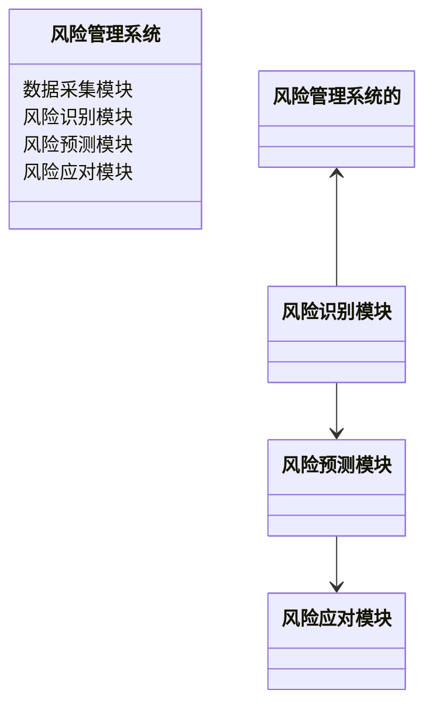
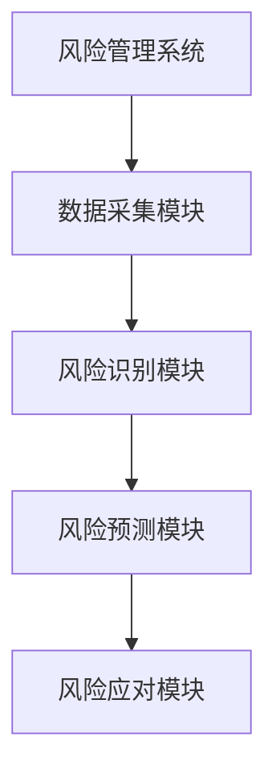
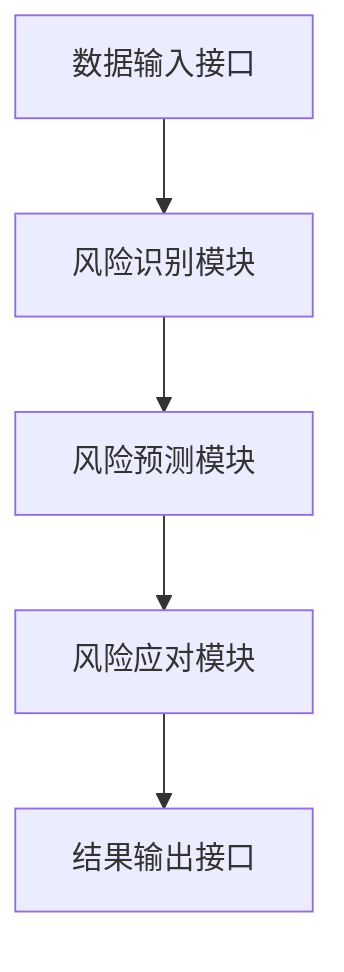
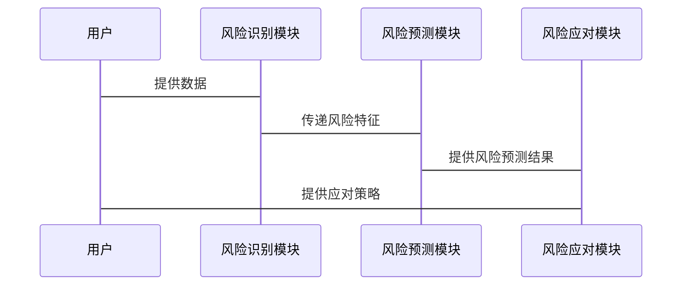

                 


# AI Agent在风险管理中的应用

> 关键词：AI Agent, 风险管理, 机器学习, 强化学习, 自然语言处理, 风险预测

> 摘要：本文深入探讨了AI Agent在风险管理中的应用，结合理论与实践，详细讲解了AI Agent的核心概念、算法原理、系统架构以及实际案例。通过本文，读者可以全面理解AI Agent如何助力风险管理的智能化与高效化。

---

## 第一部分: 风险管理的背景与挑战

### 第1章: 风险管理的背景与挑战

#### 1.1 风险管理的基本概念

##### 1.1.1 风险的定义与分类

风险是指在特定条件下，某一事件发生的概率及其可能带来的损失。根据影响范围和性质，风险可以分为以下几类：

- **市场风险**：由于市场波动导致的资产损失风险。
- **信用风险**：由于交易对手违约导致的损失风险。
- **操作风险**：由于操作失误或系统故障导致的损失风险。
- **流动性风险**：由于资产无法快速变现导致的损失风险。
- **声誉风险**：由于企业声誉受损导致的损失风险。

##### 1.1.2 风险管理的目标与流程

风险管理的目标是通过识别、评估和应对风险，降低潜在损失，确保组织的稳健运行。其流程通常包括以下几个步骤：

1. **风险识别**：识别可能影响组织的各类风险。
2. **风险评估**：量化风险的可能性和影响程度。
3. **风险应对**：制定和实施应对策略。
4. **风险监控**：持续监测风险变化，调整应对策略。

##### 1.1.3 风险管理在不同领域的应用

- **金融领域**：用于评估投资组合的风险，管理市场波动。
- **企业领域**：用于优化供应链管理，降低运营风险。
- **保险领域**：用于评估承保风险，制定保费策略。

#### 1.2 传统风险管理的局限性

##### 1.2.1 传统风险管理方法的不足

传统风险管理方法依赖于人工分析和经验判断，存在以下问题：

1. **效率低下**：人工分析耗时长，难以应对海量数据。
2. **主观性强**：依赖个人经验，缺乏客观性。
3. **覆盖范围有限**：难以全面识别和评估复杂风险。

##### 1.2.2 数据分析与决策的局限性

传统数据分析方法在处理非结构化数据和实时数据时表现不佳，且难以应对动态变化的市场环境。

##### 1.2.3 人工干预的低效性与误差

人工干预可能导致决策延迟和错误，尤其是在面对复杂和不确定的环境时。

#### 1.3 AI Agent的引入与优势

##### 1.3.1 AI Agent的基本概念

AI Agent是一种能够感知环境、自主决策并采取行动的智能体。它具备以下核心特征：

1. **自主性**：能够在没有人工干预的情况下运行。
2. **反应性**：能够实时感知环境变化并做出反应。
3. **学习能力**：能够通过数据和经验不断优化自身的决策能力。

##### 1.3.2 AI Agent在风险管理中的独特优势

AI Agent能够通过机器学习、自然语言处理和强化学习等技术，实现对复杂风险的智能识别、预测和应对，显著提升风险管理的效率和准确性。

##### 1.3.3 AI Agent与传统风险管理工具的对比

| 特性                | 传统风险管理工具                     | AI Agent                           |
|---------------------|------------------------------------|------------------------------------|
| 数据处理能力        | 依赖人工分析，处理能力有限           | 能够处理海量数据，支持实时分析     |
| 决策能力            | 依赖人工经验，决策过程缓慢           | 自主学习，快速决策                 |
| 适应能力            | 难以应对复杂和动态环境               | 能够自适应环境变化，持续优化        |

---

## 第二部分: AI Agent的核心概念与原理

### 第2章: AI Agent的核心概念与原理

#### 2.1 AI Agent的基本原理

##### 2.1.1 AI Agent的定义与分类

AI Agent可以根据其智能水平和应用场景分为以下几类：

- **反应式AI Agent**：基于当前感知做出反应，不依赖历史数据。
- **认知式AI Agent**：具备推理和规划能力，能够处理复杂任务。
- **协作式AI Agent**：能够与其他AI Agent或人类协同工作。

##### 2.1.2 AI Agent的核心特征

AI Agent的核心特征包括：

1. **自主性**：能够在无外部干预的情况下运行。
2. **反应性**：能够实时感知环境并做出反应。
3. **学习能力**：能够通过数据和经验优化决策模型。
4. **适应性**：能够自适应环境变化，持续优化性能。

##### 2.1.3 AI Agent与传统AI的区别

| 特性                | 传统AI                        | AI Agent                        |
|---------------------|-----------------------------|--------------------------------|
| 智能水平            | 依赖预设规则和数据            | 具备自主决策和学习能力          |
| 应用场景            | 适用于特定任务，如图像识别    | 适用于复杂场景，如风险管理      |
| 适应性              | 难以应对动态变化              | 能够自适应环境变化              |

#### 2.2 AI Agent在风险管理中的应用逻辑

##### 2.2.1 风险识别与评估的AI Agent实现

AI Agent通过自然语言处理和机器学习技术，能够从文本、图像等多种数据源中识别潜在风险，并对其进行量化评估。

##### 2.2.2 风险预测与预警的AI Agent机制

AI Agent利用时间序列分析和强化学习算法，能够预测未来风险事件的发生概率，并提前发出预警。

##### 2.2.3 风险应对与决策的AI Agent策略

AI Agent通过强化学习和博弈论模型，能够在多种风险应对策略中选择最优方案，最大化风险控制效果。

#### 2.3 AI Agent的核心算法与技术

##### 2.3.1 机器学习算法在AI Agent中的应用

常用的机器学习算法包括线性回归、支持向量机（SVM）、随机森林和梯度提升树（如XGBoost）等。

##### 2.3.2 自然语言处理在风险文本分析中的应用

自然语言处理技术用于从新闻、报告等文本数据中提取风险相关信息，帮助识别潜在风险。

##### 2.3.3 强化学习在风险决策优化中的应用

强化学习算法（如Q-Learning、Deep Q-Networks）用于优化风险应对策略，提升决策的准确性和效率。

---

## 第三部分: AI Agent在风险管理中的算法原理

### 第3章: AI Agent的风险预测算法

#### 3.1 风险预测的机器学习算法

##### 3.1.1 线性回归模型

线性回归是一种简单但有效的回归算法，适用于线性关系明显的数据。其数学模型如下：

$$ y = \beta_0 + \beta_1 x_1 + \beta_2 x_2 + ... + \beta_n x_n $$

其中，$y$ 是目标变量，$x_i$ 是自变量，$\beta_i$ 是回归系数。

##### 3.1.2 支持向量机（SVM）

SVM是一种强大的分类算法，适用于高维数据的分类和回归任务。其核心思想是通过找到一个超平面，将数据点分为两类。

##### 3.1.3 随机森林与梯度提升树

随机森林是一种基于决策树的集成算法，通过构建多棵决策树并取其平均，能够有效避免过拟合。梯度提升树（如XGBoost）是一种基于树的优化算法，通过迭代提升模型性能。

#### 3.2 风险决策的强化学习算法

##### 3.2.1 Q-Learning算法

Q-Learning是一种经典的强化学习算法，通过维护一个Q值表，记录状态-动作对的期望奖励值，并通过经验更新Q值。

##### 3.2.2 Deep Q-Networks（DQN）

DQN是一种基于深度神经网络的强化学习算法，通过神经网络近似Q值函数，能够处理高维状态空间。

##### 3.2.3 策略梯度方法（Policy Gradient）

策略梯度方法直接优化策略参数，通过计算梯度更新策略，适用于连续动作空间的决策问题。

#### 3.3 风险分析的自然语言处理技术

##### 3.3.1 基于词嵌入的风险文本分析

词嵌入（如Word2Vec、GloVe）通过将词语映射到低维向量空间，帮助模型理解文本语义。

##### 3.3.2 基于注意力机制的风险文本理解

注意力机制（Attention）能够聚焦文本中重要的部分，提升模型对关键信息的捕捉能力。

##### 3.3.3 基于生成模型的风险文本生成

生成模型（如GPT）能够生成与风险相关的文本，帮助识别潜在风险。

---

## 第四部分: AI Agent的风险管理系统的架构设计

### 第4章: AI Agent的风险管理系统架构

#### 4.1 系统架构概述

AI Agent的风险管理系统通常包括以下几个模块：

- **数据采集模块**：负责收集各类风险相关数据。
- **风险识别模块**：通过机器学习算法识别潜在风险。
- **风险预测模块**：利用强化学习算法预测风险发生概率。
- **风险应对模块**：根据预测结果制定和实施应对策略。

#### 4.2 系统功能设计

##### 4.2.1 领域模型设计

以下是领域模型的类图（使用mermaid）：



##### 4.2.2 系统架构设计

以下是系统架构图（使用mermaid）：



##### 4.2.3 系统接口设计

系统接口设计包括数据输入接口、模型训练接口和结果输出接口。以下是接口设计示意图（使用mermaid）：



##### 4.2.4 系统交互设计

以下是系统交互图（使用mermaid）：



---

## 第五部分: 项目实战

### 第5章: 项目实战

#### 5.1 项目环境安装

以下是Python环境的安装步骤：

1. 安装Python和pip：
   ```bash
   # 在终端中运行以下命令
   python --version
   pip install --upgrade pip
   ```

2. 安装必要的库：
   ```bash
   pip install numpy pandas scikit-learn tensorflow
   ```

#### 5.2 核心代码实现

以下是AI Agent的风险管理系统代码示例：

```python
import numpy as np
from sklearn import svm
from tensorflow.keras.models import Sequential
from tensorflow.keras.layers import Dense, LSTM

# 数据预处理
def preprocess_data(data):
    # 数据标准化
    data_norm = (data - np.mean(data)) / np.std(data)
    return data_norm

# 风险识别模型
def risk_identification_model():
    model = svm.SVC()
    return model

# 风险预测模型
def risk_prediction_model():
    model = Sequential()
    model.add(LSTM(64, input_shape=(None, 1)))
    model.add(Dense(1, activation='sigmoid'))
    model.compile(loss='binary_crossentropy', optimizer='adam')
    return model

# 风险应对策略
def risk_management_strategy():
    pass

# 主程序
def main():
    # 数据加载
    data = np.random.randn(100, 1)
    data_norm = preprocess_data(data)
    
    # 模型训练
    model_id = risk_identification_model()
    model_pred = risk_prediction_model()
    
    # 模型预测
    y_pred_id = model_id.predict(data_norm)
    y_pred_pred = model_pred.predict(data_norm)
    
    # 风险应对
    risk_management_strategy()

if __name__ == "__main__":
    main()
```

#### 5.3 案例分析与详细讲解

以股票市场风险管理为例，假设我们使用LSTM模型预测股票价格波动风险。以下是具体步骤：

1. 数据加载与预处理：
   - 加载历史股价数据。
   - 对数据进行标准化处理。

2. 模型训练：
   - 使用LSTM网络训练股价预测模型。
   - 使用SVM模型训练风险分类模型。

3. 风险预测：
   - 使用训练好的模型预测未来股价波动风险。

4. 风险应对：
   - 根据预测结果制定相应的投资策略，如卖出高风险股票，买入低风险股票。

---

## 第六部分: 最佳实践与总结

### 第6章: 最佳实践与总结

#### 6.1 最佳实践

1. **数据质量**：确保数据的完整性和准确性，避免噪声干扰。
2. **模型选择**：根据具体问题选择合适的算法，避免盲目追求复杂模型。
3. **实时性**：确保系统能够实时处理数据，及时应对风险。
4. **可解释性**：提升模型的可解释性，便于分析和优化。
5. **数据隐私**：在处理敏感数据时，确保数据隐私和安全。

#### 6.2 小结

AI Agent通过其自主性、反应性和学习能力，为风险管理提供了智能化的解决方案。结合机器学习、自然语言处理和强化学习等技术，AI Agent能够显著提升风险管理的效率和准确性。

#### 6.3 注意事项

1. **数据隐私**：在处理敏感数据时，需遵守相关法律法规，确保数据安全。
2. **模型更新**：定期更新模型，确保其适应环境变化。
3. **伦理问题**：避免AI Agent的滥用，确保其应用符合伦理规范。

#### 6.4 拓展阅读

- 《机器学习实战》
- 《深度学习》
- 《强化学习入门》

---

## 作者

**作者：AI天才研究院/AI Genius Institute & 禅与计算机程序设计艺术 /Zen And The Art of Computer Programming**

---

以上是《AI Agent在风险管理中的应用》的完整目录和文章内容，涵盖了从理论到实践的各个方面，希望对您有所帮助！

