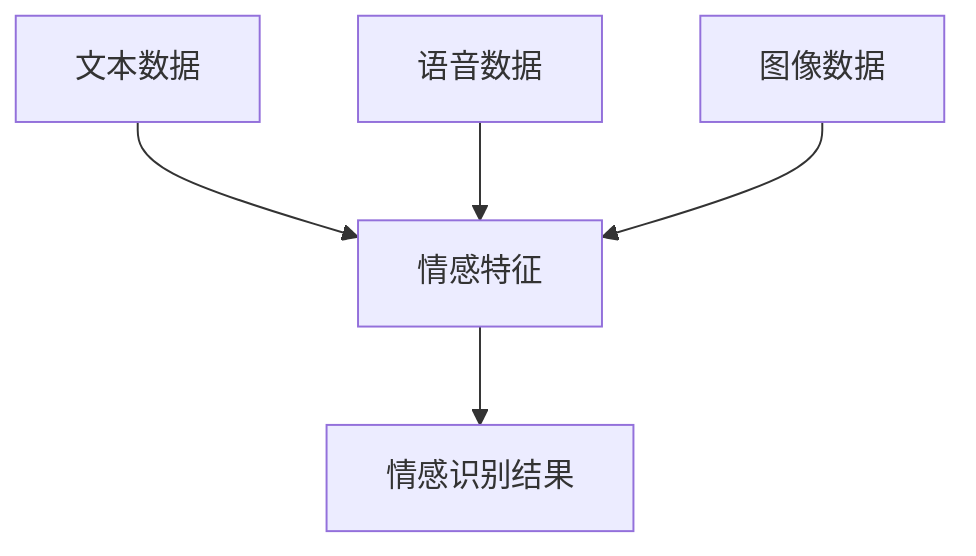
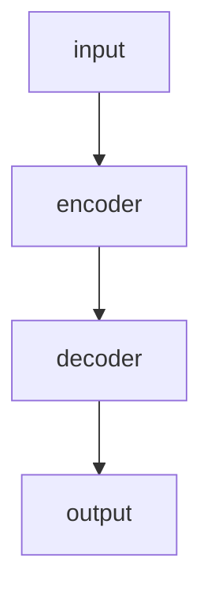
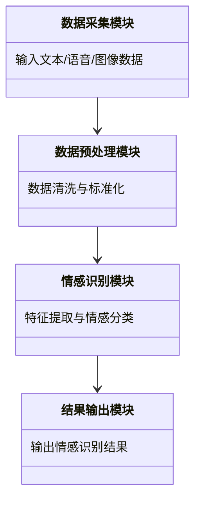

                 


# AI Agent的多模态情感识别技术

> 关键词：AI Agent，多模态情感识别，深度学习，文本数据，语音数据，图像数据

> 摘要：本文详细探讨了AI Agent在多模态情感识别技术中的应用。通过分析多模态数据的特征、情感识别的核心原理以及多模态数据融合的算法，结合实际系统设计与项目实战，深入剖析了多模态情感识别技术的实现过程和应用场景。本文旨在为AI Agent开发者和技术研究人员提供理论支持和实践指导，帮助他们更好地理解和应用多模态情感识别技术。

---

# 第一部分: AI Agent与多模态情感识别技术的背景

## 第1章: AI Agent与多模态情感识别技术的背景

### 1.1 AI Agent的基本概念

#### 1.1.1 AI Agent的定义与特点

AI Agent（人工智能代理）是一种能够感知环境、自主决策并执行任务的智能实体。AI Agent的核心特点包括：

- **自主性**：能够自主决策，无需外部干预。
- **反应性**：能够实时感知环境并做出反应。
- **学习能力**：能够通过数据和经验不断优化自身的性能。
- **交互能力**：能够与人类或其他系统进行有效交互。

AI Agent的应用场景非常广泛，包括智能客服、智能助手、自动驾驶、智能安防等领域。

#### 1.1.2 多模态数据的基本概念

多模态数据指的是多种类型的数据，包括文本、语音、图像、视频等。这些数据的特点是：

- **多样性**：数据类型多样，能够提供更全面的信息。
- **互补性**：不同类型的数据显示的信息具有互补性，能够相互补充。
- **复杂性**：处理多模态数据需要考虑不同类型数据的关联性和一致性。

#### 1.1.3 情感识别技术的定义与目标

情感识别技术是一种通过分析多模态数据来识别和理解人类情感的技术。其目标是通过计算机算法，准确识别和理解人类的情感状态，从而实现人机交互的智能化。

---

### 1.2 多模态情感识别的背景与应用

#### 1.2.1 情感识别技术的发展历程

情感识别技术的发展经历了以下几个阶段：

1. **单模态情感识别**：早期的情感识别主要基于单一数据源，如文本或语音。
2. **多模态情感识别**：随着技术的进步，研究者开始结合多种数据源进行情感识别，提高了识别的准确性和鲁棒性。
3. **深度学习驱动的情感识别**：近年来，深度学习技术的发展极大地推动了情感识别技术的进步，使得情感识别更加精准和高效。

#### 1.2.2 多模态数据在情感识别中的优势

多模态数据在情感识别中的优势主要体现在以下几个方面：

- **信息互补性**：通过结合不同类型的数据显示，可以提供更全面的信息，从而提高情感识别的准确率。
- **鲁棒性**：单一数据源在某些情况下可能无法准确捕捉情感信息，而多模态数据可以通过互补性提高识别的鲁棒性。
- **用户体验**：多模态数据的结合可以提高人机交互的自然性和流畅性，从而提升用户体验。

#### 1.2.3 AI Agent在多模态情感识别中的作用

AI Agent在多模态情感识别中的作用主要体现在以下几个方面：

- **实时感知**：AI Agent可以通过多模态数据实时感知用户的情感状态，从而做出更精准的决策。
- **智能交互**：通过理解用户的情感状态，AI Agent可以实现更自然和智能的交互。
- **个性化服务**：基于用户的情感状态，AI Agent可以提供个性化的服务和建议。

---

### 1.3 本章小结

本章主要介绍了AI Agent和多模态情感识别技术的背景，分析了多模态数据的特征及其在情感识别中的优势，探讨了AI Agent在多模态情感识别中的作用。这些内容为后续章节的深入分析奠定了基础。

---

# 第二部分: 多模态情感识别的核心概念与联系

## 第2章: 多模态数据与情感识别的关系

### 2.1 多模态数据的特征分析

#### 2.1.1 文本数据的特征

文本数据是情感识别中常用的模态之一，其主要特征包括：

- **语义信息**：文本数据可以通过语义分析提取情感信息。
- **情感倾向**：文本中可以通过关键词和句式分析判断情感倾向。
- **上下文信息**：文本的上下文信息可以提供情感识别的背景和依据。

#### 2.1.2 语音数据的特征

语音数据是情感识别中另一个重要的模态，其主要特征包括：

- **语调**：语音的语调可以反映说话人的情感状态。
- **节奏**：语音的节奏变化可以提供情感信息。
- **音量**：语音的音量变化也可以反映情感状态。

#### 2.1.3 图像数据的特征

图像数据是情感识别中的视觉模态，其主要特征包括：

- **面部表情**：面部表情是情感识别的重要视觉特征。
- **眼神变化**：眼神的变化可以反映情感状态。
- **姿态和动作**：身体的姿态和动作也可以提供情感信息。

---

### 2.2 情感识别的核心原理

#### 2.2.1 情感计算的基本流程

情感计算的基本流程包括以下几个步骤：

1. **数据采集**：采集多模态数据，包括文本、语音、图像等。
2. **数据预处理**：对采集的数据进行清洗和标准化处理。
3. **特征提取**：从数据中提取情感相关的特征。
4. **情感分类**：基于提取的特征进行情感分类，输出情感识别结果。

#### 2.2.2 多模态数据融合的必要性

多模态数据融合的必要性主要体现在以下几个方面：

- **信息互补性**：不同模态的数据可以提供互补的信息，从而提高情感识别的准确率。
- **鲁棒性**：单一模态数据在某些情况下可能无法准确捕捉情感信息，而多模态数据可以通过互补性提高识别的鲁棒性。
- **用户体验**：多模态数据的结合可以提高人机交互的自然性和流畅性，从而提升用户体验。

#### 2.2.3 情感识别的评价指标

情感识别的评价指标主要包括以下几个方面：

- **准确率**：情感分类的准确率。
- **召回率**：情感分类的召回率。
- **F1值**：综合准确率和召回率的调和平均值。
- **混淆矩阵**：用于分析情感分类的详细情况。

---

### 2.3 多模态情感识别的实体关系图



---

## 第3章: 多模态数据融合算法

### 3.1 多模态数据融合的基本方法

#### 3.1.1 基于特征级的融合

基于特征级的融合方法是将不同模态的特征进行融合，形成一个统一的特征向量。例如，可以将文本、语音和图像的特征向量进行拼接，形成一个多维特征向量。

#### 3.1.2 基于决策级的融合

基于决策级的融合方法是将不同模态的情感识别结果进行融合，形成最终的情感识别结果。例如，可以将文本、语音和图像的情感分类结果进行投票或加权融合，输出最终的情感识别结果。

#### 3.1.3 深度学习中的多模态融合

深度学习中的多模态融合方法主要基于神经网络模型，例如：

1. **多模态神经网络**：将不同模态的特征输入到同一个神经网络中进行联合学习。
2. **注意力机制**：通过注意力机制对不同模态的数据进行加权融合，突出重要模态的信息。

---

### 3.2 多模态情感识别的数学模型

#### 3.2.1 情感分类的数学表达

情感分类的数学表达可以表示为：

$$ P(y|x) = \frac{P(x|y)P(y)}{P(x)} $$

其中，$y$ 表示情感类别，$x$ 表示输入数据。

#### 3.2.2 多模态数据融合的公式

多模态数据融合的公式可以表示为：

$$ f(x_1, x_2, ..., x_n) = \sum_{i=1}^{n} w_i x_i $$

其中，$w_i$ 表示第$i$个模态的权重，$x_i$ 表示第$i$个模态的特征向量。

---

### 3.3 基于深度学习的多模态情感识别

#### 3.3.1 Transformer模型在多模态数据处理中的应用

Transformer模型是一种基于自注意力机制的深度学习模型，广泛应用于自然语言处理领域。在多模态情感识别中，可以将文本、语音和图像数据分别输入到多个Transformer编码器中，然后通过跨模态注意力机制进行融合，最终输出情感识别结果。

#### 3.3.2 多模态情感识别的神经网络架构

多模态情感识别的神经网络架构可以表示为：



---

## 第4章: 多模态情感识别系统的设计

### 4.1 系统功能设计

#### 4.1.1 数据采集模块

数据采集模块负责采集多模态数据，包括文本、语音和图像数据。采集的数据需要进行标准化处理，确保不同模态的数据能够有效融合。

#### 4.1.2 数据预处理模块

数据预处理模块负责对采集的数据进行清洗和标准化处理，例如去除噪声、归一化等。

#### 4.1.3 情感识别模块

情感识别模块负责对预处理后的数据进行特征提取和情感分类，输出情感识别结果。

#### 4.1.4 结果输出模块

结果输出模块负责将情感识别结果输出到用户界面或下游系统。

---

### 4.2 系统架构设计



---

## 第5章: 项目实战

### 5.1 环境安装

以下是项目实战所需的环境安装命令：

```bash
pip install numpy
pip install pandas
pip install scikit-learn
pip install transformers
pip install pytorch
```

---

### 5.2 系统核心实现源代码

以下是情感识别模块的核心实现代码：

```python
import numpy as np
from sklearn.metrics import accuracy_score
from transformers import AutoTokenizer, AutoModel
import torch

class MultiModalEmotionRecognizer:
    def __init__(self):
        self.tokenizer = AutoTokenizer.from_pretrained('bert-base-uncased')
        self.model = AutoModel.from_pretrained('bert-base-uncased')

    def text_feature_extraction(self, text):
        inputs = self.tokenizer(text, return_tensors='np', padding=True, truncation=True)
        outputs = self.model(**inputs)
        return outputs.last_hidden_state

    def voice_feature_extraction(self, audio):
        # 假设audio是一个音频信号
        # 这里需要实现语音特征提取，例如MFCC特征
        pass

    def image_feature_extraction(self, image):
        # 假设image是一个图像数据
        # 这里需要实现图像特征提取，例如使用CNN提取特征
        pass

    def fuse_features(self, text_features, voice_features, image_features):
        # 假设text_features、voice_features、image_features都是numpy数组
        # 这里实现特征融合，例如将特征向量拼接起来
        fused_features = np.concatenate([text_features, voice_features, image_features], axis=1)
        return fused_features

    def predict_emotion(self, text, audio, image):
        text_features = self.text_feature_extraction(text)
        voice_features = self.voice_feature_extraction(audio)
        image_features = self.image_feature_extraction(image)
        fused_features = self.fuse_features(text_features, voice_features, image_features)
        # 假设fused_features是一个numpy数组
        # 这里需要实现情感分类，例如使用机器学习模型进行分类
        pass

# 示例用法
recognizer = MultiModalEmotionRecognizer()
text = "I'm so happy!"
audio = np.array([...])  # 示例音频信号
image = np.array([...])  # 示例图像数据
emotion = recognizer.predict_emotion(text, audio, image)
print(emotion)
```

---

### 5.3 代码应用解读与分析

上述代码实现了一个多模态情感识别系统的核心模块，包括文本、语音和图像数据的特征提取，以及特征融合和情感分类。需要注意的是，语音和图像数据的特征提取部分目前只是一个示例，实际应用中需要根据具体数据类型实现相应的特征提取算法。

---

### 5.4 实际案例分析

以下是一个实际案例分析：

假设我们有一个客服系统的应用场景，用户通过文本、语音和图像与AI Agent进行交互。AI Agent需要通过分析用户的文本、语音和图像数据，准确识别用户的情感状态，从而提供更个性化的服务。

---

### 5.5 项目小结

本章通过项目实战的方式，详细讲解了多模态情感识别系统的实现过程，包括环境安装、核心代码实现、特征提取和情感分类等关键步骤。通过实际案例分析，读者可以更好地理解多模态情感识别技术在实际应用中的具体实现。

---

## 第6章: 总结与扩展

### 6.1 本章总结

本文详细探讨了AI Agent在多模态情感识别技术中的应用，从多模态数据的特征分析到情感识别的核心原理，再到多模态数据融合的算法实现，最后结合实际系统设计与项目实战，深入剖析了多模态情感识别技术的实现过程和应用场景。

---

### 6.2 最佳实践 tips

- **数据预处理**：在实际应用中，数据预处理是非常重要的一环，建议对数据进行充分的清洗和标准化处理。
- **特征提取**：不同模态的数据特征提取方法不同，需要根据具体数据类型选择合适的特征提取算法。
- **模型调优**：情感分类模型的性能需要通过大量数据进行训练和调优，建议使用深度学习模型进行优化。

---

### 6.3 注意事项

- **数据隐私**：在实际应用中，需要特别注意数据隐私问题，确保数据的安全性和合规性。
- **模型鲁棒性**：多模态情感识别系统的鲁棒性需要通过大量的测试和验证来保证。
- **用户体验**：在实际应用中，需要注重用户体验，确保系统交互的自然性和流畅性。

---

### 6.4 拓展阅读

- **《Deep Learning for Multimodal Data Processing》**
- **《A Survey on Multimodal Emotion Recognition》**
- **《Neural Networks for NLP: State-of-the-art Architectures》**

---

# 作者：AI天才研究院/AI Genius Institute & 禅与计算机程序设计艺术 /Zen And The Art of Computer Programming

