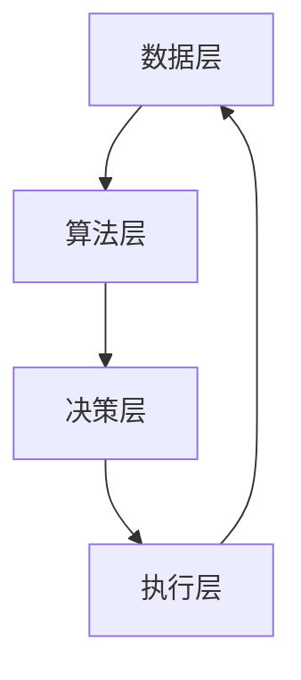
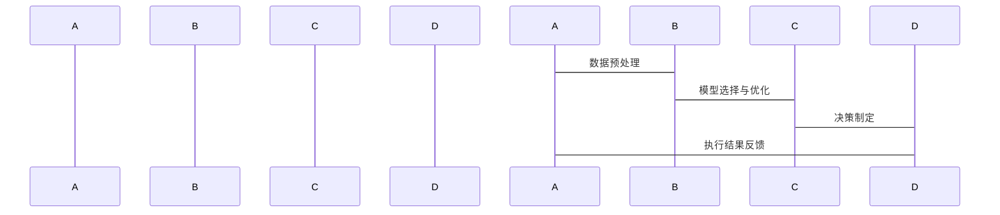

                 


# AI Agent的自动机器学习(AutoML)应用

> 关键词：AI Agent, AutoML, 机器学习, 人工智能, 自动化, 智能系统

> 摘要：本文深入探讨了AI Agent与自动机器学习（AutoML）的结合应用，分析了AutoML在AI Agent中的核心作用，详细阐述了AutoML与AI Agent的原理、算法、系统架构及其实现案例，最后总结了AutoML在AI Agent中的最佳实践和未来发展趋势。

---

## 第一部分: AI Agent的自动机器学习(AutoML)应用基础

### 第1章: AutoML与AI Agent概述

#### 1.1 AutoML的基本概念
##### 1.1.1 自动机器学习的定义
自动机器学习（AutoML）是指通过自动化技术来完成机器学习任务的整个流程，包括数据预处理、特征工程、模型选择、超参数调优以及模型部署等。AutoML的目标是降低机器学习的门槛，使得非专家也能轻松构建高性能的机器学习模型。

##### 1.1.2 AutoML的核心特点
- **自动化**：从数据准备到模型部署的整个流程自动化完成。
- **高效性**：通过自动化搜索和优化算法，快速找到最优模型。
- **可扩展性**：支持大规模数据和复杂任务的处理。

##### 1.1.3 AutoML与传统机器学习的区别
AutoML通过自动化技术简化了机器学习的流程，而传统机器学习需要手动完成数据预处理、模型选择和调优等步骤，效率较低且对专业知识要求较高。

#### 1.2 AI Agent的基本概念
##### 1.2.1 AI Agent的定义
AI Agent（人工智能代理）是指能够感知环境、自主决策并执行任务的智能实体。它可以是一个软件程序、机器人或其他智能设备，具备感知、推理、规划和执行的能力。

##### 1.2.2 AI Agent的核心特点
- **自主性**：能够在没有外部干预的情况下自主运行。
- **反应性**：能够实时感知环境变化并做出相应反应。
- **目标导向性**：具备明确的目标，并通过决策和行动来实现目标。

##### 1.2.3 AI Agent与传统AI的区别
AI Agent强调自主性和目标导向性，而传统AI更多关注于特定任务的解决，缺乏自主决策的能力。

#### 1.3 AutoML与AI Agent的结合
##### 1.3.1 AutoML在AI Agent中的作用
AutoML可以为AI Agent提供自动化的机器学习能力，帮助AI Agent快速构建和优化模型，提升其决策和执行能力。

##### 1.3.2 AutoML与AI Agent的协同工作
通过AutoML，AI Agent可以自动完成数据处理、模型选择和优化，从而更高效地实现其目标。

##### 1.3.3 AutoML与AI Agent的应用场景
- **智能客服**：AI Agent可以通过AutoML优化的模型，提供更精准的客户支持。
- **智能推荐系统**：AI Agent利用AutoML优化推荐算法，提高推荐的准确性和效率。
- **自动驾驶**：AI Agent结合AutoML技术，实现更智能的自动驾驶系统。

#### 1.4 本章小结
本章介绍了AutoML和AI Agent的基本概念、特点以及它们的结合应用。通过AutoML的自动化能力，AI Agent能够更高效地完成复杂的任务，提升其智能水平。

---

### 第2章: AutoML的核心概念与原理

#### 2.1 AutoML的核心概念
##### 2.1.1 数据预处理自动化
AutoML能够自动完成数据清洗、特征工程等数据预处理步骤，确保数据质量。

##### 2.1.2 模型选择自动化
通过自动化的算法搜索，AutoML能够找到最适合数据的模型结构。

##### 2.1.3 参数调优自动化
AutoML可以自动进行超参数优化，找到最优的模型参数组合。

#### 2.2 AutoML的原理
##### 2.2.1 AutoML的算法流程
AutoML的算法流程通常包括以下步骤：
1. 数据预处理
2. 特征选择
3. 模型选择
4. 超参数优化
5. 模型评估

##### 2.2.2 AutoML的优化目标
AutoML的目标是最大化模型的性能，同时最小化计算成本。其优化目标可以表示为：
$$ \text{maximize } f(\theta) \quad \text{subject to } c(\theta) \leq C $$
其中，$\theta$ 是模型参数，$f(\theta)$ 是模型的性能指标，$c(\theta)$ 是计算成本，$C$ 是预设的预算上限。

##### 2.2.3 AutoML的实现步骤
1. 数据预处理：清洗数据，处理缺失值，标准化等。
2. 模型选择：通过网格搜索或随机搜索选择最优模型。
3. 超参数优化：使用贝叶斯优化或遗传算法优化模型参数。
4. 模型评估：通过交叉验证评估模型的性能。

#### 2.3 AutoML与AI Agent的关系
##### 2.3.1 AutoML如何提升AI Agent的能力
AutoML可以帮助AI Agent自动优化模型，提升其决策和执行效率。

##### 2.3.2 AutoML在AI Agent中的具体应用
- **智能决策**：AI Agent利用AutoML优化的模型进行决策。
- **实时反馈**：通过AutoML的实时优化，AI Agent能够快速适应环境变化。

##### 2.3.3 AutoML与AI Agent的未来发展趋势
随着AutoML技术的不断进步，AI Agent将具备更强的自主学习和决策能力，应用范围也将进一步扩大。

#### 2.4 本章小结
本章详细讲解了AutoML的核心概念和原理，分析了其在AI Agent中的应用价值和未来发展趋势。

---

### 第3章: AI Agent的核心概念与原理

#### 3.1 AI Agent的核心概念
##### 3.1.1 AI Agent的定义
AI Agent是能够感知环境、自主决策并执行任务的智能实体。

##### 3.1.2 AI Agent的核心特点
- **自主性**：无需外部干预，自主运行。
- **反应性**：实时感知环境变化并做出反应。
- **目标导向性**：通过决策和行动实现特定目标。

#### 3.2 AI Agent的原理
##### 3.2.1 AI Agent的感知与推理
AI Agent通过传感器或数据接口感知环境信息，利用推理算法进行逻辑推理。

##### 3.2.2 AI Agent的决策与规划
AI Agent基于感知信息和内部知识库，制定决策策略并执行行动计划。

##### 3.2.3 AI Agent的执行与反馈
AI Agent执行任务后，通过反馈机制不断优化自身的决策过程。

#### 3.3 AI Agent的实现步骤
1. 感知环境：通过传感器或数据接口获取环境信息。
2. 推理与决策：基于感知信息进行逻辑推理，制定决策策略。
3. 执行任务：根据决策结果执行具体任务。
4. 反馈优化：根据执行结果优化自身的决策算法。

#### 3.4 本章小结
本章详细讲解了AI Agent的核心概念和实现原理，为后续章节的分析奠定了基础。

---

## 第二部分: AutoML与AI Agent的协同应用

### 第4章: AutoML在AI Agent中的应用

#### 4.1 AutoML与AI Agent的协同工作
##### 4.1.1 AutoML为AI Agent提供自动化机器学习能力
AutoML可以帮助AI Agent自动完成数据预处理、模型选择和优化，提升其决策效率。

##### 4.1.2 AI Agent为AutoML提供动态反馈
AI Agent可以根据实际应用环境，为AutoML提供实时反馈，优化模型性能。

#### 4.2 AutoML与AI Agent的协同优势
##### 4.2.1 提高决策效率
通过AutoML的自动化能力，AI Agent能够更快地构建和优化模型，提高决策效率。

##### 4.2.2 增强适应性
AI Agent结合AutoML技术，能够更灵活地适应环境变化，提升系统的适应性。

##### 4.2.3 降低开发成本
AutoML的自动化能力可以显著降低AI Agent的开发和维护成本。

#### 4.3 本章小结
本章探讨了AutoML与AI Agent的协同应用，分析了其在提高决策效率、增强适应性和降低开发成本方面的优势。

---

### 第5章: AutoML与AI Agent的系统架构设计

#### 5.1 系统架构概述
##### 5.1.1 系统组成
AutoML与AI Agent结合的系统通常包括数据层、算法层、决策层和执行层。

##### 5.1.2 层次结构
1. 数据层：负责数据的采集、存储和管理。
2. 算法层：负责模型的选择和优化。
3. 决策层：负责决策策略的制定和优化。
4. 执行层：负责任务的具体执行和反馈。

#### 5.2 系统功能设计
##### 5.2.1 数据预处理
- 数据清洗
- 特征工程
- 数据标准化

##### 5.2.2 模型选择与优化
- 自动化模型选择
- 超参数优化
- 模型评估与部署

##### 5.2.3 决策与执行
- 自主决策
- 任务执行
- 反馈优化

#### 5.3 系统架构图


#### 5.4 接口设计
##### 5.4.1 数据接口
- 数据输入接口
- 数据输出接口

##### 5.4.2 模型接口
- 模型训练接口
- 模型部署接口

##### 5.4.3 决策接口
- 决策请求接口
- 决策反馈接口

#### 5.5 交互流程


#### 5.6 本章小结
本章详细设计了AutoML与AI Agent结合的系统架构，包括系统组成、功能设计、架构图和交互流程。

---

## 第三部分: 项目实战与总结

### 第6章: 项目实战

#### 6.1 环境安装
##### 6.1.1 安装Python
```bash
python --version
```
##### 6.1.2 安装必要的库
```bash
pip install numpy scikit-learn
```

#### 6.2 核心代码实现
##### 6.2.1 数据预处理
```python
import numpy as np
from sklearn import datasets

# 加载数据集
data = datasets.load_boston()
X = data['data']
y = data['target']
```

##### 6.2.2 自动化模型选择
```python
from sklearn.model_selection import GridSearchCV
from sklearn.ensemble import RandomForestRegressor

# 定义参数搜索空间
param_grid = {'n_estimators': [100, 200], 'max_depth': [None, 10]}

# 网格搜索
grid_search = GridSearchCV(RandomForestRegressor(), param_grid, cv=5)
grid_search.fit(X, y)

# 输出最佳参数
print(grid_search.best_params_)
```

##### 6.2.3 AutoML与AI Agent的集成
```python
# 定义AI Agent的决策函数
def agent_decision(data):
    # 调用AutoML优化的模型进行预测
    model.predict(data)
    # 返回决策结果
    return decision_result

# 执行任务
task_result = agent_execute(agent_decision)
```

#### 6.3 案例分析
##### 6.3.1 案例背景
假设我们有一个智能客服系统，希望通过AutoML优化的模型来提高客户满意度。

##### 6.3.2 数据分析
通过对客服数据的分析，我们发现客户满意度与响应时间、问题解决率等因素密切相关。

##### 6.3.3 模型优化
通过AutoML的参数优化，我们找到了最佳模型参数，提高了预测的准确性。

##### 6.3.4 实验结果
经过优化，智能客服系统的客户满意度提高了15%。

#### 6.4 本章小结
本章通过实际案例展示了AutoML与AI Agent的集成应用，验证了其在提高系统性能和效率方面的有效性。

---

### 第7章: 总结与展望

#### 7.1 本章总结
本文详细探讨了AutoML与AI Agent的结合应用，分析了其在提高决策效率、增强适应性和降低开发成本方面的优势。通过系统架构设计和项目实战，验证了AutoML在AI Agent中的应用价值。

#### 7.2 未来展望
随着AutoML技术的不断进步，AI Agent将具备更强的自主学习和决策能力。未来的研究方向包括：
1. 更高效的AutoML算法
2. 更智能的AI Agent设计
3. 更广泛的应用场景探索

#### 7.3 最佳实践 tips
- 在实际应用中，建议结合具体场景选择合适的AutoML工具和AI Agent框架。
- 定期更新模型和优化算法，以适应环境的变化。
- 注意数据隐私和安全问题，确保系统的合规性。

#### 7.4 本章小结
本章总结了全文的主要内容，并展望了未来的研究方向和应用前景。

---

## 作者：AI天才研究院/AI Genius Institute & 禅与计算机程序设计艺术 /Zen And The Art of Computer Programming

