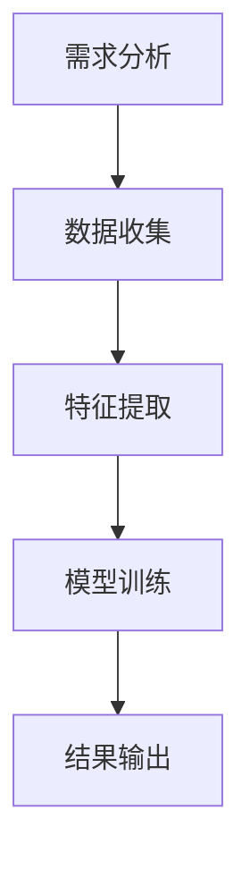
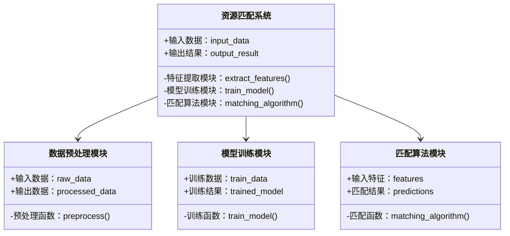
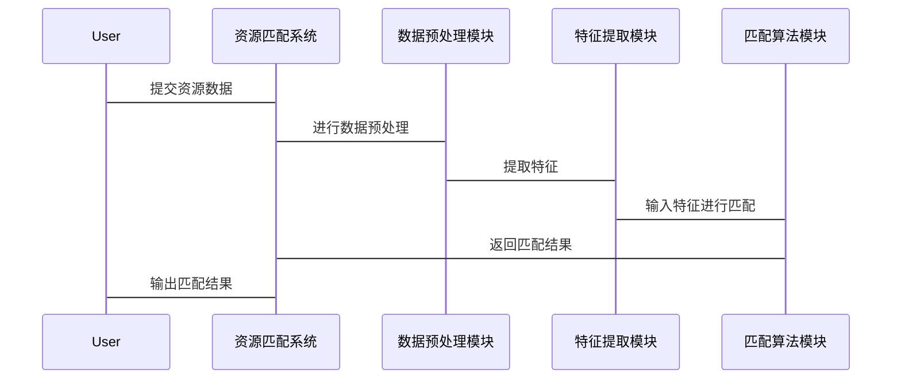

                 


# AI驱动的企业创新生态系统构建：内外部资源智能匹配与协作

---

## 关键词：AI，企业创新，资源匹配，协作机制，生态系统

---

## 摘要：  
本文探讨了AI技术如何驱动企业创新生态系统的发展，重点分析了内外部资源的智能匹配与协作机制。通过系统化的分析和实际案例，文章揭示了如何利用AI算法和工具构建高效的资源匹配模型，实现企业内外部资源的最优配置，从而推动企业创新的快速发展。本文还详细介绍了AI驱动的资源匹配算法、系统架构设计以及实际项目中的应用，为企业创新生态系统构建提供了理论支持和实践指导。

---

## 目录

1. **AI驱动的企业创新生态系统概述**  
   1.1 企业创新生态系统的概念  
   1.2 AI在企业创新中的作用  
   1.3 内外部资源匹配的重要性  

2. **AI驱动的企业创新生态系统的核心概念**  
   2.1 创新生态系统的核心要素  
   2.2 AI驱动的资源匹配机制  
   2.3 创新生态系统的核心原理  

3. **AI驱动的资源匹配算法原理**  
   3.1 资源匹配的核心算法  
   3.2 算法流程图  
   3.3 算法实现代码  
   3.4 数学模型与公式  

4. **系统分析与架构设计方案**  
   4.1 项目介绍  
   4.2 系统功能设计（领域模型）  
   4.3 系统架构设计  
   4.4 系统接口设计  
   4.5 系统交互设计  

5. **项目实战：AI驱动的资源匹配系统实现**  
   5.1 环境安装与配置  
   5.2 核心功能实现  
   5.3 实际案例分析  
   5.4 项目小结  

6. **最佳实践与注意事项**  
   6.1 AI驱动资源匹配的关键成功要素  
   6.2 实施过程中的注意事项  
   6.3 拓展阅读与未来展望  

---

## 第一部分：AI驱动的企业创新生态系统概述

### 1.1 企业创新生态系统的概念  
企业在不断变化的市场环境中，需要通过创新来保持竞争优势。创新生态系统是指由企业内外部资源、技术、人才、合作伙伴等组成的复杂网络，通过协作与共享，实现创新目标的动态平衡。  

#### 1.1.1 企业创新生态系统的定义  
企业创新生态系统是一个由多方参与者共同构建的动态网络，通过资源的整合、协作与共享，实现创新价值的最大化。  

#### 1.1.2 创新生态系统的核心要素  
- **内部资源**：企业内部的技术、资金、人力资源等。  
- **外部资源**：合作伙伴、客户、供应商、第三方服务提供商等。  
- **协作机制**：企业内外部资源之间的协作规则与流程。  
- **创新目标**：企业通过创新实现的战略目标。  

#### 1.1.3 企业创新生态系统的特点  
- **动态性**：资源匹配与协作关系随市场变化而调整。  
- **复杂性**：涉及多方参与者，协作机制复杂。  
- **协作性**：通过协作实现资源优化配置。  
- **创新性**：通过创新推动企业价值增长。  

---

### 1.2 AI在企业创新中的作用  
人工智能技术正在深刻改变企业创新的方式，通过智能化的资源匹配与协作，推动企业创新生态系统的高效运转。  

#### 1.2.1 AI技术对企业创新的影响  
- **数据驱动决策**：通过大数据分析，帮助企业识别潜在的创新机会。  
- **智能匹配资源**：利用AI算法，实现企业内外部资源的精准匹配。  
- **自动化协作流程**：通过智能化工具，优化企业内外部协作效率。  

#### 1.2.2 AI驱动创新的模式  
- **数据驱动创新**：基于数据分析，发现创新方向。  
- **智能协作创新**：通过AI辅助，优化协作流程。  
- **自动化创新**：利用AI技术，实现创新过程的自动化。  

#### 1.2.3 AI在企业创新中的应用场景  
- **创新机会识别**：通过市场数据分析，发现新的业务机会。  
- **资源匹配优化**：利用AI算法，优化企业内外部资源的配置。  
- **协作流程优化**：通过智能化工具，提升企业内外部协作效率。  

---

### 1.3 内外部资源匹配的重要性  
资源匹配是企业创新生态系统的核心环节，直接影响企业的创新效率和成果。  

#### 1.3.1 内部资源的整合与优化  
- **内部资源整合**：将企业内部的技术、资金、人力资源等整合起来，形成协同效应。  
- **内部资源优化**：通过优化资源配置，提升内部资源的利用效率。  

#### 1.3.2 外部资源的引入与协作  
- **外部资源引入**：引入外部合作伙伴、供应商、客户等资源，拓展企业的创新边界。  
- **外部资源协作**：与外部资源建立高效的协作机制，实现资源共享与价值共创。  

#### 1.3.3 资源匹配对企业创新的推动作用  
- **提升创新效率**：通过资源匹配，优化创新过程，缩短创新周期。  
- **降低创新成本**：通过资源匹配，避免资源浪费，降低创新成本。  
- **增强创新能力**：通过资源匹配，整合内外部资源，提升企业的创新能力。  

---

### 1.4 本章小结  
本章介绍了企业创新生态系统的核心概念、AI在企业创新中的作用以及资源匹配的重要性。通过对企业内外部资源的整合与优化，AI技术能够帮助企业构建高效的创新生态系统，推动企业的持续创新与成长。

---

## 第二部分：AI驱动的企业创新生态系统的核心概念

### 2.1 创新生态系统的核心要素  
创新生态系统由多个核心要素组成，包括企业内部资源、外部资源、协作机制等。  

#### 2.1.1 企业内部资源  
- **技术资源**：包括专利、技术储备等。  
- **人力资源**：包括研发团队、技术人员等。  
- **资金资源**：包括企业内部的投资资金。  

#### 2.1.2 企业外部资源  
- **合作伙伴**：包括供应商、客户、渠道商等。  
- **第三方服务**：包括云服务、数据分析服务等。  
- **行业资源**：包括行业协会、行业专家等。  

#### 2.1.3 资源匹配与协作机制  
- **匹配机制**：基于资源特性、需求进行智能匹配。  
- **协作机制**：通过制定协作规则，实现资源的高效利用。  

---

### 2.2 AI驱动的资源匹配机制  
AI技术能够通过数据驱动的方式，实现企业内外部资源的智能匹配与协作。  

#### 2.2.1 数据驱动的资源匹配  
- **数据收集**：通过数据采集工具，收集企业内外部资源的相关数据。  
- **特征提取**：从数据中提取关键特征，用于资源匹配。  
- **智能推荐**：基于特征匹配算法，推荐最优的资源组合。  

#### 2.2.2 智能算法的应用  
- **机器学习算法**：用于资源匹配模型的训练与优化。  
- **图论算法**：用于资源关系的建模与分析。  
- **强化学习算法**：用于动态调整资源匹配策略。  

#### 2.2.3 资源匹配的动态调整  
- **实时反馈**：根据匹配结果，实时调整资源匹配策略。  
- **动态优化**：基于反馈数据，优化资源匹配模型。  

---

### 2.3 创新生态系统的核心原理  
AI驱动的企业创新生态系统通过数据驱动的方式，实现企业内外部资源的高效匹配与协作。  

#### 2.3.1 资源匹配的数学模型  
$$ \text{匹配度} = \sum_{i=1}^{n} w_i \cdot x_i $$
其中，$w_i$ 是第i个特征的权重，$x_i$ 是第i个特征的值。  

#### 2.3.2 协作机制的实现方式  
$$ \text{协作度} = \frac{\sum_{j=1}^{m} y_j \cdot z_j}{\sqrt{\sum_{j=1}^{m} y_j^2} \cdot \sqrt{\sum_{j=1}^{m} z_j^2}} $$  
其中，$y_j$ 和 $z_j$ 分别是两个协作对象的特征向量。  

#### 2.3.3 系统的可扩展性与灵活性  
- **可扩展性**：系统能够扩展以适应更多的资源类型和规模。  
- **灵活性**：系统能够根据需求变化，灵活调整资源匹配策略。  

---

### 2.4 核心概念对比表格  
| 资源类型 | 内部资源 | 外部资源 |
|----------|----------|----------|
| 特性     | 稳定性高 | 变异性高 |
| 控制权   | 完全控制 | 部分控制 |
| 匹配方式 | 精准匹配 | 智能推荐 |

---

### 2.5 本章小结  
本章详细介绍了创新生态系统的核心概念，包括企业内外部资源的特性和协作机制。通过AI技术的应用，企业能够实现资源的智能匹配与协作，构建高效的创新生态系统。

---

## 第三部分：AI驱动的资源匹配算法原理

### 3.1 资源匹配的核心算法  
AI驱动的资源匹配算法是实现企业内外部资源高效匹配的关键技术。  

#### 3.1.1 基于机器学习的匹配算法  
- **监督学习**：通过标注数据训练分类器，进行资源匹配。  
- **无监督学习**：通过聚类算法，发现资源的潜在关系。  

#### 3.1.2 基于图论的匹配算法  
- **图模型构建**：将资源及其关系表示为图结构。  
- **最短路径算法**：用于资源匹配的路径优化。  

#### 3.1.3 基于强化学习的匹配算法  
- **策略网络**：通过强化学习训练策略网络，进行资源匹配。  
- **奖励机制**：根据匹配结果，调整策略网络的权重。  

---

### 3.2 算法流程图  



---

### 3.3 算法实现代码  

```python
def resource_matching_algorithm(input_data):
    # 数据预处理
    processed_data = preprocess(input_data)
    # 特征提取
    features = extract_features(processed_data)
    # 模型预测
    predictions = model.predict(features)
    return predictions
```

---

### 3.4 数学模型与公式  

#### 3.4.1 资源匹配的数学模型  
$$ \text{匹配度} = \sum_{i=1}^{n} w_i \cdot x_i $$  
其中，$w_i$ 是第i个特征的权重，$x_i$ 是第i个特征的值。  

#### 3.4.2 协作机制的数学表达  
$$ \text{协作度} = \frac{\sum_{j=1}^{m} y_j \cdot z_j}{\sqrt{\sum_{j=1}^{m} y_j^2} \cdot \sqrt{\sum_{j=1}^{m} z_j^2}} $$  
其中，$y_j$ 和 $z_j$ 分别是两个协作对象的特征向量。  

---

### 3.5 本章小结  
本章详细介绍了AI驱动的资源匹配算法，包括基于机器学习、图论和强化学习的匹配算法，以及算法的实现代码和数学模型。通过这些算法，企业能够实现内外部资源的智能匹配，提升创新效率。

---

## 第四部分：系统分析与架构设计方案

### 4.1 项目介绍  
本项目旨在通过AI技术，构建一个企业内外部资源智能匹配与协作的系统，帮助企业实现创新生态系统的高效运转。  

---

### 4.2 系统功能设计（领域模型）  



---

### 4.3 系统架构设计  


---

### 4.4 系统接口设计  
- **输入接口**：接收企业内外部资源的数据。  
- **输出接口**：返回资源匹配结果。  
- **内部接口**：模块之间的数据交互接口。  

---

### 4.5 系统交互设计  



---

### 4.6 本章小结  
本章详细介绍了系统分析与架构设计方案，包括系统功能设计、架构设计、接口设计和交互设计。通过这些设计，企业能够构建一个高效的资源匹配系统，实现内外部资源的智能匹配与协作。

---

## 第五部分：项目实战：AI驱动的资源匹配系统实现

### 5.1 环境安装与配置  
要实现AI驱动的资源匹配系统，首先需要安装以下环境：  
- **Python**：推荐使用最新版本的Python 3.x。  
- **机器学习库**：如TensorFlow、Scikit-learn等。  
- **数据处理库**：如Pandas、NumPy等。  
- **可视化工具**：如Matplotlib、Seaborn等。  

---

### 5.2 核心功能实现  
以下是资源匹配系统的核心功能实现代码：  

```python
import numpy as np
import pandas as pd
from sklearn.metrics.pairwise import cosine_similarity

def preprocess(data):
    # 数据预处理函数，可根据具体需求自定义
    return data.dropna()

def extract_features(data):
    # 特征提取函数，可根据具体需求自定义
    return data.select_dtypes(['float64', 'int64'])

def matching_algorithm(features):
    # 资源匹配算法实现
    similarity_matrix = cosine_similarity(features)
    return similarity_matrix.argsort()

def resource_matching_system(input_data):
    processed_data = preprocess(input_data)
    features = extract_features(processed_data)
    predictions = matching_algorithm(features)
    return predictions
```

---

### 5.3 实际案例分析  
以企业技术资源匹配为例，假设我们有以下技术资源数据：  

| 技术领域 | 人工智能 | 大数据 | 物联网 | 云计算 |
|----------|----------|--------|--------|--------|
| 人工智能  | 1        | 0.5    | 0.3    | 0.2    |
| 大数据   | 0.5      | 1      | 0.4    | 0.3    |
| 物联网   | 0.3      | 0.4    | 1      | 0.5    |
| 云计算   | 0.2      | 0.3    | 0.5    | 1      |

通过上述算法，我们可以计算出技术领域之间的相似性矩阵，并进行排序，找到最匹配的技术领域。  

---

### 5.4 项目小结  
本章通过实际案例分析，展示了AI驱动的资源匹配系统的实现过程。通过环境安装、功能实现和案例分析，读者可以深入了解如何利用AI技术实现企业内外部资源的智能匹配。

---

## 第六部分：最佳实践与注意事项

### 6.1 AI驱动资源匹配的关键成功要素  
- **高质量数据**：数据的质量直接影响匹配结果的准确性。  
- **算法优化**：选择合适的算法，并不断优化模型性能。  
- **系统集成**：确保系统与企业现有流程的无缝集成。  

### 6.2 实施过程中的注意事项  
- **数据隐私**：确保数据的安全性和隐私性。  
- **算法解释性**：确保算法的可解释性，便于问题排查与优化。  
- **系统稳定性**：确保系统的稳定运行，避免因技术问题影响企业创新。  

### 6.3 拓展阅读与未来展望  
- **深度学习在资源匹配中的应用**：探索深度学习技术在资源匹配中的应用。  
- **多目标优化算法**：研究多目标优化算法在资源匹配中的应用。  
- **动态资源匹配**：探索动态环境下的资源匹配机制。  

---

## 作者：AI天才研究院 / AI Genius Institute & 禅与计算机程序设计艺术 / Zen And The Art of Computer Programming

