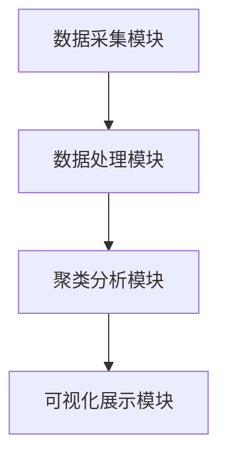
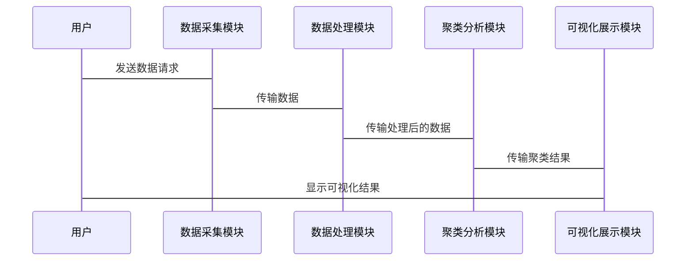

                 


# AI驱动的投资者行为模式聚类

---

## 关键词：
AI，投资者行为，聚类分析，金融数据，机器学习

---

## 摘要：
本文详细探讨了如何利用人工智能技术对投资者行为模式进行聚类分析。通过结合聚类分析的基本原理、投资者行为数据的特征提取、基于机器学习的聚类建模方法，以及实际案例分析，本文为投资者行为分析提供了全新的视角和方法。文章从理论到实践，全面解析了AI在投资者行为模式聚类中的应用，帮助读者理解如何通过技术手段揭示投资者行为的内在规律。

---

## 第1章: 投资者行为分析的背景与挑战

### 1.1 传统投资者行为分析的局限性

#### 1.1.1 传统行为分析方法的不足
传统投资者行为分析主要依赖于统计学方法和专家经验，但存在以下问题：
- 数据量有限，难以捕捉复杂的行为模式。
- 分析结果主观性强，缺乏客观性。
- 难以实时分析和预测。

#### 1.1.2 数据驱动分析的必要性
随着金融数据的爆炸式增长，传统的分析方法已无法满足需求。数据驱动分析的优势在于：
- 能够处理海量数据，发现潜在模式。
- 可以实现自动化、实时化分析。
- 提供客观、量化的分析结果。

#### 1.1.3 AI技术在行为分析中的优势
人工智能技术的引入，为投资者行为分析带来了新的可能性：
- 高效的数据处理能力。
- 自动化的模式识别能力。
- 个性化的行为分析支持。

### 1.2 AI驱动的投资者行为模式聚类概念

#### 1.2.1 聚类分析的基本定义
聚类分析是一种无监督学习方法，旨在将数据点划分到不同的类别中，使得同一类别的数据点具有较高的相似性，而不同类别之间的数据点具有较低的相似性。

#### 1.2.2 投资者行为模式的特征
投资者行为模式的特征包括：
- 交易频率：投资者在特定时间段内的交易次数。
- 交易时长：每次交易的持续时间。
- 交易金额：每次交易的金额大小。
- 市场情绪：投资者在交易时的市场情绪（如贪婪、恐惧等）。

#### 1.2.3 聚类分析在投资者行为分析中的应用
聚类分析可以用于：
- 将投资者分为不同的类型，如激进型、保守型等。
- 发现不同投资者群体的行为模式。
- 预测投资者行为的变化趋势。

### 1.3 本书的研究目标与内容框架

#### 1.3.1 研究目标
本书旨在探讨如何利用AI技术对投资者行为模式进行聚类分析，揭示投资者行为的内在规律，并为金融从业者提供实践指导。

#### 1.3.2 内容框架概述
本书将从聚类分析的基本原理、投资者行为数据的特征提取、聚类模型的构建方法，以及实际案例分析等方面展开讨论。

#### 1.3.3 本书的创新点
- 将AI技术与投资者行为分析相结合，提出了一种全新的分析方法。
- 提出了基于聚类分析的投资者行为模式分类框架。
- 通过实际案例分析，验证了方法的有效性和实用性。

---

## 第2章: 聚类分析的原理与方法

### 2.1 聚类分析的基本原理

#### 2.1.1 聚类的基本概念
聚类分析是一种无监督学习方法，其核心是通过数据点之间的相似性，将数据划分为多个簇，使得同一簇内的数据点具有较高的相似性，而不同簇之间的数据点具有较低的相似性。

#### 2.1.2 聚类的相似性度量
常用的相似性度量方法包括：
- 欧氏距离：用于度量两个点之间的直线距离。
- 曼哈顿距离：用于度量两个点在网格中的移动距离。
- 余弦相似性：用于度量两个向量之间的夹角。

#### 2.1.3 聚类算法的分类
聚类算法可以分为以下几类：
- 基于距离的聚类算法（如K-means）。
- 基于层次的聚类算法（如层次聚类）。
- 基于密度的聚类算法（如DBSCAN）。

### 2.2 常见聚类算法简介

#### 2.2.1 K-means算法
K-means算法是一种基于距离的聚类算法，其核心思想是将数据划分为K个簇，使得每个簇内的数据点到簇中心的距离之和最小。

#### 2.2.2 层次聚类算法
层次聚类算法是一种基于层次结构的聚类方法，其核心思想是通过递归地将数据划分为子簇，直到满足停止条件。

#### 2.2.3 DBSCAN算法
DBSCAN算法是一种基于密度的聚类算法，其核心思想是将数据点划分为高密度区域，这些区域被称为簇。

### 2.3 聚类算法的优缺点对比

| 算法名称 | 优点 | 缺点 |
|----------|------|------|
| K-means | 简单高效，易于实现 | 需要预先指定K值，对初始中心敏感 |
| 层次聚类 | 不需要预先指定簇数，适合处理层次结构 | 计算复杂度高，不适合大数据 |
| DBSCAN  | 不需要预先指定簇数，适合处理噪声 | 对参数敏感，计算复杂度较高 |

### 2.4 聚类分析的数学基础

#### 2.4.1 距离度量公式
欧氏距离公式为：
$$
d(x, y) = \sqrt{(x_1 - y_1)^2 + (x_2 - y_2)^2 + \cdots + (x_n - y_n)^2}
$$

#### 2.4.2 聚类质量评估指标
常用的聚类质量评估指标包括：
- 内部评估指标（如轮廓系数）。
- 外部评估指标（如准确率、召回率）。

---

## 第3章: 投资者行为数据的特征提取

### 3.1 投资者行为数据的类型

#### 3.1.1 交易数据
交易数据包括投资者的交易时间、交易金额、交易频率等信息。

#### 3.1.2 市场情绪数据
市场情绪数据反映了投资者在特定时间段内的市场情绪，如贪婪、恐惧等。

#### 3.1.3 个体行为数据
个体行为数据包括投资者的交易习惯、风险偏好等信息。

### 3.2 数据预处理方法

#### 3.2.1 数据清洗
数据清洗的目标是去除噪声数据，确保数据的干净性。

#### 3.2.2 数据标准化
数据标准化的目的是将不同特征的数据标准化到同一范围内，常用的标准化方法包括最小-最大标准化和Z-score标准化。

#### 3.2.3 数据降维
数据降维的目的是减少数据的维度，常用的方法包括主成分分析（PCA）和t-SNE。

### 3.3 特征提取的常见方法

#### 3.3.1 统计特征提取
统计特征提取方法包括计算均值、方差、最大值、最小值等统计指标。

#### 3.3.2 时序特征提取
时序特征提取方法包括计算趋势、周期性、突变点等。

#### 3.3.3 文本特征提取
文本特征提取方法包括词袋模型、TF-IDF和词嵌入模型（如Word2Vec）。

---

## 第4章: 投资者行为模式的聚类建模

### 4.1 聚类模型构建的步骤

#### 4.1.1 数据准备
数据准备包括数据清洗、数据标准化、数据降维等步骤。

#### 4.1.2 模型选择
根据数据特点选择合适的聚类算法，如K-means、层次聚类或DBSCAN。

#### 4.1.3 模型训练
根据选择的算法进行模型训练，得到聚类结果。

#### 4.1.4 模型评估
根据评估指标对聚类结果进行评估，调整模型参数以提高聚类效果。

### 4.2 基于K-means的聚类实现

#### 4.2.1 K-means算法流程
1. 初始化K个簇中心。
2. 计算每个数据点到簇中心的距离，将数据点分配到最近的簇中心。
3. 重新计算簇中心。
4. 重复步骤2和3，直到收敛。

#### 4.2.2 K-means的优缺点
优点：
- 简单高效，易于实现。
缺点：
- 需要预先指定K值，对初始中心敏感。

#### 4.2.3 K-means在投资者行为聚类中的应用
通过K-means算法，可以将投资者划分为不同的群体，如保守型、激进型等。

### 4.3 基于层次聚类的实现

#### 4.3.1 层次聚类的基本原理
层次聚类通过递归地将数据划分为子簇，直到满足停止条件。

#### 4.3.2 层次聚类的实现步骤
1. 计算所有数据点之间的相似性矩阵。
2. 根据相似性矩阵进行聚类，逐步合并相似性较高的簇。
3. 绘制层次聚类树状图。

#### 4.3.3 层次聚类在投资者行为分析中的应用
通过层次聚类，可以发现投资者行为的层次结构，如从小群体到大群体的逐步合并。

### 4.4 基于DBSCAN的实现

#### 4.4.1 DBSCAN算法流程
1. 寻找密度核心点。
2. 扩展密度核心点，形成簇。
3. 去除噪声点。

#### 4.4.2 DBSCAN的优缺点
优点：
- 不需要预先指定簇数。
缺点：
- 对参数敏感，计算复杂度较高。

#### 4.4.3 DBSCAN在投资者行为聚类中的应用
通过DBSCAN算法，可以发现投资者行为的高密度区域，揭示潜在的群体行为模式。

---

## 第5章: 系统分析与架构设计

### 5.1 问题场景介绍
本系统旨在通过AI技术对投资者行为模式进行聚类分析，帮助金融从业者更好地理解投资者行为，制定有效的投资策略。

### 5.2 系统功能设计

#### 5.2.1 数据采集模块
数据采集模块负责从多种数据源采集投资者行为数据，包括交易数据、市场情绪数据等。

#### 5.2.2 数据处理模块
数据处理模块负责对采集到的数据进行清洗、标准化和降维处理。

#### 5.2.3 聚类分析模块
聚类分析模块负责根据处理后的数据，选择合适的聚类算法进行模型训练，得到聚类结果。

#### 5.2.4 可视化展示模块
可视化展示模块负责将聚类结果以图表形式展示，帮助用户更好地理解分析结果。

### 5.3 系统架构设计



### 5.4 系统接口设计

#### 5.4.1 数据接口
- 数据输入接口：用于接收投资者行为数据。
- 数据输出接口：用于输出聚类结果。

#### 5.4.2 模型接口
- 模型训练接口：用于训练聚类模型。
- 模型预测接口：用于进行投资者行为预测。

### 5.5 系统交互设计



---

## 第6章: 项目实战

### 6.1 环境安装

#### 6.1.1 安装Python
安装Python 3.x版本，推荐使用Anaconda分布。

#### 6.1.2 安装依赖库
安装以下依赖库：
- `scikit-learn`：用于聚类分析。
- `matplotlib`：用于数据可视化。
- `pandas`：用于数据处理。

### 6.2 系统核心实现源代码

#### 6.2.1 数据处理代码
```python
import pandas as pd
from sklearn.preprocessing import StandardScaler

# 读取数据
data = pd.read_csv('investor_behavior.csv')

# 数据标准化
scaler = StandardScaler()
scaled_data = scaler.fit_transform(data)
```

#### 6.2.2 聚类分析代码
```python
from sklearn.cluster import KMeans

# 初始化K-means模型
kmeans = KMeans(n_clusters=3, random_state=42)

# 训练模型
kmeans.fit(scaled_data)

# 预测簇标签
clusters = kmeans.predict(scaled_data)
```

#### 6.2.3 可视化代码
```python
import matplotlib.pyplot as plt

# 绘制聚类结果
plt.scatter(data['x'], data['y'], c=clusters, cmap='viridis')
plt.xlabel('x')
plt.ylabel('y')
plt.show()
```

### 6.3 代码应用解读与分析
通过上述代码，我们可以实现投资者行为数据的聚类分析，并将结果以图表形式展示出来。

### 6.4 实际案例分析
以实际交易数据为例，通过聚类分析，我们可以将投资者分为保守型、激进型和平衡型三类。

### 6.5 项目小结
本项目通过实际案例分析，验证了基于K-means算法的投资者行为聚类方法的有效性。

---

## 第7章: 高级主题与最佳实践

### 7.1 模型优化与调优

#### 7.1.1 超参数调优
通过网格搜索（Grid Search）或随机搜索（Random Search）方法，优化聚类模型的超参数。

#### 7.1.2 模型评估
使用轮廓系数（Silhouette Score）等指标，评估聚类模型的质量。

### 7.2 模型的可解释性

#### 7.2.1 特征重要性分析
通过特征重要性分析，确定哪些特征对聚类结果影响较大。

#### 7.2.2 聚类结果的可视化解释
通过可视化工具，帮助用户更好地理解聚类结果。

### 7.3 实时分析与在线聚类

#### 7.3.1 实时数据处理
通过流数据处理技术，实现投资者行为的实时聚类分析。

#### 7.3.2 在线聚类算法
采用适合在线聚类的算法，如流式聚类算法。

### 7.4 最佳实践 tips

#### 7.4.1 数据预处理的重要性
数据预处理是聚类分析成功的关键，必须重视数据清洗、标准化和降维等步骤。

#### 7.4.2 模型选择的灵活性
根据数据特点选择合适的聚类算法，不要盲目追求复杂算法。

#### 7.4.3 结果解释的可理解性
聚类结果必须具有可解释性，才能为实际应用提供价值。

---

## 参考文献

1. Bishop, C. M. (2006). Pattern Recognition and Machine Learning. Springer.
2. Hastie, T., Tibshirani, R., & Friedman, J. (2009). The Elements of Statistical Learning. Springer.
3. 吴恩达. (2016). 机器学习入门. 人民邮电出版社.

---

## 作者：AI天才研究院/AI Genius Institute & 禅与计算机程序设计艺术 /Zen And The Art of Computer Programming

---

希望这篇博客文章能为读者提供关于AI驱动的投资者行为模式聚类的全面理解，并为实际应用提供有价值的参考。

