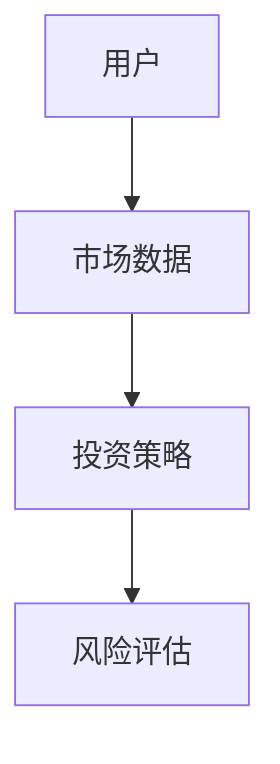
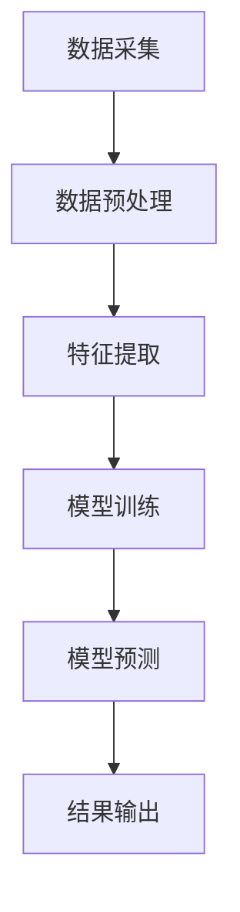
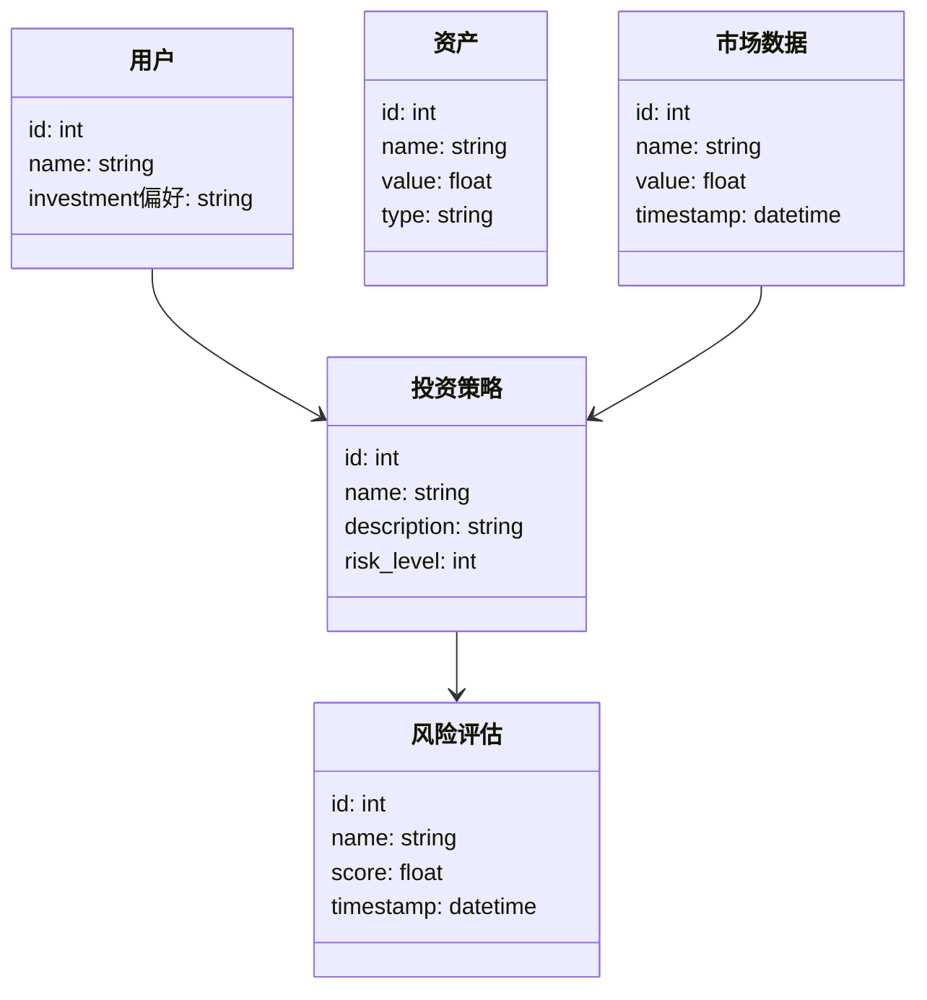
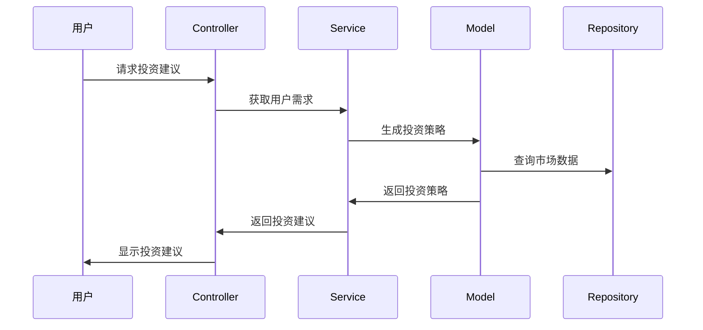

                 


# 从零构建投资理财智能助手AI Agent：基本概念与架构设计

> 关键词：投资理财，AI Agent，智能助手，架构设计，算法原理，系统实现

> 摘要：本文详细介绍了如何从零构建一个投资理财智能助手AI Agent，涵盖其基本概念、核心算法、系统架构设计、项目实现和最佳实践。通过逐步分析和深入浅出的讲解，帮助读者理解如何利用AI技术解决实际投资理财问题。

---

# 第一部分: 投资理财智能助手AI Agent背景介绍

## 第1章: 问题背景与需求分析

### 1.1 问题背景

#### 1.1.1 传统投资理财的痛点
传统投资理财过程中，投资者面临以下痛点：
- **信息过载**：金融市场数据繁杂，投资者难以快速获取和分析关键信息。
- **决策延迟**：传统人工分析耗时长，难以满足实时投资需求。
- **个性化不足**：传统理财方案往往千篇一律，难以满足不同投资者的个性化需求。

#### 1.1.2 AI技术在投资理财中的应用潜力
AI技术的快速发展为投资理财带来了革命性的变化：
- **数据处理能力**：AI能够快速处理海量金融数据，提取关键信息。
- **智能决策支持**：通过机器学习算法，AI可以提供个性化的投资建议。
- **实时性**：AI能够实时监控市场动态，提供及时的投资策略。

#### 1.1.3 当前市场对智能理财助手的需求
随着AI技术的普及，市场对智能理财助手的需求日益增长：
- **用户需求**：投资者希望获得个性化的投资建议，降低投资风险。
- **机构需求**：金融机构希望通过智能助手提升服务效率，增强竞争力。
- **市场趋势**：AI技术在金融领域的应用越来越广泛，智能理财助手成为未来趋势。

### 1.2 问题描述

#### 1.2.1 投资者行为分析
投资者的行为受到多种因素影响：
- **风险偏好**：不同投资者对风险的承受能力不同。
- **投资目标**：投资者的投资目标可能包括短期收益或长期财富积累。
- **市场认知**：投资者对市场的认知影响其决策。

#### 1.2.2 理财需求的多样性
理财需求具有多样性：
- **资产配置**：不同投资者的资产配置需求不同。
- **风险控制**：投资者对风险的控制需求各异。
- **投资周期**：投资者的投资周期长短不一。

#### 1.2.3 现有解决方案的局限性
现有解决方案存在以下局限性：
- **个性化不足**：传统理财方案难以满足个性化需求。
- **实时性差**：传统方法难以实现实时监控和调整。
- **缺乏深度分析**：传统方法难以处理复杂的投资场景。

### 1.3 问题解决思路

#### 1.3.1 AI Agent的核心目标
AI Agent的核心目标是：
- 提供个性化的投资建议。
- 实时监控市场动态。
- 优化投资组合。

#### 1.3.2 技术实现路径
技术实现路径包括：
- 数据采集与处理。
- 机器学习模型构建。
- 自然语言处理技术应用。
- 实时数据流处理。

#### 1.3.3 用户体验优化策略
用户体验优化策略包括：
- 简化操作流程。
- 提供直观的可视化界面。
- 提供及时反馈和建议。

### 1.4 边界与外延

#### 1.4.1 AI Agent的功能边界
AI Agent的功能边界包括：
- 仅提供投资建议，不直接进行交易。
- 仅处理标准化的金融数据，不支持非结构化数据。
- 仅提供基于历史数据的预测，不支持未来数据。

#### 1.4.2 与其他系统的交互边界
AI Agent与其他系统的交互边界包括：
- 与数据源系统的接口。
- 与用户交互界面的接口。
- 与其他金融系统的接口。

#### 1.4.3 功能的可扩展性
功能的可扩展性包括：
- 支持多种投资策略。
- 支持多语言交互。
- 支持多种数据源。

### 1.5 概念结构与核心要素

#### 1.5.1 核心要素组成
核心要素组成包括：
- 用户需求。
- 市场数据。
- 投资策略。
- 风险评估。

#### 1.5.2 要素之间的关系
要素之间的关系包括：
- 用户需求驱动投资策略。
- 市场数据影响投资策略。
- 投资策略决定风险评估。

#### 1.5.3 概念模型图


---

## 第2章: AI Agent基本原理

### 2.1 核心概念原理

#### 2.1.1 AI Agent的定义与分类
AI Agent的定义与分类包括：
- **定义**：AI Agent是一种能够感知环境并采取行动以实现目标的智能体。
- **分类**：根据功能和应用场景的不同，AI Agent可以分为多种类型，如基于规则的AI Agent、基于机器学习的AI Agent等。

#### 2.1.2 投资理财AI Agent的独特性
投资理财AI Agent的独特性包括：
- **实时性**：能够实时监控市场动态。
- **个性化**：能够根据用户需求提供个性化建议。
- **复杂性**：需要处理多种金融数据和投资策略。

#### 2.1.3 多模态交互机制
多模态交互机制包括：
- **文本交互**：通过自然语言处理技术与用户进行对话。
- **视觉交互**：通过可视化界面展示投资数据和建议。
- **语音交互**：通过语音识别技术与用户进行交互。

### 2.2 核心概念对比

#### 2.2.1 概念属性特征对比表
| 概念          | 属性1         | 属性2         | 属性3         |
|---------------|---------------|---------------|---------------|
| AI Agent      | 智能化         | 实时性         | 个性化         |
| 投资策略      | 数据驱动      | 风险控制      | 目标导向       |

#### 2.2.2 功能对比分析
- **AI Agent**：能够自主学习和优化投资策略。
- **传统投资策略**：依赖人工分析和调整。

#### 2.2.3 性能对比分析
- **AI Agent**：处理速度快，能够实时响应。
- **传统方法**：处理速度慢，难以实时响应。

### 2.3 实体关系图

```mermaid
er
    entity(用户) {
        id: int,
        name: string,
        age: int,
        investment偏好: string
    }
    entity(资产) {
        id: int,
        name: string,
        value: float,
        type: string
    }
    entity(市场数据) {
        id: int,
        name: string,
        value: float,
        timestamp: datetime
    }
    entity(投资策略) {
        id: int,
        name: string,
        description: string,
        risk_level: int
    }
    entity(风险评估) {
        id: int,
        name: string,
        score: float,
        timestamp: datetime
    }
    用户 --> 投资策略
    市场数据 --> 投资策略
    投资策略 --> 风险评估
```

---

## 第3章: 算法原理讲解

### 3.1 算法原理概述

#### 3.1.1 算法流程


#### 3.1.2 算法核心
- **数据预处理**：清洗和标准化数据。
- **特征提取**：提取关键特征，如市场趋势、资产波动率等。
- **模型训练**：使用机器学习算法训练模型，如随机森林、神经网络等。
- **模型预测**：基于训练好的模型进行投资策略预测。

### 3.2 算法实现

#### 3.2.1 Python代码实现
```python
import pandas as pd
from sklearn.ensemble import RandomForestRegressor
from sklearn.metrics import mean_squared_error

# 数据预处理
data = pd.read_csv('market_data.csv')
data = data.dropna()

# 特征提取
features = ['open', 'high', 'low', 'volume']
target = 'close'

# 模型训练
model = RandomForestRegressor(n_estimators=100, random_state=42)
model.fit(data[features], data[target])

# 模型预测
predicted = model.predict(data[features])
print(f"预测值: {predicted}")
print(f"均方误差: {mean_squared_error(data[target], predicted)}")
```

#### 3.2.2 算法数学模型
- **回归模型**：使用随机森林回归模型进行预测。
- **损失函数**：均方误差。
- **优化目标**：最小化均方误差。

### 3.3 算法优化

#### 3.3.1 参数优化
- 调整随机森林的参数，如n_estimators、max_depth等，以提高模型性能。

#### 3.3.2 模型选择
- 比较不同机器学习算法的性能，选择最优模型。

#### 3.3.3 实时优化
- 定期更新模型，以适应市场变化。

---

## 第4章: 系统分析与架构设计

### 4.1 问题场景介绍

#### 4.1.1 系统目标
- 提供个性化的投资建议。
- 实时监控市场动态。
- 优化投资组合。

#### 4.1.2 项目介绍
- 项目名称：投资理财智能助手AI Agent。
- 项目目标：构建一个能够提供实时投资建议的智能助手。

### 4.2 系统功能设计

#### 4.2.1 领域模型


### 4.3 系统架构设计

#### 4.3.1 系统架构图
```mermaid
graph TD
    UI[用户界面] --> Controller[控制器]
    Controller --> Service[服务层]
    Service --> Repository[数据存储]
    Service --> Model[模型层]
    Model --> Data Source[数据源]
```

#### 4.3.2 接口设计
- **API接口**：提供RESTful API接口，供其他系统调用。
- **数据接口**：与数据源系统对接，获取市场数据。

#### 4.3.3 交互流程图


---

## 第5章: 项目实战

### 5.1 环境安装

#### 5.1.1 安装Python
- 安装Python 3.8或更高版本。

#### 5.1.2 安装依赖库
- 使用pip安装numpy、pandas、scikit-learn等库。

### 5.2 系统核心实现

#### 5.2.1 数据处理代码
```python
import pandas as pd
import numpy as np

# 数据加载
data = pd.read_csv('market_data.csv')

# 数据清洗
data = data.dropna()

# 特征提取
features = ['open', 'high', 'low', 'volume']
target = 'close'

# 数据分割
X = data[features]
y = data[target]
```

#### 5.2.2 模型训练代码
```python
from sklearn.ensemble import RandomForestRegressor
from sklearn.metrics import mean_squared_error

# 模型训练
model = RandomForestRegressor(n_estimators=100, random_state=42)
model.fit(X, y)

# 模型预测
predicted = model.predict(X)
print(f"均方误差: {mean_squared_error(y, predicted)}")
```

### 5.3 代码应用解读

#### 5.3.1 代码功能解读
- **数据处理**：加载和清洗数据，提取特征。
- **模型训练**：使用随机森林回归模型进行训练。
- **模型预测**：基于训练好的模型进行预测。

#### 5.3.2 代码实现细节
- 使用pandas进行数据处理。
- 使用scikit-learn进行模型训练。

### 5.4 实际案例分析

#### 5.4.1 数据准备
- 数据来源：市场数据CSV文件。
- 数据格式：包含开盘价、收盘价、成交量等字段。

#### 5.4.2 模型训练
- 训练数据：市场数据。
- 模型参数：随机森林回归模型。

#### 5.4.3 结果分析
- 预测结果：模型预测的收盘价。
- 性能评估：均方误差。

### 5.5 项目小结

#### 5.5.1 核心实现总结
- 数据处理：清洗和特征提取。
- 模型训练：随机森林回归模型。
- 模型预测：基于模型进行投资策略预测。

#### 5.5.2 项目实现的关键点
- 数据预处理的准确性。
- 模型选择的合理性。
- 模型性能的优化。

---

## 第6章: 最佳实践与小结

### 6.1 最佳实践

#### 6.1.1 小结
- 通过构建投资理财智能助手AI Agent，可以实现个性化的投资建议和实时市场监控。

#### 6.1.2 注意事项
- 数据处理需要谨慎，确保数据的准确性和完整性。
- 模型选择需要根据具体场景进行调整。
- 系统架构需要考虑扩展性和可维护性。

#### 6.1.3 拓展阅读
- 推荐阅读相关领域的书籍和论文，如《Python机器学习实战》。

### 6.2 作者信息

作者：AI天才研究院/AI Genius Institute & 禅与计算机程序设计艺术/Zen And The Art of Computer Programming

---

通过以上详细的内容，读者可以系统地学习从零构建投资理财智能助手AI Agent的基本概念与架构设计，掌握其实现方法和最佳实践。

