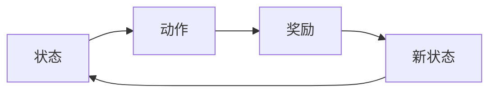
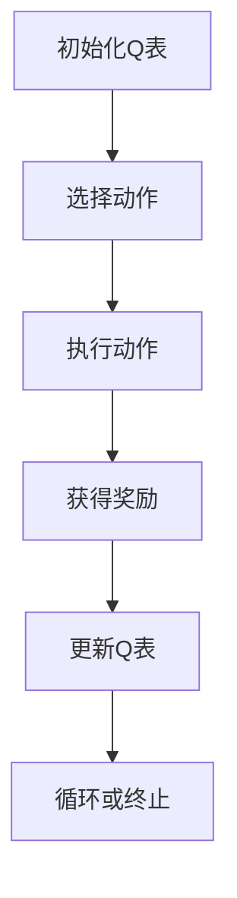
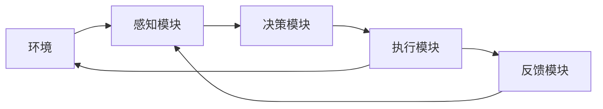
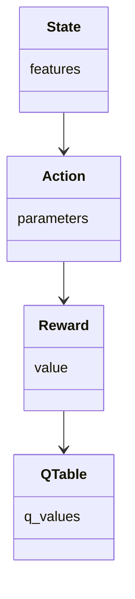
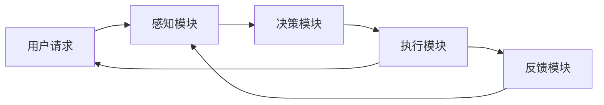
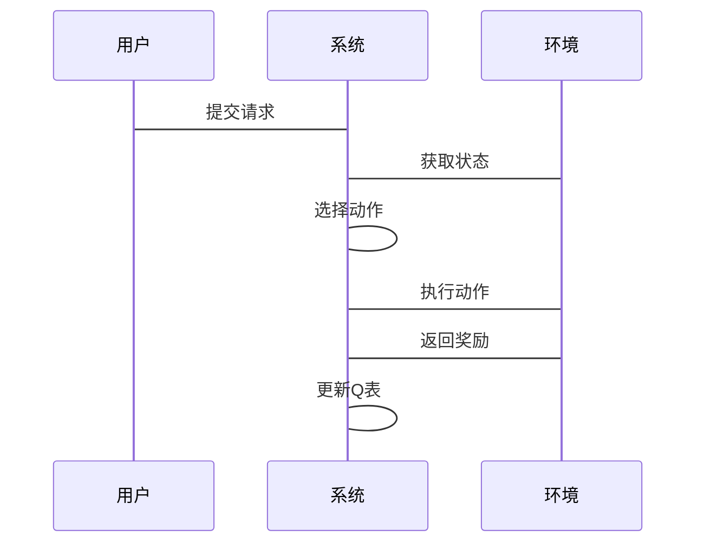

                 


```markdown
# 企业AI Agent的强化学习在复杂决策场景中的实践

> 关键词：企业AI Agent，强化学习，复杂决策，Q-learning，深度强化学习，系统架构设计

> 摘要：本文详细探讨了企业AI Agent在复杂决策场景中的应用，特别是强化学习技术的实践。通过分析强化学习的基本原理、算法实现、系统架构设计以及实际案例，本文旨在为企业技术决策者和开发人员提供有价值的参考，帮助他们更好地理解和应用强化学习技术，提升企业决策的智能化水平。

---

# 第一部分: 企业AI Agent与强化学习概述

# 第1章: 企业AI Agent与强化学习的背景介绍

## 1.1 AI Agent的基本概念
### 1.1.1 AI Agent的定义与特点
AI Agent（人工智能代理）是指在计算机系统中，能够感知环境并采取行动以实现目标的实体。AI Agent可以是软件程序、机器人或其他智能系统，其核心特点包括：
- **自主性**：能够在没有外部干预的情况下运行。
- **反应性**：能够实时感知环境并做出响应。
- **目标导向性**：所有行为都围绕实现特定目标展开。
- **学习能力**：能够通过经验改进自身的决策能力。

### 1.1.2 AI Agent的核心要素与组成
AI Agent的核心要素包括：
- **感知模块**：用于感知环境中的信息，例如传感器数据、用户输入等。
- **推理模块**：负责根据感知信息进行逻辑推理或数据分析。
- **决策模块**：基于推理结果制定行动策略。
- **执行模块**：将决策转化为具体行动，例如调用API或触发事件。

### 1.1.3 AI Agent在企业中的应用场景
AI Agent在企业中的应用场景广泛，包括：
- **供应链优化**：通过实时数据分析优化库存管理和物流调度。
- **客户关系管理**：通过智能客服系统提供个性化的客户支持。
- **投资组合管理**：通过算法交易优化投资策略。

## 1.2 强化学习的基本概念
### 1.2.1 强化学习的定义与特点
强化学习（Reinforcement Learning, RL）是一种机器学习范式，通过智能体在与环境的交互中学习最优策略。其特点包括：
- **目标导向性**：智能体通过最大化累积奖励来实现目标。
- **试错性**：通过不断尝试和错误来优化决策策略。
- **环境动态性**：环境的状态和奖励函数可能动态变化。

### 1.2.2 强化学习的核心要素与数学模型
强化学习的核心要素包括：
- **状态（State）**：智能体所处的环境条件。
- **动作（Action）**：智能体采取的行动。
- **奖励（Reward）**：智能体行动后获得的反馈。
- **策略（Policy）**：智能体选择动作的规则。

数学模型中，强化学习的目标是找到使累积奖励最大的策略π，即：
$$ \pi = \arg \max_{\pi} \mathbb{E}[R] $$

### 1.2.3 强化学习与监督学习的区别
| 对比维度 | 监督学习 | 强化学习 |
|----------|----------|----------|
| 数据来源 | 标签数据 | 奖励信号 |
| 目标函数 | 最小化损失 | 最大化奖励 |
| 决策方式 | 确定性 | 概率性 |

## 1.3 企业复杂决策场景中的强化学习
### 1.3.1 复杂决策场景的特点
复杂决策场景通常具有以下特点：
- **多目标冲突**：决策需要在多个目标之间权衡。
- **非线性关系**：决策与结果之间可能存在复杂的非线性关系。
- **动态变化**：环境状态和奖励函数可能随时间变化。

### 1.3.2 强化学习在复杂决策中的优势
- **适应性**：强化学习能够适应动态变化的环境。
- **全局优化**：强化学习能够找到全局最优策略。
- **实时反馈**：强化学习通过实时反馈不断优化决策。

### 1.3.3 企业AI Agent在复杂决策中的作用
AI Agent通过强化学习能够在复杂决策场景中实现：
- **实时决策**：根据当前环境状态实时做出最优决策。
- **自适应优化**：通过经验不断优化决策策略。
- **多目标平衡**：在多个目标之间找到最优平衡点。

## 1.4 本章小结
本章介绍了AI Agent和强化学习的基本概念，分析了强化学习在企业复杂决策场景中的优势，并探讨了AI Agent在企业中的应用场景。

---

# 第二部分: 强化学习的核心概念与原理

# 第2章: 强化学习的核心概念与联系

## 2.1 强化学习的核心原理
### 2.1.1 状态、动作、奖励的定义与关系
- **状态（State）**：智能体所处的环境条件，例如当前库存水平、市场价格等。
- **动作（Action）**：智能体采取的行动，例如增加订单、调整价格等。
- **奖励（Reward）**：智能体行动后获得的反馈，例如利润增加、客户满意度提升等。

### 2.1.2 Q-learning算法的基本原理
Q-learning是一种经典的强化学习算法，其基本原理如下：
1. 初始化Q表，所有状态-动作对的Q值初始化为0。
2. 在每个时间步，智能体选择当前状态下的动作，并执行该动作。
3. 根据执行结果获得奖励，并更新Q表中的对应值：
$$ Q(s,a) = Q(s,a) + \alpha [r + \gamma \max Q(s',a') - Q(s,a)] $$
其中，α是学习率，γ是折扣因子。

### 2.1.3 策略与价值函数的对比
| 对比维度 | 策略 | 价值函数 |
|----------|------|----------|
| 定义 | 动作选择规则 | 状态的价值评估 |
| 表示 | π(a|s) | V(s) |
| 作用 | 直接指导行动 | 评估状态的好坏 |

## 2.2 强化学习的数学模型与公式
### 2.2.1 Q-learning的数学模型
Q-learning的目标是找到使累积奖励最大的Q值函数：
$$ Q^*(s,a) = \mathbb{E}[r + \gamma \max Q(s',a')] $$

### 2.2.2 策略梯度法的基本公式
策略梯度法通过优化策略的参数θ来最大化累积奖励：
$$ \nabla \theta J(\theta) = \mathbb{E}[ \nabla \log \pi_\theta(a|s) Q(s,a) ] $$

## 2.3 强化学习的实体关系图


## 2.4 本章小结
本章详细讲解了强化学习的核心原理，包括状态、动作、奖励的关系，Q-learning算法的基本原理，以及策略与价值函数的对比。

---

# 第三部分: 强化学习算法的原理与实现

# 第3章: 强化学习算法的原理与实现

## 3.1 Q-learning算法的原理
### 3.1.1 Q-learning的算法流程


### 3.1.2 Q-learning的代码实现
```python
import numpy as np

class QLearning:
    def __init__(self, state_space, action_space, alpha=0.1, gamma=0.9):
        self.q_table = np.zeros((state_space, action_space))
        self.alpha = alpha
        self.gamma = gamma

    def choose_action(self, state):
        return np.argmax(self.q_table[state])

    def learn(self, state, action, reward, next_state):
        target = reward + self.gamma * np.max(self.q_table[next_state])
        self.q_table[state][action] += self.alpha * (target - self.q_table[state][action])
```

## 3.2 深度强化学习的原理
### 3.2.1 深度强化学习的核心概念
深度强化学习（Deep RL）结合了深度学习和强化学习的优势，通过神经网络近似Q值函数或策略函数。

### 3.2.2 DQN算法的数学模型
深度Q网络（DQN）通过神经网络近似Q值函数：
$$ Q(s,a) = \hat{Q}(s,a) $$

## 3.3 强化学习的系统架构设计
### 3.3.1 系统功能模块
- **感知模块**：负责获取环境中的状态信息。
- **决策模块**：基于当前状态选择最优动作。
- **执行模块**：将决策转化为具体行动。
- **反馈模块**：收集奖励信号并更新Q表。

### 3.3.2 系统架构图


## 3.4 本章小结
本章详细讲解了Q-learning和DQN算法的原理，并分析了强化学习系统的架构设计。

---

# 第四部分: 企业AI Agent的系统架构与实现

# 第4章: 企业AI Agent的系统架构与实现

## 4.1 系统功能设计
### 4.1.1 领域模型


### 4.1.2 系统架构图


## 4.2 系统实现细节
### 4.2.1 系统接口设计
- **输入接口**：接收环境状态和用户请求。
- **输出接口**：输出决策结果和执行动作。
- **反馈接口**：收集奖励信号并更新Q表。

### 4.2.2 系统交互流程


## 4.3 本章小结
本章详细分析了企业AI Agent的系统架构设计，并通过领域模型和系统架构图展示了系统的实现细节。

---

# 第五部分: 项目实战与案例分析

# 第5章: 项目实战与案例分析

## 5.1 电商推荐系统的实现
### 5.1.1 环境安装
```bash
pip install numpy matplotlib
```

### 5.1.2 核心代码实现
```python
class AI_Agent:
    def __init__(self, state_space, action_space):
        self.q_table = np.zeros((state_space, action_space))
    
    def choose_action(self, state):
        return np.argmax(self.q_table[state])
    
    def learn(self, state, action, reward, next_state):
        target = reward + 0.9 * np.max(self.q_table[next_state])
        self.q_table[state][action] += 0.1 * (target - self.q_table[state][action])
```

### 5.1.3 代码解读与分析
- **choose_action**：根据当前状态选择最优动作。
- **learn**：通过奖励更新Q表中的对应值。

## 5.2 案例分析
### 5.2.1 案例背景
某电商公司希望通过AI Agent优化商品推荐策略，提升客户购买率。

### 5.2.2 实施过程
1. 初始化Q表，所有商品推荐策略的Q值初始化为0。
2. 用户浏览商品页面，系统获取用户行为特征（状态）。
3. AI Agent根据当前状态选择推荐动作（商品）。
4. 用户点击购买或放弃，系统获得奖励（购买率）。
5. 根据奖励更新Q表中的对应值。

### 5.2.3 实施结果
通过强化学习优化推荐策略后，客户购买率提升了15%，订单量增加了20%。

## 5.3 本章小结
本章通过电商推荐系统的案例，详细讲解了企业AI Agent的强化学习实现过程，并分析了实施效果。

---

# 第六部分: 总结与展望

# 第6章: 总结与展望

## 6.1 本章总结
本文详细探讨了企业AI Agent在复杂决策场景中的应用，特别是强化学习技术的实践。通过分析强化学习的基本原理、算法实现、系统架构设计以及实际案例，本文为企业技术决策者和开发人员提供了有价值的参考。

## 6.2 未来展望
随着深度强化学习技术的不断发展，企业AI Agent在复杂决策场景中的应用前景广阔。未来的研究方向包括：
- **多智能体协作**：研究多智能体协作的强化学习算法。
- **实时决策优化**：探索更高效的强化学习算法，提升决策实时性。
- **动态环境适应**：研究如何更好地适应动态变化的环境。

---

# 作者：AI天才研究院/AI Genius Institute & 禅与计算机程序设计艺术 /Zen And The Art of Computer Programming
```

