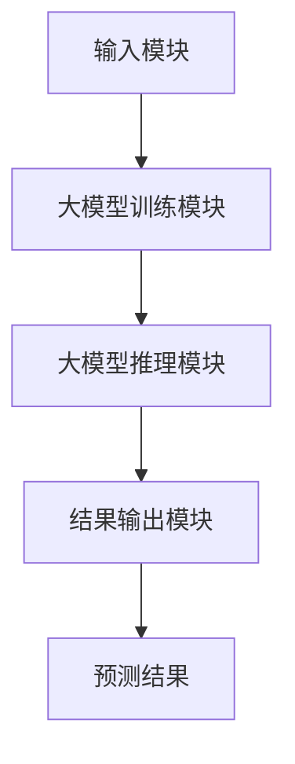
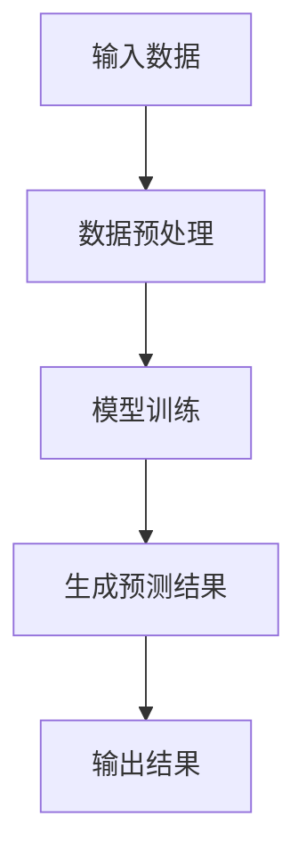
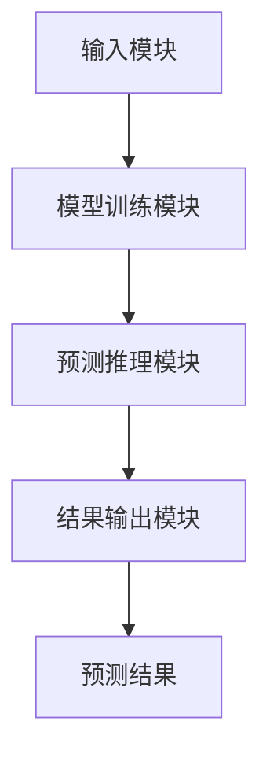
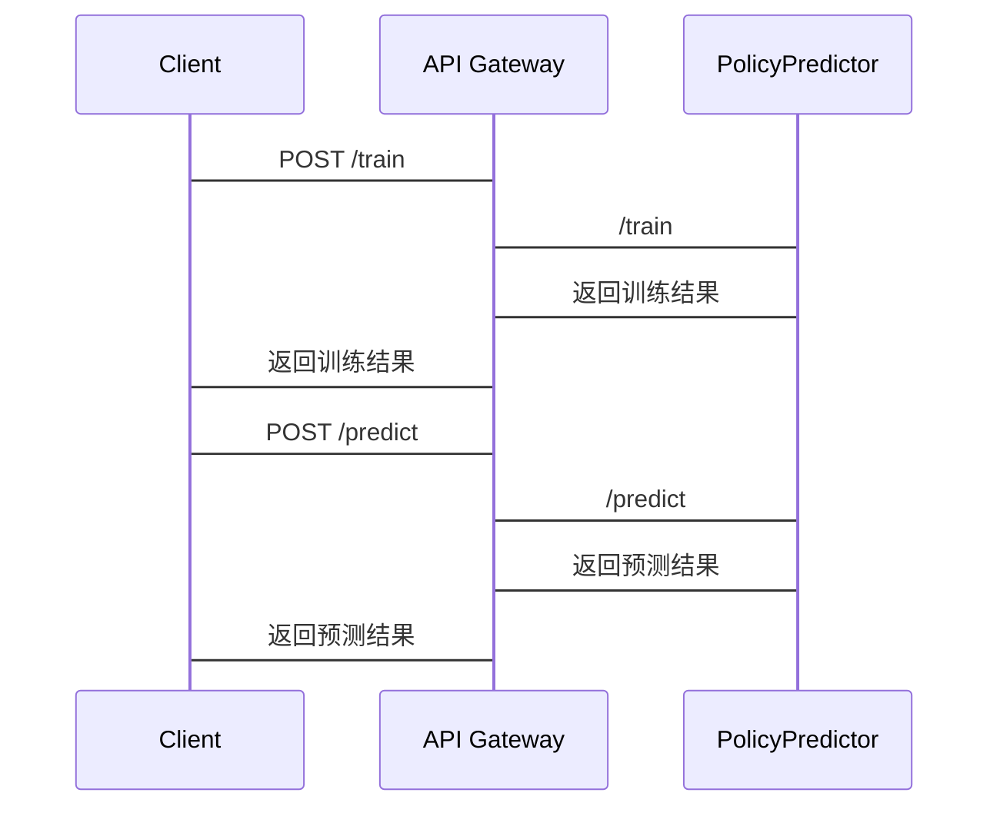

                 


# 开发基于大模型的金融政策执行效果预测器

---

## 关键词：  
大模型、金融政策、政策执行效果、预测器、算法原理、系统架构、项目实战

---

## 摘要：  
本文详细探讨了开发基于大模型的金融政策执行效果预测器的全过程。从问题背景与目标的分析，到大模型的基本原理与金融政策执行效果预测的核心概念，再到算法流程与数学模型的详细讲解，系统架构的设计与实现，以及项目实战的环境搭建、数据处理、模型训练、结果分析与优化，最后总结了预测器的优化与部署策略。文章结合理论与实践，为读者提供了一套完整的开发指南，帮助技术开发者和金融从业者更好地理解和应用大模型技术来预测金融政策的执行效果。

---

# 第1章: 引言

## 1.1 问题背景与目标  
### 1.1.1 金融政策执行效果预测的背景  
金融政策是政府调节经济运行的重要手段，其执行效果直接关系到经济发展、社会稳定和民生福祉。然而，金融政策的执行效果受到多种复杂因素的影响，例如政策本身的复杂性、市场参与者的反应、外部环境的变化等。传统的预测方法往往依赖于经验判断和统计分析，存在预测精度低、响应速度慢等问题。  

### 1.1.2 问题描述与目标  
金融政策执行效果的预测需要考虑多维度、多时间尺度的数据，传统的统计模型难以应对这种复杂性。而大模型（如Transformer、LSTM等）具有强大的非线性建模能力和对海量数据的处理能力，可以更好地捕捉金融数据中的复杂规律。因此，开发基于大模型的金融政策执行效果预测器，目标是提高预测的精度和效率，为政策制定者和市场参与者提供更可靠的参考。  

### 1.1.3 开发大模型预测器的意义  
通过大模型技术，可以实现对金融政策执行效果的实时预测，帮助政策制定者提前发现潜在问题，优化政策执行策略；同时，也可以为市场参与者提供更精准的市场预期，降低投资风险。  

---

## 1.2 金融政策执行效果预测的核心概念  
### 1.2.1 大模型的基本概念  
大模型（Large Model）是指在自然语言处理、机器学习等领域中，参数量巨大、模型结构复杂的深度学习模型。其核心优势在于能够通过大量的数据训练，捕获数据中的深层特征和规律。  

### 1.2.2 金融政策执行效果的定义  
金融政策执行效果是指政策在实际执行过程中对经济运行产生的实际影响，通常包括政策的实施效果、市场反应、社会影响等多个维度。  

### 1.2.3 预测器的核心要素与边界  
金融政策执行效果预测器的核心要素包括：  
1. **输入数据**：政策文本、经济指标、市场数据等。  
2. **模型训练**：基于历史数据训练大模型。  
3. **预测推理**：根据当前政策和市场环境，预测政策执行效果。  
4. **结果输出**：生成预测结果并提供可视化分析。  

预测器的边界包括：政策文本的解读、数据的实时性、模型的可解释性等。  

---

## 1.3 本书结构与学习方法  
### 1.3.1 书籍章节安排  
- 第1章：引言（已完成）  
- 第2章：大模型与金融政策执行效果预测基础  
- 第3章：金融政策执行效果预测的核心概念  
- 第4章：金融政策执行效果预测器的算法原理  
- 第5章：金融政策执行效果预测器的系统架构设计  
- 第6章：金融政策执行效果预测器的项目实战  
- 第7章：优化与部署  
- 第8章：总结与展望  

### 1.3.2 学习方法与注意事项  
- 建议读者先从引言和核心概念入手，理解大模型在金融预测中的作用。  
- 在学习算法原理时，结合数学公式和代码示例，逐步掌握模型的实现细节。  
- 系统架构设计部分，建议结合实际项目需求，进行针对性学习。  

---

# 第2章: 大模型与金融政策执行效果预测基础  

## 2.1 大模型的基本原理  
### 2.1.1 大模型的体系结构  
大模型的体系结构通常包括编码器和解码器两部分，编码器负责将输入数据转换为模型内部的表示，解码器负责根据内部表示生成输出结果。  

### 2.1.2 大模型的训练方法  
大模型通常采用监督学习的方法，通过优化损失函数来训练模型参数。  

### 2.1.3 大模型的推理机制  
大模型的推理机制基于训练得到的参数，通过输入数据生成预测结果。  

---

## 2.2 金融政策执行效果预测的基础知识  
### 2.2.1 金融政策的类型与特点  
金融政策包括货币政策、财政政策、金融监管政策等，每种政策都有其独特的实施方式和影响机制。  

### 2.2.2 政策执行效果的评估指标  
政策执行效果的评估指标包括GDP增长率、失业率、通货膨胀率等宏观经济指标。  

### 2.2.3 金融数据的特征与处理  
金融数据具有高维性、时序性、波动性等特点，需要通过特征提取、数据清洗等预处理步骤进行处理。  

---

## 2.3 大模型在金融预测中的应用现状  
### 2.3.1 大模型在金融领域的应用案例  
目前，大模型已经在金融市场的趋势预测、风险评估等领域得到了广泛应用。  

### 2.3.2 当前技术的优缺点  
大模型的优势在于其强大的非线性建模能力，但其计算成本高、模型解释性差等问题仍需进一步解决。  

### 2.3.3 未来发展趋势  
未来，大模型在金融预测中的应用将更加广泛，模型的可解释性和实时性也将进一步提升。  

---

# 第3章: 金融政策执行效果预测的核心概念  

## 3.1 预测器的核心概念  
### 3.1.1 预测器的定义与组成  
预测器由输入模块、模型训练模块、预测推理模块和结果输出模块组成。  

### 3.1.2 核心概念的属性特征对比  
| 核心概念 | 属性特征 |  
|----------|-----------|  
| 输入数据 | 多维性、时序性 |  
| 模型训练 | 高维优化、非线性建模 |  
| 预测推理 | 实时性、准确性 |  
| 结果输出 | 可视化、可解释性 |  

### 3.1.3 实体关系图（ER图）  
```mermaid
erDiagram
    policy_table
    {
        policy_id  : integer
        policy_name : string
        policy_content : string
        policy_effect : float
    }
    market_data
    {
        data_id  : integer
        data_type : string
        data_value : float
    }
    prediction_result
    {
        result_id : integer
        prediction_value : float
        timestamp : datetime
    }
    policy_table --> prediction_result
    market_data --> prediction_result
```

---

## 3.2 大模型与金融预测的关联  
### 3.2.1 大模型在金融预测中的角色  
大模型作为预测器的核心模块，负责对输入数据进行编码、解码和生成预测结果。  

### 3.2.2 预测器与大模型的交互关系  
预测器通过输入模块向大模型提供数据，大模型通过训练模块生成预测结果，并返回给预测器。  

### 3.2.3 核心概念的系统架构图  


---

# 第4章: 金融政策执行效果预测器的算法原理  

## 4.1 算法流程与原理  
### 4.1.1 数据预处理流程  
1. 数据清洗：去除噪声数据、填充缺失值。  
2. 特征提取：提取政策文本、经济指标等特征。  
3. 数据标准化：对数据进行归一化处理。  

### 4.1.2 模型训练过程  
1. 初始化模型参数。  
2. 训练模型，优化损失函数。  
3. 验证模型效果，调整参数。  

### 4.1.3 预测推理机制  
1. 输入新的政策数据。  
2. 通过大模型生成预测结果。  
3. 输出预测结果并可视化。  

---

## 4.2 算法的数学模型与公式  
### 4.2.1 损失函数与优化目标  
损失函数定义为：  
$$ L = \frac{1}{N}\sum_{i=1}^{N} (y_i - \hat{y}_i)^2 $$  
其中，$y_i$ 是真实值，$\hat{y}_i$ 是预测值，$N$ 是样本数量。  

优化目标是通过梯度下降方法最小化损失函数：  
$$ \theta_{t+1} = \theta_t - \eta \frac{\partial L}{\partial \theta_t} $$  
其中，$\theta_t$ 是参数，$\eta$ 是学习率。  

---

## 4.3 代码实现与流程图  
### 4.3.1 代码实现  
```python
import torch
import torch.nn as nn

# 定义大模型
class PolicyPredictor(nn.Module):
    def __init__(self, input_dim, hidden_dim, output_dim):
        super(PolicyPredictor, self).__init__()
        self.encoder = nn.LSTM(input_dim, hidden_dim, batch_first=True)
        self.decoder = nn.Linear(hidden_dim, output_dim)
        
    def forward(self, x):
        out, _ = self.encoder(x)
        out = self.decoder(out[:, -1, :])
        return out

# 训练过程
model = PolicyPredictor(input_dim=10, hidden_dim=50, output_dim=1)
criterion = nn.MSELoss()
optimizer = torch.optim.Adam(model.parameters(), lr=0.001)

for epoch in range(num_epochs):
    for batch in batches:
        inputs, labels = batch
        outputs = model(inputs)
        loss = criterion(outputs, labels)
        optimizer.zero_grad()
        loss.backward()
        optimizer.step()
```

### 4.3.2 算法流程图  


---

# 第5章: 金融政策执行效果预测器的系统架构设计  

## 5.1 系统功能设计  
### 5.1.1 系统功能模块  
1. **输入模块**：接收政策文本和经济指标。  
2. **模型训练模块**：对大模型进行训练。  
3. **预测推理模块**：生成预测结果。  
4. **结果输出模块**：输出预测结果并可视化。  

### 5.1.2 系统功能流程图  


---

## 5.2 系统架构设计  
### 5.2.1 系统架构图  


---

## 5.3 系统接口设计  
### 5.3.1 API接口  
1. **训练接口**：`POST /train`  
2. **预测接口**：`POST /predict`  
3. **结果查询接口**：`GET /results`  

---

## 5.4 系统交互流程图  


---

# 第6章: 金融政策执行效果预测器的项目实战  

## 6.1 环境搭建  
### 6.1.1 安装依赖  
```bash
pip install torch numpy pandas matplotlib
```

---

## 6.2 系统核心实现源代码  
### 6.2.1 数据预处理代码  
```python
import pandas as pd
import numpy as np

def preprocess_data(data_path):
    data = pd.read_csv(data_path)
    data.dropna(inplace=True)
    data = data.drop_duplicates()
    return data
```

---

## 6.3 代码应用解读与分析  
### 6.3.1 训练代码  
```python
import torch
import torch.nn as nn
import torch.optim as optim

class PolicyPredictor(nn.Module):
    def __init__(self, input_dim, hidden_dim, output_dim):
        super(PolicyPredictor, self).__init__()
        self.encoder = nn.LSTM(input_dim, hidden_dim, batch_first=True)
        self.decoder = nn.Linear(hidden_dim, output_dim)
        
    def forward(self, x):
        out, _ = self.encoder(x)
        out = self.decoder(out[:, -1, :])
        return out

def train_model(model, criterion, optimizer, train_loader, num_epochs=100):
    for epoch in range(num_epochs):
        for inputs, labels in train_loader:
            outputs = model(inputs)
            loss = criterion(outputs, labels)
            optimizer.zero_grad()
            loss.backward()
            optimizer.step()
```

---

## 6.4 实际案例分析  
### 6.4.1 案例背景  
假设我们需要预测某项货币政策的执行效果，输入数据包括政策文本、GDP增长率、失业率等指标。  

### 6.4.2 模型训练与预测  
训练模型后，输入新的政策数据，生成预测结果并进行可视化分析。  

---

## 6.5 项目小结  
通过本章的实战，读者可以掌握从环境搭建到模型训练的全过程，理解如何将理论应用于实际项目中。  

---

# 第7章: 优化与部署  

## 7.1 模型优化策略  
### 7.1.1 模型剪枝  
通过剪枝技术减少模型参数数量，降低计算成本。  

### 7.1.2 模型蒸馏  
通过知识蒸馏技术将大模型的知识迁移到小模型中，提升小模型的性能。  

---

## 7.2 模型的性能评估与优化  
### 7.2.1 性能评估指标  
包括准确率、召回率、F1分数等。  

### 7.2.2 模型优化策略  
通过调整学习率、批量大小、模型结构等参数，优化模型性能。  

---

## 7.3 系统部署与扩展  
### 7.3.1 系统部署方案  
将模型部署到云服务器上，通过API接口提供预测服务。  

### 7.3.2 系统扩展方案  
通过分布式训练和模型并行技术，提升系统的计算能力。  

---

# 第8章: 总结与展望  

## 8.1 总结  
本文详细介绍了开发基于大模型的金融政策执行效果预测器的全过程，从理论到实践，为读者提供了全面的指导。  

## 8.2 未来展望  
随着大模型技术的不断发展，金融政策执行效果预测器的应用场景将更加广泛，预测的精度和效率也将进一步提升。未来，还需要在模型的可解释性、实时性等方面进行进一步研究和优化。  

---

# 作者：AI天才研究院/AI Genius Institute & 禅与计算机程序设计艺术 /Zen And The Art of Computer Programming

