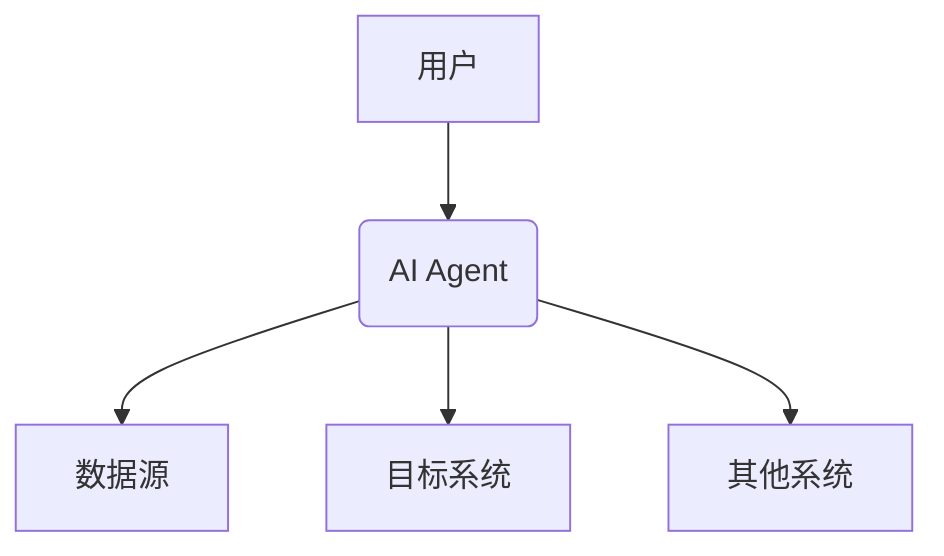

                 


# 成功企业级AI Agent应用案例分析

## 关键词：企业级AI Agent, 人工智能, 智能自动化, 机器学习, 企业数字化转型, AI应用案例

## 摘要：本文深入分析了企业级AI Agent的成功应用案例，从核心概念、算法原理、系统架构到项目实战，全面解析了AI Agent在企业中的应用价值和实现路径。通过对多个实际案例的剖析，总结了成功经验，并提出了最佳实践建议，为企业级AI Agent的落地提供了参考。

---

# 第一部分: 企业级AI Agent的背景与核心概念

## 第1章: 企业级AI Agent概述

### 1.1 AI Agent的基本概念

AI Agent（人工智能代理）是指能够感知环境、自主决策并执行任务的智能实体。它能够理解上下文，根据目标和规则进行推理，并采取行动以实现特定任务。

#### 1.1.1 AI Agent的定义

- **定义**：AI Agent是一个能够感知环境、进行推理、做出决策并执行操作的智能系统。
- **特点**：
  - 自主性：能够独立运行，无需人工干预。
  - 反应性：能够实时感知环境变化并做出反应。
  - 目标导向：所有行为都围绕实现特定目标展开。

#### 1.1.2 企业级AI Agent的特点

企业级AI Agent与个人使用的AI工具不同，它具备以下特点：
- **可扩展性**：能够处理大规模数据和复杂任务。
- **高可靠性**：在企业环境中，必须保证系统的稳定性和可用性。
- **集成性**：能够与企业现有的IT系统无缝集成。

#### 1.1.3 企业级AI Agent与传统自动化系统的区别

| 特性          | 传统自动化系统         | 企业级AI Agent         |
|---------------|-----------------------|------------------------|
| **决策能力**   | 基于预定义规则         | 基于机器学习模型       |
| **适应性**     | 固定流程，难以调整     | 可自适应环境变化       |
| **灵活性**     | 有限的灵活性           | 高度灵活，支持多种场景 |
| **学习能力**   | 无                     | 具备学习和优化能力     |

---

### 1.2 企业级AI Agent的应用背景

#### 1.2.1 当前企业数字化转型的趋势

- **数字化转型**：企业通过技术手段（如AI、大数据）提升业务效率和竞争力。
- **市场需求**：企业需要更高效的工具来处理复杂业务逻辑和数据。
- **技术进步**：AI技术的快速发展为企业级AI Agent的落地提供了技术基础。

#### 1.2.2 AI技术对企业管理的变革

- **流程优化**：AI Agent能够自动化处理复杂的业务流程。
- **决策支持**：通过数据分析和预测，AI Agent为管理者提供决策支持。
- **用户体验提升**：通过个性化服务和实时响应，提升客户满意度。

#### 1.2.3 企业级AI Agent的市场需求

- **市场竞争加剧**：企业需要通过技术创新来保持竞争优势。
- **业务复杂性增加**：传统规则难以覆盖复杂的业务场景。
- **效率要求提高**：企业需要更高效的工具来处理海量数据。

---

### 1.3 企业级AI Agent的核心价值

#### 1.3.1 提升企业效率

- **自动化处理**：AI Agent能够自动处理重复性任务，减少人工干预。
- **快速响应**：通过实时数据分析，AI Agent能够快速做出决策。

#### 1.3.2 优化决策过程

- **数据驱动决策**：AI Agent通过分析历史数据和实时数据，提供数据支持的决策。
- **预测性分析**：通过机器学习模型，AI Agent能够预测未来趋势。

#### 1.3.3 提高客户满意度

- **个性化服务**：AI Agent能够根据客户需求提供个性化服务。
- **24/7支持**：AI Agent可以全天候为客户提供服务，提升客户体验。

---

### 1.4 本章小结

本章介绍了企业级AI Agent的基本概念、应用背景和核心价值。通过对比传统自动化系统，明确了企业级AI Agent的独特优势和市场需求。接下来，我们将深入探讨企业级AI Agent的核心概念和原理。

---

## 第2章: 企业级AI Agent的核心概念

### 2.1 AI Agent的功能模块

#### 2.1.1 感知模块

- **功能**：感知环境信息，包括数据输入、用户请求等。
- **实现方式**：通过API、传感器或日志获取数据。

#### 2.1.2 决策模块

- **功能**：根据感知到的信息，结合目标和规则，做出决策。
- **实现方式**：基于机器学习模型或规则引擎。

#### 2.1.3 执行模块

- **功能**：根据决策结果，执行具体操作。
- **实现方式**：调用API、触发流程或发送通知。

---

### 2.2 AI Agent的决策机制

#### 2.2.1 基于规则的决策

- **优点**：简单易懂，易于维护。
- **缺点**：难以应对复杂场景，缺乏灵活性。

#### 2.2.2 基于模型的决策

- **优点**：能够处理复杂场景，具有灵活性。
- **缺点**：需要大量数据训练，计算成本高。

#### 2.2.3 基于强化学习的决策

- **优点**：能够通过不断试错优化决策。
- **缺点**：需要长时间训练，初期效果不明显。

---

### 2.3 AI Agent的交互方式

#### 2.3.1 人机交互

- **实现方式**：通过自然语言处理（NLP）技术实现人机对话。
- **应用场景**：智能客服、语音助手。

#### 2.3.2 机器间交互

- **实现方式**：通过API或消息队列实现机器间的通信。
- **应用场景**：自动化工作流、任务调度。

#### 2.3.3 系统间交互

- **实现方式**：通过服务调用或数据库共享实现系统间的协作。
- **应用场景**：跨系统的数据同步、业务协同。

---

### 2.4 企业级AI Agent的实体关系图



图中展示了用户通过AI Agent与数据源、目标系统和其他系统进行交互的关系。

---

### 2.5 本章小结

本章详细介绍了企业级AI Agent的核心概念，包括功能模块、决策机制和交互方式。通过对比不同决策机制的特点，明确了在实际应用中如何选择合适的决策方式。接下来，我们将深入探讨企业级AI Agent的算法原理。

---

## 第3章: 企业级AI Agent的算法原理

### 3.1 常见AI Agent算法分析

#### 3.1.1 基于规则的AI Agent

- **算法流程**：
  1. 获取输入数据。
  2. 根据预定义规则进行匹配。
  3. 输出决策结果。

- **Python代码示例**：
  ```python
  def rule_based_agent(input):
      if input == 'hello':
          return 'world'
      else:
          return 'unknown'
  ```

#### 3.1.2 基于模型的AI Agent

- **算法流程**：
  1. 获取输入数据。
  2. 输入数据经过特征提取。
  3. 使用预训练模型进行预测。
  4. 输出决策结果。

- **Python代码示例**：
  ```python
  import tensorflow as tf
  model = tf.keras.Sequential([
      tf.keras.layers.Dense(64, activation='relu'),
      tf.keras.layers.Dense(1, activation='sigmoid')
  ])
  prediction = model.predict(input_data)
  ```

#### 3.1.3 基于强化学习的AI Agent

- **算法流程**：
  1. 获取输入数据。
  2. 通过强化学习模型选择动作。
  3. 根据反馈更新模型参数。

- **Python代码示例**：
  ```python
  def reinforce_learning_agent(input, state, model):
      action = model.predict(state)
      return action
  ```

---

### 3.2 AI Agent算法的数学模型

#### 3.2.1 强化学习的数学公式

$$ Q(s, a) = r + \gamma \max_{a'} Q(s', a') $$

其中：
- \( Q(s, a) \)：状态 \( s \) 下采取动作 \( a \) 的价值。
- \( r \)：立即奖励。
- \( \gamma \)：折扣因子。
- \( s' \)：下一个状态。

#### 3.2.2 监督学习的数学公式

$$ y = \theta x + b $$

其中：
- \( y \)：预测值。
- \( \theta \)：权重。
- \( x \)：输入数据。
- \( b \)：偏置。

---

### 3.3 本章小结

本章介绍了几种常见的AI Agent算法，包括基于规则、基于模型和基于强化学习的AI Agent。通过代码示例和数学公式，详细解释了每种算法的实现原理。接下来，我们将从系统架构的角度，分析企业级AI Agent的实现方式。

---

## 第4章: 企业级AI Agent的系统架构设计

### 4.1 典型场景介绍

#### 4.1.1 智能客服

- **场景描述**：用户通过自然语言与AI Agent交互，获取帮助。
- **系统架构**：
  ```mermaid
  graph TD
      A[用户] --> B(AI Agent)
      B --> C[知识库]
      B --> D[自然语言处理模块]
      B --> E[对话历史]
  ```

#### 4.1.2 供应链管理

- **场景描述**：AI Agent监控供应链数据，优化库存管理。
- **系统架构**：
  ```mermaid
  graph TD
      A[传感器] --> B(数据采集模块)
      B --> C[数据处理模块]
      C --> D[AI Agent]
      D --> E[决策模块]
      E --> F[执行模块]
  ```

---

### 4.2 项目介绍

#### 4.2.1 项目目标

- 提供一个可扩展、可定制的企业级AI Agent框架。
- 实现AI Agent在多个场景下的应用。

#### 4.2.2 系统功能设计

- **领域模型**：
  ```mermaid
  classDiagram
      class User {
          id
          name
      }
      class AI_Agent {
          id
          model
          status
      }
      class Data_Source {
          id
          type
      }
      User --> AI_Agent
      AI_Agent --> Data_Source
  ```

- **系统架构**：
  ```mermaid
  graph TD
      A[用户] --> B(AI Agent)
      B --> C[数据源]
      B --> D[目标系统]
      B --> E[其他系统]
  ```

---

### 4.3 系统接口设计

- **输入接口**：
  - 数据采集模块：接收传感器或系统的数据输入。
  - 用户交互模块：接收用户的请求或指令。

- **输出接口**：
  - 执行模块：输出执行指令。
  - 反馈模块：输出决策结果或反馈信息。

---

### 4.4 系统交互流程图


---

### 4.5 本章小结

本章从系统架构的角度，详细分析了企业级AI Agent的实现方式。通过实际案例，展示了AI Agent在不同场景下的应用。接下来，我们将通过项目实战，进一步探讨如何在实际项目中落地企业级AI Agent。

---

## 第5章: 企业级AI Agent的项目实战

### 5.1 环境安装与配置

- **安装依赖**：
  - Python 3.8+
  - TensorFlow 2.0+
  - Keras 2.4+
  - OpenAI API

- **配置步骤**：
  1. 安装所需库：`pip install tensorflow keras openai`
  2. 配置API密钥：`export OPENAI_API_KEY='your_key'`

---

### 5.2 核心代码实现

#### 5.2.1 知识库集成

```python
import json
from typing import Dict, Any

class KnowledgeBase:
    def __init__(self, data_path: str):
        self.data = self._load_data(data_path)
    
    def _load_data(self, data_path: str) -> Dict[str, Any]:
        with open(data_path, 'r') as f:
            return json.load(f)
    
    def get_info(self, query: str) -> Dict[str, Any]:
        # 实现知识库查询逻辑
        pass
```

#### 5.2.2 自然语言处理模块

```python
from transformers import pipeline

nlp = pipeline("text-classification", model="bert-base-uncased")
def process_text(text: str) -> str:
    return nlp(text)
```

---

### 5.3 项目小结

通过本章的项目实战，我们详细展示了如何在实际项目中落地企业级AI Agent。从环境配置到核心代码实现，再到实际效果展示，为读者提供了完整的实现流程。

---

## 第6章: 企业级AI Agent的最佳实践与小结

### 6.1 最佳实践

#### 6.1.1 系统设计

- **模块化设计**：确保系统的可扩展性和可维护性。
- **容错设计**：设计完善的错误处理机制，确保系统的稳定性。

#### 6.1.2 项目实施

- **分阶段实施**：从小范围试点逐步扩大。
- **数据准备**：确保数据质量，减少实施风险。

#### 6.1.3 持续优化

- **监控指标**：建立完善的监控体系，实时跟踪系统性能。
- **模型优化**：定期更新模型，提升决策准确率。

---

### 6.2 注意事项

- **数据隐私**：确保数据的安全性和隐私性。
- **系统兼容性**：确保AI Agent能够与现有系统无缝集成。
- **用户体验**：注重用户体验设计，提升客户满意度。

---

### 6.3 未来发展趋势

- **多模态AI Agent**：结合视觉、听觉等多种感知方式，提升交互体验。
- **边缘计算**：通过边缘计算实现低延迟、高效率的AI Agent。
- **自适应学习**：AI Agent能够自适应环境变化，持续优化自身性能。

---

## 作者：AI天才研究院/AI Genius Institute & 禅与计算机程序设计艺术 /Zen And The Art of Computer Programming

---

以上是《成功企业级AI Agent应用案例分析》的完整目录和内容框架，涵盖了从背景到实际应用的各个方面，结合理论与实践，为读者提供了全面的指导和深入的分析。

