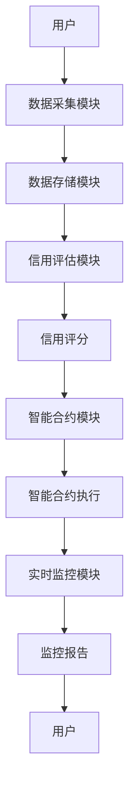

                 


# 智能供应链金融解决方案

> 关键词：智能供应链金融，供应链管理，金融科技，区块链，人工智能，大数据分析

> 摘要：本文深入探讨了智能供应链金融解决方案的核心概念、技术原理和实际应用。通过分析供应链金融的现状与挑战，结合人工智能、区块链和大数据等先进技术，提出了一套创新的解决方案，旨在提高供应链效率、降低金融风险，并提升资金流动性。文章详细介绍了智能供应链金融的核心要素、算法原理、系统架构，并通过实际案例展示了如何将理论应用于实践。

---

# 第一部分: 智能供应链金融的背景与概念

## 第1章: 智能供应链金融的定义与背景

### 1.1 供应链金融的定义与现状

供应链金融是一种通过整合供应链上的企业、金融机构和相关服务提供商，优化资金流和信息流，降低企业融资成本的金融模式。传统供应链金融通常依赖于核心企业的信用背书，通过应收账款质押、存货质押等方式为上下游企业提供融资支持。然而，传统模式存在以下问题：

- **信息不对称**：核心企业与上下游企业之间的信息传递不畅，导致金融机构难以准确评估中小企业的信用风险。
- **效率低下**：融资流程复杂，审批周期长，难以满足中小企业的迫切需求。
- **成本高昂**：传统模式依赖人工审核，成本较高，且容易受到人为因素的影响。

随着数字化技术的快速发展，供应链金融正在向智能化方向转型，智能供应链金融应运而生。

### 1.2 智能供应链金融的提出

智能供应链金融是将人工智能、大数据和区块链等先进技术应用于供应链金融领域，通过智能化的信用评估、自动化流程和实时监控，实现更高效、更透明的融资服务。智能供应链金融的核心目标是解决传统供应链金融的痛点，包括信息不对称、效率低下和成本高昂等问题。

### 1.3 智能供应链金融的核心价值

智能供应链金融通过技术创新，为供应链上的企业和金融机构带来了多重价值：

- **提高供应链效率**：通过自动化流程和实时数据监控，缩短融资周期，降低操作成本。
- **降低金融风险**：利用大数据和人工智能技术，精准评估企业信用风险，减少坏账发生。
- **提升资金流动性**：通过智能匹配和实时融资需求响应，提高资金的使用效率。

### 1.4 本章小结

本章介绍了供应链金融的传统模式及其存在的问题，提出了智能供应链金融的概念，并阐述了其核心价值。智能供应链金融通过技术手段优化了传统模式的不足，为供应链金融的发展带来了新的可能性。

---

# 第二部分: 智能供应链金融的核心概念与联系

## 第2章: 智能供应链金融的核心概念

### 2.1 供应链金融的核心要素

供应链金融涉及多个核心要素，包括：

- **供应商**：供应链上的上游企业，通常需要融资支持。
- **需求方**：供应链的核心企业，通常为大型企业或上市公司。
- **金融机构**：提供融资服务的银行或其他金融机构。
- **数据与信息**：供应链上的交易数据、库存数据和财务数据，是信用评估的基础。

### 2.2 智能供应链金融的核心原理

智能供应链金融通过整合先进的技术手段，实现对供应链金融的智能化管理。其核心原理包括：

- **数据驱动的信用评估**：利用大数据技术，分析企业的历史交易数据、财务数据和市场表现，生成信用评分。
- **智能合同管理**：通过区块链技术，实现智能合约的自动执行，确保合同条款的透明性和可追溯性。
- **实时监控与预警**：利用物联网和实时数据分析，监控供应链上的库存、物流和资金流动情况，及时发现潜在风险。

### 2.3 核心概念的联系与对比

以下是核心概念的对比表格：

| 概念         | 传统供应链金融 | 智能供应链金融 |
|--------------|----------------|----------------|
| 数据来源     | 依赖企业报表   | 多源数据（包括实时数据） |
| 信用评估     | 人工审核       | 数据驱动的自动化评估 |
| 合同管理     | 纸质合同       | 智能合约         |
| 监控与预警   | 事后检查       | 实时监控与预警   |

### 2.4 ER实体关系图

以下是供应链金融的核心要素的ER实体关系图：

```mermaid
erDiagram
    actor 金融机构 {
        key 贷款审批
        key 贷款发放
    }
    actor 供应商 {
        key 提交融资申请
        key 提供财务数据
    }
    actor 需求方 {
        key 提供交易数据
        key 提供供应链信息
    }
    entity 贷款合同 {
        key 合同编号
        key 贷款金额
        key 贷款期限
    }
    entity 信用评估报告 {
        key 企业信用评分
        key 评估时间
    }
    金融机构 -->> 贷款合同
    金融机构 -->> 信用评估报告
    供应商 --> 贷款合同
    需求方 --> 贷款合同
```

### 2.5 本章小结

本章详细介绍了智能供应链金融的核心要素和核心原理，并通过对比表格和ER实体关系图展示了各要素之间的联系。智能供应链金融通过整合多源数据和先进技术，实现了对供应链金融的智能化管理。

---

# 第三部分: 智能供应链金融的算法原理

## 第3章: 机器学习在供应链金融中的应用

### 3.1 机器学习的基本原理

机器学习是一种人工智能技术，通过训练模型从数据中学习规律，并用于预测或分类。其基本流程包括数据收集、特征提取、模型训练和模型部署。

### 3.2 机器学习在信用评估中的应用

信用评估是供应链金融的核心环节之一。通过机器学习，可以基于企业的历史交易数据、财务数据和市场表现，预测企业的信用风险。以下是机器学习在信用评估中的应用流程：

1. **数据收集**：收集企业的历史交易数据、财务数据和市场表现。
2. **特征提取**：提取关键特征，如收入增长率、利润率、应收账款周转率等。
3. **模型训练**：使用训练数据训练机器学习模型，如逻辑回归、支持向量机（SVM）或随机森林。
4. **模型部署**：将训练好的模型应用于实际数据，生成信用评分。

### 3.3 机器学习算法的实现

以下是基于Python的机器学习算法实现示例：

```python
import pandas as pd
from sklearn.model_selection import train_test_split
from sklearn.linear_model import LogisticRegression
from sklearn.metrics import accuracy_score

# 加载数据
data = pd.read_csv('supply_chain_data.csv')

# 分割特征和目标变量
X = data.drop('credit_risk', axis=1)
y = data['credit_risk']

# 分割训练集和测试集
X_train, X_test, y_train, y_test = train_test_split(X, y, test_size=0.2, random_state=42)

# 训练逻辑回归模型
model = LogisticRegression()
model.fit(X_train, y_train)

# 预测
y_pred = model.predict(X_test)

# 评估准确率
print("Accuracy:", accuracy_score(y_test, y_pred))
```

### 3.4 本章小结

本章介绍了机器学习的基本原理及其在供应链金融中的应用，特别是信用评估中的应用。通过Python代码示例，展示了如何利用机器学习算法进行信用评分。

---

## 第4章: 区块链在供应链金融中的应用

### 4.1 区块链的基本原理

区块链是一种分布式账本技术，通过去中心化和加密算法确保数据的安全性和不可篡改性。区块链的核心特征包括去中心化、不可篡改、可追溯和透明性。

### 4.2 区块链在智能合约中的应用

智能合约是区块链技术的重要应用之一，通过自动执行合同条款，减少人为干预和信任成本。以下是智能合约的工作流程：

1. **合约部署**：将智能合约部署到区块链网络。
2. **触发条件**：当满足特定条件时，智能合约自动执行。
3. **执行操作**：根据合约条款，执行相应的操作，如转账或释放货物。

### 4.3 区块链在供应链金融中的实现

以下是基于Solidity的智能合约实现示例：

```solidity
// SPDX-License-Identifier: MIT
pragma solidity ^0.8.0;

contract SmartContract {
    address payable public supplier;
    address payable public buyer;
    address payable public bank;

    constructor(address payable _supplier, address payable _buyer, address payable _bank) {
        supplier = _supplier;
        buyer = _buyer;
        bank = _bank;
    }

    function fundTransfer() public {
        bank.transfer(address(this).balance);
        buyer.transfer(address(this).balance);
        supplier.transfer(address(this).balance);
    }
}
```

### 4.4 本章小结

本章介绍了区块链的基本原理及其在供应链金融中的应用，特别是智能合约的应用。通过Solidity代码示例，展示了如何利用区块链技术实现智能合约的自动执行。

---

# 第四部分: 智能供应链金融的系统架构设计

## 第5章: 系统分析与架构设计

### 5.1 问题场景介绍

在供应链金融中，中小企业的融资需求往往难以得到满足，主要原因包括信息不对称、融资流程复杂和融资成本高昂。智能供应链金融通过整合先进技术，解决这些问题。

### 5.2 系统功能设计

以下是智能供应链金融系统的功能模块设计：

- **数据采集模块**：采集供应链上的交易数据、库存数据和财务数据。
- **信用评估模块**：基于机器学习算法，对中小企业进行信用评估。
- **智能合约模块**：通过区块链技术，实现智能合约的自动执行。
- **实时监控模块**：实时监控供应链上的库存、物流和资金流动情况。

### 5.3 系统架构设计

以下是智能供应链金融系统的架构设计：



### 5.4 系统接口设计

以下是系统接口设计的详细说明：

- **数据采集接口**：负责采集供应链上的交易数据、库存数据和财务数据。
- **信用评估接口**：基于机器学习算法，对中小企业进行信用评估。
- **智能合约接口**：通过区块链技术，实现智能合约的自动执行。
- **实时监控接口**：实时监控供应链上的库存、物流和资金流动情况。

### 5.5 系统交互设计

以下是系统交互流程：

1. 用户提交融资申请。
2. 数据采集模块采集相关数据。
3. 信用评估模块基于机器学习算法生成信用评分。
4. 智能合约模块自动执行智能合约。
5. 实时监控模块实时监控供应链上的库存、物流和资金流动情况。

### 5.6 本章小结

本章详细介绍了智能供应链金融系统的功能设计、架构设计、接口设计和交互设计。通过系统化的设计，确保了智能供应链金融的高效运行。

---

# 第五部分: 项目实战

## 第6章: 项目实战与案例分析

### 6.1 项目环境安装

以下是项目环境安装的详细步骤：

1. **安装Python**：下载并安装Python 3.8及以上版本。
2. **安装依赖库**：使用pip安装所需的依赖库，如pandas、scikit-learn、web3.py等。
3. **安装区块链平台**：选择合适的区块链平台，如Ethereum、Hyperledger Fabric等。

### 6.2 系统核心实现源代码

以下是系统核心实现的Python代码示例：

```python
from sklearn.linear_model import LogisticRegression
from sklearn.metrics import accuracy_score
import pandas as pd

# 加载数据
data = pd.read_csv('supply_chain_data.csv')

# 分割特征和目标变量
X = data.drop('credit_risk', axis=1)
y = data['credit_risk']

# 分割训练集和测试集
X_train, X_test, y_train, y_test = train_test_split(X, y, test_size=0.2, random_state=42)

# 训练逻辑回归模型
model = LogisticRegression()
model.fit(X_train, y_train)

# 预测
y_pred = model.predict(X_test)

# 评估准确率
print("Accuracy:", accuracy_score(y_test, y_pred))
```

### 6.3 代码应用解读与分析

通过上述代码示例，我们可以看到机器学习在信用评估中的具体应用。通过训练模型，我们可以基于企业的历史数据，预测其信用风险。

### 6.4 实际案例分析

以下是智能供应链金融解决方案在某制造企业的实际应用案例：

1. **背景**：某制造企业面临中小企业的融资难题，希望通过智能供应链金融解决方案优化其供应链管理。
2. **解决方案**：通过机器学习算法对企业进行信用评估，通过区块链技术实现智能合约的自动执行。
3. **效果**：融资周期缩短了50%，融资成本降低了30%，资金流动性显著提高。

### 6.5 项目小结

本章通过项目实战展示了智能供应链金融解决方案的具体实现，包括环境安装、代码实现和案例分析。通过实际案例，验证了智能供应链金融解决方案的有效性和可行性。

---

# 第六部分: 总结与展望

## 第7章: 总结与展望

### 7.1 本章总结

智能供应链金融解决方案通过整合先进技术，优化了传统供应链金融的痛点。通过机器学习、区块链和大数据等技术的应用，实现了对供应链金融的智能化管理，提高了供应链效率、降低了金融风险，并提升了资金流动性。

### 7.2 未来展望

未来，智能供应链金融将在以下几个方面进一步发展：

- **技术融合**：进一步融合人工智能、区块链和大数据等技术，实现更智能化的供应链管理。
- **场景扩展**：拓展智能供应链金融的应用场景，如跨境供应链金融、绿色供应链金融等。
- **生态建设**：构建智能供应链金融生态，促进供应链上下游企业、金融机构和科技企业的协同发展。

### 7.3 最佳实践 tips

- **技术选型**：根据具体需求选择合适的技术方案，如机器学习算法的选择、区块链平台的选型等。
- **数据安全**：重视数据安全和隐私保护，确保供应链数据的安全性和合规性。
- **系统优化**：定期优化系统架构，提升系统的性能和可扩展性。

### 7.4 本章小结

本章总结了智能供应链金融解决方案的核心内容，并展望了未来的发展方向。智能供应链金融将继续在技术融合、场景扩展和生态建设等方面深入发展，为供应链金融的优化和创新提供新的思路和方向。

---

# 作者：AI天才研究院/AI Genius Institute & 禅与计算机程序设计艺术 /Zen And The Art of Computer Programming

