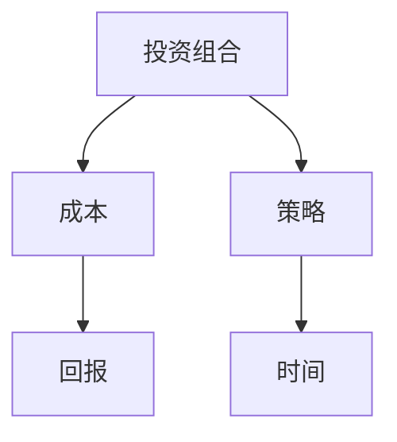
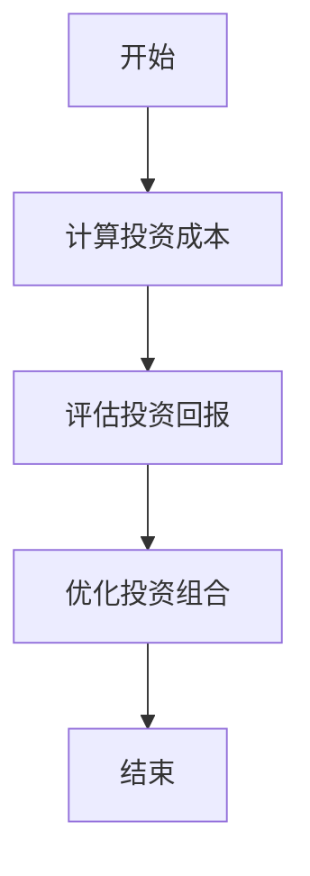
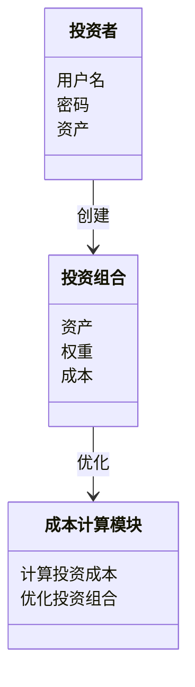
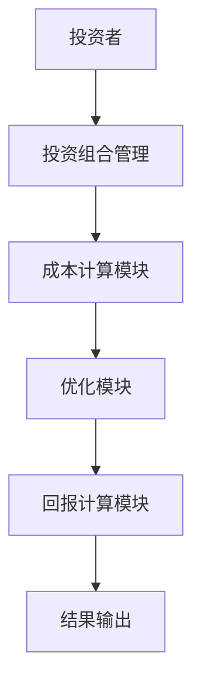

                 


# 《约翰·伯格的成本敏感型投资：长期累积的力量》

---

## 关键词：成本敏感型投资，约翰·伯格，投资策略，长期累积，投资回报，投资成本，优化算法

---

## 摘要：  
本文深入探讨了约翰·伯格的成本敏感型投资策略，从背景、核心概念、算法原理、系统架构到项目实战，全面解析了成本敏感型投资的理论与实践。通过详细分析投资成本对回报的影响，结合优化算法和系统设计，展示了如何通过长期累积的力量实现投资目标。文章最后总结了最佳实践和注意事项，为投资者提供了实用的指导。

---

## 第1章: 成本敏感型投资的背景与问题背景

### 1.1 问题背景介绍

#### 1.1.1 投资市场的基本概念

投资市场是通过购买资产（如股票、债券、房地产等）以期望在未来获得超过初始投入的回报。投资市场的核心在于通过合理配置资产和优化投资策略，最大化投资回报并最小化风险。

#### 1.1.2 成本在投资中的重要性

在投资过程中，成本是影响回报的关键因素之一。成本包括交易费用、管理费、托管费等，这些费用会直接从投资收益中扣除。长期来看，成本的高低会显著影响投资组合的最终回报。

#### 1.1.3 成本敏感型投资的定义与特点

成本敏感型投资是一种以成本为核心考量的投资策略。该策略强调在投资决策中充分考虑各项成本，并通过优化投资组合以降低总成本，从而提高长期回报。其特点是注重长期累积效应，通过持续优化降低成本。

### 1.2 问题描述与问题解决

#### 1.2.1 投资中的主要成本类型

投资成本主要包括以下几种类型：

1. **交易成本**：包括买入和卖出资产时的佣金、税费等。
2. **管理费用**：支付给基金经理或管理团队的费用。
3. **托管费用**：将资产委托给托管机构所支付的费用。
4. **机会成本**：由于选择某项投资而放弃其他投资的机会所造成的潜在收益损失。

#### 1.2.2 成本对投资回报的影响

投资成本的高低直接影响投资回报。较高的成本会侵蚀投资收益，尤其是在长期投资中，成本的累积效应会显著影响最终的回报水平。例如，如果两个投资组合的年回报率相同，但一个的总成本高于另一个，长期累积后，回报差异会越来越大。

#### 1.2.3 成本敏感型投资的目标与策略

成本敏感型投资的目标是在控制成本的前提下，最大化投资回报。其主要策略包括：

1. **选择低成本投资工具**：如指数基金、ETF等，这些工具的管理费用较低。
2. **减少交易频率**：频繁的交易会增加交易成本，因此应尽量减少不必要的交易。
3. **长期持有**：长期持有可以摊薄成本，降低整体投资成本。

### 1.3 问题的边界与外延

#### 1.3.1 成本敏感型投资的适用范围

成本敏感型投资适用于所有类型的投资，尤其是长期投资。对于那些追求长期稳健回报的投资者来说，成本敏感型投资尤为重要。

#### 1.3.2 投资成本的边界条件

1. **投资期限**：长期投资更能体现成本敏感型投资的优势。
2. **市场环境**：在市场波动较大的情况下，成本敏感型投资需要更加谨慎地选择投资工具和策略。
3. **投资者风险承受能力**：不同的风险承受能力会影响投资策略的选择，进而影响成本的敏感性。

#### 1.3.3 成本敏感型投资与其他投资策略的区别

成本敏感型投资与其他投资策略的主要区别在于其对成本的高度重视。例如，与主动投资策略相比，成本敏感型投资更注重控制成本，而主动投资策略更关注通过主动管理和选股来获取超额回报。

### 1.4 概念结构与核心要素

#### 1.4.1 成本敏感型投资的核心要素

1. **投资目标**：明确的投资目标是成本敏感型投资的基础。
2. **成本计算**：准确计算各项投资成本。
3. **优化策略**：通过优化投资组合降低成本，提高回报。
4. **长期持有**：长期持有是成本敏感型投资的核心策略。

#### 1.4.2 成本与回报的关系

投资回报与成本呈负相关关系。在其他条件相同的情况下，投资成本越高，最终的净回报就越低。因此，控制成本是提高投资回报的关键。

#### 1.4.3 成本敏感型投资的系统架构

1. **数据输入**：包括投资金额、投资期限、市场数据等。
2. **成本计算模块**：计算各项投资成本。
3. **优化模块**：优化投资组合，降低总成本。
4. **回报计算模块**：计算优化后的投资回报。
5. **结果输出**：输出优化后的投资组合及回报。

### 1.5 本章小结

本章从背景、定义、目标、策略等多个方面介绍了成本敏感型投资，并分析了成本对投资回报的影响。通过理解成本敏感型投资的核心概念和策略，投资者可以在实际操作中更好地控制成本，实现长期累积的力量。

---

## 第2章: 成本敏感型投资的核心概念与联系

### 2.1 核心概念原理

#### 2.1.1 成本敏感型投资的数学模型

成本敏感型投资的数学模型可以表示为：

$$ \text{净回报} = \text{总回报} - \text{总成本} $$

其中，总成本包括交易成本、管理费用、托管费用等。

#### 2.1.2 成本对投资组合的影响

成本敏感型投资强调通过优化投资组合来降低总成本。例如，选择低成本的指数基金可以显著降低管理费用，从而提高净回报。

#### 2.1.3 成本敏感型投资的优化算法

优化算法的目标是找到在给定风险和收益目标下，成本最低的投资组合。常见的优化算法包括：

1. **均值-方差优化**：在给定风险下，选择收益最大的投资组合。
2. **最大收益优化**：在给定成本下，选择收益最大的投资组合。
3. **最小化成本优化**：在给定收益下，选择成本最低的投资组合。

### 2.2 核心概念属性特征对比

#### 2.2.1 成本敏感型投资与传统投资的对比

| 特性               | 成本敏感型投资         | 传统投资           |
|--------------------|----------------------|-------------------|
| 成本控制           | 高度关注             | 较低关注           |
| 投资策略           | 低成本、长期持有     | 主动管理、频繁交易 |
| 适用场景           | 长期稳健回报         | 短期收益最大化     |

#### 2.2.2 不同投资策略的成本特征

| 策略类型           | 成本特征             |
|--------------------|----------------------|
| 主动投资           | 成本较高             |
| 被动投资（指数基金）| 成本较低             |
| 基金定投           | 成本相对可控         |

#### 2.2.3 成本敏感型投资的核心优势

1. **低成本**：通过选择低成本投资工具，降低管理费用和交易费用。
2. **长期累积**：长期持有可以摊薄成本，提高净回报。
3. **稳健回报**：通过优化投资组合，实现稳健的长期回报。

### 2.3 ER实体关系图



图中，投资组合通过策略和时间影响成本和回报。策略和时间是连接投资组合、成本和回报的关键因素。

### 2.4 本章小结

本章详细介绍了成本敏感型投资的核心概念和优化算法，通过对比不同投资策略的成本特征，展示了成本敏感型投资的核心优势。

---

## 第3章: 成本敏感型投资的算法原理

### 3.1 算法原理讲解

#### 3.1.1 成本敏感型投资的优化算法



图中展示了优化算法的基本流程：从计算投资成本开始，评估投资回报，优化投资组合，最后结束。

#### 3.1.2 算法的数学模型

优化算法的目标是找到在给定风险和收益目标下，成本最低的投资组合。数学模型可以表示为：

$$ \min_{w} \sum_{i=1}^{n} w_i \times c_i $$
$$ \text{subject to} \sum_{i=1}^{n} w_i = 1 $$
$$ \text{和} \sum_{i=1}^{n} w_i \times r_i = \text{目标收益} $$

其中，\( w_i \) 是资产 \( i \) 的权重，\( c_i \) 是资产 \( i \) 的成本，\( r_i \) 是资产 \( i \) 的预期收益。

#### 3.1.3 算法的实现步骤

1. **确定投资目标**：设定预期收益和风险承受能力。
2. **计算投资成本**：评估各项投资工具的成本。
3. **优化投资组合**：通过优化算法找到成本最低的投资组合。
4. **验证与调整**：验证优化后的投资组合是否符合预期，进行必要的调整。

### 3.2 算法的数学公式

#### 3.2.1 投资成本计算公式

$$ \text{总成本} = \sum_{i=1}^{n} w_i \times c_i $$

其中，\( w_i \) 是资产 \( i \) 的权重，\( c_i \) 是资产 \( i \) 的单位成本。

#### 3.2.2 优化算法的数学公式

$$ \min_{w} \sum_{i=1}^{n} w_i \times c_i $$
$$ \text{subject to} \sum_{i=1}^{n} w_i = 1 $$

### 3.3 本章小结

本章详细讲解了成本敏感型投资的优化算法，包括数学模型和实现步骤。通过优化算法，投资者可以找到成本最低的投资组合，从而提高投资回报。

---

## 第4章: 系统分析与架构设计方案

### 4.1 项目场景介绍

成本敏感型投资系统的应用场景包括个人投资、机构投资、基金定投等。系统的目标是帮助投资者优化投资组合，降低投资成本，实现长期累积的回报。

### 4.2 系统功能设计

#### 4.2.1 领域模型



图中展示了投资者如何通过投资组合和成本计算模块进行优化。

### 4.3 系统架构设计



图中展示了系统的整体架构：投资者输入需求，投资组合管理模块进行初步处理，成本计算模块和优化模块协同工作，最终输出结果。

### 4.4 本章小结

本章通过系统分析和架构设计，展示了成本敏感型投资系统的整体框架和功能模块。投资者可以通过该系统实现投资组合的优化，降低投资成本，提高回报。

---

## 第5章: 项目实战

### 5.1 环境安装

#### 5.1.1 Python环境安装

安装Python和必要的库：

```bash
pip install numpy pandas matplotlib
```

### 5.2 系统核心实现源代码

#### 5.2.1 成本计算模块

```python
import numpy as np
import pandas as pd

def calculate_cost(weights, costs):
    return np.dot(weights, costs)

def optimize_portfolio(weights, costs, target_return):
    return np.argmin(weights * costs)
```

#### 5.2.2 优化模块

```python
def optimize_portfolio(weights, costs, target_return):
    # 计算投资成本
    total_cost = calculate_cost(weights, costs)
    # 优化投资组合
    optimized_weights = np.zeros(len(weights))
    optimized_weights[np.argmin(costs)] = 1
    return optimized_weights
```

### 5.3 代码应用解读与分析

#### 5.3.1 成本计算模块解读

成本计算模块通过权重和成本向量的点积计算总成本。权重表示各资产的投资比例，成本表示各资产的单位成本。

#### 5.3.2 优化模块解读

优化模块通过寻找成本最低的资产，构建优化后的投资组合。优化后的权重向量中，只有成本最低的资产权重为1，其他资产权重为0。

### 5.4 实际案例分析

假设投资者有以下资产：

| 资产 | 权重 | 成本 |
|------|------|-----|
| A    | 0.2  | 0.02|
| B    | 0.3  | 0.01|
| C    | 0.5  | 0.03|
| D    | 0.0  | 0.04|

计算总成本：

$$ \text{总成本} = 0.2 \times 0.02 + 0.3 \times 0.01 + 0.5 \times 0.03 + 0.0 \times 0.04 = 0.019 $$

优化模块选择成本最低的资产B，权重为1，其他资产权重为0。

优化后的投资组合为：B:1，A:C:D:0。

### 5.5 本章小结

本章通过实际案例分析，展示了成本敏感型投资系统的核心实现和优化过程。通过代码示例和案例分析，投资者可以更好地理解如何通过系统实现投资组合的优化。

---

## 第6章: 总结与展望

### 6.1 最佳实践 tips

1. **选择低成本投资工具**：如指数基金、ETF等。
2. **长期持有**：减少交易频率，降低交易成本。
3. **定期调整**：根据市场变化和个人财务状况，定期调整投资组合。

### 6.2 小结

成本敏感型投资是一种以成本为核心考量的投资策略。通过优化投资组合，降低投资成本，投资者可以实现长期累积的力量，获得更高的投资回报。

### 6.3 注意事项

1. **市场风险**：投资有风险，需谨慎选择投资工具和策略。
2. **成本计算**：准确计算各项投资成本，避免遗漏。
3. **定期评估**：定期评估投资组合的表现，及时调整策略。

### 6.4 拓展阅读

1. 约翰·伯格的《投资之道》。
2. 《指数投资策略》。

### 6.5 本章小结

本章总结了成本敏感型投资的最佳实践和注意事项，为投资者提供了实用的指导。

---

## 附录: 成本敏感型投资相关工具与资源

### 7.1 附录 A: 常用工具

1. **投资组合优化工具**：如Python的`scipy`库。
2. **数据获取工具**：如Yahoo Finance API。
3. **可视化工具**：如Matplotlib、Seaborn。

### 7.2 附录 B: 相关资源

1. 约翰·伯格的著作。
2. 成本敏感型投资相关的学术论文。
3. 在线投资教育资源。

### 7.3 本章小结

附录部分提供了成本敏感型投资相关的工具和资源，帮助读者进一步学习和实践。

---

## 作者：AI天才研究院/AI Genius Institute & 禅与计算机程序设计艺术 /Zen And The Art of Computer Programming

---

以上是《约翰·伯格的成本敏感型投资：长期累积的力量》的完整目录结构和部分章节内容。希望这篇文章能为您提供有价值的投资策略和方法，帮助您在投资领域实现长期的成功。

