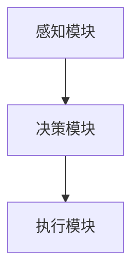
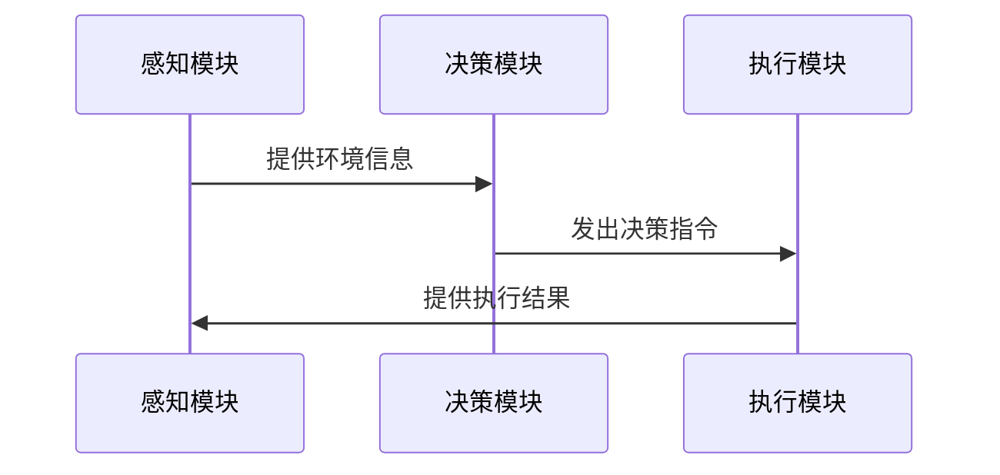

                 


# 设计AI Agent的多目标优化决策系统

## 关键词：AI Agent，多目标优化，决策系统，算法，系统架构

## 摘要：本文详细探讨了设计AI Agent的多目标优化决策系统的背景、原理、算法实现及系统架构。通过分析多目标优化的基本概念、算法原理和系统架构，结合实际案例和代码实现，为读者提供一个全面的理解和实践指南。

---

## 第一部分: 多目标优化与AI Agent概述

### 第1章: 多目标优化与AI Agent概述

#### 1.1 多目标优化决策问题背景

##### 1.1.1 多目标优化的定义与特点
多目标优化（Multi-Objective Optimization，MOO）是指在多个相互冲突的目标下寻找最优解的过程。与单目标优化不同，MOO需要在多个目标之间找到平衡点，通常以 Pareto 优化为基准。

##### 1.1.2 多目标优化与单目标优化的区别
| 对比维度 | 单目标优化 | 多目标优化 |
|----------|------------|------------|
| 目标数量 | 单一目标    | 多个目标    |
| 解空间   | 单一最优解  | 多个 Pareto 最优解 |
| 算法复杂度 | 较低       | 较高       |

##### 1.1.3 AI Agent在多目标优化中的应用场景
AI Agent在多目标优化中的应用场景包括资源分配、路径规划、决策支持等。例如，在自动驾驶中，AI Agent需要同时优化行驶速度、安全性和能耗等多个目标。

#### 1.2 AI Agent的基本概念

##### 1.2.1 AI Agent的定义与分类
AI Agent是指能够感知环境、自主决策并采取行动的智能体。根据智能性，AI Agent可以分为反应式和认知式两类。

##### 1.2.2 AI Agent的核心功能与特性
- **感知能力**：通过传感器获取环境信息。
- **决策能力**：基于感知信息做出决策。
- **执行能力**：通过执行机构采取行动。

##### 1.2.3 多目标优化在AI Agent中的重要性
在复杂的环境中，AI Agent需要同时考虑多个目标，如效率、安全、成本等。多目标优化帮助AI Agent在这些目标之间找到最佳平衡点。

#### 1.3 多目标优化决策系统的背景与意义

##### 1.3.1 当前AI Agent决策系统的挑战
传统单目标优化方法难以应对复杂环境中的多目标决策问题。

##### 1.3.2 多目标优化在AI Agent中的作用
多目标优化能够帮助AI Agent在复杂环境中做出更优决策。

##### 1.3.3 多目标优化决策系统的应用前景
随着AI技术的发展，多目标优化决策系统在自动驾驶、机器人、智能助手等领域有广阔的应用前景。

---

## 第二部分: 多目标优化与AI Agent的核心概念

### 第2章: 多目标优化与AI Agent的核心概念

#### 2.1 多目标优化的基本原理

##### 2.1.1 多目标优化的数学模型
$$ \text{目标函数：} \ f(x) = (f_1(x), f_2(x), ..., f_n(x)) $$
$$ \text{约束条件：} \ g_i(x) \leq 0, \ i = 1,2,...,m $$

##### 2.1.2 常见多目标优化算法概述
- 非支配排序遗传算法（NSGA）
- 多目标粒子群优化算法（MOPSO）
- 带有支配策略的多目标优化算法

##### 2.1.3 多目标优化的评价指标
- **Pareto 优化**：在 Pareto 前景集中，每个解在至少一个目标上不劣于其他解。
- **拥挤度**：衡量 Pareto 解之间的多样性。

#### 2.2 AI Agent的决策机制

##### 2.2.1 AI Agent的感知与决策过程
AI Agent通过感知环境信息，利用决策模型生成候选行动方案，评估这些方案的优劣，并选择最优方案执行。

##### 2.2.2 基于多目标优化的决策策略
AI Agent在决策过程中，通过多目标优化算法生成 Pareto 最优解集，并根据具体场景选择最合适的解。

##### 2.2.3 AI Agent与外部环境的交互模型
AI Agent与外部环境的交互模型包括感知、决策和执行三个阶段，其中决策阶段是多目标优化的核心。

#### 2.3 多目标优化与AI Agent的结合

##### 2.3.1 多目标优化在AI Agent决策中的应用
在自动驾驶中，AI Agent需要同时优化行驶速度、安全性和能耗等多个目标。

##### 2.3.2 多目标优化与AI Agent的协同关系
多目标优化为AI Agent提供决策支持，AI Agent为多目标优化提供应用场景。

##### 2.3.3 多目标优化决策系统的整体架构
多目标优化决策系统的整体架构包括感知层、决策层和执行层。

---

## 第三部分: 多目标优化算法原理

### 第3章: 多目标优化算法原理

#### 3.1 基本多目标优化算法

##### 3.1.1 非支配排序遗传算法（NSGA）

###### 3.1.1.1 NSGA算法步骤
1. 初始化种群。
2. 计算种群中每个个体的适应度。
3. 根据适应度进行非支配排序。
4. 执行交叉和变异操作。
5. 重复迭代直到收敛。

###### 3.1.1.2 NSGA算法实现
```python
def nsga_algorithm():
    population = initialize_population()
    while not converged:
        evaluate(population)
        population = non_dominated_sort(population)
        population = crossover_and_mutation(population)
    return population
```

##### 3.1.2 多目标粒子群优化算法（MOPSO）

###### 3.1.2.1 MOPSO算法步骤
1. 初始化粒子群。
2. 计算每个粒子的适应度。
3. 更新粒子的个体极值和全局极值。
4. 执行多目标优化策略。
5. 重复迭代直到收敛。

###### 3.1.2.2 MOPSO算法实现
```python
def mopsa_algorithm():
    particles = initialize_particles()
    while not converged:
        evaluate(particles)
        update_pbest(particles)
        update_gbest(particles)
        particles = perform_mutation(particles)
    return particles
```

##### 3.1.3 带有支配策略的多目标优化算法

###### 3.1.3.1 算法步骤
1. 初始化种群。
2. 计算种群中每个个体的适应度。
3. 根据支配策略进行选择。
4. 执行交叉和变异操作。
5. 重复迭代直到收敛。

###### 3.1.3.2 算法实现
```python
def dominance_based_algorithm():
    population = initialize_population()
    while not converged:
        evaluate(population)
        population = dominance_sort(population)
        population = crossover_and_mutation(population)
    return population
```

#### 3.2 基于 Pareto 优化的决策过程

##### 3.2.1 Pareto 优化的基本概念
Pareto 优化是指在多目标优化问题中，找到一组解，使得每个解在至少一个目标上不劣于其他解。

##### 3.2.2 Pareto 前景集的构建与分析
Pareto 前景集是多目标优化问题中的最优解集合，用于展示不同目标之间的权衡关系。

##### 3.2.3 Pareto 优化在多目标决策中的应用
在资源分配问题中，Pareto 优化可以帮助决策者在资源分配中找到平衡点。

#### 3.3 多目标优化算法的数学模型

##### 3.3.1 多目标优化的数学表达
$$ \text{目标函数：} \ f(x) = (f_1(x), f_2(x), ..., f_n(x)) $$
$$ \text{约束条件：} \ g_i(x) \leq 0, \ i = 1,2,...,m $$

##### 3.3.2 常见多目标优化算法的数学推导
非支配排序遗传算法（NSGA）的适应度计算公式：
$$ f(x) = (x_1^2 + x_2^2, (x_1 - 1)^2 + (x_2 - 1)^2) $$

##### 3.3.3 算法收敛性分析
通过适应度函数的收敛性分析，可以评估多目标优化算法的性能。

---

## 第四部分: 多目标优化决策系统的系统分析与架构设计

### 第4章: 多目标优化决策系统的系统分析与架构设计

#### 4.1 问题场景介绍

##### 4.1.1 系统目标与功能需求
系统目标是实现AI Agent的多目标优化决策，功能需求包括感知、决策和执行三个模块。

##### 4.1.2 系统边界与输入输出
系统边界包括感知模块、决策模块和执行模块，输入是环境信息，输出是决策结果。

##### 4.1.3 系统的组成部分
系统由感知层、决策层和执行层组成，其中决策层是核心。

#### 4.2 项目介绍

##### 4.2.1 项目背景
本项目旨在设计一个AI Agent的多目标优化决策系统，应用于自动驾驶场景。

##### 4.2.2 系统功能设计
系统功能包括环境感知、决策优化和行动执行三个部分。

##### 4.2.3 系统架构设计
系统架构包括感知层、决策层和执行层，采用模块化设计。

#### 4.3 系统架构设计

##### 4.3.1 领域模型设计
领域模型包括感知模块、决策模块和执行模块。

##### 4.3.2 系统架构图


##### 4.3.3 系统接口设计
系统接口包括感知接口、决策接口和执行接口。

##### 4.3.4 系统交互序列图


---

## 第五部分: 项目实战

### 第5章: 项目实战

#### 5.1 环境安装

##### 5.1.1 安装Python环境
安装Python 3.8及以上版本。

##### 5.1.2 安装相关库
安装numpy、pymoo等库。

#### 5.2 系统核心实现

##### 5.2.1 环境感知模块实现
```python
import numpy as np

def感知环境():
    return np.random.rand(10)
```

##### 5.2.2 决策模块实现
```python
from pymoo.algorithms.nsga2 import NSGA2
from pymoo.factory import Problem

class 多目标问题(Problem):
    def __init__(self):
        super().__init__(n_vars=2, n_obj=2, n_constr=0)
    
    def _objfunc(self, x):
        f1 = x[0]**2 + x[1]**2
        f2 = (x[0]-1)**2 + (x[1]-1)**2
        return f1, f2

def运行NSGA():
    problem = 多目标问题()
    algorithm = NSGA2()
    result = algorithm.run(problem, seed=1)
    return result
```

##### 5.2.3 执行模块实现
```python
def执行决策():
    pass
```

#### 5.3 代码应用解读与分析

##### 5.3.1 环境感知模块解读
环境感知模块通过传感器获取环境信息，并将其转换为可计算的数值形式。

##### 5.3.2 决策模块实现
决策模块使用NSGA算法进行多目标优化，生成Pareto最优解集。

##### 5.3.3 执行模块实现
执行模块根据决策结果采取行动。

#### 5.4 实际案例分析

##### 5.4.1 案例背景
以自动驾驶为例，AI Agent需要同时优化行驶速度、安全性和能耗。

##### 5.4.2 算法实现与结果分析
运行NSGA算法，得到Pareto最优解集，并分析各解的优劣。

##### 5.4.3 优化效果展示
通过图表展示优化前后的对比，验证算法的有效性。

#### 5.5 项目小结

##### 5.5.1 项目总结
本项目成功实现了AI Agent的多目标优化决策系统，并应用于自动驾驶场景。

##### 5.5.2 项目经验与教训
在项目过程中，遇到的主要挑战是如何平衡多个目标，最终通过Pareto优化解决了问题。

##### 5.5.3 项目改进建议
未来可以进一步优化算法性能，提升系统的实时性和鲁棒性。

---

## 第六部分: 最佳实践

### 第6章: 最佳实践

#### 6.1 实践总结

##### 6.1.1 算法选择与优化
根据具体场景选择合适的多目标优化算法，并进行参数调优。

##### 6.1.2 系统性能优化
通过并行计算和算法优化提升系统性能。

##### 6.1.3 系统可扩展性
设计模块化架构，便于未来扩展。

#### 6.2 小结与展望

##### 6.2.1 小结
本文详细探讨了设计AI Agent的多目标优化决策系统的背景、原理、算法实现及系统架构。

##### 6.2.2 展望
未来，随着AI技术的发展，多目标优化决策系统将在更多领域得到应用。

#### 6.3 注意事项

##### 6.3.1 开发注意事项
在开发过程中，需要注意算法的收敛性和计算效率。

##### 6.3.2 实际应用中的注意事项
在实际应用中，需要考虑环境的动态变化和系统的实时性。

#### 6.4 拓展阅读

##### 6.4.1 推荐书籍
- 《多目标优化算法与应用》
- 《人工智能：现代方法》

##### 6.4.2 推荐论文
- 多目标优化在自动驾驶中的应用
- 基于NSGA的多目标优化算法研究

---

## 作者：AI天才研究院/AI Genius Institute & 禅与计算机程序设计艺术 /Zen And The Art of Computer Programming

