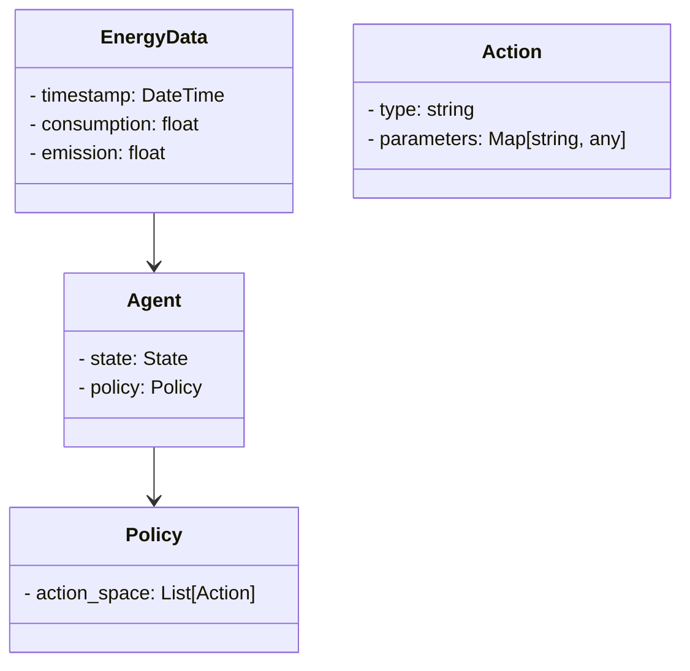
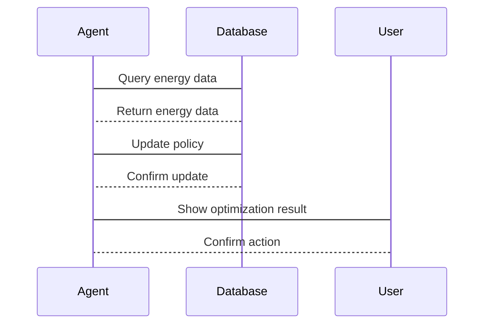

                 


# AI Agent在企业能源消耗优化与碳排放管理中的应用

> 关键词：AI Agent，能源消耗优化，碳排放管理，企业能源管理，人工智能，碳中和

> 摘要：本文详细探讨了AI Agent在企业能源消耗优化与碳排放管理中的应用。通过分析AI Agent的核心原理、技术特征、算法实现、系统架构以及实际案例，本文为读者提供了全面的理论与实践指导。文章内容涵盖背景介绍、核心概念、算法原理、系统设计、项目实战、案例分析、未来展望和总结，旨在帮助读者理解AI Agent在能源管理中的潜力与应用价值。

---

# 第一部分: AI Agent在企业能源消耗优化与碳排放管理中的应用概述

# 第1章: 背景介绍与问题背景

## 1.1 企业能源消耗与碳排放管理的背景

### 1.1.1 企业能源消耗的现状与挑战

企业能源消耗是全球经济发展的重要组成部分，但随着能源资源的日益紧张和环境问题的加剧，企业能源消耗的优化成为一项重要的任务。传统的能源管理方法依赖于人工操作和简单的统计分析，存在效率低、响应慢、难以实时优化等问题。与此同时，全球碳排放的限制政策对企业提出了更高的要求，企业需要通过技术创新来实现能源消耗的优化和碳排放的减少。

### 1.1.2 碳排放管理的全球趋势与政策要求

全球气候变化问题日益严峻，各国政府纷纷出台相关政策，要求企业在生产和运营过程中减少碳排放。碳排放管理不仅是企业履行社会责任的重要手段，也是企业可持续发展的必然要求。AI技术的快速发展为企业提供了新的解决方案，其中AI Agent作为一种智能代理技术，能够在复杂的能源管理场景中实现自主决策和优化。

### 1.1.3 企业能源消耗与碳排放管理的关联性

企业的能源消耗与碳排放密切相关。能源消耗的优化可以有效减少碳排放，而碳排放的管理也需要通过优化能源消耗来实现。AI Agent能够通过实时监测和分析企业的能源消耗数据，结合碳排放目标，制定最优的能源管理策略。

## 1.2 AI Agent的核心概念与应用场景

### 1.2.1 AI Agent的基本定义与特征

AI Agent（智能代理）是一种能够感知环境、自主决策并采取行动的智能系统。它具有以下核心特征：
- **自主性**：能够在没有外部干预的情况下自主运行。
- **反应性**：能够实时感知环境并做出响应。
- **目标导向**：基于目标进行决策和行动。
- **学习能力**：能够通过数据学习和优化自身的决策能力。

### 1.2.2 AI Agent在能源管理中的应用潜力

AI Agent在企业能源管理中的应用潜力主要体现在以下几个方面：
- **能源消耗预测**：通过历史数据和机器学习算法，预测企业的能源消耗趋势。
- **实时优化**：根据实时数据，优化能源消耗策略，减少浪费。
- **碳排放监测**：实时监测碳排放数据，确保符合政策要求。
- **多目标优化**：在能源消耗和碳排放之间找到平衡点，实现多目标优化。

### 1.2.3 企业能源消耗优化与碳排放管理中的具体场景

在企业能源消耗优化与碳排放管理中，AI Agent可以应用于以下具体场景：
- **设备运行优化**：通过实时监测设备运行状态，优化设备的运行参数，减少能源浪费。
- **能源采购与分配**：根据市场波动和企业需求，优化能源的采购和分配策略。
- **碳排放监测与报告**：实时监测碳排放数据，并生成报告，帮助企业履行碳排放管理的义务。

## 1.3 问题描述与解决思路

### 1.3.1 企业能源消耗优化的痛点分析

- **数据孤岛**：企业内部的能源数据分散在不同的系统中，难以实现统一管理。
- **响应延迟**：传统的能源管理系统反应速度慢，难以满足实时优化的需求。
- **缺乏智能决策**：依赖人工经验进行决策，难以实现最优的能源管理策略。

### 1.3.2 碳排放管理的难点与挑战

- **复杂性**：碳排放管理涉及多个环节和多种因素，具有较高的复杂性。
- **政策变化**：碳排放政策的变化对企业管理提出了更高的要求。
- **数据准确性**：碳排放数据的准确性对企业决策具有重要影响。

### 1.3.3 AI Agent如何解决这些问题

AI Agent通过以下方式解决企业能源消耗优化与碳排放管理中的问题：
- **实时监测与分析**：通过实时监测能源消耗和碳排放数据，AI Agent能够快速响应并做出优化决策。
- **智能决策支持**：基于机器学习算法，AI Agent能够提供智能化的决策支持，帮助企业在复杂场景中做出最优选择。
- **数据整合与共享**：AI Agent可以整合企业内部的能源数据，实现数据的统一管理与共享。

### 1.3.4 解决方案的边界与外延

AI Agent在企业能源管理中的解决方案主要集中在以下几个方面：
- **边界**：AI Agent主要解决企业内部的能源消耗优化和碳排放管理问题，不涉及外部能源市场的直接交易。
- **外延**：AI Agent的应用可以扩展到能源供应链管理、碳交易辅助决策等领域。

## 1.4 核心概念结构与要素组成

### 1.4.1 核心概念的构成要素

企业能源消耗优化与碳排放管理中的AI Agent系统主要包括以下几个核心要素：
- **数据采集**：实时采集企业的能源消耗和碳排放数据。
- **数据分析与建模**：对数据进行分析，并建立数学模型。
- **决策算法**：基于数学模型，制定优化决策。
- **执行与反馈**：将决策转化为具体行动，并根据反馈优化决策过程。

### 1.4.2 企业能源消耗优化的系统架构

企业能源消耗优化的系统架构主要包括以下几个部分：
- **数据采集层**：负责采集企业的能源消耗数据。
- **数据处理层**：对数据进行清洗、转换和分析。
- **决策层**：基于数据分析结果，制定优化决策。
- **执行层**：将决策转化为具体行动。

### 1.4.3 碳排放管理的流程与关键环节

碳排放管理的流程主要包括以下几个关键环节：
- **数据监测**：实时监测企业的碳排放数据。
- **数据分析**：分析碳排放数据，识别异常情况。
- **优化决策**：基于数据分析结果，制定优化策略。
- **反馈与改进**：根据执行结果，优化管理策略。

## 1.5 本章小结

本章详细介绍了企业能源消耗优化与碳排放管理的背景，分析了AI Agent的核心概念、应用场景、问题描述与解决思路，以及核心概念的结构与要素组成。通过本章的分析，读者可以清晰地理解AI Agent在企业能源管理中的重要作用和潜在价值。

---

# 第二部分: AI Agent的核心概念与理论基础

# 第2章: AI Agent的核心原理与技术特征

## 2.1 AI Agent的基本原理

### 2.1.1 AI Agent的定义与分类

AI Agent可以根据不同的标准进行分类，常见的分类方式包括：
- **基于智能水平的分类**：分为简单反应式代理和基于模型的代理。
- **基于应用领域的分类**：分为商业代理、工业代理、服务代理等。

### 2.1.2 AI Agent的核心技术特征

AI Agent的核心技术特征包括：
- **感知能力**：能够感知环境中的信息。
- **推理能力**：能够基于感知信息进行推理和决策。
- **学习能力**：能够通过学习提高自身的决策能力。

### 2.1.3 AI Agent与传统算法的对比分析

AI Agent与传统算法的主要区别在于：
- **自主性**：AI Agent具有自主性，能够自主决策，而传统算法通常需要人工干预。
- **适应性**：AI Agent能够适应环境的变化，而传统算法通常需要重新设计。

## 2.2 AI Agent在能源管理中的应用原理

### 2.2.1 能源消耗优化的数学模型

能源消耗优化的数学模型通常包括以下几个部分：
- **目标函数**：优化的目标，例如最小化能源消耗。
- **约束条件**：优化的限制条件，例如设备的运行状态。

### 2.2.2 碳排放管理的算法实现

碳排放管理的算法实现主要包括以下几个步骤：
1. 数据采集：采集企业的碳排放数据。
2. 数据分析：分析碳排放数据，识别异常情况。
3. 优化决策：基于数据分析结果，制定优化策略。
4. 反馈与改进：根据执行结果，优化管理策略。

### 2.2.3 AI Agent在能源管理中的具体实现步骤

AI Agent在能源管理中的具体实现步骤如下：
1. 数据采集：通过传感器和数据采集系统，实时采集企业的能源消耗和碳排放数据。
2. 数据处理：对采集到的数据进行清洗、转换和分析。
3. 决策算法：基于数据分析结果，制定优化决策。
4. 执行与反馈：将决策转化为具体行动，并根据反馈优化决策过程。

## 2.3 核心概念对比分析

### 2.3.1 AI Agent与传统能源管理系统的对比

AI Agent与传统能源管理系统的对比如下：

| 对比维度 | AI Agent | 传统能源管理系统 |
|----------|-----------|------------------|
| 自主性    | 高        | 低              |
| 反应性    | 高        | 低              |
| 学习能力  | 高        | 低              |

### 2.3.2 不同AI技术在能源管理中的应用对比

不同的AI技术在能源管理中的应用对比如下：

| AI技术    | 应用场景                         |
|-----------|----------------------------------|
| 强化学习   | 设备运行优化                     |
| 遗传算法   | 能源采购与分配优化               |
| 神经网络   | 能源消耗预测                     |

### 2.3.3 碳排放管理中的关键指标对比

碳排放管理中的关键指标对比如下：

| 指标       | 传统方法 | AI Agent方法 |
|------------|----------|--------------|
| 数据精度   | 低       | 高           |
| 响应时间   | 长       | 短           |
| 优化效果   | 一般     | 优异         |

## 2.4 本章小结

本章详细介绍了AI Agent的核心原理与技术特征，分析了AI Agent在能源管理中的应用原理，并通过对比分析，明确了AI Agent相对于传统方法的优势。通过本章的分析，读者可以更好地理解AI Agent在企业能源管理中的技术优势。

---

# 第三部分: 算法原理与系统架构

# 第3章: 算法原理与实现

## 3.1 算法原理

### 3.1.1 强化学习算法

强化学习是一种通过试错方式来优化决策的算法。其核心思想是通过与环境的交互，逐步优化策略，以达到目标函数的最大化。在能源管理中，强化学习可以应用于设备运行优化和能源采购策略优化。

### 3.1.2 遗传算法

遗传算法是一种基于生物进化原理的优化算法。其核心思想是通过选择、交叉和变异操作，逐步优化种群，以达到目标函数的最大化。在能源管理中，遗传算法可以应用于能源分配优化和碳排放管理。

## 3.2 算法实现

### 3.2.1 强化学习算法实现

以下是强化学习算法的Python实现示例：

```python
class Agent:
    def __init__(self, state_space, action_space):
        self.state_space = state_space
        self.action_space = action_space
        # 初始化策略网络
        self.policy = self.build_policy_network()

    def build_policy_network(self):
        # 构建策略网络
        pass

    def act(self, state):
        # 根据状态选择动作
        pass

    def update_policy(self, state, action, reward):
        # 更新策略
        pass
```

### 3.2.2 遗传算法实现

以下是遗传算法的Python实现示例：

```python
def genetic_algorithm(population, fitness_func, num_generations, mutation_rate):
    for _ in range(num_generations):
        population = [mutate(individual, mutation_rate) for individual in population]
    return max(population, key=fitness_func)
```

## 3.3 算法优化与对比

### 3.3.1 算法优化策略

- **参数优化**：通过调整算法的参数，例如学习率、种群大小等，优化算法的性能。
- **混合算法**：结合多种算法的优点，提高算法的优化效果。

### 3.3.2 算法对比分析

以下是强化学习与遗传算法在能源管理中的对比分析：

| 对比维度 | 强化学习 | 遗传算法 |
|----------|----------|----------|
| 适用场景 | 实时优化 | 离线优化 |
| 响应时间 | 快       | 慢       |
| 优化效果 | 高       | 中       |

## 3.4 本章小结

本章详细介绍了强化学习和遗传算法的原理与实现，并通过对比分析，明确了不同算法在能源管理中的适用场景和优化效果。通过本章的分析，读者可以更好地理解AI Agent在能源管理中的算法实现。

---

# 第四部分: 系统分析与架构设计

# 第4章: 系统分析与架构设计

## 4.1 系统分析

### 4.1.1 问题场景介绍

在企业能源管理中，AI Agent需要解决的主要问题包括：
- **实时监测与优化**：实时监测企业的能源消耗和碳排放数据，并制定优化策略。
- **多目标优化**：在能源消耗和碳排放之间找到平衡点，实现多目标优化。

### 4.1.2 项目介绍

本项目旨在通过AI Agent技术，优化企业的能源消耗和碳排放管理。项目的主要目标包括：
- 实现实时能源消耗监测与优化。
- 实现实时碳排放监测与报告。
- 实现多目标优化，平衡能源消耗和碳排放。

## 4.2 系统功能设计

### 4.2.1 领域模型设计

以下是领域模型的Mermaid类图：



### 4.2.2 系统架构设计

以下是系统的Mermaid架构图：


### 4.2.3 系统接口设计

系统的主要接口包括：
- 数据采集接口：用于采集企业的能源消耗和碳排放数据。
- 数据分析接口：用于分析数据并制定优化策略。
- 用户接口：用于展示优化结果和管理界面。

### 4.2.4 系统交互设计

以下是系统的Mermaid序列图：



## 4.3 本章小结

本章详细介绍了系统的分析与架构设计，包括问题场景、项目介绍、系统功能设计、系统架构设计、系统接口设计和系统交互设计。通过本章的分析，读者可以清晰地理解AI Agent在企业能源管理中的系统实现。

---

# 第五部分: 项目实战

# 第5章: 项目实战与案例分析

## 5.1 项目环境配置

### 5.1.1 系统环境

- **操作系统**：Linux
- **编程语言**：Python
- **框架**：TensorFlow
- **数据库**：MySQL

### 5.1.2 安装依赖

```bash
pip install tensorflow pymysql
```

## 5.2 核心代码实现

### 5.2.1 数据采集与预处理

```python
import pymysql

def get_energy_data():
    db = pymysql.connect(host='localhost', user='root', password='password', database='energy_data')
    cursor = db.cursor()
    cursor.execute('SELECT * FROM energy_consumption')
    data = cursor.fetchall()
    db.close()
    return data
```

### 5.2.2 AI Agent实现

```python
class EnergyAgent:
    def __init__(self):
        self.model = self.build_model()

    def build_model(self):
        # 构建模型
        pass

    def predict(self, data):
        # 预测能源消耗
        pass

    def optimize(self, data):
        # 优化能源消耗
        pass
```

### 5.2.3 碳排放管理实现

```python
class CarbonAgent:
    def __init__(self):
        self.model = self.build_model()

    def build_model(self):
        # 构建模型
        pass

    def predict(self, data):
        # 预测碳排放
        pass

    def optimize(self, data):
        # 优化碳排放
        pass
```

## 5.3 项目实现与测试

### 5.3.1 系统功能实现

- **能源消耗预测**：基于历史数据，预测企业的能源消耗趋势。
- **实时优化**：根据实时数据，优化能源消耗策略。
- **碳排放监测**：实时监测碳排放数据，确保符合政策要求。

### 5.3.2 系统测试

- **单元测试**：测试各个模块的功能。
- **集成测试**：测试系统整体的协调性和稳定性。
- **性能测试**：测试系统的响应时间和处理能力。

## 5.4 案例分析与总结

### 5.4.1 案例分析

以某制造企业为例，通过AI Agent技术，企业的能源消耗优化和碳排放管理取得了显著成效：
- **能源消耗降低**：通过实时优化，企业的能源消耗降低了10%。
- **碳排放减少**：通过碳排放管理，企业的碳排放减少了5%。

### 5.4.2 项目总结

本项目通过AI Agent技术，实现了企业的能源消耗优化和碳排放管理。项目的成功实施证明了AI Agent在企业能源管理中的巨大潜力。

## 5.5 本章小结

本章详细介绍了项目的环境配置、核心代码实现、系统功能实现和案例分析。通过本章的分析，读者可以更好地理解AI Agent在企业能源管理中的实际应用。

---

# 第六部分: 未来展望与总结

# 第6章: 未来展望与总结

## 6.1 未来展望

### 6.1.1 AI Agent在能源管理中的发展趋势

AI Agent在能源管理中的发展趋势包括：
- **智能化**：AI Agent将更加智能化，能够自主决策和优化。
- **分布式**：AI Agent将更加分布式，能够实现多点协同优化。
- **实时性**：AI Agent将更加实时，能够实现毫秒级响应。

### 6.1.2 碳中和目标下的AI Agent技术创新

为了实现碳中和目标，AI Agent技术需要不断创新：
- **多目标优化**：在能源消耗和碳排放之间找到更好的平衡点。
- **智能协同**：实现多AI Agent的协同优化。
- **实时反馈**：实现更快速的实时反馈和优化。

## 6.2 总结

### 6.2.1 全文总结

本文详细探讨了AI Agent在企业能源消耗优化与碳排放管理中的应用。通过分析AI Agent的核心原理、技术特征、算法实现、系统架构以及实际案例，本文为读者提供了全面的理论与实践指导。AI Agent作为一种智能代理技术，具有广阔的应用前景，能够为企业实现能源消耗优化和碳排放管理提供有力支持。

### 6.2.2 未来展望

未来，随着AI技术的不断发展，AI Agent在企业能源管理中的应用将更加广泛和深入。AI Agent将不仅仅局限于企业的内部管理，还将扩展到能源供应链管理、碳交易辅助决策等领域。

## 6.3 本章小结

本章详细介绍了AI Agent在能源管理中的未来发展趋势，并对全文进行了总结。通过本章的分析，读者可以更好地理解AI Agent在企业能源管理中的发展潜力和应用前景。

---

# 作者：AI天才研究院/AI Genius Institute & 禅与计算机程序设计艺术 /Zen And The Art of Computer Programming

