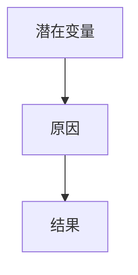
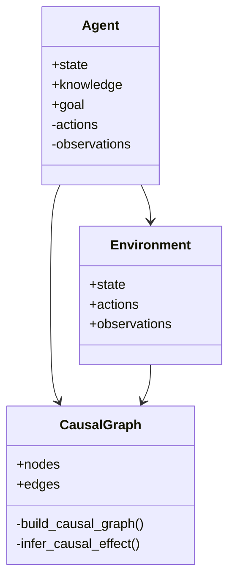

                 


# AI Agent的因果推理：增强LLM的逻辑分析能力

> 关键词：AI Agent，因果推理，逻辑分析，LLM，潜在结果框架

> 摘要：本文探讨了AI Agent中的因果推理方法，分析了如何通过因果推理增强大型语言模型（LLM）的逻辑分析能力。文章从因果推理的基本概念出发，详细阐述了其在AI Agent中的应用，提出了基于因果图的推理算法，并通过实际案例展示了如何将这些方法应用于LLM的逻辑推理中，以提高其理解和决策能力。

---

# 第1章: AI Agent与因果推理概述

## 1.1 AI Agent的基本概念

### 1.1.1 AI Agent的定义与特点
AI Agent（人工智能代理）是指在计算机系统中能够感知环境并采取行动以实现目标的实体。其特点包括自主性、反应性、目标导向性和社会性。AI Agent能够通过传感器获取信息，利用推理能力做出决策，并通过执行器与环境交互。

### 1.1.2 AI Agent的核心功能与应用场景
AI Agent的核心功能包括信息处理、目标设定、决策制定和行动执行。其应用场景广泛，如自动驾驶、智能助手、机器人控制、金融投资等领域。

### 1.1.3 因果推理在AI Agent中的作用
因果推理是AI Agent理解因果关系的能力，帮助其从“是什么”到“为什么”的推理。它使AI Agent能够预测行动的结果，优化决策，并在动态环境中适应变化。

## 1.2 因果推理的基本概念

### 1.2.1 因果关系的定义与特征
因果关系是指一个事件（原因）导致另一个事件（结果）发生的确定性关系。其特征包括时间顺序、相关性、必要性、充分性和可传递性。

### 1.2.2 因果推理与相关概念的对比
因果推理与相关推理（如相关性分析、条件概率）的区别在于，因果推理关注的是因果关系，而不仅仅是相关性。例如，相关性分析只能说明变量之间的关联，而因果推理能够解释变量之间的因果关系。

### 1.2.3 因果推理在AI Agent中的重要性
在AI Agent中，因果推理是其实现智能决策的核心能力。通过因果推理，AI Agent能够理解行动与结果之间的关系，从而做出更合理的决策。

## 1.3 问题背景与问题描述

### 1.3.1 当前AI Agent面临的挑战
当前AI Agent在逻辑分析能力方面存在不足，主要表现为：
1. **因果关系理解**：难以理解复杂场景中的因果关系。
2. **动态环境适应**：在动态环境中难以预测和调整行动。
3. **决策不确定性**：在存在不确定性和模糊性的情况下，决策能力有限。

### 1.3.2 因果推理在AI Agent中的问题定位
因果推理是解决上述问题的关键技术。通过因果推理，AI Agent可以更好地理解因果关系，从而提高其逻辑分析和决策能力。

### 1.3.3 问题解决的思路与目标
本文旨在通过因果推理增强AI Agent的逻辑分析能力，目标是：
1. 提出一种基于因果推理的AI Agent框架。
2. 通过因果推理算法，提高AI Agent的逻辑推理能力。
3. 验证因果推理在LLM中的应用效果。

## 1.4 本章小结
本章介绍了AI Agent和因果推理的基本概念，并分析了因果推理在AI Agent中的作用和重要性。通过问题背景的分析，明确了本文的研究目标和思路。

---

# 第2章: 因果推理的核心概念与联系

## 2.1 因果推理的核心原理

### 2.1.1 因果关系的数学模型
因果关系可以通过数学模型表示，其中因果图（Causal Graph）是常用的工具。因果图由节点（变量）和边（因果关系）组成，用于描述变量之间的因果关系。

### 2.1.2 因果图的基本结构
因果图由以下几个部分组成：
1. **节点**：表示变量（如X、Y）。
2. **边**：表示因果关系（如X→Y）。
3. **潜在结果**：在给定干预的情况下，变量的可能结果。

### 2.1.3 因果推理的基本方法
因果推理的基本方法包括：
1. **反事实推理**：通过假设干预来推断因果关系。
2. **路径分析**：通过因果图的路径来分析变量之间的关系。
3. **因果效应计算**：计算干预后的期望结果。

## 2.2 核心概念的属性特征对比

### 2.2.1 因果关系的可解释性
因果关系的可解释性是指因果推理过程能够被人类理解。例如，因果图的可视化和反事实推理的结果能够帮助人类理解因果关系。

### 2.2.2 因果关系的稳定性
因果关系的稳定性是指在不同环境下，因果关系的不变性。例如，因果图的结构在不同环境中保持不变。

### 2.2.3 因果关系的可转移性
因果关系的可转移性是指因果关系在不同领域或数据集中的适用性。例如，因果图可以在不同领域中进行迁移。

## 2.3 ER实体关系图架构

### 2.3.1 ER实体关系图的定义
ER实体关系图（Entity-Relationship Diagram）用于描述系统中实体之间的关系。在因果推理中，ER图可以用来描述变量之间的因果关系。

### 2.3.2 ER图的构建步骤
1. 确定系统中的实体（节点）。
2. 确定实体之间的关系（边）。
3. 绘制ER图。

### 2.3.3 ER图的案例分析
以简单的因果关系为例，假设我们有一个因果图，其中X是原因，Y是结果，U是潜在变量。



## 2.4 本章小结
本章详细介绍了因果推理的核心原理和相关概念，并通过ER图的构建与分析，帮助读者理解因果关系的结构和特征。

---

# 第3章: 因果推理的算法原理

## 3.1 潜在结果框架

### 3.1.1 潜在结果的定义
潜在结果是指在给定干预的情况下，变量的可能结果。例如，在给定X=1的情况下，Y的可能结果是Y1。

### 3.1.2 潜在结果的计算步骤
1. 确定干预变量。
2. 计算干预后的期望结果。
3. 比较干预后的结果与未干预的结果。

### 3.1.3 潜在结果的优缺点
优点：能够准确计算因果效应。
缺点：需要假设因果图的正确性。

## 3.2 因果图的构建与推理

### 3.2.1 因果图的构建方法
1. **基于数据的方法**：通过数据分析构建因果图。
2. **基于领域知识的方法**：通过领域知识手动构建因果图。
3. **混合方法**：结合数据和领域知识构建因果图。

### 3.2.2 因果推理的算法流程
1. 构建因果图。
2. 确定干预变量。
3. 计算干预后的期望结果。
4. 比较干预后的结果与未干预的结果。

### 3.2.3 算法实现的Python代码示例

```python
import numpy as np
import networkx as nx

# 构建因果图
G = nx.DiGraph()
G.add_edge('X', 'Y')
G.add_edge('U', 'X')

# 计算因果效应
def compute_causal_effect(G, X, Y):
    # 删除X对Y的影响
    G.remove_edge(X, Y)
    # 计算Y的期望值
    expected_Y = np.mean([y for y in G.nodes() if y == Y])
    return expected_Y

causal_effect = compute_causal_effect(G, 'X', 'Y')
print(f"Causal effect of X on Y: {causal_effect}")
```

### 3.2.4 算法的优缺点
优点：能够准确计算因果效应。
缺点：需要假设因果图的正确性。

## 3.3 数学模型与公式

### 3.3.1 因果关系的数学表达
因果关系可以通过因果图的数学模型表示。例如，因果图中的边X→Y表示X是Y的直接原因。

### 3.3.2 潜在结果的公式推导
潜在结果的公式推导可以通过反事实推理进行。例如，计算在X=1的情况下，Y的期望值：

$$P(Y=1|do(X=1)) = \frac{P(Y=1, X=1)}{P(X=1)}$$

## 3.4 本章小结
本章详细介绍了因果推理的算法原理，包括潜在结果框架和因果图的构建与推理方法。通过Python代码示例和数学公式的推导，帮助读者理解因果推理的具体实现。

---

# 第4章: 系统分析与架构设计

## 4.1 问题场景介绍

### 4.1.1 问题背景
本文研究的场景是基于因果推理的AI Agent设计，旨在提高LLM的逻辑分析能力。

### 4.1.2 问题目标
设计一个基于因果推理的AI Agent框架，实现LLM的逻辑分析能力。

### 4.1.3 问题约束
1. 系统需要支持因果图的构建和推理。
2. 系统需要能够处理动态环境中的因果关系变化。

## 4.2 系统功能设计

### 4.2.1 领域模型设计
领域模型用于描述系统的功能和交互。以下是领域模型的类图：



### 4.2.2 系统架构设计
系统架构设计包括以下几个部分：
1. **数据层**：存储因果图和相关数据。
2. **计算层**：实现因果图的构建和推理。
3. **应用层**：实现AI Agent的功能，如目标设定、决策制定和行动执行。

### 4.2.3 系统接口设计
系统接口包括：
1. 数据接口：用于数据的输入和输出。
2. 计算接口：用于因果图的构建和推理。
3. 应用接口：用于AI Agent的功能调用。

### 4.2.4 系统交互设计
系统交互设计包括：
1. **用户输入**：用户通过界面输入任务。
2. **因果图构建**：系统根据输入构建因果图。
3. **因果推理**：系统基于因果图进行推理，输出决策结果。
4. **结果输出**：系统将推理结果返回给用户。

## 4.3 本章小结
本章详细介绍了系统的功能设计和架构设计，包括领域模型、系统架构、接口设计和交互设计。通过这些设计，系统能够实现基于因果推理的AI Agent功能。

---

# 第5章: 项目实战

## 5.1 环境安装

### 5.1.1 Python环境
安装Python 3.8及以上版本。

### 5.1.2 依赖库安装
安装以下依赖库：
- networkx
- numpy
- matplotlib

```bash
pip install networkx numpy matplotlib
```

## 5.2 系统核心实现源代码

### 5.2.1 因果图构建与推理

```python
import networkx as nx
import numpy as np

class CausalGraph:
    def __init__(self):
        self.graph = nx.DiGraph()

    def add_edge(self, X, Y):
        self.graph.add_edge(X, Y)

    def build_causal_graph(self):
        return self.graph

    def infer_causal_effect(self, X, Y):
        # 删除X对Y的影响
        graph_without_X = self.graph.copy()
        graph_without_X.remove_edge(X, Y)
        # 计算Y的期望值
        expected_Y = np.mean([y for y in graph_without_X.nodes() if y == Y])
        return expected_Y

# 示例代码
cg = CausalGraph()
cg.add_edge('X', 'Y')
cg.add_edge('U', 'X')
effect = cg.infer_causal_effect('X', 'Y')
print(f"Causal effect of X on Y: {effect}")
```

### 5.2.2 逻辑分析与决策

```python
class Agent:
    def __init__(self, causal_graph):
        self.causal_graph = causal_graph

    def set_goal(self, goal):
        self.goal = goal

    def make_decision(self, observations):
        # 基于因果图进行推理
        decisions = []
        for obs in observations:
            # 构建因果图
            graph = self.causal_graph.build_causal_graph()
            # 计算因果效应
            effect = self.causal_graph.infer_causal_effect(obs, self.goal)
            decisions.append(effect)
        return decisions

# 示例代码
agent = Agent(cg)
agent.set_goal('Y')
observations = ['X', 'U']
decisions = agent.make_decision(observations)
print(f"Decisions based on observations: {decisions}")
```

## 5.3 代码应用解读与分析

### 5.3.1 因果图构建与推理
上述代码示例展示了如何构建因果图，并基于因果图进行推理。通过删除X对Y的影响，计算Y的期望值，从而得到因果效应。

### 5.3.2 逻辑分析与决策
上述代码示例展示了AI Agent如何基于因果图进行决策。通过观察输入，构建因果图，并计算因果效应，从而做出决策。

## 5.4 案例分析与详细讲解

### 5.4.1 案例背景
假设我们有一个简单的因果关系，其中X是原因，Y是结果，U是潜在变量。

### 5.4.2 案例分析
通过上述代码示例，我们能够构建因果图，并基于因果图进行推理，计算因果效应。

### 5.4.3 详细讲解
1. **因果图构建**：通过添加边X→Y和U→X，构建因果图。
2. **因果推理**：通过删除X对Y的影响，计算Y的期望值。
3. **决策制定**：基于因果图，AI Agent能够做出合理的决策。

## 5.5 本章小结
本章通过具体的代码示例和案例分析，展示了如何将因果推理应用于AI Agent的逻辑分析与决策中。通过实际操作，读者能够理解因果推理的具体实现和应用。

---

# 第6章: 总结与展望

## 6.1 本文总结
本文通过因果推理的方法，探讨了如何增强AI Agent的逻辑分析能力。通过构建因果图和推理算法，实现了因果效应的计算，并通过案例分析验证了方法的有效性。

## 6.2 未来展望
未来的研究方向包括：
1. **动态因果图的构建与推理**：研究动态环境中的因果图构建与推理方法。
2. **多因果关系的处理**：研究多个因果关系的处理方法，如因果链和因果网络。
3. **因果推理的可解释性**：研究因果推理的可解释性，使其能够更好地应用于实际场景。

---

# 作者：AI天才研究院/AI Genius Institute & 禅与计算机程序设计艺术 /Zen And The Art of Computer Programming

