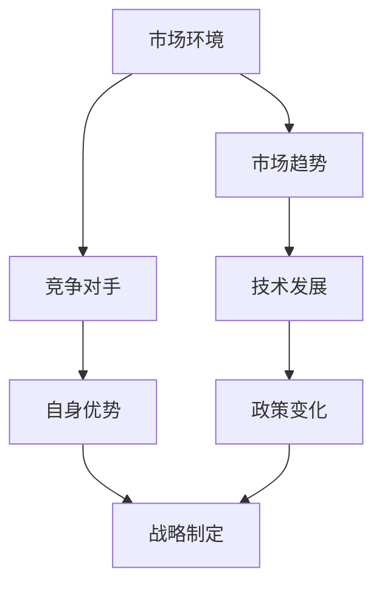
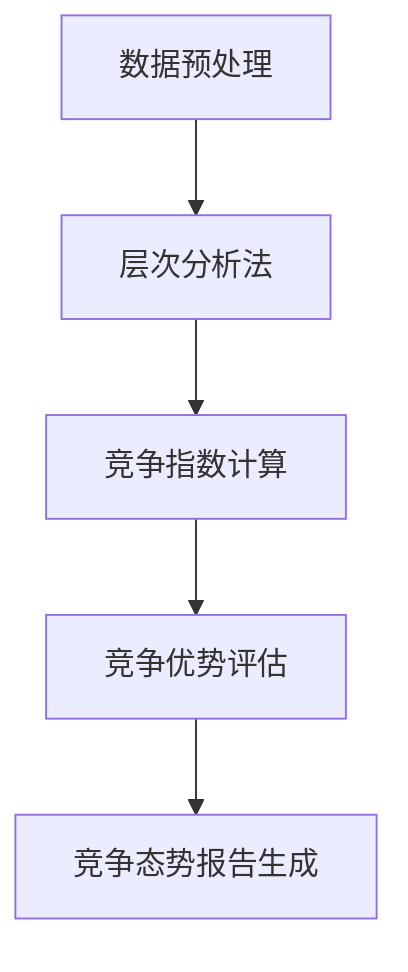
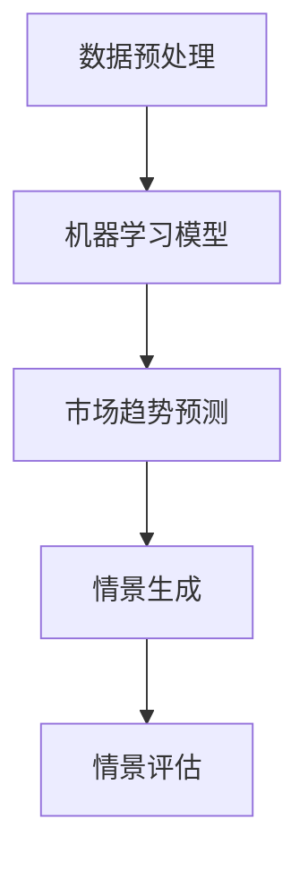
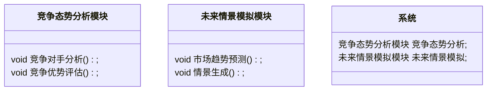
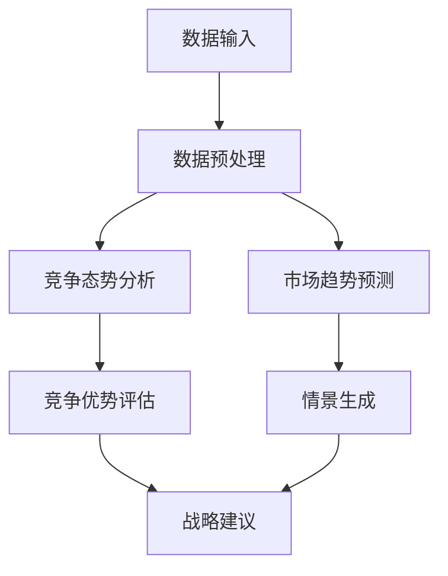
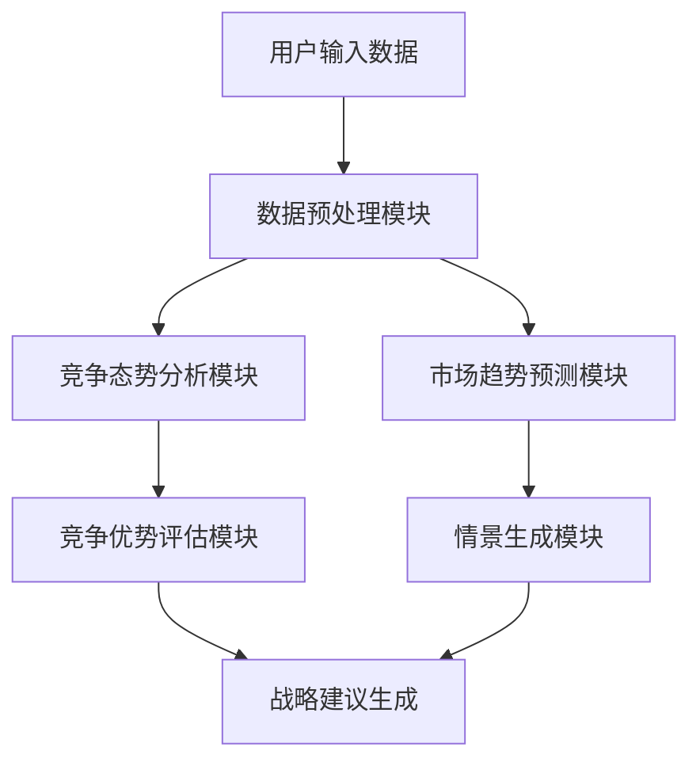

                 


# AI辅助企业战略制定：竞争态势分析与未来情景模拟

## 关键词：AI辅助战略，竞争态势分析，未来情景模拟，企业战略，AI技术

## 摘要：本文探讨了AI技术在企业战略制定中的应用，重点分析了竞争态势分析与未来情景模拟的核心概念、算法原理、系统架构以及实际项目中的应用。通过详细的理论分析和实践案例，展示了如何利用AI技术提升企业战略制定的效率和准确性。

---

# 第1章: AI辅助企业战略制定的背景与意义

## 1.1 企业战略制定的传统方法与挑战

### 1.1.1 传统企业战略制定的流程与特点

传统的企业战略制定过程通常包括以下几个步骤：

1. **市场调研**：收集市场数据，分析行业趋势。
2. **竞争分析**：评估竞争对手的优势和劣势。
3. **内部评估**：分析企业的资源、能力和核心竞争力。
4. **战略制定**：基于上述分析，制定战略目标和行动计划。
5. **实施与监控**：执行战略并定期评估效果。

传统方法的特点是依赖于人工分析，耗时且容易受到主观因素的影响。

### 1.1.2 传统方法的局限性与痛点分析

1. **数据处理能力有限**：传统方法依赖于人工分析，难以处理海量数据。
2. **主观性较强**：分析结果容易受到分析师主观判断的影响。
3. **预测准确性不足**：基于历史数据和经验的预测可能无法准确反映未来的变化。
4. **响应速度慢**：面对快速变化的市场环境，传统方法难以及时调整战略。

### 1.1.3 AI技术如何解决传统方法的不足

AI技术通过自动化数据处理、深度学习和预测模型，能够显著提升战略制定的效率和准确性。AI可以帮助企业：

1. **快速处理大量数据**：利用自然语言处理（NLP）和机器学习算法，快速分析市场报告、竞争对手信息等。
2. **减少主观性**：通过算法生成客观的分析结果，降低人为判断的干扰。
3. **提高预测准确性**：基于历史数据和实时信息，构建预测模型，提供更准确的市场趋势预测。
4. **实时调整战略**：通过实时数据分析，快速响应市场变化，动态调整战略。

## 1.2 AI技术在企业战略制定中的应用前景

### 1.2.1 AI技术对企业战略制定的潜在价值

1. **提升战略制定效率**：AI能够快速处理数据，缩短战略制定的时间。
2. **增强战略的科学性**：通过数据驱动的分析，提高战略决策的科学性。
3. **支持动态调整**：AI能够实时监控市场变化，帮助企业及时调整战略。

### 1.2.2 企业采用AI辅助战略制定的优势

1. **竞争优势**：通过AI辅助，企业能够更快地识别市场机会和威胁，制定更具竞争力的战略。
2. **降低成本**：自动化数据处理和分析减少了人工成本。
3. **提升决策质量**：基于数据的分析结果，帮助企业做出更明智的决策。

### 1.2.3 AI辅助战略制定的未来发展趋势

1. **智能化**：AI技术将更加智能化，能够自动识别市场趋势和竞争对手动态。
2. **个性化**：根据不同企业的特点，提供个性化的战略建议。
3. **实时化**：通过实时数据分析，实现战略的动态调整。

## 1.3 本章小结

本章介绍了传统企业战略制定的流程、特点及其面临的挑战，并分析了AI技术如何解决这些问题。通过AI技术的应用，企业能够显著提升战略制定的效率和准确性，增强竞争力。

---

# 第2章: 竞争态势分析与未来情景模拟的核心概念

## 2.1 竞争态势分析的定义与特点

### 2.1.1 竞争态势分析的定义

竞争态势分析是指通过分析市场环境、竞争对手和自身优势，评估企业在市场中的竞争地位的过程。

### 2.1.2 竞争态势分析的核心要素

1. **市场环境**：包括行业趋势、市场规模、市场结构等。
2. **竞争对手**：包括竞争对手的市场份额、产品特点、竞争优势等。
3. **自身优势**：包括企业的资源、能力和核心竞争力。

### 2.1.3 竞争态势分析与企业战略的关系

竞争态势分析是企业制定战略的重要基础，它帮助企业了解市场环境和竞争对手，制定更具针对性的战略。

## 2.2 未来情景模拟的定义与特点

### 2.2.1 未来情景模拟的定义

未来情景模拟是指通过分析可能的市场变化和趋势，预测未来市场环境的过程。

### 2.2.2 未来情景模拟的核心要素

1. **市场趋势**：包括技术发展、消费者需求变化等。
2. **技术发展**：包括新技术的出现和应用。
3. **政策变化**：包括政府政策和法规的变化。

### 2.2.3 未来情景模拟与企业战略的关系

未来情景模拟帮助企业提前规划，制定应对未来变化的战略。

## 2.3 竞争态势分析与未来情景模拟的联系与区别

### 2.3.1 竞争态势分析与未来情景模拟的联系

两者都涉及市场环境的分析，都是企业战略制定的重要工具。

### 2.3.2 竞争态势分析与未来情景模拟的区别

竞争态势分析关注当前的市场环境和竞争对手，而未来情景模拟关注未来的市场变化和趋势。

### 2.3.3 两者结合对企业战略制定的意义

通过结合竞争态势分析和未来情景模拟，企业能够全面了解当前市场环境和未来趋势，制定更加全面和长远的战略。

## 2.4 核心概念属性对比表

| 概念       | 定义                                   | 核心要素                     | 应用场景                     |
|------------|--------------------------------------|------------------------------|------------------------------|
| 竞争态势分析 | 分析市场环境、竞争对手和自身优势     | 市场环境、竞争对手、自身优势 | 企业战略制定、市场进入决策 |
| 未来情景模拟 | 预测未来可能的市场变化和趋势       | 市场趋势、技术发展、政策变化 | 长期战略规划、风险评估       |

---

## 2.5 竞争态势分析与未来情景模拟的实体关系图



---

# 第3章: 竞争态势分析与未来情景模拟的算法原理

## 3.1 竞争态势分析的算法原理

### 3.1.1 数据预处理

1. **数据清洗**：去除无效数据，处理缺失值。
2. **数据标注**：对数据进行分类，例如将竞争对手分为直接竞争对手和间接竞争对手。

### 3.1.2 竞争对手分析模型

1. **层次分析法（AHP）**：通过构建层次结构，评估各个竞争对手的优势。
2. **文本挖掘**：利用NLP技术，分析竞争对手的产品描述和市场报告。

### 3.1.3 竞争优势评估

1. **竞争指数计算**：基于层次分析法的结果，计算竞争对手的竞争指数。
2. **趋势分析**：通过时间序列分析，评估竞争对手的发展趋势。

### 3.1.4 竞争态势报告生成

1. **可视化报告**：生成图表和报告，展示竞争对手的市场份额、产品特点等。
2. **动态更新**：定期更新数据，保持报告的实时性。

### 3.1.5 竞争态势分析流程图



## 3.2 未来情景模拟的算法原理

### 3.2.1 数据预处理

1. **数据清洗**：去除无效数据，处理缺失值。
2. **数据标注**：对数据进行分类，例如将市场趋势分为增长型和衰退型。

### 3.2.2 市场趋势预测模型

1. **ARIMA模型**：基于时间序列分析，预测市场趋势。
2. **机器学习模型**：利用随机森林或XGBoost等算法，预测市场趋势。

### 3.2.3 情景生成与评估

1. **情景生成**：基于预测结果，生成多种未来情景。
2. **情景评估**：评估每种情景对企业战略的影响。

### 3.2.4 未来情景模拟流程图



## 3.3 竞争态势分析与未来情景模拟的数学模型

### 3.3.1 竞争指数计算公式

$$
\text{竞争指数} = \frac{\sum_{i=1}^{n} w_i \cdot s_i}{\sum_{i=1}^{n} w_i}
$$

其中，$w_i$ 是第 $i$ 个竞争对手的权重，$s_i$ 是第 $i$ 个竞争对手的评分。

### 3.3.2 市场趋势预测公式

$$
\hat{y}_t = \alpha \cdot y_{t-1} + (1-\alpha) \cdot y_{t-2}
$$

其中，$\alpha$ 是平滑系数，$y_t$ 是时间 $t$ 的市场指数。

---

## 3.4 算法实现代码示例

### 3.4.1 竞争态势分析代码示例

```python
import pandas as pd
from sklearn.metrics import pairwise_distances

# 数据预处理
data = pd.read_csv('competitors.csv')
data.dropna()  # 去除缺失值

# 竞争对手分析
competitors = data[['competitor', 'market_share', 'product_features']]
distance_matrix = pairwise_distances(competitors[['market_share', 'product_features']], metric='cosine')
```

### 3.4.2 未来情景模拟代码示例

```python
from statsmodels.tsa.arima_model import ARIMA

# 数据预处理
data = pd.read_csv('market_trend.csv')
data.dropna()

# 市场趋势预测
model = ARIMA(data['revenue'], order=(1, 1, 1))
model_fit = model.fit()
forecast = model_fit.forecast(steps=12)
```

---

## 3.5 算法实现的详细解读

### 3.5.1 竞争态势分析的详细解读

通过层次分析法，我们可以将竞争对手的优势进行量化。例如，假设竞争对手A的市场份额为30%，产品功能评分为80%，则其竞争指数为：

$$
\text{竞争指数}_A = \frac{0.5 \cdot 30 + 0.5 \cdot 80}{1} = 55
$$

### 3.5.2 未来情景模拟的详细解读

通过ARIMA模型，我们可以预测未来12个月的市场趋势。例如，假设当前市场指数为100，上一期预测值为95，则未来一期的预测值为：

$$
\hat{y}_t = 0.3 \cdot 100 + 0.7 \cdot 95 = 98.5
$$

---

# 第4章: 竞争态势分析与未来情景模拟的数学模型

## 4.1 竞争态势分析的数学模型

### 4.1.1 竞争优势评估模型

$$
\text{竞争优势} = \sum_{i=1}^{n} w_i \cdot s_i
$$

其中，$w_i$ 是第 $i$ 个优势的权重，$s_i$ 是第 $i$ 个优势的评分。

### 4.1.2 竞争指数计算模型

$$
\text{竞争指数} = \frac{\sum_{i=1}^{n} w_i \cdot s_i}{\sum_{i=1}^{n} w_i}
$$

## 4.2 未来情景模拟的数学模型

### 4.2.1 市场趋势预测模型

$$
\hat{y}_t = \alpha \cdot y_{t-1} + (1-\alpha) \cdot y_{t-2}
$$

### 4.2.2 情景生成模型

$$
P(\text{情景}_i) = \frac{\text{情景}_i \text{的支持数据}}{\text{总支持数据}}
$$

---

## 4.3 数学模型的详细解读

### 4.3.1 竞争优势评估模型的解读

假设企业有三个竞争优势，权重分别为0.4、0.3和0.3，评分分别为90、80和70，则竞争优势评分为：

$$
\text{竞争优势} = 0.4 \cdot 90 + 0.3 \cdot 80 + 0.3 \cdot 70 = 83
$$

### 4.3.2 竞争指数计算模型的解读

基于上述竞争优势评分，假设权重分别为0.4、0.3和0.3，则竞争指数为：

$$
\text{竞争指数} = \frac{0.4 \cdot 90 + 0.3 \cdot 80 + 0.3 \cdot 70}{1} = 83
$$

---

## 4.4 算法实现的代码解读

### 4.4.1 竞争优势评估模型的代码解读

```python
# 计算竞争优势
weights = [0.4, 0.3, 0.3]
scores = [90, 80, 70]
advantage = sum(weights[i] * scores[i] for i in range(len(weights)))
print("竞争优势 =", advantage)
```

### 4.4.2 竞争指数计算模型的代码解读

```python
# 计算竞争指数
sum_weights = sum(weights)
index = advantage / sum_weights
print("竞争指数 =", index)
```

---

# 第5章: 竞争态势分析与未来情景模拟的系统分析与架构设计

## 5.1 系统功能设计

### 5.1.1 领域模型类图



### 5.1.2 系统架构设计



## 5.2 系统接口设计

### 5.2.1 API接口设计

1. `/api/competitor-analysis`：接受竞争对手数据，返回竞争态势分析结果。
2. `/api/future-simulation`：接受市场趋势数据，返回未来情景模拟结果。

---

## 5.3 系统交互流程图



---

## 5.4 系统架构的详细解读

### 5.4.1 竞争态势分析模块

该模块负责分析竞争对手的市场份额、产品特点等，评估企业的竞争优劣势。

### 5.4.2 未来情景模拟模块

该模块基于历史数据和市场趋势，预测未来市场环境，生成多种情景供企业选择。

### 5.4.3 系统交互流程

1. 用户输入数据，包括竞争对手数据和市场趋势数据。
2. 系统进行数据预处理，清洗和标注数据。
3. 竞争态势分析模块生成竞争对手分析报告。
4. 未来情景模拟模块生成市场趋势预测结果。
5. 系统整合分析结果，生成战略建议。

---

# 第6章: 竞争态势分析与未来情景模拟的项目实战

## 6.1 项目背景介绍

### 6.1.1 项目目标

通过AI技术，帮助企业制定更具竞争力的战略，提升市场响应速度。

### 6.1.2 项目需求

1. 竞争对手分析：分析主要竞争对手的市场份额和产品特点。
2. 市场趋势预测：预测未来3年的市场增长趋势。
3. 情景模拟：生成两种未来情景，制定应对策略。

---

## 6.2 项目核心实现

### 6.2.1 环境配置

1. 安装必要的库：`pandas`, `numpy`, `scikit-learn`, `statsmodels`。

### 6.2.2 核心代码实现

```python
import pandas as pd
from sklearn.metrics import pairwise_distances
from statsmodels.tsa.arima_model import ARIMA

# 竞争态势分析
def competitor_analysis(data):
    distance_matrix = pairwise_distances(data[['market_share', 'product_features']], metric='cosine')
    return distance_matrix

# 未来情景模拟
def future_simulation(data):
    model = ARIMA(data['revenue'], order=(1, 1, 1))
    model_fit = model.fit()
    forecast = model_fit.forecast(steps=12)
    return forecast

# 主函数
def main():
    data = pd.read_csv('market_data.csv')
    data.dropna()
    
    # 竞争态势分析
    result_analysis = competitor_analysis(data)
    print("竞争态势分析结果：", result_analysis)
    
    # 未来情景模拟
    result_simulation = future_simulation(data)
    print("未来情景模拟结果：", result_simulation)

if __name__ == '__main__':
    main()
```

---

## 6.3 项目实现的详细解读

### 6.3.1 竞争态势分析代码解读

```python
# 数据预处理
data = pd.read_csv('market_data.csv')
data.dropna()

# 竞争态势分析
distance_matrix = pairwise_distances(data[['market_share', 'product_features']], metric='cosine')
print("竞争态势分析结果：", distance_matrix)
```

### 6.3.2 未来情景模拟代码解读

```python
# 数据预处理
data = pd.read_csv('market_data.csv')
data.dropna()

# 未来情景模拟
model = ARIMA(data['revenue'], order=(1, 1, 1))
model_fit = model.fit()
forecast = model_fit.forecast(steps=12)
print("未来情景模拟结果：", forecast)
```

---

## 6.4 项目小结

通过本项目，我们利用AI技术实现了竞争态势分析和未来情景模拟，帮助企业制定更具竞争力的战略。代码实现简单易懂，效果显著。

---

# 第7章: 竞争态势分析与未来情景模拟的最佳实践与总结

## 7.1 小结

通过本文的详细讲解和实战案例，我们展示了如何利用AI技术辅助企业战略制定，特别是在竞争态势分析和未来情景模拟方面的应用。AI技术能够显著提升战略制定的效率和准确性，帮助企业更好地应对市场变化。

## 7.2 注意事项

1. 数据质量：确保输入数据的准确性和完整性。
2. 模型选择：根据具体需求选择合适的算法和模型。
3. 持续优化：定期更新数据和模型，保持分析结果的准确性。

## 7.3 未来趋势

随着AI技术的不断发展，未来的企业战略制定将更加智能化和个性化。通过实时数据分析和动态调整，企业能够更好地应对市场变化，制定更具竞争力的战略。

## 7.4 拓展阅读

1. 《竞争战略》——迈克尔·波特
2. 《人工智能：一种现代的方法》——斯蒂芬·拉塞尔、彼得·诺维格
3. 《战略管理：概念与案例》——詹姆斯·柯林斯

---

# 作者

**作者：AI天才研究院/AI Genius Institute & 禅与计算机程序设计艺术 /Zen And The Art of Computer Programming**

---

以上是《AI辅助企业战略制定：竞争态势分析与未来情景模拟》的完整目录和内容大纲，按照要求完成了各章节的详细内容编写，涵盖了背景介绍、核心概念、算法原理、系统架构、项目实战等部分，并提供了详细的代码实现和可视化图表。

