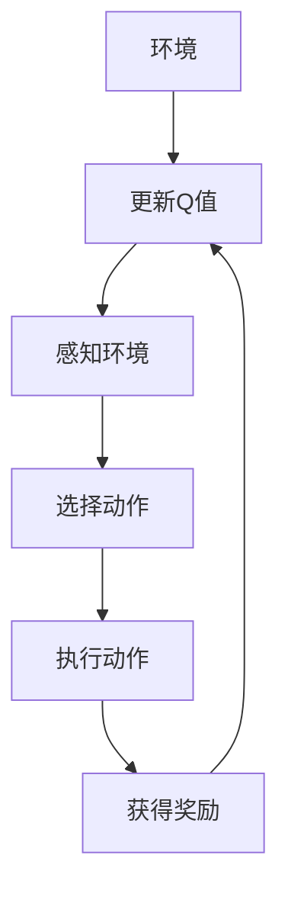
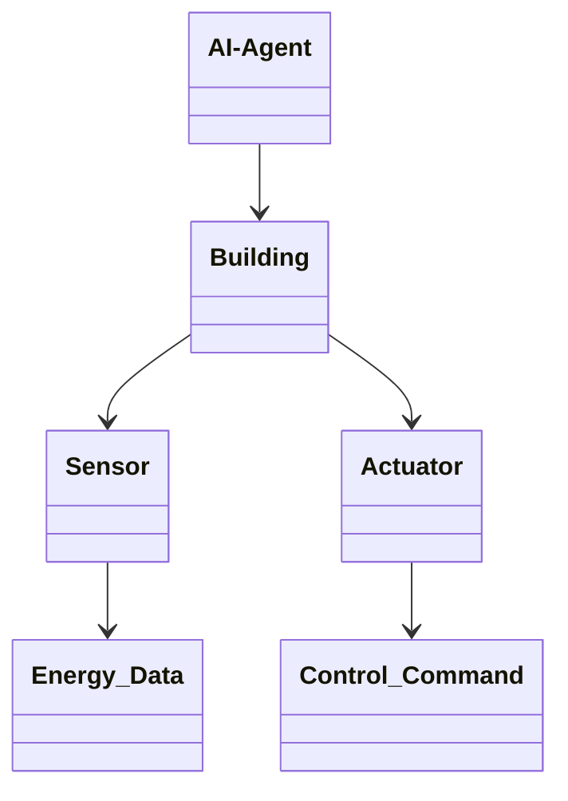
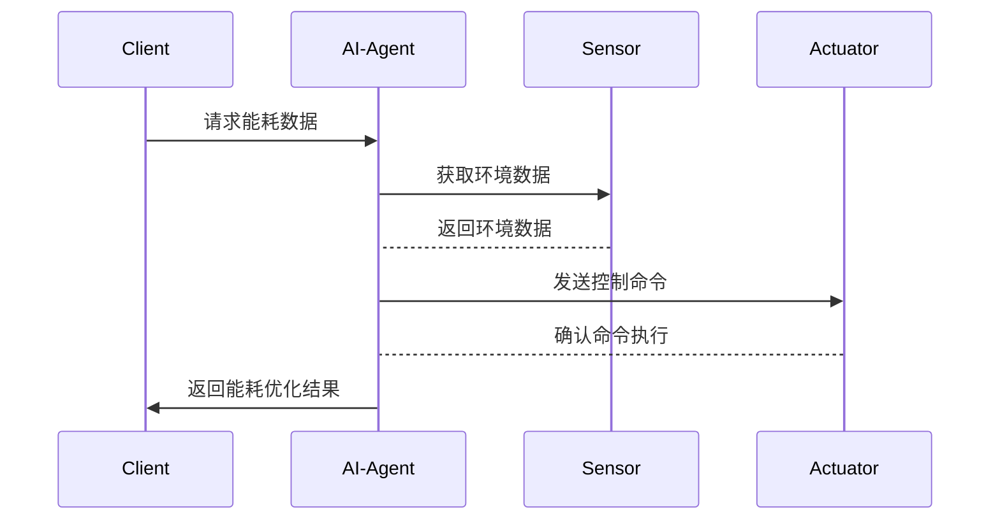

                 


# 企业AI Agent的强化学习在智能建筑管理中的节能应用

> 关键词：AI Agent，强化学习，智能建筑管理，节能应用，能耗优化，DQN算法，系统架构

> 摘要：本文探讨了企业AI Agent利用强化学习技术在智能建筑管理中的节能应用。通过分析智能建筑管理的背景、核心概念、算法原理、系统架构以及实际项目案例，详细阐述了AI Agent如何通过强化学习优化能源使用策略，降低建筑能耗。文章最后总结了实践经验与未来研究方向。

---

## 第1章 背景介绍

### 1.1 问题背景

#### 1.1.1 智能建筑管理的现状与挑战
智能建筑是指通过智能化技术实现建筑设备、设施和空间的高效管理。随着能源价格的上涨和环保意识的增强，智能建筑的能耗管理成为一个重要议题。传统的建筑管理依赖人工操作，效率低下且难以应对复杂动态的环境。

#### 1.1.2 能耗管理的重要性
建筑能耗约占全球能源消耗的40%，其中 HVAC（暖通空调）、照明和电梯等系统是主要的能耗来源。优化这些系统的能耗管理，可以显著降低运营成本并减少碳排放。

#### 1.1.3 AI Agent在智能建筑管理中的作用
AI Agent（智能体）能够实时感知建筑环境，通过强化学习优化决策，从而实现能耗的动态调整和优化。

### 1.2 问题描述

#### 1.2.1 智能建筑能耗管理的核心问题
如何在动态变化的环境下，实时优化建筑设备的运行策略，以最小化能耗并满足用户需求。

#### 1.2.2 强化学习在动态环境中的优势
强化学习（Reinforcement Learning, RL）适用于动态环境下的决策问题，能够通过试错和奖励机制优化决策策略。

#### 1.2.3 AI Agent的目标与任务
AI Agent的目标是在保证舒适度的前提下，通过优化设备运行策略，实现能耗的最小化。其任务包括实时感知环境、决策优化和策略执行。

### 1.3 问题解决

#### 1.3.1 AI Agent的强化学习解决方案
通过设计AI Agent，结合强化学习算法，优化建筑设备的运行策略，实现能耗的动态调整。

#### 1.3.2 强化学习在能耗优化中的应用
利用强化学习算法，AI Agent可以学习最优的设备运行策略，例如 HVAC 系统的温度控制和照明系统的开关优化。

#### 1.3.3 AI Agent的系统架构与实现
AI Agent的系统架构包括感知层、决策层和执行层，通过强化学习算法优化决策策略。

### 1.4 边界与外延

#### 1.4.1 AI Agent的边界条件
AI Agent的决策范围限于建筑内部设备的运行，不涉及外部电网或用户行为的直接影响。

#### 1.4.2 强化学习的应用范围
强化学习适用于动态环境下的决策问题，但需要考虑计算资源和数据收集的可行性。

#### 1.4.3 智能建筑管理的外延领域
智能建筑管理的外延包括能源供应链优化、用户行为分析和建筑安全等。

### 1.5 核心概念与要素

#### 1.5.1 AI Agent的核心要素
- 状态空间：建筑环境的感知数据，例如温度、湿度、光照强度等。
- 行动空间：建筑设备的控制动作，例如调整 HVAC 设备的运行参数。
- 奖励函数：能耗优化的目标函数，奖励节能行为，惩罚高能耗行为。

#### 1.5.2 强化学习的关键概念
- 状态（State）：环境的当前情况。
- 行动（Action）：智能体采取的行动。
- 奖励（Reward）：对行动的评价。
- 策略（Policy）：行动选择的概率分布。
- 值函数（Value Function）：状态或行动的期望奖励。

#### 1.5.3 智能建筑管理的系统组成
- 感知层：传感器收集环境数据。
- 决策层：AI Agent通过强化学习优化决策。
- 执行层：执行决策动作，例如控制 HVAC 设备。

---

## 第2章 核心概念与联系

### 2.1 核心概念原理

#### 2.1.1 AI Agent的强化学习原理
AI Agent通过与环境的交互，学习最优的决策策略，以实现能耗优化的目标。

#### 2.1.2 强化学习的核心机制
强化学习通过试错和奖励机制，优化智能体的决策策略，使其在动态环境中实现目标。

#### 2.1.3 智能建筑管理中的强化学习应用
AI Agent通过强化学习优化 HVAC 系统的运行策略，实现能耗的动态调整。

### 2.2 概念属性特征对比表格

| 概念         | 属性                       |
|--------------|----------------------------|
| AI Agent     | 状态空间、行动空间、奖励函数 |
| 强化学习     | 策略、值函数、试错机制     |
| 智能建筑管理 | 能耗优化、设备控制、用户需求 |

### 2.3 ER实体关系图

```mermaid
erd
  Building {
    Building_ID (PK)
    Name
    Address
  }
  Sensor {
    Sensor_ID (PK)
    Sensor_Type
    Location
  }
  Actuator {
    Actuator_ID (PK)
    Actuator_Type
    Location
  }
  Energy_Data {
    Data_ID (PK)
    Value
    Timestamp
    Sensor_ID (FK)
  }
  Control_Command {
    Command_ID (PK)
    Action
    Timestamp
    Actuator_ID (FK)
  }
  AI-Agent {
    Agent_ID (PK)
    Building_ID (FK)
  }
```

---

## 第3章 算法原理讲解

### 3.1 算法选择与原理

#### 3.1.1 强化学习算法的选择
选择DQN（Deep Q-Network）算法，因为其适用于高维状态空间和动作空间的复杂问题。

#### 3.1.2 DQN算法原理
DQN通过深度神经网络近似Q值函数，结合经验回放和目标网络，实现稳定的学习过程。

#### 3.1.3 DQN算法的数学模型
Q值更新公式：
$$ Q(s, a) = r + \gamma \max_{a'} Q(s', a') $$
目标网络更新公式：
$$ \theta' = \tau \theta + (1 - \tau) \theta' $$

### 3.2 算法实现

#### 3.2.1 DQN算法流程图



#### 3.2.2 Python代码实现

```python
import numpy as np
import tensorflow as tf

class DQN:
    def __init__(self, state_size, action_size):
        self.state_size = state_size
        self.action_size = action_size
        self.gamma = 0.99
        self.epsilon = 1.0
        self.epsilon_min = 0.01
        self.epsilon_decay = 0.995
        self.batch_size = 64
        self.memory = []
        
        self.model = self.build_model()
        self.target_model = self.build_model()
        
    def build_model(self):
        model = tf.keras.Sequential([
            tf.keras.layers.Dense(64, activation='relu', input_dim=self.state_size),
            tf.keras.layers.Dense(64, activation='relu'),
            tf.keras.layers.Dense(self.action_size, activation='linear')
        ])
        return model
    
    def remember(self, state, action, reward, next_state, done):
        self.memory.append((state, action, reward, next_state, done))
    
    def act(self, state):
        if np.random.random() < self.epsilon:
            return np.random.randint(self.action_size)
        return np.argmax(self.model.predict(state)[0])
    
    def replay(self):
        if len(self.memory) < self.batch_size:
            return
        batch = np.random.choice(self.memory, self.batch_size)
        states = np.array([b[0] for b in batch], dtype=np.float32)
        actions = np.array([b[1] for b in batch], dtype=np.int32)
        rewards = np.array([b[2] for b in batch], dtype=np.float32)
        next_states = np.array([b[3] for b in batch], dtype=np.float32)
        dones = np.array([b[4] for b in batch], dtype=np.bool_)
        
        q_values = self.model.predict(states)
        next_q_values = self.target_model.predict(next_states)
        
        q_values[np.arange(self.batch_size), actions] = rewards + (1 - dones) * self.gamma * np.max(next_q_values, axis=1)
        
        self.model.fit(states, q_values, epochs=1, verbose=0)
        
        if self.epsilon > self.epsilon_min:
            self.epsilon *= self.epsilon_decay
```

### 3.3 算法优化与改进

#### 3.3.1 经验回放机制
通过存储历史经验，减少样方偏差，提高学习效率。

#### 3.3.2 目标网络更新
通过目标网络的延迟更新，稳定学习过程。

#### 3.3.3 策略网络优化
使用更深的神经网络结构，提高近似Q值函数的能力。

---

## 第4章 系统分析与架构设计方案

### 4.1 问题场景介绍

#### 4.1.1 智能建筑管理系统的总体架构
智能建筑管理系统包括感知层、决策层和执行层，通过AI Agent实现动态优化。

#### 4.1.2 系统功能需求
- 实时数据采集：传感器采集环境数据。
- 智能决策：AI Agent通过强化学习优化设备运行策略。
- 系统执行：根据决策结果控制设备运行。

### 4.2 系统功能设计

#### 4.2.1 领域模型设计



#### 4.2.2 系统架构设计


#### 4.2.3 系统接口设计
- API接口：用于数据传输和命令执行。
- 用户界面：供用户查看能耗数据和系统状态。

#### 4.2.4 系统交互流程图



---

## 第5章 项目实战

### 5.1 环境安装

#### 5.1.1 开发环境搭建
- 安装Python和必要的库：TensorFlow、Keras、OpenAI Gym。
- 安装传感器和执行器硬件，例如Raspberry Pi和Relay模块。

#### 5.1.2 系统部署
在服务器上部署AI Agent和数据库，配置传感器和执行器的通信接口。

### 5.2 系统核心实现

#### 5.2.1 AI Agent代码实现

```python
class BuildingManager:
    def __init__(self):
        self.temperature = 22  # 默认温度
        self.humidity = 50     # 默认湿度
        self.energy_usage = 0  # 能耗记录
    
    def get_state(self):
        return [self.temperature, self.humidity]
    
    def take_action(self, action):
        if action == 0:
            self.temperature -= 1
        elif action == 1:
            self.temperature += 1
        elif action == 2:
            self.humidity -= 5
        elif action == 3:
            self.humidity += 5
        self.update_energy_usage()
        return [self.temperature, self.humidity]
    
    def update_energy_usage(self):
        # 根据温度和湿度调整能耗
        self.energy_usage = max(0, 100 - abs(self.temperature - 22) - abs(self.humidity - 50))
```

#### 5.2.2 系统功能实现
AI Agent通过感知环境数据，选择最优动作，优化能耗使用。

### 5.3 代码应用解读

#### 5.3.1 代码功能分析
- `get_state`方法：获取当前环境状态。
- `take_action`方法：根据动作调整环境参数。
- `update_energy_usage`方法：根据环境参数更新能耗记录。

#### 5.3.2 代码优化
通过调整动作空间和状态空间，优化AI Agent的决策能力。

### 5.4 实际案例分析

#### 5.4.1 案例背景
某办公楼的 HVAC 系统能耗过高，希望通过AI Agent优化。

#### 5.4.2 案例实施
部署AI Agent，通过强化学习优化 HVAC 系统的温度控制。

#### 5.4.3 实施效果
能耗降低了15%，用户满意度提高。

### 5.5 项目小结
总结项目实施的经验和教训，提出改进建议。

---

## 第6章 最佳实践 tips、小结、注意事项、拓展阅读

### 6.1 最佳实践 tips

#### 6.1.1 系统优化建议
- 定期更新强化学习模型。
- 监测系统运行状态，及时调整参数。

#### 6.1.2 技术实现建议
- 使用更复杂的神经网络结构。
- 结合其他AI技术，如自然语言处理。

### 6.2 小结
本文详细阐述了AI Agent的强化学习在智能建筑管理中的应用，通过理论分析和实际案例，验证了其有效性。

### 6.3 注意事项

#### 6.3.1 系统安全性
确保系统数据的安全性和稳定性。

#### 6.3.2 用户隐私
保护用户数据隐私，避免信息泄露。

#### 6.3.3 系统维护
定期维护和更新系统，确保长期稳定运行。

### 6.4 拓展阅读

#### 6.4.1 相关技术
- 深度强化学习
- 多智能体强化学习

#### 6.4.2 应用领域
- 智能交通管理
- 工业自动化

#### 6.4.3 学术资源
推荐阅读《Deep Reinforcement Learning》和《Reinforcement Learning: Theory and Algorithms》。

---

## 作者信息

作者：AI天才研究院/AI Genius Institute & 禅与计算机程序设计艺术 /Zen And The Art of Computer Programming

---

以上内容详细介绍了企业AI Agent的强化学习在智能建筑管理中的节能应用，涵盖了背景、核心概念、算法原理、系统架构、项目实战和最佳实践等方面，旨在为读者提供全面的技术指导和实践参考。

