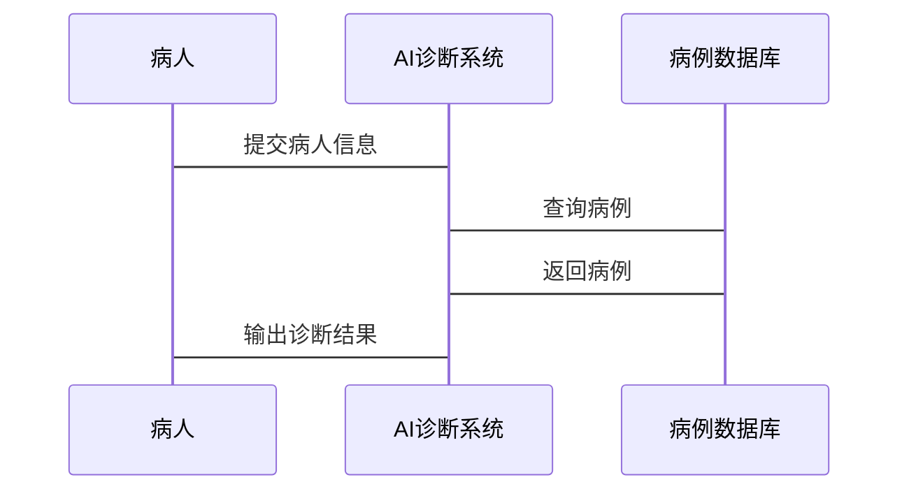

                 


# 可信AI：构建值得信赖的AI Agent系统

> 关键词：可信AI，AI Agent，系统架构，算法原理，项目实战，数学模型

> 摘要：本文将详细介绍如何构建一个值得信赖的AI Agent系统。从可信AI的背景和核心概念出发，深入探讨其算法基础、系统架构设计，并通过项目实战展示如何实现一个可信的AI Agent系统。文章内容丰富，逻辑清晰，涵盖从理论到实践的各个方面，旨在为读者提供一个全面的可信AI Agent系统构建指南。

---

## 第1章: 可信AI的背景与概念

### 1.1 可信AI的背景

人工智能（AI）技术的快速发展为我们带来了许多便利，但与此同时，AI系统的不可预测性和黑箱特性也让人们对其信任度产生质疑。可信AI（Trusted AI）的概念应运而生，旨在确保AI系统的行为符合预期，能够在各种场景下可靠地运行，并且让用户对其决策过程感到放心。

#### 1.1.1 人工智能的发展历程

人工智能的发展可以分为以下几个阶段：

1. **符号推理阶段（20世纪50年代-60年代）**：基于逻辑推理的AI系统，如专家系统。
2. **机器学习阶段（20世纪80年代-90年代）**：基于数据的AI系统，如支持向量机（SVM）和决策树。
3. **深度学习阶段（21世纪初至今）**：基于神经网络的AI系统，如卷积神经网络（CNN）和循环神经网络（RNN）。

#### 1.1.2 可信AI的提出背景

随着AI技术的广泛应用，人们开始关注AI系统的可靠性和可解释性。例如，在医疗领域，AI辅助诊断系统必须确保其决策的准确性和可解释性，否则可能对患者的生命造成威胁。可信AI的核心目标是确保AI系统的行为可预测、可解释、可控制。

#### 1.1.3 AI Agent系统的定义与特点

AI Agent是一种能够感知环境并采取行动以实现目标的智能实体。AI Agent系统的特点包括：

- **自主性**：能够在没有外部干预的情况下自主决策。
- **反应性**：能够根据环境的变化调整其行为。
- **目标导向**：所有的行动都是为了实现特定的目标。

### 1.2 可信AI的核心问题

#### 1.2.1 信任问题的定义

可信AI的核心问题是如何让人类信任AI系统。信任需要满足以下几个条件：

1. **可预测性**：AI系统的行为必须在可预测的范围内。
2. **可解释性**：AI系统的决策过程必须是透明的，用户能够理解其决策依据。
3. **可靠性**：AI系统必须在各种情况下都能正确运行。

#### 1.2.2 可信AI的核心要素

可信AI的核心要素包括：

- **可靠性**：系统在各种情况下都能正确运行。
- **可解释性**：用户能够理解系统的行为和决策过程。
- **可预测性**：系统的行为可以被准确预测。

#### 1.2.3 可信AI的边界与外延

可信AI的边界包括：

- **技术边界**：AI系统的算法、数据和模型。
- **应用边界**：AI系统的应用场景和限制。
- **伦理边界**：AI系统的伦理和道德问题。

可信AI的外延包括：

- **法律合规性**：AI系统必须符合相关法律法规。
- **用户隐私**：AI系统必须保护用户的隐私。
- **社会责任**：AI系统必须承担社会责任。

---

## 第2章: 可信AI的核心概念与联系

### 2.1 可信AI的核心概念

#### 2.1.1 可信性定义

可信性是指AI系统在特定场景下能够满足用户期望和要求的能力。可信性包括以下几个方面：

- **功能可信性**：系统能够正确执行其功能。
- **行为可信性**：系统的行为符合用户的预期。
- **决策可信性**：系统的决策过程是透明和可解释的。

#### 2.1.2 可靠性与安全性的区别

可靠性是指系统在正常条件下能够正确运行的能力，而安全性是指系统在异常条件下能够避免危险行为的能力。

- **可靠性**：系统在正常情况下能够正确运行。
- **安全性**：系统在异常情况下能够避免危险行为。

#### 2.1.3 可解释性与可预测性的关系

可解释性是指用户能够理解系统的行为和决策过程，而可预测性是指用户能够预测系统的行为。

- **可解释性**：用户能够理解系统的行为和决策过程。
- **可预测性**：用户能够预测系统的行为。

### 2.2 核心概念的属性对比

以下是一个对比表格：

| **属性**       | **可靠性**         | **可解释性**       | **可预测性**       |
|----------------|-------------------|-------------------|-------------------|
| **定义**       | 系统在正常条件下能够正确运行的能力。 | 用户能够理解系统的行为和决策过程的能力。 | 用户能够预测系统的行为的能力。 |
| **关键性**     | 系统在正常情况下能够正确运行。       | 系统的决策过程必须透明和可理解。         | 系统的行为必须在可预测的范围内。       |
| **实现方法**   | 使用可靠算法和数据。                 | 提供可解释的模型和决策过程。             | 使用可预测的算法和模型。               |

---

## 第3章: 可信AI的算法基础

### 3.1 可信AI的核心算法

#### 3.1.1 概率图模型

概率图模型是一种基于概率论的图形化表示方法，用于表示变量之间的关系。概率图模型包括贝叶斯网络和马尔可夫链等。

- **贝叶斯网络**：贝叶斯网络是一种有向图，表示变量之间的条件概率关系。
- **马尔可夫链**：马尔可夫链是一种无向图，表示变量之间的马尔可夫性质。

#### 3.1.2 对抗训练

对抗训练是一种机器学习技术，通过两个神经网络的对抗训练来提高模型的鲁棒性。对抗训练包括生成器和判别器两个部分。

- **生成器**：生成器的目标是生成与真实数据相似的假数据。
- **判别器**：判别器的目标是区分真实数据和生成的假数据。

#### 3.1.3 解释性模型

解释性模型是一种能够解释其决策过程的模型。解释性模型包括线性回归和决策树等。

- **线性回归**：线性回归是一种简单且易于解释的模型。
- **决策树**：决策树是一种基于树状结构的解释性模型。

### 3.2 算法原理的数学模型

#### 3.2.1 概率图模型的公式推导

贝叶斯网络的联合概率分布公式为：

$$ P(x_1, x_2, \dots, x_n) = \prod_{i=1}^n P(x_i | \text{pa}(x_i)) $$

其中，$\text{pa}(x_i)$ 表示$x_i$的父节点。

#### 3.2.2 对抗训练的损失函数

对抗训练的损失函数包括生成器的损失函数和判别器的损失函数。

- **生成器的损失函数**：$$ \mathcal{L}_G = -\mathbb{E}_{z \sim p_z(z)}[\log D(G(z))] $$
- **判别器的损失函数**：$$ \mathcal{L}_D = -\mathbb{E}_{x \sim p_x(x)}[\log D(x)] - \mathbb{E}_{z \sim p_z(z)}[\log (1 - D(G(z)))] $$

---

## 第4章: 可信AI的系统分析与架构设计

### 4.1 系统分析

#### 4.1.1 问题场景介绍

可信AI系统的应用场景包括医疗、金融、自动驾驶等领域。以医疗领域为例，AI Agent需要能够准确诊断疾病并提供治疗建议。

#### 4.1.2 领域模型的Mermaid类图

以下是领域模型的Mermaid类图：


#### 4.1.3 系统架构的Mermaid架构图

以下是系统架构的Mermaid架构图：


### 4.2 接口与交互设计

#### 4.2.1 系统接口设计

系统接口设计包括：

1. 输入接口：接收病人信息。
2. 输出接口：输出诊断结果。

#### 4.2.2 系统交互的Mermaid序列图

以下是系统交互的Mermaid序列图：



---

## 第5章: 可信AI的项目实战

### 5.1 项目环境安装

#### 5.1.1 开发环境配置

推荐使用Python 3.8及以上版本。

#### 5.1.2 依赖库安装

安装以下依赖库：

```bash
pip install numpy pandas scikit-learn tensorflow
```

### 5.2 系统核心实现

#### 5.2.1 关键算法实现

以下是生成器和判别器的代码实现：

```python
import tensorflow as tf
from tensorflow.keras import layers

def build_generator(input_dim, output_dim):
    model = tf.keras.Sequential()
    model.add(layers.Dense(256, activation='relu', input_dim=input_dim))
    model.add(layers.Dense(128, activation='relu'))
    model.add(layers.Dense(output_dim, activation='sigmoid'))
    return model

def build_discriminator(input_dim):
    model = tf.keras.Sequential()
    model.add(layers.Dense(128, activation='relu', input_dim=input_dim))
    model.add(layers.Dense(64, activation='relu'))
    model.add(layers.Dense(1, activation='sigmoid'))
    return model
```

#### 5.2.2 系统功能实现

以下是整个系统的实现代码：

```python
import numpy as np
import tensorflow as tf
from tensorflow.keras import layers

def train(generator, discriminator, x_train, y_train, epochs=100, batch_size=32):
    discriminator.compile(loss='binary_crossentropy', optimizer='adam')
    generator.compile(loss='binary_crossentropy', optimizer='adam')
    
    for epoch in range(epochs):
        for i in range(len(x_train) // batch_size):
            noise = np.random.randn(batch_size, 100)
            real_images = x_train[i*batch_size:(i+1)*batch_size]
            real_labels = np.ones((batch_size, 1))
            fake_images = generator.predict(noise)
            fake_labels = np.zeros((batch_size, 1))
            
            discriminator.trainable = True
            d_loss_real = discriminator.train_on_batch(real_images, real_labels)
            d_loss_fake = discriminator.train_on_batch(fake_images, fake_labels)
            d_loss = 0.5 * np.add(d_loss_real, d_loss_fake)
            
            discriminator.trainable = False
            g_loss = generator.train_on_batch(noise, real_labels)
            
            print(f"Epoch: {epoch}, D loss: {d_loss}, G loss: {g_loss}")

if __name__ == "__main__":
    import mnist
    (x_train, y_train), (x_test, y_test) = mnist.load_data()
    x_train = x_train.astype('float32') / 255
    x_train = x_train.reshape((-1, 784))
    
    generator = build_generator(100, 784)
    discriminator = build_discriminator(784)
    train(generator, discriminator, x_train, y_train, epochs=50, batch_size=32)
```

#### 5.2.3 代码应用解读与分析

上述代码实现了一个简单的对抗训练系统，生成器和判别器分别用于生成和判别数据。训练过程中，生成器和判别器交替训练，最终达到对抗平衡。

---

## 第6章: 可信AI的最佳实践与小结

### 6.1 最佳实践Tips

#### 6.1.1 开发中的注意事项

1. **数据质量**：确保数据的多样性和代表性。
2. **模型可解释性**：选择可解释性强的模型。
3. **系统测试**：进行全面的系统测试，确保系统的可靠性和可预测性。

#### 6.1.2 系统优化建议

1. **模型优化**：使用更复杂的模型提高系统的准确率。
2. **数据增强**：增加数据的多样性和鲁棒性。
3. **系统监控**：实时监控系统的运行状态，及时发现和解决问题。

#### 6.1.3 可信性评估工具推荐

1. **模型解释工具**：如SHAP和LIME。
2. **模型验证工具**：如Cross-validation和A/B测试。

### 6.2 项目小结

#### 6.2.1 知识回顾

本文详细介绍了可信AI的核心概念、算法基础、系统架构设计和项目实战。通过实际案例分析，展示了如何实现一个可信的AI Agent系统。

#### 6.2.2 经验总结

1. **系统设计**：系统设计必须模块化，松耦合，便于维护和扩展。
2. **算法选择**：选择合适的算法，确保系统的准确性和可解释性。
3. **数据处理**：数据的多样性和质量直接影响系统的性能。

#### 6.2.3 未来展望

可信AI的研究和应用将更加广泛，未来的研究方向包括：

1. **模型可解释性**：提高模型的可解释性。
2. **系统安全性**：提高系统的安全性，防止攻击。
3. **多领域应用**：探索可信AI在更多领域的应用。

---

## 第7章: 附录

### 7.1 可信AI相关工具

#### 7.1.1 开发工具列表

1. **TensorFlow**：深度学习框架。
2. **Keras**：深度学习库。
3. **Scikit-learn**：机器学习库。

#### 7.1.2 测试工具推荐

1. **SHAP**：模型解释工具。
2. **LIME**：模型解释工具。

### 7.2 参考文献与拓展阅读

#### 7.2.1 推荐书籍

1. **《深度学习》**：Ian Goodfellow 等著。
2. **《机器学习实战》**：周志华著。

#### 7.2.2 相关论文

1. **"Generative Adversarial Nets"**：Ian Goodfellow 等人。
2. **"Deep Learning for Image Inpainting"**：相关研究论文。

#### 7.2.3 在线资源

1. **Kaggle**：机器学习和深度学习的数据集和竞赛。
2. **Coursera**：在线课程。

---

## 作者：AI天才研究院/AI Genius Institute & 禅与计算机程序设计艺术 /Zen And The Art of Computer Programming

---

以上是《可信AI：构建值得信赖的AI Agent系统》的完整目录和内容概要。希望这篇文章能够为您提供有价值的参考和启发。如果需要更详细的内容或代码示例，请随时联系我。

