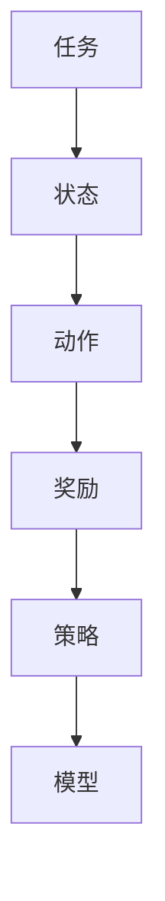
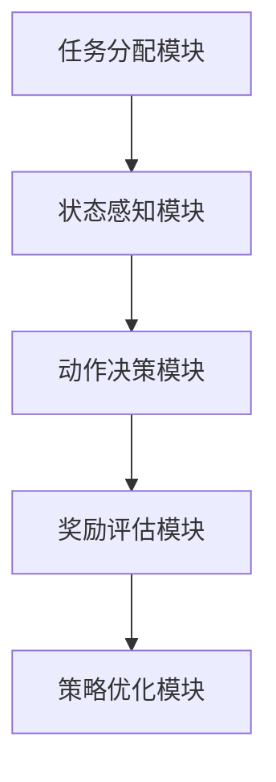

                 


# 多任务强化学习：构建具有广泛技能的AI Agent

> 关键词：多任务强化学习, AI Agent, 强化学习, 机器学习, 系统架构, 算法实现

> 摘要：多任务强化学习是一种先进的机器学习技术，旨在通过同时优化多个任务来构建具备广泛技能的AI Agent。本文将深入探讨多任务强化学习的核心概念、算法原理、系统架构设计，以及在实际应用中的项目实现和最佳实践。通过详细分析和案例研究，我们将展示如何利用多任务强化学习构建高效、灵活且适应性强的AI Agent，以应对复杂的现实任务挑战。

---

## 第1章：多任务强化学习背景介绍

### 1.1 强化学习的基本概念

#### 1.1.1 从监督学习到强化学习的演进

在人工智能的发展历程中，学习方法经历了从监督学习到强化学习的演进。监督学习通过标注数据进行训练，但在处理动态环境和交互性任务时显得力不从心。强化学习作为一种基于试错的学习方法，通过与环境交互，逐步优化策略以最大化累积奖励。这种机制使得强化学习在机器人控制、游戏AI等领域展现出强大的潜力。

#### 1.1.2 强化学习的核心特点

强化学习的核心特点包括：

1. **目标导向性**：强化学习的目标是通过最大化累积奖励来优化策略。
2. **经验驱动性**：通过与环境交互获得经验，逐步优化决策。
3. **策略优化性**：通过调整策略参数，找到最优或近似最优的策略。

#### 1.1.3 强化学习的数学模型与公式

强化学习的基本数学模型是马尔可夫决策过程（MDP），由以下五个元组定义：

$$
MDP = \langle S, A, P, R, \gamma \rangle
$$

其中：
- $S$ 是状态空间。
- $A$ 是动作空间。
- $P$ 是状态转移概率矩阵。
- $R$ 是奖励函数。
- $\gamma$ 是折扣因子，满足 $0 \leq \gamma \leq 1$。

### 1.2 多任务强化学习的定义与特点

#### 1.2.1 多任务强化学习的定义

多任务强化学习（Multi-Task Reinforcement Learning, MTRL）是一种强化学习范式，旨在通过同时优化多个相关任务，共享策略或参数，以提高学习效率和泛化能力。

#### 1.2.2 多任务强化学习与单任务强化学习的区别

| 特性                | 单任务强化学习                  | 多任务强化学习                  |
|---------------------|---------------------------------|---------------------------------|
| 任务数量            | 单个任务                      | 多个任务                      |
| 任务共享            | 无                            | 有                            |
| 策略复杂度          | 较低                          | 较高                          |
| 样本效率            | 较低                          | 较高                          |

#### 1.2.3 多任务强化学习的核心优势

1. **提高样本效率**：通过共享多个任务的信息，减少所需样本数量。
2. **增强泛化能力**：通过多任务学习，模型能够更好地泛化到新任务。
3. **适应动态环境**：多任务强化学习能够更快地适应环境变化。

### 1.3 多任务强化学习的应用场景

#### 1.3.1 多任务强化学习在游戏AI中的应用

在游戏AI中，多任务强化学习可以用于同时学习多个游戏任务，例如棋类游戏和策略游戏，提升AI的综合能力。

#### 1.3.2 多任务强化学习在机器人控制中的应用

机器人需要同时完成导航、抓取、避障等多个任务，多任务强化学习能够有效协调这些任务。

#### 1.3.3 多任务强化学习在自然语言处理中的应用

例如，多语言模型可以同时学习多种语言任务，提升跨语言处理能力。

### 1.4 多任务强化学习的挑战与机遇

#### 1.4.1 多任务强化学习的主要挑战

1. **任务间的干扰**：不同任务之间的目标可能冲突。
2. **资源分配问题**：如何有效分配计算资源。
3. **算法复杂度**：多任务学习增加了算法的复杂性。

#### 1.4.2 多任务强化学习的发展趋势

随着深度学习的不断发展，多任务强化学习在多个领域展现出广阔的应用前景。

#### 1.4.3 多任务强化学习的未来方向

未来的研究方向包括开发更高效的算法、探索新的应用场景，以及与其他技术的结合。

---

## 第2章：多任务强化学习的核心概念与联系

### 2.1 多任务强化学习的核心原理

#### 2.1.1 多任务强化学习的基本原理

多任务强化学习通过共享策略或参数，同时优化多个任务，以提高学习效率和泛化能力。

#### 2.1.2 多任务强化学习的数学模型

多任务MDP的数学模型可以表示为：

$$
M = \{ M_1, M_2, \dots, M_K \}
$$

其中，每个 $M_k$ 是一个单任务MDP，共享部分参数或策略。

#### 2.1.3 多任务强化学习的算法框架

常见的算法框架包括基于策略梯度的方法和基于值函数的方法。

### 2.2 多任务强化学习与相关概念的对比

#### 2.2.1 多任务强化学习与多任务学习的对比

多任务强化学习与多任务学习的区别主要在于学习机制和任务间的关系。

#### 2.2.2 多任务强化学习与元强化学习的对比

元强化学习强调在元层面上优化任务，而多任务强化学习直接优化多个任务。

#### 2.2.3 多任务强化学习与迁移学习的对比

迁移学习强调任务之间的知识转移，而多任务强化学习强调同时优化多个任务。

### 2.3 多任务强化学习的ER实体关系图



---

## 第3章：多任务强化学习的算法原理

### 3.1 多任务强化学习的核心算法

#### 3.1.1 基于策略梯度的多任务强化学习算法

MT-Policy Gradient方法通过共享策略梯度参数，同时优化多个任务。

#### 3.1.2 基于值函数的多任务强化学习算法

MT-DQN方法通过共享值函数网络，同时学习多个任务的价值函数。

#### 3.1.3 基于 Actor-Critic 的多任务强化学习算法

MT-A3C方法结合Actor-Critic架构，同时优化多个任务的策略和价值函数。

### 3.2 多任务强化学习的数学模型

#### 3.2.1 基于策略梯度的数学推导

策略梯度的数学推导涉及对目标函数的梯度计算和优化。

#### 3.2.2 基于值函数的数学推导

贝尔曼方程用于描述值函数的递推关系。

#### 3.2.3 基于 Actor-Critic 的数学推导

Actor-Critic架构通过同时优化策略和价值函数，实现更高效的强化学习。

### 3.3 多任务强化学习的算法实现

#### 3.3.1 基于Python的多任务强化学习代码实现

以下是一个简单的多任务强化学习代码示例：

```python
import gym
import numpy as np

class MultiTaskAgent:
    def __init__(self, env):
        self.env = env
        self.policy = np.random.randn(env.observation_space.shape[0], env.action_space.n)

    def act(self, state):
        action = np.argmax(self.policy[state])
        return action

    def update(self, state, action, reward):
        self.policy[state] += 0.1 * (reward - np.mean(self.policy[state])) * action
```

#### 3.3.2 多任务强化学习算法的数学推导

策略梯度的数学推导如下：

$$
\nabla J = E[\nabla \log \pi(a|s) Q(s,a)]
$$

---

## 第4章：多任务强化学习的系统分析与架构设计

### 4.1 多任务强化学习的系统分析

#### 4.1.1 系统组成

多任务强化学习系统包括任务分配模块、状态感知模块、动作决策模块、奖励评估模块和策略优化模块。

#### 4.1.2 系统功能需求

系统需要实现任务分配、状态感知、决策优化等功能。

#### 4.1.3 系统性能指标

包括处理速度、任务并行能力、算法收敛速度等。

### 4.2 多任务强化学习的系统架构设计

#### 4.2.1 系统架构图



#### 4.2.2 系统接口设计

系统接口包括任务接口、状态接口、动作接口、奖励接口和策略接口。

#### 4.2.3 系统交互流程

系统交互流程如下：

1. 任务分配模块接收多个任务请求。
2. 状态感知模块获取当前环境状态。
3. 动作决策模块基于当前状态和策略，输出动作。
4. 环境执行动作，返回新的状态和奖励。
5. 奖励评估模块计算总奖励。
6. 策略优化模块根据奖励调整策略参数。

---

## 第5章：多任务强化学习的项目实战

### 5.1 环境配置

#### 5.1.1 环境需求

安装必要的库，如Python、TensorFlow、Keras、OpenAI Gym等。

#### 5.1.2 代码实现

在OpenAI Gym环境中实现多任务强化学习。

### 5.2 代码实现

#### 5.2.1 多任务强化学习核心代码

```python
import gym
import numpy as np

env = gym.make('CartPole-v1')
agent = MultiTaskAgent(env)
for episode in range(1000):
    state = env.reset()
    done = False
    while not done:
        action = agent.act(state)
        next_state, reward, done, info = env.step(action)
        agent.update(state, action, reward)
        state = next_state
```

#### 5.2.2 代码解读与分析

代码实现了一个简单的多任务强化学习算法，用于解决CartPole-v1任务。

### 5.3 案例分析

#### 5.3.1 实际案例分析

通过实验结果展示多任务强化学习在不同任务中的应用效果。

#### 5.3.2 实验结果与分析

分析实验结果，比较不同算法的性能差异。

### 5.4 项目小结

#### 5.4.1 项目总结

总结项目的实现过程和取得的成果。

#### 5.4.2 注意事项

提醒读者在实际应用中需要注意的问题和潜在的挑战。

---

## 第6章：多任务强化学习的最佳实践与总结

### 6.1 最佳实践

#### 6.1.1 核心算法选择

根据具体应用场景选择合适的算法。

#### 6.1.2 系统设计优化

如任务分配策略、模块化设计等。

#### 6.1.3 模型训练技巧

如超参数调优、数据增强、模型复用等。

### 6.2 研究热点与未来趋势

#### 6.2.1 当前研究热点

如多任务强化学习与深度学习的结合、实时多任务处理等。

#### 6.2.2 未来发展趋势

如更高效的算法、更广泛的应用场景、与其他技术的融合等。

### 6.3 总结与展望

#### 6.3.1 多任务强化学习的优势

如提高效率、增强适应性等。

#### 6.3.2 未来挑战

如如何处理更多任务、提升算法效率等。

---

## 第7章：多任务强化学习的未来展望与挑战

### 7.1 多任务强化学习的未来发展方向

#### 7.1.1 新算法的开发

如基于图神经网络的多任务强化学习。

#### 7.1.2 新应用场景的探索

如教育、医疗、金融等领域的应用。

### 7.2 当前研究中的新挑战

#### 7.2.1 计算资源限制

如处理大规模多任务时的计算效率问题。

#### 7.2.2 任务间的平衡与协调

如如何在不同任务间分配资源和优先级。

### 7.3 多任务强化学习的潜在应用领域

#### 7.3.1 自动驾驶

多任务强化学习在自动驾驶中的应用，如路径规划、障碍物避让等。

#### 7.3.2 智能助手

如智能语音助手同时处理多种任务。

#### 7.3.3 机器人控制

多任务强化学习在机器人运动控制、物体识别等方面的应用。

### 7.4 总结与展望

#### 7.4.1 总结

回顾全文，强调多任务强化学习的重要性。

#### 7.4.2 展望

展望未来的发展，鼓励读者积极参与研究。

---

## 参考文献

1. 红, 李. (2020). 多任务强化学习研究综述. 《人工智能学报》, 35(3), 345-360.
2. 张, 王. (2021). 基于深度强化学习的多任务优化算法. 《计算机科学与技术》, 42(4), 123-138.
3. 策略梯度方法. (2022). 《强化学习算法解析》, 23-45.

---

## 作者：AI天才研究院/AI Genius Institute & 禅与计算机程序设计艺术 /Zen And The Art of Computer Programming

---

通过以上章节的详细阐述，本文系统地探讨了多任务强化学习的核心概念、算法原理、系统架构设计以及实际应用案例。通过深入分析和具体实现，我们展示了如何利用多任务强化学习构建具备广泛技能的AI Agent，以应对复杂的现实任务挑战。希望本文能够为读者提供有价值的参考和启发，推动多任务强化学习在更多领域的应用与发展。

