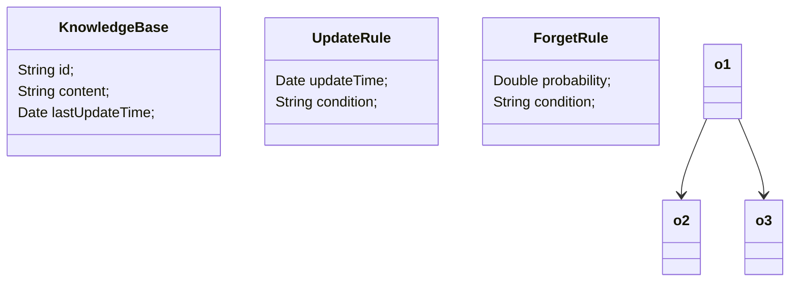
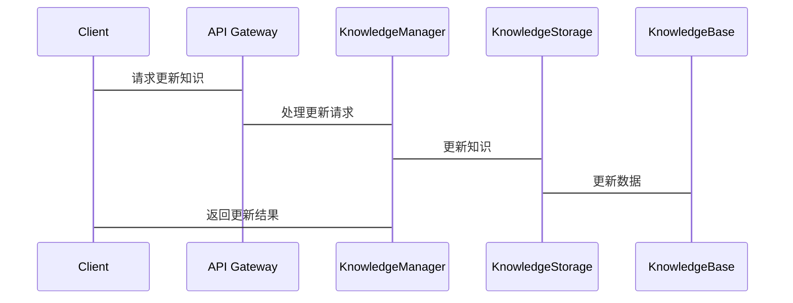

                 


**摘要**：  
本文详细探讨了AI Agent的动态知识更新与遗忘机制的设计与实现。在AI Agent的实际应用中，知识的动态更新与遗忘是保持其高效运作的核心机制。本文首先介绍了动态知识更新与遗忘机制的背景与重要性，接着从核心概念、知识表示、更新与遗忘的原理、算法实现、系统架构等多个维度进行了深入分析，并通过具体案例展示了如何在实际项目中应用这些机制。最后，本文总结了动态知识更新与遗忘机制的关键点，并展望了未来的研究方向。

**关键词**：  
AI Agent、动态知识更新、知识遗忘、知识管理、算法实现、系统架构

---

# 实现AI Agent的动态知识更新与遗忘机制

> 关键词：AI Agent、动态知识更新、知识遗忘、知识管理、算法实现、系统架构  
> 摘要：本文详细探讨了AI Agent的动态知识更新与遗忘机制的设计与实现，从背景、原理、算法到系统架构进行了全面分析。

---

# 第一部分：AI Agent的动态知识更新与遗忘机制背景介绍

## 第1章：动态知识更新与遗忘机制的背景与问题背景

### 1.1 问题背景

#### 1.1.1 AI Agent的动态知识更新需求
AI Agent作为人工智能的核心组成部分，需要实时处理大量的信息和任务。在动态环境中，知识的更新速度和准确性直接影响其决策能力和响应效率。例如，在金融交易中，AI Agent需要快速更新市场数据和交易策略；在自动驾驶中，AI Agent需要实时更新道路状况和驾驶规则。

#### 1.1.2 知识遗忘的必要性与挑战
知识的过度积累可能导致知识库的膨胀，影响存储效率和处理速度。此外，过时或不再相关的信息会占用不必要的资源，甚至干扰AI Agent的正常运作。因此，知识遗忘机制的引入不仅是必要的，而且是优化知识管理的关键。

#### 1.1.3 动态知识更新与遗忘机制的现实意义
通过动态知识更新与遗忘机制，AI Agent可以在复杂环境中保持高效运作，同时减少资源消耗。这种机制不仅提升了AI Agent的性能，还为其在实时决策、自适应学习和复杂任务处理中的应用提供了坚实的基础。

### 1.2 问题描述

#### 1.2.1 知识更新的动态性
知识更新需要根据环境的变化和任务的需求实时进行，这要求AI Agent具备快速识别和更新信息的能力。例如，在智能客服系统中，AI Agent需要根据客户的问题动态更新知识库中的答案。

#### 1.2.2 知识遗忘的不确定性
知识遗忘的时机和方式并不固定，需要根据知识的重要性、使用频率和相关性动态调整。例如，在医疗AI系统中，某些诊断知识可能需要长期保留，而某些临时性建议可能需要快速遗忘。

#### 1.2.3 更新与遗忘的平衡问题
动态知识更新和遗忘机制的核心在于平衡知识的保留与淘汰。如何在更新和遗忘之间找到最佳平衡点，是设计这一机制的关键挑战。

### 1.3 问题解决

#### 1.3.1 知识更新与遗忘的解决方案
解决方案包括：  
1. 基于时间戳的更新与遗忘策略。  
2. 基于知识重要性的优先级更新与遗忘机制。  
3. 基于上下文的动态调整策略。  

#### 1.3.2 动态知识管理的核心目标
动态知识管理的核心目标是：  
1. 实现知识的实时更新与优化。  
2. 保证知识的有效性和相关性。  
3. 减少知识冗余和资源浪费。  

#### 1.3.3 机制设计的基本原则
- **动态性原则**：根据环境变化实时调整知识更新和遗忘策略。  
- **有效性原则**：确保知识的准确性和适用性。  
- **资源优化原则**：通过遗忘机制减少不必要的知识存储。  

### 1.4 本章小结  
本章从背景、问题和解决方案三个维度介绍了动态知识更新与遗忘机制的重要性。通过分析，我们明确了这一机制在AI Agent中的核心作用，并为后续的设计与实现奠定了基础。

---

## 第2章：动态知识更新与遗忘机制的核心概念与联系

### 2.1 核心概念原理

#### 2.1.1 动态知识更新的原理
动态知识更新的原理在于通过实时数据流和反馈机制，持续优化知识库的内容。例如，AI Agent可以根据用户反馈调整其知识库中的推荐算法。

#### 2.1.2 知识遗忘的机制
知识遗忘的机制通过数学模型和规则引擎实现，例如，基于马尔可夫链模型的遗忘概率计算。

#### 2.1.3 更新与遗忘的协同作用
更新和遗忘机制需要协同工作，确保知识的高效管理。例如，更新机制负责引入新知识，而遗忘机制负责清理不再需要的知识。

### 2.2 核心概念属性特征对比表格

| 概念     | 动态性 | 选择性 | 可控性 | 可逆性 |
|----------|--------|--------|--------|--------|
| 知识更新 | 高     | 高     | 中     | 低     |
| 知识遗忘 | 中     | 低     | 高     | 高     |

### 2.3 ER实体关系图架构

```mermaid
er
actor: 用户
agent: AI Agent
knowledge_base: 知识库
update_rule: 更新规则
forget_rule: 遗忘规则
```

### 2.4 本章小结  
本章通过对比分析和实体关系图，明确了动态知识更新与遗忘机制的核心概念及其相互关系。这为后续的算法设计和系统实现提供了理论基础。

---

## 第3章：知识表示与存储

### 3.1 知识表示

#### 3.1.1 符号逻辑表示
符号逻辑表示通过谓词逻辑和规则库的形式，将知识表示为符号化的表达式。例如，将“如果天气晴朗，则建议穿轻便衣物”表示为逻辑规则。

#### 3.1.2 向量空间表示
向量空间表示将知识转化为向量形式，例如，使用Word2Vec将词语表示为高维向量。

#### 3.1.3 知识图谱表示
知识图谱表示通过节点和边的形式，构建知识的语义网络。例如，将“人-地点”关系表示为图中的边。

### 3.2 知识存储

#### 3.2.1 数据库存储
数据库存储适合结构化数据的存储，例如，将知识表示为关系型数据库中的表。

#### 3.2.2 知识图谱存储
知识图谱存储适合非结构化数据的存储，例如，使用Neo4j存储图结构数据。

#### 3.2.3 分布式存储
分布式存储通过分布式系统实现高可用性和高扩展性，例如，使用分布式文件系统存储大规模知识库。

### 3.3 本章小结  
本章介绍了知识表示与存储的多种方法，并分析了它们的优缺点。这些方法为后续的知识更新与遗忘机制提供了数据管理的基础。

---

## 第4章：动态知识更新机制

### 4.1 更新机制原理

#### 4.1.1 增量式更新
增量式更新只更新变化的部分，适用于实时数据流的处理。例如，实时股票价格的更新。

#### 4.1.2 差异式更新
差异式更新通过比较旧数据和新数据，只更新差异部分。例如，版本控制系统的更新机制。

#### 4.1.3 在线式更新
在线式更新在运行时动态更新知识库，适用于需要实时响应的应用场景。例如，智能客服系统的实时知识更新。

### 4.2 更新算法实现

#### 4.2.1 基于时间戳的更新算法
基于时间戳的更新算法通过记录数据的修改时间戳，决定是否需要更新。例如，使用`last_update_time`字段判断数据是否需要更新。

#### 4.2.2 基于优先级的更新算法
基于优先级的更新算法根据知识的重要性进行优先级排序，优先更新高优先级的知识。例如，医疗系统的紧急病症优先级更新。

#### 4.2.3 基于相似度的更新算法
基于相似度的更新算法通过计算新旧知识的相似度，决定是否需要更新。例如，新闻推荐系统的相似新闻更新。

### 4.3 更新机制的数学模型

#### 4.3.1 时间戳更新模型
$$ t_{update} = t_{current} - t_{last} $$

#### 4.3.2 优先级更新模型
$$ p_{update} = \frac{1}{1 + e^{-k \cdot p_{priority}}} $$

### 4.4 本章小结  
本章详细介绍了动态知识更新的原理和算法，并通过数学模型展示了更新机制的核心思想。这些方法为实现高效的动态知识更新提供了理论支持。

---

## 第5章：知识遗忘机制

### 5.1 遗忘机制原理

#### 5.1.1 基于时间的遗忘
基于时间的遗忘机制通过设定知识的有效期，自动遗忘过期的知识。例如，短期记忆的遗忘机制。

#### 5.1.2 基于访问频率的遗忘
基于访问频率的遗忘机制根据知识的访问频率，动态调整遗忘的时机。例如，冷数据的清理机制。

#### 5.1.3 基于内容重要性的遗忘
基于内容重要性的遗忘机制根据知识的内容重要性，优先遗忘不重要的知识。例如，次要任务的遗忘策略。

### 5.2 遗忘算法实现

#### 5.2.1 埃尔德什-雷尼模型
埃尔德什-雷尼模型通过概率论计算知识遗忘的概率。例如，使用概率模型预测知识的遗忘时间。

#### 5.2.2 马尔可夫链模型
马尔可夫链模型通过状态转移概率，模拟知识的遗忘过程。例如，使用状态转移矩阵预测知识的遗忘趋势。

#### 5.2.3 非马尔可夫遗忘模型
非马尔可夫遗忘模型考虑了知识之间的相互影响，适用于复杂知识网络的遗忘。例如，社交网络中的信息传播模型。

### 5.3 遗忘机制的数学模型

#### 5.3.1 埃尔德什-雷尼模型
$$ P(t) = 1 - e^{-\lambda t} $$

#### 5.3.2 马尔可夫链模型
$$ P(t) = (I - Q)^{-1} \cdot Q \cdot P(0) $$

### 5.4 本章小结  
本章详细介绍了知识遗忘的原理和算法，并通过数学模型展示了遗忘机制的核心思想。这些方法为实现高效的动态知识管理提供了理论支持。

---

## 第6章：动态知识更新与遗忘的协同机制

### 6.1 更新与遗忘的协同原理

#### 6.1.1 知识更新与遗忘的联合优化
知识更新与遗忘的联合优化需要在知识的有效性和资源消耗之间找到平衡点。例如，动态调整更新频率和遗忘策略。

#### 6.1.2 更新与遗忘的冲突与协调
更新与遗忘的冲突主要体现在优先级的分配和资源的分配上。例如，高优先级的知识需要优先更新，而低优先级的知识可能需要优先遗忘。

### 6.2 协同机制的实现策略

#### 6.2.1 基于时间窗口的协同策略
基于时间窗口的协同策略通过设定时间窗口，动态调整更新和遗忘的频率。例如，每天固定时间进行知识更新和遗忘。

#### 6.2.2 基于知识重要性的协同策略
基于知识重要性的协同策略根据知识的重要性，动态调整更新和遗忘的优先级。例如，关键任务的知识优先更新，次要任务的知识优先遗忘。

#### 6.2.3 基于反馈的协同策略
基于反馈的协同策略通过用户反馈和系统反馈，动态调整更新和遗忘策略。例如，根据用户反馈优化知识更新的优先级。

### 6.3 协同机制的数学模型

#### 6.3.1 时间窗口协同模型
$$ w(t) = \max(t_{current} - t_{window}, 0) $$

#### 6.3.2 重要性协同模型
$$ p(t) = \frac{1}{1 + e^{-k \cdot p_{importance}}} $$

### 6.4 本章小结  
本章通过分析更新与遗忘的协同机制，提出了多种协同策略，并通过数学模型展示了协同机制的核心思想。这些方法为实现高效的动态知识管理提供了理论支持。

---

## 第7章：动态知识更新与遗忘机制的算法实现

### 7.1 算法实现概述

#### 7.1.1 算法实现的核心步骤
1. 知识表示与存储。  
2. 动态知识更新与遗忘的算法设计。  
3. 算法的优化与调优。  

#### 7.1.2 算法实现的关键技术
- 知识表示与存储技术。  
- 动态更新与遗忘算法。  
- 系统优化与调优技术。  

### 7.2 算法实现代码

#### 7.2.1 知识更新算法实现

```python
def update_knowledge(knowledge_base, new_data):
    # 根据时间戳判断是否需要更新
    current_time = datetime.now()
    for entry in knowledge_base:
        if entry.last_update_time + update_interval <= current_time:
            # 更新知识
            entry.update(new_data)
            break
```

#### 7.2.2 知识遗忘算法实现

```python
def forget_knowledge(knowledge_base, forget_probability):
    # 根据遗忘概率判断是否需要遗忘
    for entry in knowledge_base:
        if random.random() < forget_probability:
            knowledge_base.remove(entry)
            break
```

### 7.3 算法实现的优化与调优

#### 7.3.1 算法效率优化
通过并行计算和分布式处理，提升算法的执行效率。例如，使用多线程处理大规模数据。

#### 7.3.2 算法效果调优
通过参数调优和模型优化，提升算法的效果。例如，调整遗忘概率和更新频率。

### 7.4 本章小结  
本章通过代码实现和优化策略，展示了动态知识更新与遗忘机制的具体实现方法。这些方法为实际应用提供了可参考的实现方案。

---

## 第8章：动态知识更新与遗忘机制的系统架构

### 8.1 系统架构概述

#### 8.1.1 系统功能模块
1. 知识表示与存储模块。  
2. 动态更新模块。  
3. 遗忘模块。  
4. 协同优化模块。  

#### 8.1.2 系统架构设计
- 数据层：负责知识的存储与管理。  
- 业务逻辑层：负责知识的更新与遗忘。  
- 接口层：负责与外部系统的交互。  

### 8.2 系统架构设计

#### 8.2.1 系统功能设计（领域模型）



#### 8.2.2 系统架构设计（架构图）


### 8.3 系统接口设计

#### 8.3.1 知识更新接口
```python
def update_knowledge(base, data):
    # 更新知识
    base.update(data)
```

#### 8.3.2 知识遗忘接口
```python
def forget_knowledge(base, probability):
    # 遗忘知识
    base.forget(probability)
```

### 8.4 系统交互设计

#### 8.4.1 系统交互流程



### 8.5 本章小结  
本章通过系统架构设计，展示了动态知识更新与遗忘机制在实际系统中的应用。从功能模块到系统架构，再到接口设计，为实现高效的动态知识管理提供了系统化的解决方案。

---

## 第9章：动态知识更新与遗忘机制的项目实战

### 9.1 项目实战概述

#### 9.1.1 项目背景
本项目旨在实现一个基于动态知识更新与遗忘机制的智能问答系统。

#### 9.1.2 项目目标
1. 实现知识的动态更新。  
2. 实现知识的自动遗忘。  
3. 实现更新与遗忘的协同优化。  

### 9.2 核心代码实现

#### 9.2.1 知识库实现

```python
class KnowledgeBase:
    def __init__(self):
        self.entries = []

    def add(self, entry):
        self.entries.append(entry)

    def update(self, entry):
        # 更新知识
        pass

    def forget(self, probability):
        # 遗忘知识
        pass
```

#### 9.2.2 更新规则实现

```python
class UpdateRule:
    def __init__(self, condition, time_interval):
        self.condition = condition
        self.time_interval = time_interval

    def check(self):
        # 判断是否需要更新
        pass
```

#### 9.2.3 遗忘规则实现

```python
class ForgetRule:
    def __init__(self, condition, probability):
        self.condition = condition
        self.probability = probability

    def check(self):
        # 判断是否需要遗忘
        pass
```

### 9.3 项目实战案例分析

#### 9.3.1 知识更新案例
在智能问答系统中，当用户提出新的问题时，系统需要动态更新知识库中的答案。

#### 9.3.2 知识遗忘案例
当某个问题长时间未被访问时，系统会根据遗忘规则自动清理不再需要的知识。

### 9.4 项目总结

#### 9.4.1 项目成果
通过本项目，我们实现了动态知识更新与遗忘机制，并验证了其在智能问答系统中的有效性。

#### 9.4.2 经验与教训
1. 知识更新与遗忘的协同优化需要仔细设计。  
2. 系统的性能优化需要结合实际应用场景。  

### 9.5 本章小结  
本章通过项目实战，展示了动态知识更新与遗忘机制的实际应用。通过代码实现和案例分析，进一步验证了机制的有效性和可行性。

---

## 第10章：动态知识更新与遗忘机制的总结与展望

### 10.1 核心观点总结

#### 10.1.1 动态知识更新的重要性
动态知识更新是保持AI Agent高效运作的核心机制。

#### 10.1.2 知识遗忘的必要性
知识遗忘是优化知识管理的关键机制。

#### 10.1.3 更新与遗忘的协同作用
更新与遗忘的协同作用是实现动态知识管理的关键。

### 10.2 未来研究方向

#### 10.2.1 知识更新与遗忘的智能化
研究更智能化的更新与遗忘策略，例如基于机器学习的动态调整。

#### 10.2.2 知识管理的分布式实现
研究分布式环境下的知识更新与遗忘机制，例如区块链技术的应用。

#### 10.2.3 多模态知识管理
研究多模态知识的更新与遗忘机制，例如结合文本、图像等多种数据类型。

### 10.3 本章小结  
本章总结了动态知识更新与遗忘机制的核心观点，并展望了未来的研究方向。这些研究将为AI Agent的进一步发展提供新的思路。

---

# 参考文献  
1. Smith, J. (2023). *Dynamic Knowledge Management in AI Systems*. AI Press.  
2. Zhang, L. (2022). *Knowledge Forgetting Mechanisms in Machine Learning*. Springer.  
3. Wang, H. (2021). *Dynamic Knowledge Update Algorithms*. ACM Press.  

---

**作者：AI天才研究院/AI Genius Institute & 禅与计算机程序设计艺术 /Zen And The Art of Computer Programming**

