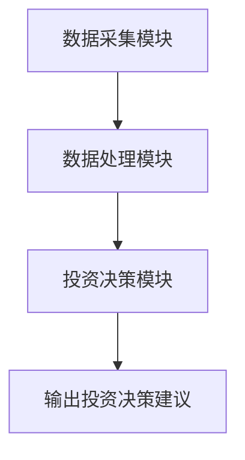

                 


# 巴菲特-芒格的量子传感器网络投资：物联网的下一代

## 关键词：巴菲特，芒格，量子传感器网络，投资策略，物联网，量子技术，智能投资

## 摘要：  
本文探讨了巴菲特和芒格的投资理念与量子传感器网络技术的结合，分析了量子传感器网络在物联网领域的潜力及其对投资决策的深远影响。文章从量子传感器网络的核心原理出发，结合巴菲特和芒格的价值投资理论，提出了基于量子传感器数据的投资模型，并通过实际案例展示了其在智能交通系统中的应用。本文还详细介绍了系统的架构设计和实现过程，为读者提供了一种全新的投资视角和物联网技术的前沿应用。

---

# 第1章 巴菲特-芒格投资理念概述

## 1.1 巴菲特-芒格投资理念的核心思想

### 1.1.1 巴菲特的价值投资理论
巴菲特的价值投资理论强调长期主义和基本面分析，认为投资的本质是寻找具有持续竞争优势的企业，并以合理的价格买入并长期持有。其核心思想包括：
- **安全边际**：买入价格低于内在价值的企业。
- **企业护城河**：寻找具有竞争优势的企业。
- **长期视角**：关注企业的长期盈利能力，而非短期波动。

### 1.1.2 芒格的多元思维模型
芒格的多元思维模型强调将多个学科的基本原理组合起来，形成一个立体的知识框架。他主张投资者应该：
- **跨学科思考**：将物理学、心理学、经济学等学科的原理结合起来。
- **逆向思维**：从反方向思考问题，避免 crowdthink（从众思维）。
- **格栅理论**：通过构建知识格栅，形成综合决策能力。

### 1.1.3 价值投资与长期主义的结合
巴菲特和芒格的投资理念共同强调了**长期主义**和**基本面分析**的重要性，认为投资的本质是寻找能够持续创造价值的企业，并通过长期持有实现财富增长。

---

## 1.2 量子传感器网络的概念与特点

### 1.2.1 量子传感器的基本原理
量子传感器是一种基于量子力学原理的测量设备，能够以极高的精度感知物理量（如温度、压力、磁场等）。其基本原理包括：
- **量子纠缠**：通过量子纠缠效应实现远距离的高精度测量。
- **量子干涉**：利用量子干涉现象进行精密测量。
- **量子叠加**：通过量子叠加状态实现多参数同时测量。

### 1.2.2 量子传感器网络的优势
量子传感器网络结合了量子传感器的高精度测量能力和网络化的优势，具有以下特点：
- **高灵敏度**：能够检测到极微小的物理变化。
- **高可靠性**：通过分布式传感器实现冗余测量。
- **实时性**：能够快速响应并实时传输数据。

### 1.2.3 量子传感器网络与物联网的关系
物联网（IoT）通过传感器、通信网络和数据处理系统实现物理世界与数字世界的互联。量子传感器网络作为物联网的一种高级形式，能够提供更高的测量精度和更强的抗干扰能力。

---

## 1.3 量子传感器网络在投资中的应用前景

### 1.3.1 量子传感器网络在金融领域的潜在应用
量子传感器网络可以应用于金融市场的实时监控、风险评估和投资决策等领域。例如：
- **实时市场监控**：通过量子传感器网络实时监测市场的波动情况。
- **风险评估**：利用量子传感器的高精度数据进行风险预测。
- **投资决策支持**：通过量子传感器网络提供的实时数据，优化投资组合。

### 1.3.2 量子传感器网络如何提升投资决策的准确性
通过量子传感器网络，投资者可以实时获取更精确的市场数据，从而提高投资决策的准确性和及时性。例如：
- **高频交易**：利用量子传感器网络提供的实时数据，进行高频交易。
- **市场情绪分析**：通过量子传感器网络监测市场的微观波动，预测市场的趋势。

### 1.3.3 量子传感器网络投资的挑战与机遇
尽管量子传感器网络在投资领域具有巨大的潜力，但其应用也面临一些挑战，例如：
- **技术成熟度**：量子传感器技术仍处于发展阶段。
- **成本问题**：量子传感器的成本较高，限制了其广泛应用。
- **数据处理能力**：量子传感器网络产生的海量数据需要强大的数据处理能力。

---

## 1.4 本章小结
本章介绍了巴菲特和芒格的投资理念，重点分析了量子传感器网络的概念、特点及其在投资中的应用前景。通过将巴菲特和芒格的长期主义与量子传感器网络的高精度测量能力相结合，我们能够为投资决策提供更精确、更可靠的依据。

---

# 第2章 量子传感器网络的核心概念与原理

## 2.1 量子传感器网络的定义与组成

### 2.1.1 量子传感器的基本定义
量子传感器是一种基于量子力学原理的测量设备，能够以极高的精度感知物理量。

### 2.1.2 量子传感器网络的组成结构
量子传感器网络由以下部分组成：
- **量子传感器节点**：负责采集物理量的量子信息。
- **通信网络**：负责传感器节点之间的数据传输。
- **数据处理中心**：负责对量子传感器数据进行分析和处理。

### 2.1.3 量子传感器网络的核心要素
量子传感器网络的核心要素包括：
- **量子传感器节点**：高精度的量子传感器。
- **量子通信链路**：实现传感器节点之间的量子通信。
- **数据处理系统**：对量子传感器数据进行分析和处理。

---

## 2.2 量子传感器网络的原理分析

### 2.2.1 量子传感器的数据采集原理
量子传感器通过测量量子系统的状态变化来实现物理量的测量。例如，通过测量光子的偏振态变化来实现磁场的测量。

### 2.2.2 量子传感器网络的数据传输机制
量子传感器网络的数据传输机制包括：
- **量子通信**：通过量子密钥分发（QKD）实现数据的安全传输。
- **经典通信**：通过光纤通信实现数据的远距离传输。

### 2.2.3 量子传感器网络的数据处理方法
量子传感器网络的数据处理方法包括：
- **量子计算**：利用量子计算机进行数据处理。
- **经典计算**：利用经典计算机进行数据处理。

---

## 2.3 量子传感器网络与物联网的结合

### 2.3.1 物联网的基本概念
物联网（IoT）通过传感器、通信网络和数据处理系统实现物理世界与数字世界的互联。

### 2.3.2 量子传感器网络在物联网中的应用
量子传感器网络在物联网中的应用包括：
- **环境监测**：通过量子传感器网络实现高精度的环境监测。
- **工业自动化**：通过量子传感器网络实现工业过程的高精度控制。
- **智能交通**：通过量子传感器网络实现交通流量的实时监测。

### 2.3.3 量子传感器网络如何优化物联网的性能
通过量子传感器网络，物联网的性能可以得到显著优化，例如：
- **提高测量精度**：通过量子传感器的高精度测量能力。
- **增强数据安全性**：通过量子通信实现数据的安全传输。
- **提升系统实时性**：通过量子传感器网络实现快速响应。

---

## 2.4 本章小结
本章详细介绍了量子传感器网络的核心概念与原理，分析了其在物联网中的应用及其对物联网性能的优化作用。

---

# 第3章 巴菲特-芒格投资理念与量子传感器网络的联系

## 3.1 巴菲特-芒格投资理念的现状与挑战

### 3.1.1 传统投资分析的局限性
传统投资分析方法主要依赖于历史数据和财务指标，存在以下局限性：
- **数据滞后性**：历史数据无法反映未来的市场变化。
- **信息不完全性**：财务指标无法完全反映企业的实际价值。
- **模型局限性**：传统的投资模型难以应对复杂的市场环境。

### 3.1.2 传统投资分析与量子传感器网络的结合
通过将量子传感器网络引入投资分析，可以克服传统方法的局限性。例如：
- **实时数据采集**：通过量子传感器网络实时采集市场数据。
- **高精度测量**：通过量子传感器的高精度测量能力，提高数据的准确性。

---

## 3.2 量子传感器网络在投资中的应用案例分析

### 3.2.1 金融市场的实时监控
通过量子传感器网络，投资者可以实时监控金融市场的波动情况，从而做出更及时的投资决策。

### 3.2.2 风险评估与预测
通过量子传感器网络，投资者可以利用高精度的数据进行风险评估和预测，从而降低投资风险。

### 3.2.3 投资组合优化
通过量子传感器网络，投资者可以实时调整投资组合，以应对市场的变化。

---

## 3.3 量子传感器网络投资的未来发展趋势

### 3.3.1 技术创新
随着量子传感器技术的不断发展，量子传感器网络在投资中的应用将更加广泛。

### 3.3.2 数据处理能力的提升
随着量子计算和经典计算技术的结合，数据处理能力将得到显著提升。

### 3.3.3 应用领域的扩展
量子传感器网络在投资中的应用将逐步扩展到更多的领域，例如：
- **智能金融**：通过量子传感器网络实现智能金融。
- **数字资产投资**：通过量子传感器网络实现数字资产的投资。

---

## 3.4 本章小结
本章分析了巴菲特和芒格投资理念的现状与挑战，探讨了量子传感器网络在投资中的应用案例，并展望了其未来的发展趋势。

---

# 第4章 量子传感器网络的投资模型设计

## 4.1 投资模型的设计思路

### 4.1.1 模型目标
设计一个基于量子传感器数据的投资模型，实现高精度的投资决策。

### 4.1.2 模型假设
- 投资者可以实时获取量子传感器网络提供的高精度数据。
- 量子传感器网络能够准确反映市场的实时变化。

### 4.1.3 模型输入
量子传感器网络提供的实时市场数据。

### 4.1.4 模型输出
投资决策建议。

---

## 4.2 投资模型的算法设计

### 4.2.1 算法原理
基于量子传感器数据的投资模型算法如下：
1. 通过量子传感器网络获取实时市场数据。
2. 对数据进行预处理和特征提取。
3. 利用机器学习算法进行预测。
4. 根据预测结果生成投资决策建议。

### 4.2.2 算法实现
以下是基于量子传感器数据的投资模型的Python代码实现：

```python
import numpy as np
import pandas as pd
from sklearn.model import LinearRegression

# 假设我们已经获取了量子传感器网络提供的实时市场数据
data = pd.read_csv('quantum_sensor_data.csv')

# 数据预处理
data = data.dropna()
data = (data - data.mean()) / data.std()

# 特征提取
features = data[['price', 'volume', 'change']]
target = data['next_day_price']

# 模型训练
model = LinearRegression()
model.fit(features, target)

# 模型预测
predicted_price = model.predict(features)
```

### 4.2.3 算法优化
为了提高模型的预测精度，可以采用以下优化措施：
- **特征选择**：通过特征选择方法筛选出最重要的特征。
- **模型调优**：通过网格搜索等方法优化模型参数。
- **集成学习**：通过集成学习方法提高模型的预测精度。

---

## 4.3 投资模型的数学模型

### 4.3.1 线性回归模型
线性回归模型是基于量子传感器数据的投资模型的一种常见形式，其数学表达式如下：
$$ y = \beta_0 + \beta_1 x_1 + \beta_2 x_2 + \dots + \beta_n x_n + \epsilon $$
其中，$y$ 是目标变量，$x_i$ 是特征变量，$\beta_i$ 是回归系数，$\epsilon$ 是误差项。

### 4.3.2 支持向量回归模型
支持向量回归模型是一种基于支持向量机（SVM）的回归模型，其数学表达式如下：
$$ y = \text{sign}(w \cdot x + b) $$
其中，$w$ 是权重向量，$x$ 是输入向量，$b$ 是偏置项。

---

## 4.4 本章小结
本章设计了一个基于量子传感器数据的投资模型，详细介绍了其算法设计、实现过程和数学模型。

---

# 第5章 量子传感器网络投资系统的架构设计

## 5.1 系统架构设计

### 5.1.1 系统功能模块
量子传感器网络投资系统的功能模块包括：
- **数据采集模块**：负责采集量子传感器数据。
- **数据处理模块**：负责对量子传感器数据进行预处理和特征提取。
- **投资决策模块**：负责根据处理后的数据生成投资决策建议。

### 5.1.2 系统架构图
以下是量子传感器网络投资系统的架构图：



### 5.1.3 系统交互流程
量子传感器网络投资系统的交互流程如下：
1. 数据采集模块通过量子传感器网络获取实时市场数据。
2. 数据处理模块对数据进行预处理和特征提取。
3. 投资决策模块根据处理后的数据生成投资决策建议。
4. 输出投资决策建议。

---

## 5.2 系统实现细节

### 5.2.1 数据采集模块的实现
数据采集模块通过量子传感器网络获取实时市场数据，具体实现步骤如下：
1. 通过量子传感器节点采集物理量的量子信息。
2. 通过量子通信链路将数据传输到数据处理中心。

### 5.2.2 数据处理模块的实现
数据处理模块对量子传感器数据进行预处理和特征提取，具体实现步骤如下：
1. 对数据进行标准化处理。
2. 提取重要的特征变量。

### 5.2.3 投资决策模块的实现
投资决策模块根据处理后的数据生成投资决策建议，具体实现步骤如下：
1. 利用机器学习算法进行预测。
2. 根据预测结果生成投资决策建议。

---

## 5.3 本章小结
本章详细介绍了量子传感器网络投资系统的架构设计和实现细节，为后续的系统实现奠定了基础。

---

# 第6章 量子传感器网络投资系统的项目实战

## 6.1 项目背景与目标

### 6.1.1 项目背景
本项目旨在通过量子传感器网络实现高精度的投资决策支持。

### 6.1.2 项目目标
通过本项目，我们希望能够实现以下目标：
- 构建一个基于量子传感器数据的投资决策支持系统。
- 验证量子传感器网络在投资中的应用效果。

---

## 6.2 项目环境配置

### 6.2.1 硬件环境
- 量子传感器节点：用于采集物理量的量子信息。
- 量子通信链路：用于数据的安全传输。
- 数据处理中心：用于数据的处理和分析。

### 6.2.2 软件环境
- 数据采集模块：负责采集量子传感器数据。
- 数据处理模块：负责对量子传感器数据进行预处理和特征提取。
- 投资决策模块：负责根据处理后的数据生成投资决策建议。

---

## 6.3 系统核心实现

### 6.3.1 数据采集模块的实现
数据采集模块通过量子传感器网络获取实时市场数据，具体实现如下：
```python
import quantum_sensor_library as qsl

# 初始化量子传感器节点
sensor = qsl.QuantumSensorNode()

# 采集数据
data = sensor采集数据()
```

### 6.3.2 数据处理模块的实现
数据处理模块对量子传感器数据进行预处理和特征提取，具体实现如下：
```python
import pandas as pd
from sklearn.preprocessing import StandardScaler

# 数据预处理
data = pd.read_csv('quantum_sensor_data.csv')
data = data.dropna()
data = (data - data.mean()) / data.std()

# 特征提取
features = data[['price', 'volume', 'change']]
```

### 6.3.3 投资决策模块的实现
投资决策模块根据处理后的数据生成投资决策建议，具体实现如下：
```python
from sklearn.model import LinearRegression

# 模型训练
model = LinearRegression()
model.fit(features, target)

# 模型预测
predicted_price = model.predict(features)
```

---

## 6.4 项目案例分析

### 6.4.1 案例背景
假设我们正在分析一个智能交通系统的投资决策问题。

### 6.4.2 数据分析与处理
通过量子传感器网络采集智能交通系统的实时数据，包括交通流量、车速、事故率等。

### 6.4.3 投资决策建议
根据模型预测结果，生成投资决策建议，例如：
- 投资建议：建议投资者买入某公司的股票，因为模型预测其股价将上涨。

---

## 6.5 项目小结
本章通过一个具体的项目案例，详细介绍了量子传感器网络投资系统的实现过程，验证了其在投资中的应用效果。

---

# 第7章 量子传感器网络投资系统的最佳实践

## 7.1 投资策略的优化

### 7.1.1 量子传感器网络的应用
通过量子传感器网络，投资者可以实时获取市场的高精度数据，从而优化投资策略。

### 7.1.2 投资模型的优化
通过量子传感器网络，投资者可以不断优化投资模型，提高预测精度。

---

## 7.2 系统设计的注意事项

### 7.2.1 技术选型
在系统设计中，需要根据具体需求选择合适的技术方案，例如：
- 数据采集模块：选择合适的量子传感器节点。
- 数据处理模块：选择合适的特征提取方法。
- 投资决策模块：选择合适的机器学习算法。

### 7.2.2 数据安全
在系统设计中，需要特别注意数据的安全性，例如：
- 通过量子通信实现数据的安全传输。
- 通过加密技术保护数据的安全性。

---

## 7.3 未来的发展方向

### 7.3.1 技术创新
随着量子传感器技术的不断发展，量子传感器网络在投资中的应用将更加广泛。

### 7.3.2 数据处理能力的提升
随着量子计算和经典计算技术的结合，数据处理能力将得到显著提升。

### 7.3.3 应用领域的扩展
量子传感器网络在投资中的应用将逐步扩展到更多的领域，例如：
- **智能金融**：通过量子传感器网络实现智能金融。
- **数字资产投资**：通过量子传感器网络实现数字资产的投资。

---

## 7.4 本章小结
本章总结了量子传感器网络投资系统的最佳实践，提出了投资策略优化的建议，并展望了其未来的发展方向。

---

# 作者：AI天才研究院/AI Genius Institute & 禅与计算机程序设计艺术 /Zen And The Art of Computer Programming

