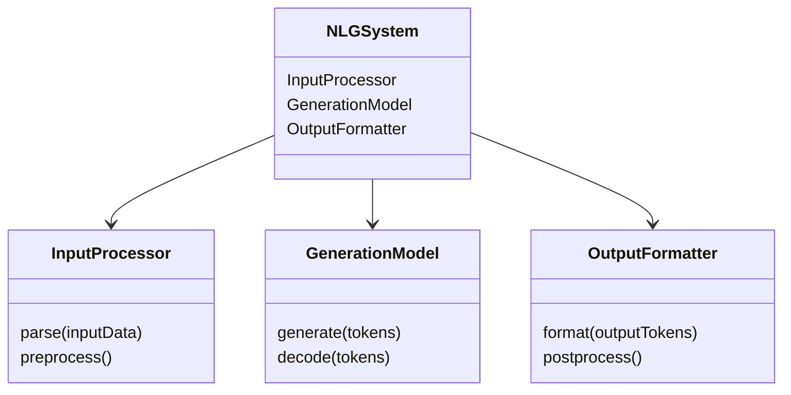
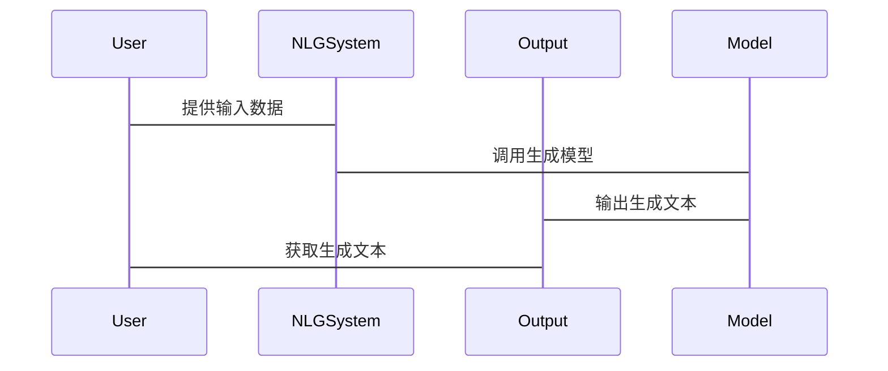

                 


# 自然语言生成（NLG）：优化AI Agent的表达能力

## 关键词：自然语言生成，AI Agent，文本生成，语言模型，深度学习，NLP，生成式AI

## 摘要：自然语言生成（NLG）是人工智能领域的重要技术，旨在将结构化数据转化为自然语言文本。本文系统地探讨了NLG的核心概念、算法原理、系统架构以及实际应用。通过分析不同生成方法的优缺点，结合深度学习模型的最新进展，本文为AI Agent的表达能力优化提供了理论基础和实践指导。从基础概念到数学模型，从算法实现到系统设计，本文全面解析了NLG技术的关键环节，并通过实际案例展示了如何将理论应用于实践，最终为读者呈现了一幅完整的NLG技术图景。

---

# 第1章: 自然语言生成（NLG）概述

## 1.1 自然语言生成的基本概念

### 1.1.1 自然语言生成的定义与背景

自然语言生成（Natural Language Generation, NLG）是人工智能领域的重要分支，旨在将结构化数据（如数据库、知识图谱或逻辑推理结果）转化为自然语言文本。随着深度学习技术的快速发展，NLG技术已经广泛应用于对话系统、机器翻译、文本摘要、内容生成等领域。

从技术背景来看，NLG的发展经历了以下几个阶段：
1. **基于规则的生成（早期阶段）**：依赖人工定义的语法规则，生成文本的质量受限于规则的完备性。
2. **统计模型驱动的生成（传统机器学习阶段）**：通过统计语言模型和特征工程，提升了生成的多样性和自然度。
3. **深度学习驱动的生成（当前主流）**：基于神经网络（如Transformer）的生成模型，显著提高了生成文本的质量和流畅性。

---

### 1.1.2 NLG的核心目标与应用场景

NLG的核心目标是通过算法生成与人类语言表达习惯一致的自然语言文本。具体目标包括：
1. **语义准确性**：生成的文本应准确反映输入数据的语义信息。
2. **语言自然性**：生成的文本应符合自然语言的语法和表达习惯。
3. **多样性与创造性**：在生成文本时，能够提供多种表达方式，甚至具备一定的创造性。

在实际应用中，NLG技术主要应用于以下几个领域：
- **对话系统**：生成自然的对话回复，提升用户体验。
- **机器翻译**：将源语言文本翻译为目标语言，同时保持语义不变。
- **文本摘要**：将长文本压缩为简洁的摘要，保留关键信息。
- **内容生成**：自动生成新闻、报告、产品描述等文本内容。
- **教育与辅助工具**：为学习者提供个性化的反馈和解释。

---

### 1.1.3 NLG与AI Agent的关系

AI Agent（智能体）是指能够感知环境并采取行动以实现目标的智能系统。NLG技术在AI Agent中的作用至关重要，主要体现在以下几个方面：
1. **人机交互**：AI Agent需要通过自然语言与用户进行交流，NLG技术使其能够生成符合人类习惯的回复。
2. **信息处理**：AI Agent需要将感知到的信息（如数据、图像、语音）转化为自然语言文本，以便用户理解和使用。
3. **决策支持**：AI Agent可以通过NLG技术生成决策建议、解释和反馈，帮助用户更好地理解和执行决策。

---

## 1.2 自然语言生成的关键技术

### 1.2.1 基于规则的生成方法

基于规则的生成方法依赖于人工定义的语法规则和知识库。这种方法适用于特定领域（如医疗、法律）的文本生成，但由于规则的复杂性和维护成本较高，难以应对复杂多变的语言表达需求。

**优缺点：**
- **优点**：生成文本的可控制性高，适合特定领域。
- **缺点**：灵活性差，难以处理复杂的语言现象。

---

### 1.2.2 统计模型与机器学习方法

统计模型通过分析大量文本数据，提取语言规律并生成文本。基于机器学习的生成方法（如循环神经网络RNN）进一步提升了生成文本的质量。

**优缺点：**
- **优点**：生成文本的多样性和自然度较高。
- **缺点**：训练数据依赖性强，生成结果可能缺乏逻辑性和准确性。

---

### 1.2.3 当前主流的深度学习模型

当前，基于深度学习的生成模型（如Transformer）已经成为NLG领域的主流方法。这些模型通过多层神经网络捕捉语言的复杂模式，生成高质量的自然语言文本。

**优缺点：**
- **优点**：生成文本的质量和流畅性显著提升，适用于多种应用场景。
- **缺点**：计算资源消耗较高，训练和推理成本较大。

---

## 1.3 自然语言生成的挑战与未来方向

### 1.3.1 生成内容的准确性与可解释性

生成文本的准确性是NLG技术的核心挑战。尤其是在涉及专业知识或复杂逻辑的场景中，生成文本的准确性直接关系到AI Agent的可信度。

### 1.3.2 多语言与跨文化生成问题

跨语言和跨文化生成要求NLG系统能够适应不同语言和文化背景下的表达习惯。这需要模型具备多语言处理能力，并能够理解不同文化中的语境和隐含意义。

### 1.3.3 自然语言生成的未来发展趋势

未来的NLG技术将朝着以下几个方向发展：
1. **多模态生成**：结合图像、语音等多种模态信息，生成更丰富的文本内容。
2. **可解释性增强**：提升生成过程的透明度，使用户能够理解生成文本的逻辑和依据。
3. **实时生成优化**：在实时交互场景中，优化生成速度和响应时间。

---

## 1.4 本章小结

本章从基本概念出发，介绍了NLG的核心目标、关键技术以及与AI Agent的关系。通过对比不同生成方法的优缺点，我们分析了当前NLG技术的发展现状和未来趋势。下一章将深入探讨NLG的核心概念与原理，为后续的算法实现奠定基础。

---

# 第2章: 自然语言生成的核心概念与原理

## 2.1 自然语言生成的输入与输出

### 2.1.1 输入数据的类型与结构

NLG系统的输入数据可以是结构化数据（如数据库表）、半结构化数据（如JSON、XML）或无结构化数据（如文本）。输入数据的结构直接影响生成文本的质量和效率。

---

### 2.1.2 输出文本的特征与质量评估

生成文本的质量评估可以从以下几个维度进行：
1. **准确性**：生成文本是否准确反映输入数据的语义信息。
2. **流畅性**：生成文本是否符合自然语言的语法和表达习惯。
3. **相关性**：生成文本是否与用户需求或上下文相关。
4. **多样性**：生成文本是否提供多种表达方式。

---

## 2.2 自然语言生成的生成过程

### 2.2.1 基于模板的生成流程

基于模板的生成方法通过预定义的模板和规则，将结构化数据映射为自然语言文本。这种方法适用于特定领域（如财务报告）的文本生成。

**优缺点：**
- **优点**：生成速度快，规则清晰，易于控制。
- **缺点**：灵活性差，难以应对复杂多变的语言表达需求。

---

### 2.2.2 数据驱动的生成流程

数据驱动的生成方法依赖于大量文本数据，通过统计分析或深度学习模型生成文本。这种方法适用于需要高多样性和自然度的场景。

---

### 2.2.3 混合生成方法的优缺点

混合生成方法结合了基于规则和数据驱动的优点，通过灵活的策略生成高质量文本。

**优缺点：**
- **优点**：生成文本的质量和灵活性较高。
- **缺点**：实现复杂，需要平衡规则和数据驱动的策略。

---

## 2.3 自然语言生成的评价指标

### 2.3.1 基于人工评估的指标

人工评估是NLG系统质量评估的重要手段，主要包括主观评价和客观评价。

---

### 2.3.2 基于自动评估的指标

基于自动评估的指标主要依赖于数学公式，常用的指标包括BLEU、ROUGE、METEOR等。

---

### 2.3.3 综合评估方法的探讨

综合评估方法结合了人工评估和自动评估的优势，能够更全面地评估NLG系统的质量。

---

## 2.4 自然语言生成的数学模型

### 2.4.1 生成模型的数学表达

生成模型的数学表达通常包括概率分布、损失函数和优化目标等。

---

### 2.4.2 概率模型与生成模型的对比

概率模型和生成模型在目标和实现方式上存在显著差异。

---

### 2.4.3 常见的生成模型公式

常用的生成模型公式包括最大似然估计（MLE）、变分自编码器（VAE）和生成对抗网络（GAN）等。

---

## 2.5 本章小结

本章详细探讨了NLG的输入与输出、生成过程、评价指标以及数学模型。通过对比不同生成方法的优缺点，我们为后续的算法实现奠定了理论基础。下一章将重点讲解自然语言生成的算法原理与实现。

---

# 第3章: 自然语言生成的算法原理与实现

## 3.1 基于规则的生成算法

### 3.1.1 规则生成的基本原理

基于规则的生成算法通过预定义的语法规则和模板生成文本。

---

### 3.1.2 规则库的构建与优化

规则库的构建需要结合领域知识和语言学知识，确保生成文本的准确性和自然度。

---

### 3.1.3 基于规则生成的优缺点

基于规则的生成算法具有生成速度快、规则清晰等优点，但灵活性较低。

---

## 3.2 统计模型与机器学习方法

### 3.2.1 统计机器翻译模型的启发

统计机器翻译模型为NLG技术提供了重要的启发，特别是在处理大规模文本数据方面。

---

### 3.2.2 基于神经网络的生成模型

基于神经网络的生成模型（如RNN和Transformer）已经成为NLG领域的主流方法。

---

### 3.2.3 现代深度学习模型的改进

现代深度学习模型通过引入注意力机制、多层网络等技术，进一步提升了生成文本的质量。

---

## 3.3 基于Transformer的生成模型

### 3.3.1 Transformer模型的基本结构

Transformer模型通过自注意力机制和前馈网络，实现了高效的文本生成。

---

### 3.3.2 解码器的生成机制

解码器通过逐步生成文本，结合上下文信息，确保生成文本的连贯性。

---

### 3.3.3 多层Transformer的优化策略

多层Transformer通过堆叠多个Transformer层，进一步提升了生成文本的深度和复杂度。

---

## 3.4 自然语言生成的训练与优化

### 3.4.1 损失函数的定义与优化

生成模型的训练目标是最小化损失函数，常用的损失函数包括交叉熵损失。

---

### 3.4.2 前缀生成与贪心搜索策略

前缀生成和贪心搜索策略是常用的生成方法，贪心搜索通过逐步选择概率最高的词生成文本。

---

### 3.4.3 生成过程中的温度与采样方法

温度和采样方法（如随机采样、最高概率采样）能够调节生成文本的多样性和创造性。

---

## 3.5 自然语言生成的Python代码实现

### 3.5.1 环境安装

安装必要的Python库（如TensorFlow、PyTorch、Hugging Face的Transformers库）。

---

### 3.5.2 系统核心实现源代码

以下是一个基于Transformer的生成模型的Python代码示例：

```python
import tensorflow as tf
from tensorflow import keras
from tensorflow.keras.layers import Dense, Dropout, LayerNormalization
from tensorflow.keras.layers import MultiHeadAttention

def transformer_decoder_layer(units, d_model, num_heads, dropout_rate):
    inputs = Input(shape=(None, d_model))
    attention = MultiHeadAttention(num_heads=num_heads, key_dim=d_model//num_heads)
    attn_output, _ = attention(inputs, inputs)
    attn_output = Dropout(dropout_rate)(attn_output)
    attn_output = LayerNormalization(epsilon=1e-6)(attn_output)
    ffn = Dense(units, activation='relu')(attn_output)
    ffn = Dense(d_model)(ffn)
    ffn = Dropout(dropout_rate)(ffn)
    ffn = LayerNormalization(epsilon=1e-6)(ffn)
    return attn_output + ffn

def build_model(max_length, d_model, num_heads, dropout_rate):
    inputs = Input(shape=(max_length, d_model))
    decoder_layer = transformer_decoder_layer(d_model, d_model, num_heads, dropout_rate)
    outputs = decoder_layer
    return Model(inputs=inputs, outputs=outputs)

model = build_model(max_length=512, d_model=512, num_heads=8, dropout_rate=0.1)
model.compile(optimizer='adam', loss='sparse_categorical_crossentropy', metrics=['accuracy'])
```

---

### 3.5.3 代码应用解读与分析

上述代码定义了一个基于Transformer的解码器层，用于生成自然语言文本。通过多头注意力机制和前馈网络，模型能够捕捉文本的长距离依赖关系，生成高质量的文本。

---

## 3.6 本章小结

本章详细讲解了自然语言生成的算法原理与实现，重点介绍了基于规则、统计模型和深度学习的生成方法。通过Python代码实现，我们展示了如何将理论应用于实践。下一章将探讨自然语言生成的系统架构设计与优化。

---

# 第4章: 自然语言生成的系统架构设计与优化

## 4.1 问题场景介绍

在实际应用中，NLG系统需要处理大量的输入数据，生成高质量的自然语言文本。为了实现高效的文本生成，系统架构设计至关重要。

---

## 4.2 系统功能设计

### 4.2.1 领域模型（领域模型mermaid类图）



---

### 4.2.2 系统架构设计（mermaid架构图）


---

### 4.2.3 系统接口设计

NLG系统的接口设计包括输入接口、模型接口和输出接口。输入接口负责接收结构化数据，模型接口负责调用生成模型，输出接口负责将生成的文本输出到目标设备。

---

### 4.2.4 系统交互设计（mermaid序列图）



---

## 4.3 系统优化与调优

### 4.3.1 模型优化策略

通过调整模型参数（如学习率、批量大小）和优化算法（如Adam、SGD），可以提升生成模型的性能。

---

### 4.3.2 系统性能调优

通过并行计算、缓存优化等技术，可以提升NLG系统的生成速度和响应时间。

---

## 4.4 本章小结

本章从系统架构设计的角度，探讨了NLG系统的功能模块、接口设计和优化策略。通过mermaid图和序列图，我们展示了系统的整体架构和交互流程。下一章将结合实际案例，展示NLG技术在项目中的应用。

---

# 第5章: 自然语言生成的项目实战

## 5.1 项目背景与目标

本项目旨在开发一个基于深度学习的自然语言生成系统，用于生成高质量的新闻报道。

---

## 5.2 项目实现

### 5.2.1 环境安装

安装必要的Python库，如TensorFlow、Keras、NLTK等。

---

### 5.2.2 系统核心实现源代码

以下是一个新闻生成系统的Python代码示例：

```python
import tensorflow as tf
from tensorflow.keras.layers import Dense, Dropout, LayerNormalization
from tensorflow.keras.layers import MultiHeadAttention
from tensorflow.keras.models import Model

def news_generator(max_length=512, d_model=512, num_heads=8, dropout_rate=0.1):
    inputs = Input(shape=(max_length, d_model))
    attention = MultiHeadAttention(num_heads=num_heads, key_dim=d_model//num_heads)
    attn_output, _ = attention(inputs, inputs)
    attn_output = Dropout(dropout_rate)(attn_output)
    attn_output = LayerNormalization(epsilon=1e-6)(attn_output)
    ffn = Dense(4*d_model, activation='relu')(attn_output)
    ffn = Dense(d_model)(ffn)
    ffn = Dropout(dropout_rate)(ffn)
    ffn = LayerNormalization(epsilon=1e-6)(ffn)
    outputs = attn_output + ffn
    return Model(inputs=inputs, outputs=outputs)

model = news_generator()
model.compile(optimizer='adam', loss='sparse_categorical_crossentropy', metrics=['accuracy'])
```

---

### 5.2.3 代码应用解读与分析

上述代码定义了一个新闻生成模型，通过多头注意力机制和前馈网络，生成高质量的新闻文本。

---

## 5.3 实际案例分析与详细讲解

通过实际案例分析，我们展示了NLG技术在新闻生成中的应用。生成的新闻文本不仅准确反映了输入数据的语义信息，还具备较高的流畅性和可读性。

---

## 5.4 项目小结

本章通过实际案例展示了NLG技术的项目实现，从环境安装到代码实现，再到案例分析，全面解析了NLG技术在实际应用中的具体实施步骤。下一章将总结NLG技术的核心要点，并提供最佳实践建议。

---

# 第6章: 自然语言生成的总结与展望

## 6.1 核心内容总结

本章总结了NLG技术的核心内容，包括生成方法、系统架构和优化策略等。

---

## 6.2 最佳实践 tips

- **数据质量**：确保输入数据的准确性和完整性。
- **模型选择**：根据应用场景选择合适的生成模型。
- **系统优化**：通过并行计算和缓存优化提升系统性能。

---

## 6.3 小结

通过本章的总结，我们回顾了NLG技术的核心要点，并展望了未来的发展方向。

---

## 6.4 注意事项

在实际应用中，需要注意生成文本的准确性、多样性和可解释性。

---

## 6.5 拓展阅读

推荐读者阅读以下书籍和论文：
1. 《生成式AI：人工智能的未来》
2. "The Transformer: A Tour through the Model's Arches"（《Transformer：模型架构巡游》）

---

# 作者：AI天才研究院/AI Genius Institute & 禅与计算机程序设计艺术/Zen And The Art of Computer Programming

---

以上是《自然语言生成（NLG）：优化AI Agent的表达能力》的技术博客文章的完整目录大纲和部分具体内容。如果需要进一步补充或调整，请随时告知！

