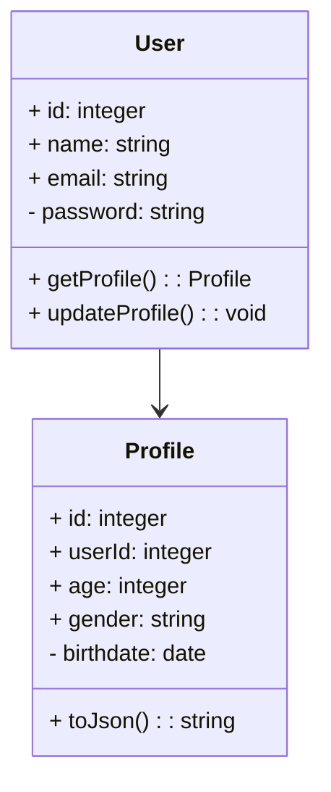
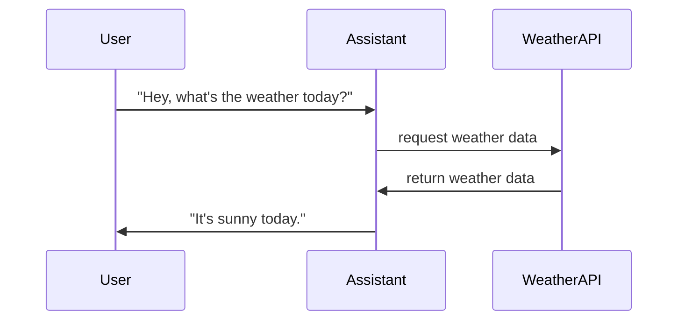

                 


# 虚拟助手AI Agent：从Siri到更智能的未来

> 关键词：虚拟助手、AI Agent、自然语言处理、机器学习、对话系统、人机交互

> 摘要：本文将深入探讨虚拟助手AI Agent的发展历程、核心技术、算法原理以及系统架构。从早期的Siri到现代的智能助手，我们将分析其背后的技术挑战与未来趋势。通过详细的技术分析和实际案例，本文将帮助读者全面理解虚拟助手的工作原理及其未来发展方向。

---

# 第1章: 虚拟助手AI Agent的背景与现状

## 1.1 虚拟助手的定义与概念

### 1.1.1 虚拟助手的定义
虚拟助手（Virtual Assistant，VA）是一种基于人工智能技术的计算机程序，能够通过自然语言处理（NLP）与用户进行交互，帮助用户完成各种任务，如信息查询、日程管理、语音控制等。

### 1.1.2 虚拟助手的核心概念
- **意图识别（Intent Recognition）**：理解用户的输入意图，如“设置提醒”或“查询天气”。
- **实体识别（Entity Recognition）**：从输入中提取关键信息，如日期、地点等。
- **对话管理（Dialog Management）**：维护对话上下文，确保对话流畅。

### 1.1.3 虚拟助手与传统助手的区别
- **自动化**：虚拟助手通过AI技术实现自动化服务，而传统助手依赖人工操作。
- **学习能力**：虚拟助手能够通过机器学习不断优化性能，而传统助手无法自主改进。

## 1.2 虚拟助手的发展历程

### 1.2.1 虚拟助手的起源
虚拟助手的概念最早可以追溯到20世纪末的语音助手技术，但真正的发展始于2010年苹果推出Siri。

### 1.2.2 从Siri到现代AI Agent的演进
- **Siri**：2011年，Siri作为独立应用出现，后被苹果收购并集成到iOS系统中。
- **Alexa**：亚马逊推出的智能音箱Alexa成为智能家居中的重要虚拟助手。
- **Google Assistant**：谷歌助手通过深度集成到谷歌生态系统，提供更强大的服务。

### 1.2.3 当前虚拟助手市场的竞争格局
- **主要玩家**：苹果（Siri）、谷歌（Google Assistant）、亚马逊（Alexa）、微软（Cortana）。
- **技术趋势**：从单一功能向多场景、多设备协同方向发展。

## 1.3 虚拟助手的应用场景

### 1.3.1 智能手机中的虚拟助手
- **功能**：信息查询、日程管理、语音搜索。
- **案例**：用户通过语音指令设置提醒或查询天气。

### 1.3.2 智能家居中的应用
- **功能**：控制智能家居设备，如调整温度、开启灯光。
- **案例**：用户通过语音指令控制智能音箱播放音乐。

### 1.3.3 企业级虚拟助手的潜力
- **功能**：内部员工查询公司信息、处理邮件、安排会议。
- **案例**：企业内部虚拟助手帮助员工快速获取公司政策信息。

## 1.4 虚拟助手的技术挑战与未来趋势

### 1.4.1 当前技术的主要挑战
- **理解能力**：如何准确理解用户意图，特别是在复杂语境下。
- **多语言支持**：支持多种语言和方言，满足全球用户需求。
- **隐私与安全**：确保用户数据的安全性和隐私性。

### 1.4.2 未来虚拟助手的发展方向
- **多模态交互**：结合视觉、听觉等多种交互方式，提升用户体验。
- **个性化服务**：根据用户习惯和偏好提供定制化服务。
- **无缝集成**：与更多设备和平台无缝连接，提供统一的服务体验。

### 1.4.3 用户需求的变化对技术的影响
- **需求多样化**：用户希望虚拟助手能够处理更多复杂任务。
- **实时性要求**：用户期望虚拟助手能够快速响应，减少延迟。

---

## 1.5 本章小结
本章介绍了虚拟助手的定义、核心概念及其发展历程，分析了当前市场的主要参与者和技术挑战。通过探讨应用场景和技术趋势，我们展望了虚拟助手的未来发展，特别是在多模态交互和个性化服务方面的潜力。

---

# 第2章: 虚拟助手的核心技术与实现原理

## 2.1 自然语言处理（NLP）基础

### 2.1.1 NLP的定义与作用
自然语言处理（NLP）是研究如何让计算机理解、生成人类语言的科学。它是虚拟助手实现人机交互的核心技术。

### 2.1.2 常见的NLP技术与算法
- **分词（Tokenization）**：将连续的文本分割成单词或短语。
- **词性标注（Part-of-Speech Tagging）**：确定每个词的词性，如名词、动词等。
- **句法分析（Parsing）**：分析句子的语法结构。

### 2.1.3 NLP在虚拟助手中的应用
- **意图识别**：通过NLP技术分析用户输入，确定其意图。
- **实体识别**：从用户输入中提取关键实体信息，如日期、地点等。

## 2.2 机器学习与深度学习

### 2.2.1 机器学习的定义与作用
机器学习是通过数据训练模型，使其能够从经验中学习并做出预测或决策。

### 2.2.2 深度学习在虚拟助手中的应用
- **神经网络**：用于语音识别和自然语言处理。
- **循环神经网络（RNN）**：处理序列数据，如对话历史。

### 2.2.3 常见的深度学习模型
- **长短期记忆网络（LSTM）**：用于处理长序列数据，保持长期依赖关系。
- **Transformer模型**：如BERT，用于文本生成和理解。

## 2.3 对话管理与任务处理

### 2.3.1 对话管理的定义与实现
对话管理负责维护对话上下文，确保对话流畅。常用技术包括基于规则和基于模型的方法。

### 2.3.2 任务处理的流程与方法
- **任务分解**：将用户意图分解为多个子任务。
- **任务执行**：通过调用API或执行预设操作完成任务。

### 2.3.3 基于规则与基于模型的对话管理对比
- **基于规则**：通过预设规则处理对话，灵活性低，但实现简单。
- **基于模型**：通过机器学习模型动态调整对话策略，灵活性高，但实现复杂。

## 2.4 虚拟助手的多轮对话机制

### 2.4.1 多轮对话的定义与挑战
多轮对话是指在一次交互中，用户和虚拟助手进行多轮交流。挑战包括对话上下文的维护和用户意图的准确理解。

### 2.4.2 基于上下文的对话管理
- **上下文存储**：记录对话历史，以便后续交互。
- **上下文应用**：根据上下文调整对话策略。

### 2.4.3 对话历史的存储与应用
- **存储方式**：可以使用数据库或缓存存储对话历史。
- **应用方式**：根据对话历史优化后续响应。

---

## 2.5 本章小结
本章详细介绍了虚拟助手的核心技术，包括自然语言处理、机器学习和对话管理。通过分析这些技术的实现原理，我们理解了虚拟助手如何通过先进的算法实现智能交互。

---

# 第3章: 虚拟助手的算法原理与实现

## 3.1 自然语言处理模型

### 3.1.1 词袋模型（Bag of Words）
词袋模型将文本表示为单词的集合，不考虑单词顺序。

### 3.1.2 词嵌入（Word Embedding）
词嵌入将单词映射到低维向量空间，如Word2Vec。

### 3.1.3 循环神经网络（RNN）
RNN用于处理序列数据，如对话历史。

### 3.1.4 变量长度序列的处理
通过填充或截断，统一序列长度，便于模型处理。

## 3.2 机器学习算法在虚拟助手中的应用

### 3.2.1 分类算法（如SVM、随机森林）
- **SVM**：支持向量机，用于分类任务。
- **随机森林**：集成学习方法，用于分类和回归。

### 3.2.2 回归算法
- **线性回归**：用于预测连续值。
- **逻辑回归**：用于分类任务。

### 3.2.3 聚类算法
- **K-means**：用于无监督学习，如用户分群。

## 3.3 对话生成模型

### 3.3.1 基于规则的对话生成
- **规则定义**：根据预设规则生成响应。
- **优点**：实现简单，但灵活性低。

### 3.3.2 基于模板的对话生成
- **模板设计**：使用预设模板生成响应。
- **优点**：生成速度快，但创意有限。

### 3.3.3 基于预训练模型的对话生成
- **预训练模型**：如GPT，通过微调生成自然的对话响应。

## 3.4 虚拟助手的训练与优化

### 3.4.1 数据预处理与清洗
- **数据清洗**：去除噪音数据，如特殊字符。
- **数据增强**：增加数据多样性，提升模型泛化能力。

### 3.4.2 模型训练与调优
- **训练策略**：使用分布式训练，加快训练速度。
- **模型调优**：通过交叉验证优化超参数。

### 3.4.3 模型评估与优化
- **评估指标**：准确率、召回率、F1值。
- **优化方法**：通过A/B测试优化用户体验。

---

## 3.5 本章小结
本章详细讲解了虚拟助手的算法原理，包括自然语言处理模型和机器学习算法。通过分析这些算法的实现细节，我们理解了虚拟助手如何通过先进的算法实现智能交互。

---

# 第4章: 虚拟助手的系统架构与设计

## 4.1 系统架构概述

### 4.1.1 分层架构
分层架构将系统划分为表示层、业务逻辑层和数据访问层，便于模块化开发。

### 4.1.2 微服务架构
微服务架构将系统功能分解为多个独立的服务，通过API进行通信，具有良好的扩展性和灵活性。

### 4.1.3 基于云的架构
基于云的架构利用云计算资源，提供高可用性和弹性扩展能力。

---

## 4.2 系统功能设计

### 4.2.1 领域模型设计
领域模型是系统功能的核心，通常使用Mermaid类图表示。



### 4.2.2 系统架构设计
系统架构设计通常使用Mermaid架构图表示。


### 4.2.3 系统接口设计
系统接口设计通常使用RESTful API，常用HTTP方法如GET、POST、PUT、DELETE。

### 4.2.4 系统交互设计
系统交互通常使用Mermaid序列图表示。



---

## 4.5 本章小结
本章详细介绍了虚拟助手的系统架构与设计，包括分层架构、微服务架构、系统功能设计和系统交互设计。通过分析这些设计，我们理解了虚拟助手如何通过高效的系统架构实现智能交互。

---

# 第5章: 虚拟助手的项目实战

## 5.1 环境安装与配置

### 5.1.1 安装Python
```bash
# 安装Python
sudo apt-get install python3 python3-dev
```

### 5.1.2 安装必要的库
```bash
# 安装numpy和pandas
pip install numpy pandas
```

### 5.1.3 安装深度学习框架
```bash
# 安装TensorFlow
pip install tensorflow
```

## 5.2 系统核心实现源代码

### 5.2.1 意图识别模型
```python
import tensorflow as tf
from tensorflow.keras import layers

# 定义模型
model = tf.keras.Sequential()
model.add(layers.Dense(128, activation='relu', input_shape=(1000,)))
model.add(layers.Dense(64, activation='relu'))
model.add(layers.Dense(1, activation='sigmoid'))

# 编译模型
model.compile(optimizer='adam', loss='binary_crossentropy', metrics=['accuracy'])
```

### 5.2.2 对话生成模块
```python
import numpy as np
from tensorflow.keras.preprocessing.text import Tokenizer

# 初始化tokenizer
tokenizer = Tokenizer(num_words=10000)
tokenizer.fit_on_texts(corpus)
```

## 5.3 代码应用解读与分析

### 5.3.1 意图识别模型的训练
```python
# 训练模型
model.fit(x_train, y_train, epochs=10, batch_size=32, validation_data=(x_val, y_val))
```

### 5.3.2 对话生成模块的使用
```python
# 生成响应
sequences = tokenizer.texts_to_sequences(corpus)
padded_sequences = tokenizer.sequences_to_matrix(sequences, mode='padding')
```

## 5.4 实际案例分析

### 5.4.1 查询天气
用户输入：“今天天气怎么样？”
系统响应：“今天天气晴朗，25℃左右。”

### 5.4.2 设置提醒
用户输入：“提醒我明天上午开会。”
系统响应：“好的，已经为您设置提醒。”

## 5.5 项目小结

---

## 5.6 本章小结
本章通过实际项目案例，详细讲解了虚拟助手的实现过程，包括环境配置、核心代码实现和实际应用案例。通过这些实践，我们理解了虚拟助手如何通过实际代码实现智能交互。

---

# 第6章: 最佳实践与未来展望

## 6.1 最佳实践Tips

### 6.1.1 数据质量
- 确保数据质量和多样性，避免过拟合。
- 使用数据增强技术提升模型鲁棒性。

### 6.1.2 模型优化
- 定期更新模型，保持其准确性。
- 使用模型压缩技术降低计算成本。

### 6.1.3 安全与隐私
- 采用端到端加密，确保数据传输安全。
- 定期进行安全审计，防止数据泄露。

## 6.2 小结

## 6.3 注意事项

## 6.4 拓展阅读

---

## 6.5 本章小结
本章总结了虚拟助手开发的最佳实践，并展望了未来的发展方向。通过这些最佳实践，我们能够更好地开发和优化虚拟助手，为用户提供更智能的服务。

---

# 作者：AI天才研究院/AI Genius Institute & 禅与计算机程序设计艺术 /Zen And The Art of Computer Programming

---

**本文通过详细的技术分析和实际案例，帮助读者全面理解虚拟助手AI Agent的工作原理及其未来发展方向。**

