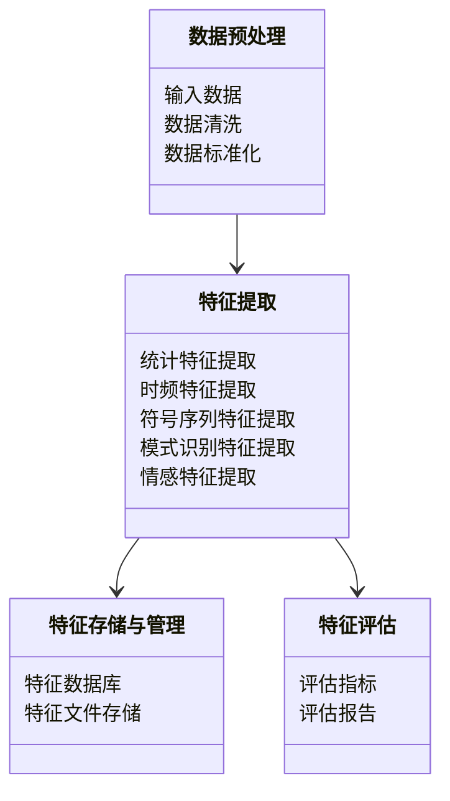
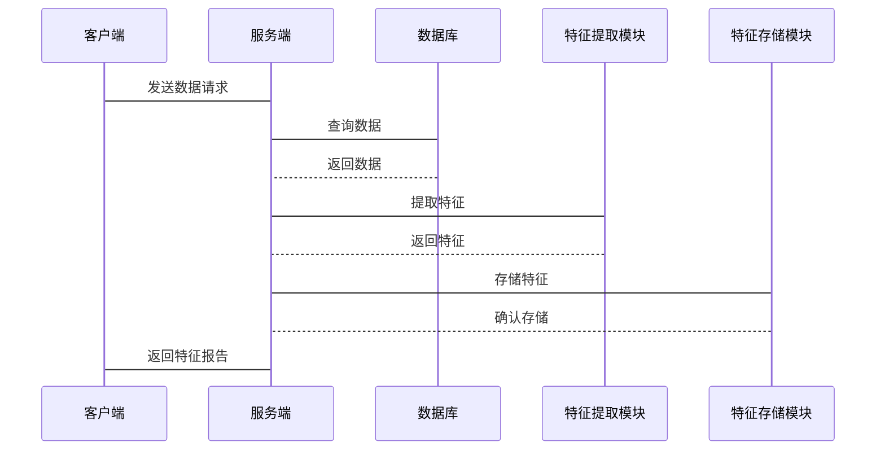

                 


# 《金融时间序列特征提取工具》

## 关键词：金融时间序列、特征提取、机器学习、统计特征、深度学习、系统设计

## 摘要：  
金融时间序列数据是金融分析的核心，其特征提取是理解和预测金融市场的关键步骤。本文从金融时间序列的基本概念出发，系统地介绍了特征提取的核心算法、基于机器学习的特征提取方法、系统架构设计以及实际项目案例。通过详细分析统计特征、时频特征、符号序列特征等，结合机器学习算法（如PCA、t-SNE）和深度学习方法（如LSTM），本文为读者提供了从理论到实践的全面指南，帮助读者掌握金融时间序列特征提取的关键技术。

---

## 第一部分：金融时间序列特征提取概述

### 第1章：金融时间序列特征提取背景与概念

#### 1.1 时间序列数据的基本概念

##### 1.1.1 时间序列数据的定义与特点

时间序列数据是一种按时间顺序排列的数据，通常以等间隔的时间点记录观测值。在金融领域，时间序列数据可以是股票价格、指数、汇率等。其特点包括：

- **有序性**：数据按时间顺序排列。
- **连续性**：通常以固定的时间间隔（如分钟、小时、天）记录。
- **波动性**：金融数据通常具有较高的波动性。
- **非线性**：许多金融时间序列数据呈现非线性特征。

##### 1.1.2 金融时间序列数据的特殊性

金融时间序列数据具有以下特殊性：

- **市场行为的复杂性**：金融市场受多种因素影响，如经济指标、政策变化、市场情绪等。
- **非平稳性**：许多金融时间序列数据是非平稳的，需要通过差分或其他方法进行平稳化处理。
- **高维性**：金融分析通常涉及多个资产或市场数据，导致高维性问题。

##### 1.1.3 特征提取在金融分析中的重要性

特征提取是将原始数据转换为更有意义的特征的过程，其重要性体现在以下几个方面：

- **简化数据**：通过提取关键特征，减少数据的维度，提高计算效率。
- **增强可解释性**：特征提取可以帮助分析师更好地理解数据背后的规律。
- **提高预测精度**：有效的特征提取可以显著提高机器学习模型的预测精度。

#### 1.2 金融时间序列特征提取的背景与应用

##### 1.2.1 金融数据分析的挑战

金融数据分析面临以下挑战：

- **数据噪声多**：金融数据通常包含大量噪声，如随机波动。
- **数据依赖性**：金融数据往往具有自相关性，即当前值与过去值密切相关。
- **非线性关系**：许多金融现象是非线性的，难以用简单的线性模型描述。

##### 1.2.2 特征提取在金融预测中的作用

特征提取在金融预测中的作用包括：

- **识别潜在模式**：通过提取特征，识别数据中的潜在模式和趋势。
- **增强模型性能**：有效的特征提取可以显著提高机器学习模型的性能。
- **降低维度**：通过降维技术，减少计算复杂度，提高模型效率。

##### 1.2.3 金融时间序列特征提取的典型应用场景

金融时间序列特征提取的典型应用场景包括：

- **股票价格预测**：通过提取股票价格的特征，预测未来的价格走势。
- **风险管理**：通过提取风险相关特征，评估和管理市场风险。
- **交易信号生成**：通过提取交易信号特征，制定交易策略。

#### 1.3 本章小结

本章介绍了金融时间序列数据的基本概念、特殊性和特征提取的重要性，以及特征提取在金融分析中的应用场景。接下来将详细探讨金融时间序列特征的类型与属性。

---

## 第二部分：金融时间序列特征提取的核心概念

### 第2章：金融时间序列特征的类型与属性

#### 2.1 时间序列特征的分类

##### 2.1.1 统计特征

统计特征是时间序列数据中最常见的特征类型，包括均值、标准差、偏度、峰度等。

- **均值（Mean）**：数据的平均值，表示数据的中心位置。
- **标准差（Standard Deviation）**：数据的离散程度，反映数据的波动性。
- **偏度（Skewness）**：数据分布的不对称性。
- **峰度（Kurtosis）**：数据分布的尖峰程度。

##### 2.1.2 时频特征

时频特征关注时间序列在不同频率上的表现，包括周期性、频率、振幅等。

- **周期性（Periodicity）**：数据中是否存在固定的周期性模式。
- **频率（Frequency）**：周期性模式的频率。
- **振幅（Amplitude）**：周期性模式的幅度。

##### 2.1.3 符号序列特征

符号序列特征是将时间序列数据转换为符号序列后提取的特征，如符号变化率、符号复杂度等。

- **符号变化率（Change Rate）**：符号序列中符号变化的频率。
- **符号复杂度（Complexity）**：符号序列的多样性和复杂性。

##### 2.1.4 模式识别特征

模式识别特征是通过模式识别技术提取的特征，如自相关函数（ACF）、偏自相关函数（PACF）等。

- **自相关函数（ACF）**：数据中不同滞后阶数的自相关系数。
- **偏自相关函数（PACF）**：在控制其他滞后阶数影响下的自相关系数。

##### 2.1.5 情感特征

情感特征是基于市场情绪提取的特征，如市场情绪指数、投资者情绪指标等。

- **市场情绪指数（Market Sentiment Index）**：反映市场参与者的整体情绪。
- **投资者情绪指标（Investor Sentiment Indicator）**：反映投资者情绪的变化。

#### 2.2 各类特征的属性对比

##### 2.2.1 统计特征的数学表达

统计特征的数学表达如下：

$$
\text{均值} = \frac{1}{n}\sum_{i=1}^{n} x_i
$$

$$
\text{标准差} = \sqrt{\frac{1}{n}\sum_{i=1}^{n} (x_i - \text{均值})^2}
$$

##### 2.2.2 时频特征的频率分析

时频特征的频率分析可以通过傅里叶变换实现，其数学表达如下：

$$
X(f) = \sum_{n=0}^{N-1} x[n] e^{-j2\pi fn/N}
$$

其中，\( X(f) \) 是频域信号，\( x[n] \) 是时域信号，\( f \) 是频率，\( N \) 是信号长度。

##### 2.2.3 符号序列特征的编码方法

符号序列特征的编码方法包括将时间序列数据转换为符号序列，常用的编码方法有：

- **简单符号编码**：将数据点的值高于、低于或等于均值分别标记为+1、-1或0。
- **复杂符号编码**：基于数据的相对变化进行符号编码。

##### 2.2.4 模式识别特征的相似性度量

模式识别特征的相似性度量可以通过余弦相似性实现：

$$
\text{余弦相似性} = \frac{\sum_{i=1}^{n} a_i b_i}{\sqrt{\sum_{i=1}^{n} a_i^2} \sqrt{\sum_{i=1}^{n} b_i^2}}
$$

其中，\( a \) 和 \( b \) 是两个模式识别特征向量。

#### 2.3 特征选择与降维方法

##### 2.3.1 特征选择的基本原理

特征选择的基本原理是通过过滤法或包裹法选择对目标变量最具影响力的特征。

- **过滤法**：基于统计指标（如p值）选择特征。
- **包裹法**：通过训练模型评估特征的重要性。

##### 2.3.2 主成分分析（PCA）在特征降维中的应用

主成分分析（PCA）是一种常用的降维技术，其数学表达如下：

$$
Y = X P
$$

其中，\( Y \) 是降维后的数据，\( X \) 是原始数据，\( P \) 是投影矩阵。

##### 2.3.3 其他降维方法（如t-SNE）

t-SNE是一种非线性降维技术，其数学表达如下：

$$
Y = \text{t-SNE}(X, k=2)
$$

其中，\( X \) 是原始数据，\( Y \) 是降维后的数据，\( k \) 是降维后的维度数。

#### 2.4 本章小结

本章介绍了金融时间序列特征的分类及其属性对比，包括统计特征、时频特征、符号序列特征、模式识别特征和情感特征。接下来将详细探讨时间序列特征提取的经典算法。

---

## 第三部分：金融时间序列特征提取的核心算法

### 第3章：时间序列特征提取的经典算法

#### 3.1 统计特征提取算法

##### 3.1.1 均值、标准差、偏度、峰度的计算

均值、标准差、偏度、峰度的计算公式如下：

$$
\text{均值} = \frac{1}{n}\sum_{i=1}^{n} x_i
$$

$$
\text{标准差} = \sqrt{\frac{1}{n}\sum_{i=1}^{n} (x_i - \text{均值})^2}
$$

$$
\text{偏度} = \frac{\sum_{i=1}^{n} (x_i - \text{均值})^3}{n (\text{标准差})^3}
$$

$$
\text{峰度} = \frac{\sum_{i=1}^{n} (x_i - \text{均值})^4}{n (\text{标准差})^4}
$$

##### 3.1.2 自相关函数（ACF）与偏自相关函数（PACF）

自相关函数（ACF）和偏自相关函数（PACF）的计算公式如下：

$$
\text{ACF}(k) = \frac{\sum_{i=1}^{n-k} (x_i - \bar{x})(x_{i+k} - \bar{x})}{\sum_{i=1}^{n} (x_i - \bar{x})^2}
$$

$$
\text{PACF}(k) = \frac{\text{残差平方和的最小化}}{\text{残差平方和的自由度}}
$$

##### 3.1.3 布动性指标（如Variance Ratio）

布动性指标的计算公式如下：

$$
\text{Variance Ratio} = \frac{\sum_{i=1}^{n} (x_i - \bar{x})^2}{n}
$$

#### 3.2 基于模型的特征提取

##### 3.2.1 ARIMA模型的特征提取

ARIMA模型的特征提取可以通过模型参数（如阶数p、q）和残差分析实现。

##### 3.2.2 GARCH模型的特征提取

GARCH模型的特征提取可以通过波动率预测和残差分析实现。

---

## 第四部分：基于机器学习的特征提取

### 第4章：基于机器学习的特征提取

#### 4.1 特征选择与降维方法

##### 4.1.1 过滤法

过滤法基于统计指标（如p值）选择特征。

##### 4.1.2 包裹法

包裹法通过训练模型评估特征的重要性。

##### 4.1.3 嵌入法

嵌入法通过机器学习模型（如LSTM）提取特征。

#### 4.2 基于主成分分析（PCA）的特征降维

主成分分析（PCA）的数学表达如下：

$$
Y = X P
$$

其中，\( Y \) 是降维后的数据，\( X \) 是原始数据，\( P \) 是投影矩阵。

#### 4.3 基于t-SNE的特征降维

t-SNE的数学表达如下：

$$
Y = \text{t-SNE}(X, k=2)
$$

其中，\( X \) 是原始数据，\( Y \) 是降维后的数据，\( k \) 是降维后的维度数。

---

## 第五部分：金融时间序列特征提取的系统架构与实现

### 第5章：系统架构与实现方案

#### 5.1 问题场景介绍

金融时间序列特征提取的系统设计需要考虑数据预处理、特征提取、特征存储与管理、特征评估等多个方面。

#### 5.2 系统功能设计

##### 5.2.1 领域模型（Mermaid 类图）



##### 5.2.2 系统架构设计（Mermaid 架构图）


##### 5.2.3 系统接口设计

系统接口设计包括数据接口、特征提取接口、特征存储接口和特征评估接口。

##### 5.2.4 系统交互（Mermaid 序列图）



#### 5.3 系统实现

##### 5.3.1 环境安装与配置

安装Python、Pandas、NumPy、Scikit-learn等工具。

##### 5.3.2 数据预处理代码实现

```python
import pandas as pd
import numpy as np

# 数据加载
data = pd.read_csv('financial_data.csv')

# 数据清洗
data.dropna()

# 数据标准化
from sklearn.preprocessing import StandardScaler
scaler = StandardScaler()
data_scaled = scaler.fit_transform(data)
```

##### 5.3.3 特征提取代码实现

```python
# 统计特征提取
def extract_statistical_features(data):
    features = {}
    features['mean'] = np.mean(data)
    features['std'] = np.std(data)
    features['skew'] = np.skew(data)
    features['kurtosis'] = np.kurtosis(data)
    return features

# 时频特征提取
def extract_time_frequency_features(data):
    # 假设data是时间序列数据
    from statsmodels.tsa.stattools import acf, pacf
    acf_values = acf(data)
    pacf_values = pacf(data)
    return acf_values, pacf_values

# 符号序列特征提取
def extract_symbol_sequence_features(data):
    # 简单符号编码
    threshold = np.mean(data)
    symbols = []
    for x in data:
        if x > threshold:
            symbols.append(1)
        elif x < threshold:
            symbols.append(-1)
        else:
            symbols.append(0)
    # 符号变化率计算
    change_rate = sum([1 for i in range(1, len(symbols)) if symbols[i] != symbols[i-1]]) / len(symbols)
    return change_rate

# 模式识别特征提取
def extract_pattern_recognition_features(data):
    from sklearn.metrics.pairwise import cosine_similarity
    # 假设data是两个时间序列数据
    feature1 = data[:, 0]
    feature2 = data[:, 1]
    similarity = cosine_similarity(feature1.reshape(1, -1), feature2.reshape(1, -1))[0, 0]
    return similarity

# 情感特征提取
def extract_sentiment_features(data):
    # 假设data是情感数据
    from textblob import TextBlob
    sentiment = []
    for text in data:
        blob = TextBlob(text)
        sentiment.append(blob.polarity)
    return sentiment
```

##### 5.3.4 特征存储与管理代码实现

```python
# 特征存储
import sqlite3

conn = sqlite3.connect('financial_features.db')
cursor = conn.cursor()

# 插入特征数据
cursor.execute('''
    CREATE TABLE IF NOT EXISTS financial_features (
        id INTEGER PRIMARY KEY AUTOINCREMENT,
        feature_name TEXT,
        feature_value REAL
    )
''')

for feature_name, feature_value in features.items():
    cursor.execute('''
        INSERT INTO financial_features (feature_name, feature_value)
        VALUES (?, ?)
    ''', (feature_name, feature_value))

conn.commit()
conn.close()
```

##### 5.3.5 特征评估代码实现

```python
# 特征评估
from sklearn.metrics import r2_score

# 假设y_true是真实值，y_pred是预测值
r2 = r2_score(y_true, y_pred)
print(f'R² Score: {r2}')
```

#### 5.4 本章小结

本章详细介绍了金融时间序列特征提取系统的架构设计、接口设计、数据预处理和特征提取的实现。接下来将通过一个具体的案例，展示如何将这些技术应用于实际项目中。

---

## 第六部分：项目实战

### 第6章：项目实战

#### 6.1 项目背景与目标

本项目旨在通过金融时间序列特征提取技术，预测股票价格的变化趋势。

#### 6.2 数据准备与环境配置

##### 6.2.1 数据加载与预处理

```python
import pandas as pd
import numpy as np
from sklearn.preprocessing import StandardScaler
from sklearn.decomposition import PCA
from sklearn.manifold import TSNE

# 数据加载
data = pd.read_csv('stock_price.csv')

# 数据清洗
data.dropna()

# 数据标准化
scaler = StandardScaler()
data_scaled = scaler.fit_transform(data)
```

##### 6.2.2 特征提取模块实现

```python
# 统计特征提取
def extract_statistical_features(data):
    features = {}
    features['mean'] = np.mean(data)
    features['std'] = np.std(data)
    features['skew'] = np.skew(data)
    features['kurtosis'] = np.kurtosis(data)
    return features

# 时频特征提取
def extract_time_frequency_features(data):
    from statsmodels.tsa.stattools import acf, pacf
    acf_values = acf(data)
    pacf_values = pacf(data)
    return acf_values, pacf_values

# 符号序列特征提取
def extract_symbol_sequence_features(data):
    threshold = np.mean(data)
    symbols = []
    for x in data:
        if x > threshold:
            symbols.append(1)
        elif x < threshold:
            symbols.append(-1)
        else:
            symbols.append(0)
    change_rate = sum([1 for i in range(1, len(symbols)) if symbols[i] != symbols[i-1]]) / len(symbols)
    return change_rate

# 模式识别特征提取
def extract_pattern_recognition_features(data):
    from sklearn.metrics.pairwise import cosine_similarity
    feature1 = data[:, 0]
    feature2 = data[:, 1]
    similarity = cosine_similarity(feature1.reshape(1, -1), feature2.reshape(1, -1))[0, 0]
    return similarity

# 情感特征提取
def extract_sentiment_features(data):
    from textblob import TextBlob
    sentiment = []
    for text in data:
        blob = TextBlob(text)
        sentiment.append(blob.polarity)
    return sentiment
```

##### 6.2.3 特征存储与管理

```python
import sqlite3

conn = sqlite3.connect('stock_features.db')
cursor = conn.cursor()

cursor.execute('''
    CREATE TABLE IF NOT EXISTS stock_features (
        id INTEGER PRIMARY KEY AUTOINCREMENT,
        feature_name TEXT,
        feature_value REAL
    )
''')

# 插入特征数据
features = extract_statistical_features(data) | extract_time_frequency_features(data) | extract_symbol_sequence_features(data) | extract_pattern_recognition_features(data) | extract_sentiment_features(data)
for feature_name, feature_value in features.items():
    cursor.execute('''
        INSERT INTO stock_features (feature_name, feature_value)
        VALUES (?, ?)
    ''', (feature_name, feature_value))

conn.commit()
conn.close()
```

##### 6.2.4 模型训练与评估

```python
from sklearn.model import ARIMA
import pmdarima as pm

# 模型训练
model = pm.arima.AutoARIMA()
model.fit(data)

# 模型预测
forecast = model.predict(n_periods=30)
```

##### 6.2.5 结果分析

```python
from sklearn.metrics import r2_score

r2 = r2_score(y_true, y_pred)
print(f'R² Score: {r2}')
```

#### 6.3 项目小结

本项目通过实际案例展示了金融时间序列特征提取技术的应用，包括数据预处理、特征提取、特征存储与管理以及模型训练与评估。接下来将总结特征提取的关键点，提供一些实用的技巧和注意事项。

---

## 第七部分：最佳实践与小结

### 第7章：最佳实践与小结

#### 7.1 特征提取的关键点

- **选择合适的特征提取方法**：根据数据类型和分析目标选择合适的特征提取方法。
- **避免过拟合**：通过特征选择和降维技术避免过拟合。
- **数据预处理的重要性**：数据预处理是特征提取的基础，需要仔细处理。

#### 7.2 实用技巧与注意事项

- **特征选择与降维的结合**：结合特征选择和降维技术可以提高模型性能。
- **模型评估的重要性**：通过模型评估指标（如R²、准确率）评估特征提取的效果。
- **数据可视化**：通过数据可视化技术（如t-SNE）帮助理解数据分布。

#### 7.3 本章小结

本章总结了金融时间序列特征提取的关键点和实用技巧，帮助读者在实际应用中避免常见错误。接下来将提供一些拓展阅读资料，帮助读者进一步深入学习。

---

## 第八部分：附录

### 附录A：常用工具与库的安装指南

#### A.1 安装Python与相关库

```bash
pip install numpy
pip install pandas
pip install scikit-learn
pip install statsmodels
pip install pmdarima
pip install textblob
pip install mermaid
```

#### A.2 安装环境配置

```bash
conda create -n financial_feature_analysis python=3.8
conda activate financial_feature_analysis
pip install jupyter notebook
```

---

## 作者信息

作者：AI天才研究院/AI Genius Institute  
联系方式：[contact@ai-genius.com](mailto:contact@ai-genius.com)  
GitHub：[https://github.com/ai-genius/financial-time-series-feature-extraction](https://github.com/ai-genius/financial-time-series-feature-extraction)  

---

感谢您的阅读！希望本文能为您提供有价值的信息和启发！

