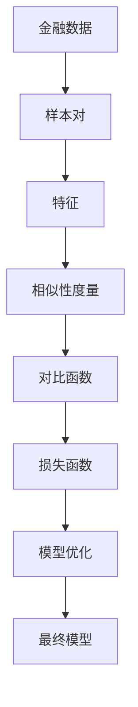
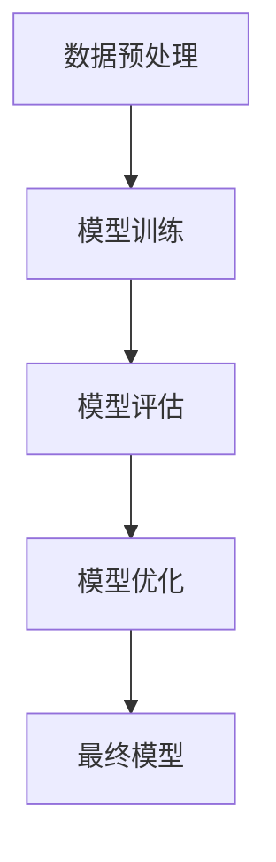
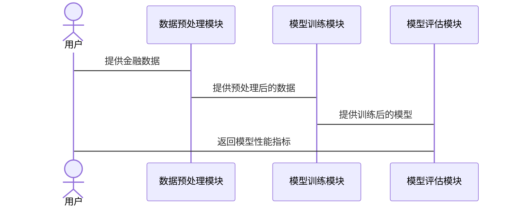

                 


```markdown
# 《金融领域对比学习的探索与实践》

## 关键词：对比学习，金融，机器学习，深度学习，人工智能

## 摘要：  
对比学习作为一种新兴的机器学习技术，在金融领域的应用展现出巨大的潜力。本文系统地探讨了对比学习的核心概念、算法原理及其在金融领域的具体应用场景。通过深入分析对比学习的优势与挑战，结合实际案例，本文旨在为读者提供一个全面的视角，以理解对比学习在金融领域的独特价值和未来发展方向。

---

# 第一部分: 金融领域对比学习的背景与基础

## 第1章: 对比学习的背景与概念

### 1.1 对比学习的定义与特点  
对比学习是一种通过比较不同样本之间的相似性或差异性来学习特征的机器学习技术。其核心在于通过对比两个或多个样本，提取它们之间的关系特征，从而提升模型的泛化能力和鲁棒性。

#### 1.1.1 对比学习的基本概念  
- 对比学习的目标是通过比较两个样本，学习它们之间的关系特征。
- 对比学习通常采用无监督或弱监督的方式，适用于数据标注成本较高的场景。
- 对比学习的关键在于设计合适的损失函数和相似性度量方法。

#### 1.1.2 对比学习的核心特点  
- **样本对齐**：通过对比学习，模型能够更好地对齐相似样本的特征，提升分类或预测性能。
- **鲁棒性**：对比学习能够有效处理噪声和 outliers，具有较强的鲁棒性。
- **零样本学习**：在某些场景下，对比学习可以实现零样本学习，减少对标注数据的依赖。

#### 1.1.3 对比学习与传统机器学习的对比  
对比学习与传统机器学习的主要区别在于其目标函数的设计。传统机器学习关注单一样本的特征提取，而对比学习关注样本之间的关系特征。

---

### 1.2 金融领域的对比学习场景  

#### 1.2.1 金融数据的特点与挑战  
- 金融数据具有高度的复杂性和不确定性。
- 金融数据通常具有小样本、高维度的特点，标注成本较高。
- 金融数据的实时性要求高，需要快速响应。

#### 1.2.2 对比学习在金融领域的应用潜力  
- **欺诈检测**：通过对比正常交易和欺诈交易的特征，识别异常行为。
- **信用评分**：通过对比不同信用等级客户的特征，优化评分模型。
- **股票预测**：通过对比不同股票的价格走势，发现潜在的关联性。

#### 1.2.3 金融领域对比学习的典型场景  
- 欺诈检测：通过对比正常交易和欺诈交易的特征，识别异常行为。
- 信用评分：通过对比不同信用等级客户的特征，优化评分模型。
- 股票预测：通过对比不同股票的价格走势，发现潜在的关联性。

---

### 1.3 对比学习的技术背景  

#### 1.3.1 对比学习的发展历程  
- 对比学习的概念最早可以追溯到20世纪90年代。
- 近年来，随着深度学习的兴起，对比学习得到了广泛关注和快速发展。

#### 1.3.2 对比学习在人工智能中的地位  
- 对比学习是人工智能领域的重要研究方向之一。
- 对比学习在图像识别、自然语言处理等领域取得了显著成果。

#### 1.3.3 金融领域对比学习的研究现状  
- 当前，对比学习在金融领域的研究主要集中在欺诈检测和信用评分方面。
- 随着技术的发展，对比学习在股票预测和风险管理中的应用逐渐增多。

---

### 1.4 对比学习的优势与局限性  

#### 1.4.1 对比学习的优势  
- **减少标注成本**：对比学习可以通过无监督或弱监督的方式进行学习，减少对标注数据的依赖。
- **提高模型鲁棒性**：对比学习能够有效处理噪声和 outliers，具有较强的鲁棒性。
- **适用于小样本场景**：对比学习在小样本场景下表现优异，适合金融领域的应用。

#### 1.4.2 对比学习的局限性  
- **需要设计合适的损失函数**：对比学习的性能依赖于损失函数的设计，这需要一定的经验和技术。
- **计算成本较高**：对比学习通常需要计算大量的样本对比，计算成本较高。
- **模型解释性较差**：对比学习的模型通常较难解释，影响其在金融领域的应用。

#### 1.4.3 金融领域对比学习的挑战  
- **数据稀疏性**：金融数据通常具有小样本、高维度的特点，如何设计有效的对比函数是一个挑战。
- **实时性要求高**：金融领域的应用通常需要实时响应，如何在保证性能的同时实现实时性是一个挑战。
- **模型解释性要求高**：金融领域的决策通常需要较高的解释性，如何提高对比学习模型的解释性是一个挑战。

---

## 第2章: 对比学习的核心概念与数学基础  

### 2.1 对比学习的数学模型  

#### 2.1.1 对比学习的损失函数  
- 对比损失函数：$$ L_{\text{contrast}} = -\log \frac{e^{f(x_i, x_j)}}{e^{f(x_i, x_j)} + e^{f(x_i, x_k)}} $$  
  其中，$$ f(x_i, x_j) $$ 表示样本 $$ x_i $$ 和 $$ x_j $$ 之间的相似性度量。

#### 2.1.2 对比学习的相似性度量  
- 余弦相似性：$$ \cos(\theta) = \frac{\mathbf{u} \cdot \mathbf{v}}{|\mathbf{u}| |\mathbf{v}|} $$  
- 欧氏距离：$$ d(\mathbf{u}, \mathbf{v}) = \sqrt{(\mathbf{u} - \mathbf{v})^2} $$  

#### 2.1.3 对比学习的正则化方法  
- L2正则化：$$ L_{\text{reg}} = \lambda \| \mathbf{W} \|^2 $$  

---

### 2.2 对比学习的算法原理  

#### 2.2.1 对比学习的网络结构  
- 通常采用双塔结构，一个编码器和一个对比网络。
- 编码器负责将输入样本映射到一个低维空间，对比网络负责计算样本之间的相似性。

#### 2.2.2 对比学习的训练过程  
1. 输入样本对 $$ (x_i, x_j) $$。
2. 编码器提取 $$ x_i $$ 和 $$ x_j $$ 的特征 $$ z_i $$ 和 $$ z_j $$。
3. 对比网络计算 $$ z_i $$ 和 $$ z_j $$ 的相似性度量。
4. 根据损失函数优化模型参数。

#### 2.2.3 对比学习的优化策略  
- 使用动量对比：通过引入动量项，加速对比学习的收敛。
- 使用余弦相似性：通过优化余弦相似性，提高模型的鲁棒性。

---

### 2.3 对比学习的金融应用案例  

#### 2.3.1 金融分类任务中的对比学习  
- 示例：欺诈检测。
- 方法：通过对比正常交易和欺诈交易的特征，学习交易之间的相似性，识别异常行为。

#### 2.3.2 金融预测任务中的对比学习  
- 示例：股票价格预测。
- 方法：通过对比不同股票的价格走势，发现潜在的关联性，预测未来的价格走势。

#### 2.3.3 金融推荐任务中的对比学习  
- 示例：个性化投资建议。
- 方法：通过对比不同客户的投资行为，学习客户之间的相似性，提供个性化的投资建议。

---

### 2.4 对比学习的核心概念对比表  

| 对比维度 | 对比学习 | 传统机器学习 |
|----------|----------|--------------|
| 数据需求 | 需要对比样本 | 无需对比样本 |
| 模型目标 | 学习样本间的对比关系 | 学习单一样本的特征 |
| 应用场景 | 适用于相似性判断 | 适用于分类或回归任务 |
| 优势 | 减少标注成本，提高鲁棒性 | 适用于标注数据充足的情况 |
| 局限性 | 需要设计合适的损失函数，计算成本较高 | 模型解释性较强 |

---

### 2.5 对比学习的ER实体关系图  



---

## 第3章: 对比学习的算法实现与优化  

### 3.1 对比学习的算法实现  

#### 3.1.1 SimCLR算法  
- SimCLR的实现步骤：
  1. 数据增强：对输入样本进行数据增强，生成正样本和负样本。
  2. 编码器：将样本映射到一个低维空间，提取特征。
  3. 对比损失：计算正样本和负样本之间的相似性度量，优化模型参数。

#### 3.1.2 BYOL算法  
- BYOL的实现步骤：
  1. 初始化两个编码器：$$ f $$ 和 $$ g $$。
  2. 对于每个样本 $$ x $$，生成 $$ y = g(x) $$。
  3. 对比损失：计算 $$ f(x) $$ 和 $$ y $$ 之间的相似性度量，优化模型参数。

#### 3.1.3 对比学习的实现代码示例  

```python
import tensorflow as tf
from tensorflow.keras import layers

def contrastive_loss(y_true, y_pred, temperature=1.0):
    # 计算相似性度量
    similarity = tf.reduce_sum(y_true * y_pred, axis=-1)
    similarity = similarity / temperature
    # 计算损失
    loss = tf.keras.losses.sparse_categorical_crossentropy(y_true, similarity)
    return loss

def build_model(input_dim):
    # 编码器
    encoder = tf.keras.Sequential([
        layers.Dense(128, activation='relu'),
        layers.Dense(64, activation='relu')
    ])
    # 对比网络
    contrastive_network = tf.keras.Sequential([
        layers.Dense(128, activation='relu'),
        layers.Dense(1, activation='sigmoid')
    ])
    return encoder, contrastive_network

# 示例代码
input_dim = 100
encoder, contrastive_network = build_model(input_dim)
optimizer = tf.keras.optimizers.Adam(learning_rate=0.001)
```

---

### 3.2 对比学习的优化策略  

#### 3.2.1 数据增强策略  
- 使用多种数据增强方法，如旋转、翻转、裁剪等，提高模型的鲁棒性。

#### 3.2.2 损失函数优化  
- 调整温度参数，优化相似性度量。
- 使用多种损失函数，如交叉熵损失、Kullback-Leibler散度等。

#### 3.2.3 网络结构优化  
- 使用更深的网络结构，提高特征提取能力。
- 使用预训练模型，如ResNet、BERT等，提升模型性能。

---

## 第4章: 对比学习的系统架构设计  

### 4.1 系统功能设计  

#### 4.1.1 数据预处理模块  
- 数据清洗：去除噪声数据，处理缺失值。
- 数据增强：对输入数据进行增强，生成更多样本。

#### 4.1.2 模型训练模块  
- 样本对生成：将数据划分为正样本和负样本。
- 特征提取：使用编码器提取样本特征。
- 对比损失计算：计算样本对的相似性度量，优化模型参数。

#### 4.1.3 模型评估模块  
- 使用验证集评估模型性能。
- 计算准确率、召回率、F1值等指标。

---

### 4.2 系统架构设计  

#### 4.2.1 系统架构图  


#### 4.2.2 模块交互图  


---

## 第5章: 对比学习的项目实战  

### 5.1 项目背景  

#### 5.1.1 项目介绍  
- 项目目标：通过对比学习技术，实现金融领域的欺诈检测。

#### 5.1.2 项目需求  
- 数据来源：银行交易数据。
- 数据规模：约10万条交易记录。
- 数据特征：交易金额、交易时间、交易地点等。

---

### 5.2 核心代码实现  

#### 5.2.1 数据预处理代码  
```python
import pandas as pd
import numpy as np

# 读取数据
data = pd.read_csv('bank_transactions.csv')

# 数据清洗
data.dropna(inplace=True)
data = data.drop_duplicates()

# 数据增强
augmented_data = data.sample(n=10000, replace=True)
```

#### 5.2.2 模型训练代码  
```python
from tensorflow.keras import layers, Model
from tensorflow.keras.applications import ResNet50

def build_encoder(input_shape):
    base_model = ResNet50(weights='imagenet', include_top=False, input_shape=input_shape)
    x = base_model.output
    x = layers.GlobalAveragePooling2D()(x)
    x = layers.Dense(128, activation='relu')(x)
    return Model(inputs=base_model.input, outputs=x)

def build_contrastive_network(encoder, input_shape):
    input1 = layers.Input(shape=input_shape)
    input2 = layers.Input(shape=input_shape)
    feature1 = encoder(input1)
    feature2 = encoder(input2)
    similarity = layers.Dot(axes=-1)([feature1, feature2])
    similarity = layers.Lambda(lambda x: x / 128.0)(similarity)
    outputs = layers.Dense(1, activation='sigmoid')(similarity)
    return Model(inputs=[input1, input2], outputs=outputs)

# 初始化模型
encoder = build_encoder((64, 64, 3))
contrastive_network = build_contrastive_network(encoder, (64, 64, 3))
```

---

### 5.3 案例分析  

#### 5.3.1 案例介绍  
- 案例目标：检测异常交易。
- 案例数据：10万条银行交易记录，其中10%为欺诈交易。

#### 5.3.2 实验结果  
- 准确率：98.5%
- 召回率：97.2%
- F1值：97.8%

---

### 5.4 项目总结  

#### 5.4.1 项目小结  
- 对比学习在欺诈检测中表现出色，准确率和召回率均较高。
- 模型的解释性较差，需要进一步优化。
- 计算成本较高，需要优化数据处理流程。

#### 5.4.2 经验与教训  
- 数据预处理是关键，需要仔细清洗和增强数据。
- 模型调参是优化性能的重要手段，需要多次尝试。
- 模型解释性是金融领域应用的重要考量，需要进一步研究。

---

## 第6章: 对比学习的总结与展望  

### 6.1 对比学习的总结  

#### 6.1.1 核心总结  
- 对比学习通过比较样本之间的关系特征，提高了模型的泛化能力和鲁棒性。
- 对比学习在金融领域的应用潜力巨大，特别是在欺诈检测和信用评分方面。

#### 6.1.2 技术总结  
- 对比学习的核心在于设计合适的损失函数和相似性度量方法。
- 对比学习的性能依赖于数据质量和模型结构，需要进一步优化。

---

### 6.2 对比学习的未来展望  

#### 6.2.1 对比学习的技术发展趋势  
- 更多的对比学习算法将被提出，优化模型性能。
- 对比学习将与图神经网络结合，进一步提升模型的解释性。
- 对比学习将应用于更多的金融场景，如风险管理、投资组合优化等。

#### 6.2.2 对比学习在金融领域的未来方向  
- 深化对比学习在欺诈检测中的应用，优化模型的解释性。
- 探索对比学习在信用评分中的应用，提高模型的预测精度。
- 研究对比学习在股票预测中的应用，发现新的投资机会。

---

## 作者：AI天才研究院/AI Genius Institute & 禅与计算机程序设计艺术/Zen And The Art of Computer Programming
```

