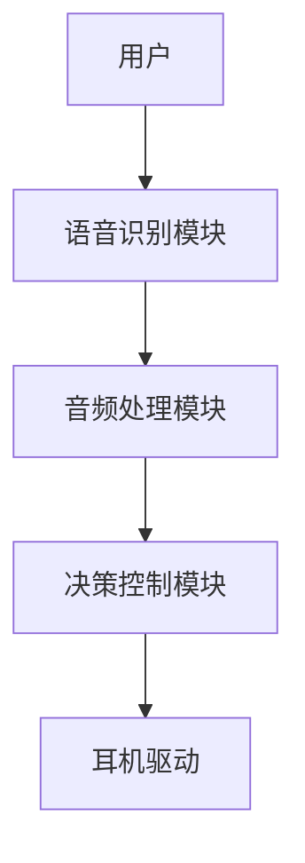
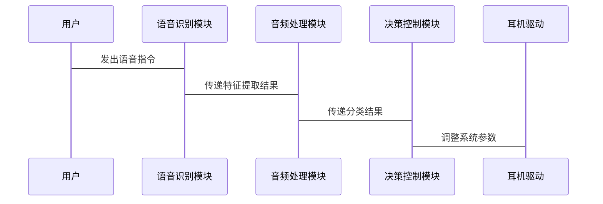

                 


# AI Agent在智能耳机中的听力保护功能

> 关键词：AI Agent, 听力保护, 智能耳机, 噪声控制, 音频处理, 机器学习, 听觉健康

> 摘要：随着智能耳机的普及，保护用户听力健康变得越来越重要。本文详细探讨了AI Agent在智能耳机中的听力保护功能，从核心概念、算法原理到系统架构，再到实际应用案例，全面解析了如何利用人工智能技术实现智能耳机的听力保护功能。通过本文，读者可以深入了解AI Agent在智能耳机中的工作原理，掌握其在听力保护中的实际应用价值，并为后续研究和开发提供参考。

---

# 第一章: AI Agent与听力保护概述

## 1.1 AI Agent的基本概念

### 1.1.1 AI Agent的定义与特点
AI Agent（人工智能代理）是指能够感知环境、执行任务并做出决策的智能实体。其特点包括：
- **自主性**：能够在没有外部干预的情况下独立运行。
- **反应性**：能够实时感知环境并做出响应。
- **学习能力**：通过数据和经验不断优化自身的行为。

### 1.1.2 AI Agent在智能耳机中的应用背景
智能耳机作为一种结合了音频处理和人工智能技术的设备，可以通过AI Agent实现更智能化的功能，如语音识别、噪声控制和个性化音频调节。AI Agent的引入使得智能耳机能够更好地适应用户的听觉需求，同时保护用户的听力健康。

### 1.1.3 听力保护的重要性与需求
长时间使用耳机或在高噪音环境中使用耳机可能导致听力损伤。AI Agent可以通过实时监测音频信号的强度和频谱特征，调整输出音量，避免用户暴露于过高的声音水平。

---

## 1.2 智能耳机的功能与技术基础

### 1.2.1 智能耳机的基本功能
智能耳机的基本功能包括：
- **语音识别**：通过语音指令控制耳机功能。
- **噪声控制**：通过降噪技术消除环境噪声。
- **个性化音频调节**：根据用户听觉习惯调整音频输出。

### 1.2.2 耳机中的AI技术应用
AI技术在耳机中的应用主要体现在：
- **智能降噪**：通过机器学习算法识别并消除环境噪声。
- **个性化音频推荐**：根据用户的听觉偏好推荐音乐或音频内容。
- **实时语音翻译**：将语音内容实时翻译成多种语言。

### 1.2.3 听力保护的必要性
听力保护是智能耳机设计中的重要功能，尤其是对于长期使用耳机的用户。AI Agent可以通过实时监测和调整音频输出，确保用户不会长时间暴露在过高的音量环境中，从而保护听力健康。

---

## 1.3 本章小结
本章介绍了AI Agent的基本概念及其在智能耳机中的应用背景，重点阐述了智能耳机的基本功能和技术基础。同时，强调了听力保护的重要性，为后续章节的深入分析奠定了基础。

---

# 第二章: AI Agent的核心原理与技术

## 2.1 自然语言处理与语音识别

### 2.1.1 NLP的基本原理
自然语言处理（NLP）是AI Agent实现语音识别和理解的核心技术。NLP通过分析语音信号的特征，如音调、语速和语调，将其转换为可理解的文本。

### 2.1.2 语音识别的实现流程
语音识别的实现流程包括：
1. **语音信号采集**：通过麦克风采集用户的语音信号。
2. **特征提取**：提取语音信号的特征，如MFCC（Mel-Frequency Cepstral Coefficients）。
3. **模型训练**：使用机器学习算法训练语音识别模型。
4. **语音匹配**：将输入语音与训练好的模型进行匹配，输出识别结果。

### 2.1.3 NLP与语音识别的结合
通过NLP技术，AI Agent可以理解用户的意图，并根据意图调整耳机的音频输出参数，例如调整音量或切换音乐播放模式。

---

## 2.2 实时音频分析与特征提取

### 2.2.1 音频信号的特征提取方法
音频信号的特征提取方法包括：
- **时域特征**：如波形、周期和幅度。
- **频域特征**：如频谱、频带能量和能量比。
- **时频域特征**：如小波变换和常规模型。

### 2.2.2 基于AI的音频分类
通过机器学习算法，AI Agent可以对音频信号进行分类，例如区分音乐、语音和其他类型的声音。分类结果可以用于动态调整音频输出，以优化用户的听觉体验。

### 2.2.3 特征提取的数学模型
特征提取的数学模型可以通过以下公式表示：
$$
\text{MFCC} = \log(DFT(\text{x[n]}))
$$
其中，DFT表示离散傅里叶变换，x[n]表示输入信号。

---

## 2.3 AI Agent的决策机制

### 2.3.1 基于规则的决策系统
基于规则的决策系统通过预定义的规则对音频信号进行分类和处理。例如，当检测到环境噪声超过一定阈值时，系统会自动启动降噪功能。

### 2.3.2 基于机器学习的决策系统
基于机器学习的决策系统通过训练好的模型对音频信号进行分类和处理。例如，使用深度学习模型对音频信号进行实时分类，并动态调整耳机的音频输出。

### 2.3.3 决策机制的优化方法
为了提高决策系统的准确性，可以采用在线学习和增量学习的方法，实时更新模型参数，以适应不同环境下的音频处理需求。

---

## 2.4 本章小结
本章详细介绍了AI Agent的核心原理与技术，包括自然语言处理、语音识别、实时音频分析和决策机制。通过这些技术，AI Agent能够实现智能耳机的听力保护功能。

---

# 第三章: AI Agent在听力保护中的具体应用

## 3.1 听力保护的功能需求

### 3.1.1 听力保护的指标与标准
听力保护的指标包括：
- **最大声输出**：耳机的最大音量输出。
- **噪声暴露时间**：用户暴露在高噪声环境中的时间。
- **频谱能量分布**：音频信号的频谱特征。

### 3.1.2 功能需求的分解与优先级
听力保护功能的需求分解包括：
1. **实时噪声监测**：监测环境噪声的强度和频谱特征。
2. **动态音量调节**：根据环境噪声和用户听觉习惯动态调整音量。
3. **个性化音频优化**：根据用户的听觉偏好优化音频输出。

### 3.1.3 用户需求分析
通过用户调研和数据分析，了解用户对听力保护功能的需求，例如长时间使用耳机的用户对听力保护功能的需求较高。

---

## 3.2 AI Agent在听力保护中的实现

### 3.2.1 噪声检测与分类
AI Agent通过实时检测环境噪声的强度和类型，动态调整耳机的降噪模式。例如，当检测到环境噪声较高时，系统会自动启动主动降噪功能。

### 3.2.2 动态音量调节
动态音量调节算法通过分析环境噪声和用户听觉习惯，动态调整耳机的输出音量。例如，当用户在嘈杂的环境中使用耳机时，系统会自动提高音量，以确保用户能够清晰地听到音频内容。

### 3.2.3 个性化音频优化
个性化音频优化功能通过分析用户的听觉偏好，调整音频输出的频谱特征，以提供更舒适的听觉体验。例如，用户可以选择低音增强或高音增强模式。

---

## 3.3 听力保护的实际案例分析

### 3.3.1 环境噪声检测与降噪
通过AI Agent实现的环境噪声检测与降噪功能，可以在嘈杂的环境中提供清晰的音频输出。例如，在火车车厢中使用智能耳机，系统会自动检测环境噪声并启动降噪功能。

### 3.3.2 动态音量调节
动态音量调节功能可以根据用户的听觉习惯和环境噪声自动调整音量输出。例如，在安静的环境中，系统会降低音量，以提供舒适的听觉体验。

### 3.3.3 个性化音频优化
个性化音频优化功能可以根据用户的听觉偏好，提供定制化的音频输出。例如，用户可以选择低音增强模式，以获得更丰富的音乐体验。

---

## 3.4 本章小结
本章详细介绍了AI Agent在听力保护中的具体应用，包括噪声检测与分类、动态音量调节和个性化音频优化。通过这些功能的实现，AI Agent能够有效地保护用户的听力健康，同时提供更优质的听觉体验。

---

# 第四章: AI Agent在智能耳机中的系统架构设计

## 4.1 系统功能设计

### 4.1.1 系统功能模块
智能耳机的系统功能模块包括：
- **语音识别模块**：实现语音指令的识别和处理。
- **音频处理模块**：实现音频信号的特征提取和分类。
- **决策控制模块**：根据分析结果动态调整系统参数。

### 4.1.2 功能模块的交互流程
功能模块的交互流程包括：
1. **语音信号采集**：通过麦克风采集用户的语音信号。
2. **特征提取与分类**：对语音信号进行特征提取和分类。
3. **决策控制**：根据分类结果动态调整系统参数。

---

## 4.2 系统架构设计

### 4.2.1 系统架构图
以下是智能耳机的系统架构图：



### 4.2.2 系统接口设计
系统接口设计包括：
- **用户接口**：提供语音指令输入和音频输出接口。
- **系统接口**：提供与耳机驱动和其他功能模块的交互接口。

---

## 4.3 系统交互流程

### 4.3.1 系统交互序列图
以下是系统交互的序列图：



---

## 4.4 本章小结
本章详细介绍了AI Agent在智能耳机中的系统架构设计，包括功能模块的设计、系统架构图和系统交互流程。通过这些设计，可以实现AI Agent在听力保护中的高效运行。

---

# 第五章: AI Agent在智能耳机中的项目实战

## 5.1 项目环境安装

### 5.1.1 开发环境配置
开发环境配置包括：
- **操作系统**：建议使用Linux或macOS系统。
- **开发工具**：推荐使用PyCharm或VS Code。
- **依赖库安装**：安装Python的第三方库，例如numpy、scipy、librosa等。

### 5.1.2 项目代码仓库
项目代码仓库可以通过GitHub或其他代码托管平台获取。

---

## 5.2 系统核心实现

### 5.2.1 语音识别模块实现
语音识别模块的实现代码如下：

```python
import librosa
import numpy as np

def extract_features(audio_file):
    audio, sr = librosa.load(audio_file, sr=None)
    mfcc = librosa.feature.mfcc(y=audio, sr=sr)
    return mfcc.T

# 示例用法
features = extract_features("input.wav")
print(features.shape)
```

### 5.2.2 音频处理模块实现
音频处理模块的实现代码如下：

```python
import numpy as np

def classify_audio(features, model):
    prediction = model.predict(features)
    return prediction

# 示例用法
model = ...  # 加载训练好的模型
features = ...  # 提取的特征向量
result = classify_audio(features, model)
print(result)
```

### 5.2.3 决策控制模块实现
决策控制模块的实现代码如下：

```python
def adjust_volume(level):
    if level > threshold:
        volume = volume_level[level]
    else:
        volume = default_volume
    return volume

# 示例用法
noise_level = ...  # 环境噪声水平
volume = adjust_volume(noise_level)
print(volume)
```

---

## 5.3 代码应用解读与分析

### 5.3.1 语音识别模块解读
语音识别模块通过 librosa 库提取语音信号的MFCC特征，并将其传递给分类模型进行识别。分类模型可以是支持向量机（SVM）或神经网络模型。

### 5.3.2 音频处理模块解读
音频处理模块通过特征提取和分类算法对音频信号进行实时处理。分类结果可以用于动态调整耳机的音频输出参数。

### 5.3.3 决策控制模块解读
决策控制模块根据分类结果和环境噪声水平动态调整耳机的音量输出。例如，当环境噪声较高时，系统会自动提高音量，以确保用户能够清晰地听到音频内容。

---

## 5.4 实际案例分析

### 5.4.1 环境噪声检测与降噪
通过AI Agent实现的环境噪声检测与降噪功能，可以在嘈杂的环境中提供清晰的音频输出。例如，在火车车厢中使用智能耳机，系统会自动检测环境噪声并启动降噪功能。

### 5.4.2 动态音量调节
动态音量调节功能可以根据用户的听觉习惯和环境噪声自动调整音量输出。例如，在安静的环境中，系统会降低音量，以提供舒适的听觉体验。

### 5.4.3 个性化音频优化
个性化音频优化功能可以根据用户的听觉偏好，提供定制化的音频输出。例如，用户可以选择低音增强或高音增强模式。

---

## 5.5 本章小结
本章通过具体的项目实战，详细介绍了AI Agent在智能耳机中的实现过程，包括环境配置、核心代码实现和实际案例分析。通过这些实践，可以更好地理解AI Agent在听力保护中的实际应用价值。

---

# 第六章: AI Agent在听力保护中的最佳实践

## 6.1 实践中的注意事项

### 6.1.1 数据采集与标注
数据采集与标注是AI Agent训练的重要环节。需要确保数据的多样性和代表性，以提高模型的泛化能力。

### 6.1.2 模型优化与调参
模型优化与调参是提高AI Agent性能的关键。可以通过交叉验证和网格搜索等方法找到最佳的模型参数。

### 6.1.3 系统测试与调试
系统测试与调试是确保AI Agent稳定运行的重要步骤。需要进行全面的功能测试和性能测试，以发现和解决潜在的问题。

---

## 6.2 听力保护的小结

### 6.2.1 听力保护的核心价值
听力保护的核心价值在于保护用户的听力健康，同时提供更优质的听觉体验。

### 6.2.2 听力保护的未来发展方向
未来的发展方向包括：
- **更智能的降噪技术**：通过深度学习模型实现更高效的降噪。
- **个性化的音频优化**：根据用户的听觉偏好提供定制化的音频输出。
- **实时的听力监测**：通过AI Agent实时监测用户的听力健康，提供预警和建议。

---

## 6.3 本章小结
本章总结了AI Agent在听力保护中的最佳实践，包括数据采集与标注、模型优化与调参以及系统测试与调试。同时，展望了听力保护的未来发展方向。

---

# 作者：AI天才研究院/AI Genius Institute & 禅与计算机程序设计艺术 /Zen And The Art of Computer Programming

