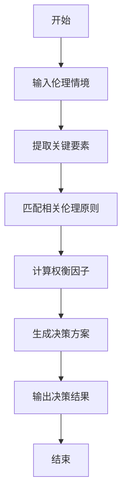
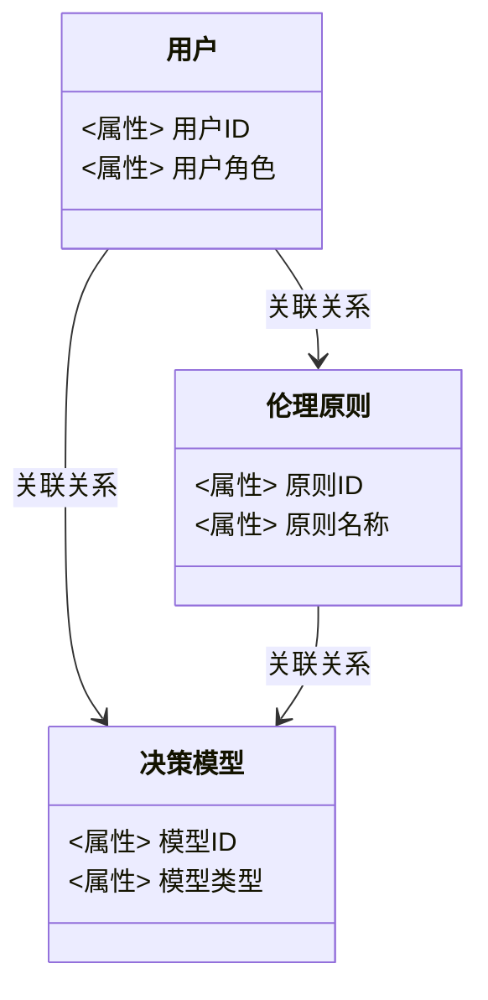
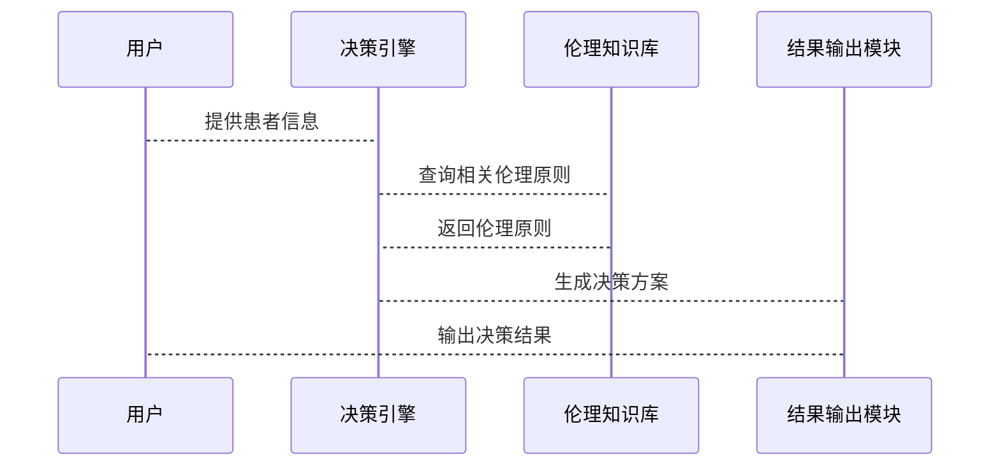

                 


# AI Agent的伦理决策框架：实现LLM的道德推理能力

## 关键词：AI Agent，伦理决策，LLM，道德推理能力，决策框架

## 摘要：
随着人工智能技术的快速发展，AI Agent在各个领域的应用越来越广泛。然而，AI Agent在做出决策时，如何确保其符合伦理规范，成为一个亟待解决的问题。本文将深入探讨AI Agent的伦理决策框架，分析其核心概念、算法原理及系统架构，并通过实际案例展示如何实现LLM的道德推理能力。通过本文的阐述，读者将能够理解并掌握如何构建一个具备伦理决策能力的AI系统。

---

## 正文：

### 第一部分: 背景介绍

#### 第1章: AI Agent与伦理决策概述

##### 1.1 AI Agent的基本概念

###### 1.1.1 AI Agent的定义与特点
AI Agent（人工智能代理）是指能够感知环境并采取行动以实现目标的智能实体。AI Agent具有以下特点：
- **自主性**：能够在没有外部干预的情况下自主决策。
- **反应性**：能够实时感知环境并做出响应。
- **目标导向性**：所有行动都是为了实现特定目标。

###### 1.1.2 AI Agent的分类与应用场景
AI Agent可以根据智能水平和应用场景分为以下几类：
1. **基于规则的AI Agent**：通过预定义的规则进行决策，适用于简单、确定性环境。
2. **基于学习的AI Agent**：通过机器学习算法从数据中学习决策策略，适用于复杂、动态环境。
3. **混合型AI Agent**：结合规则和学习的混合策略，适用于复杂性和确定性并存的环境。

应用场景包括：
- 智能助手（如Siri、Alexa）
- 自动驾驶汽车
- 医疗诊断辅助系统
- 金融投资决策系统

###### 1.1.3 AI Agent与人类决策的异同
AI Agent与人类决策的异同主要体现在：
- **决策速度**：AI Agent能够快速处理大量数据并做出决策，而人类决策相对较慢。
- **决策依据**：AI Agent依赖于编程规则和训练数据，而人类决策基于情感、经验和逻辑。
- **可重复性**：AI Agent的决策过程是高度可重复的，而人类决策具有一定的主观性和不可重复性。

##### 1.2 伦理决策的核心概念

###### 1.2.1 伦理决策的定义与特征
伦理决策是指在遵循道德规范和伦理原则的基础上，做出合理、公正的决策。其主要特征包括：
- **价值导向性**：决策过程中需要考虑伦理价值观。
- **权衡性**：在多个利益之间进行权衡和取舍。
- **情境依赖性**：决策结果会受到具体情境的影响。

###### 1.2.2 伦理决策的主体与客体关系
在AI Agent的伦理决策中，决策主体是AI系统，决策客体是环境中的实体（如人、物、事件等）。AI Agent需要在满足伦理原则的前提下，与客体进行交互并做出决策。

###### 1.2.3 伦理决策的边界与外延
伦理决策的边界在于如何平衡AI Agent的目标与社会伦理规范。其外延包括：
- **个人伦理**：如隐私保护、个人权益。
- **社会伦理**：如公共利益、社会公平。
- **环境伦理**：如可持续发展、生态保护。

##### 1.3 LLM与伦理决策的关联

###### 1.3.1 LLM的基本原理与能力
LLM（Large Language Model）是一种基于深度学习的自然语言处理模型，具有以下能力：
- **理解能力**：能够理解和生成人类语言。
- **推理能力**：通过大规模数据训练，具备一定的逻辑推理能力。
- **自适应能力**：能够根据上下文调整输出内容。

###### 1.3.2 LLM在伦理推理中的潜力
LLM可以通过对海量伦理案例的学习，模拟人类的伦理推理过程。其潜力体现在：
- **案例推理**：通过分析类似案例，生成合理的决策建议。
- **多目标优化**：在多个伦理目标之间进行权衡和优化。
- **动态适应**：能够根据环境变化调整伦理决策策略。

###### 1.3.3 当前LLM在伦理决策中的局限性
当前LLM在伦理决策中的局限性主要表现在：
- **缺乏价值观一致性**：不同模型可能因为训练数据的不同而产生不同的伦理判断。
- **可解释性不足**：LLM的决策过程通常难以解释。
- **动态适应性有限**：难以应对突发的、未见过的伦理情境。

---

### 第二部分: 核心概念与联系

#### 第2章: 伦理决策框架的核心要素

##### 2.1 伦理决策框架的结构

###### 2.1.1 伦理原则与价值观的层次化
伦理原则可以分为以下几个层次：
1. **基本伦理原则**：如诚实、公正、不伤害他人。
2. **具体伦理规范**：如隐私保护、数据安全。
3. **组织或行业特定原则**：如医疗伦理、金融伦理。

###### 2.1.2 决策过程中的权衡机制
在伦理决策中，权衡机制是关键。常见的权衡方法包括：
- **优先级排序**：根据伦理原则的重要性进行排序。
- **损失最小化**：在可能造成伤害的情况下，选择伤害最小的选项。
- **利益最大化**：在可能带来利益的情况下，选择利益最大的选项。

###### 2.1.3 框架的可解释性与透明性
为了确保伦理决策的可信性，框架需要具备可解释性和透明性。这包括：
- **决策过程透明**：能够追溯决策的每一步。
- **结果可解释**：能够用人类可理解的方式解释决策结果。
- **模型可解释**：能够解释模型的决策逻辑。

##### 2.2 核心概念的属性对比

###### 2.2.1 伦理原则的属性特征对比表

| 伦理原则 | 属性 | 特征 |
|----------|------|------|
| 诚实     | 基础性 | 核心原则 |
| 公正     | 普适性 | 广泛适用 |
| 不伤害他人 | 紧急性 | 需优先考虑 |

###### 2.2.2 决策模型的属性特征对比表

| 决策模型 | 属性 | 特征 |
|----------|------|------|
| 基于规则 | 简单性 | 易实现 |
| 基于学习 | 复杂性 | 高灵活性 |
| 混合型 | 综合性 | 高适应性 |

###### 2.2.3 框架设计的属性特征对比表

| 框架设计 | 属性 | 特征 |
|----------|------|------|
| 分层式 | 层次性 | 易管理 |
| 平铺式 | 简单性 | 易实现 |
| 综合式 | 综合性 | 高复杂性 |

##### 2.3 ER实体关系图

```mermaid
erDiagram
    用户 {
        <属性> 用户ID
        <属性> 用户角色
    }
    伦理原则 {
        <属性> 原则ID
        <属性> 原则名称
    }
    决策模型 {
        <属性> 模型ID
        <属性> 模型类型
    }
    用户 --> 伦理原则 : 关联关系
    用户 --> 决策模型 : 关联关系
    伦理原则 --> 决策模型 : 关联关系
```

---

### 第三部分: 算法原理

#### 第3章: 伦理决策框架的算法原理

##### 3.1 伦理决策的算法模型

###### 3.1.1 基于伦理原则的多目标优化
多目标优化是一种在多个目标之间进行权衡的算法。例如，在自动驾驶中，当遇到紧急情况时，需要在“保护乘客”和“减少路人伤害”之间进行权衡。

###### 3.1.2 基于案例推理的决策树构建
决策树是一种常用的机器学习算法，适用于伦理决策中的案例推理。例如，可以通过分析类似案例，构建决策树来指导AI Agent做出决策。

###### 3.1.3 基于强化学习的伦理决策
强化学习是一种通过试错来优化决策策略的算法。例如，可以通过模拟不同的伦理情境，训练AI Agent在不同情境下做出最优决策。

##### 3.2 算法流程图



##### 3.3 算法实现代码

```python
def ethical_decision-making(context, principles):
    # 输入参数：context为伦理情境，principles为伦理原则列表
    # 输出：决策结果
    # 具体实现：根据情境匹配相关原则，计算权衡因子，生成决策方案
    pass
```

##### 3.4 数学模型与公式

###### 3.4.1 权衡因子计算公式
$$ \text{权衡因子} = \frac{\sum_{i=1}^{n} w_i \cdot p_i}{\sum_{i=1}^{n} w_i} $$

其中，\( w_i \) 是第 \( i \) 个原则的权重，\( p_i \) 是第 \( i \) 个原则的评分。

---

### 第四部分: 系统分析与架构设计

#### 第4章: 系统分析与架构设计方案

##### 4.1 问题场景介绍
在医疗辅助决策系统中，AI Agent需要根据患者的具体情况，结合伦理原则，做出合理的诊断和治疗方案。

##### 4.2 系统功能设计

###### 4.2.1 领域模型



###### 4.2.2 系统架构图

```mermaid
container 医疗辅助决策系统 {
    component 伦理知识库 {
        <功能> 存储伦理原则
        <功能> 提供伦理原则查询
    }
    component 决策引擎 {
        <功能> 分析患者情况
        <功能> 调用伦理知识库
        <功能> 生成决策方案
    }
    component 结果输出模块 {
        <功能> 输出决策结果
        <功能> 提供可解释性说明
    }
}
```

##### 4.3 系统接口设计
系统接口设计包括：
- **输入接口**：接收患者的基本信息和病情描述。
- **输出接口**：输出诊断建议和治疗方案。
- **交互接口**：提供人机交互界面，方便医生和患者查看决策过程。

##### 4.4 系统交互图



---

### 第五部分: 项目实战

#### 第5章: 项目实战

##### 5.1 环境配置
- **操作系统**：Linux/Windows/MacOS
- **编程语言**：Python
- **框架与库**：TensorFlow/PyTorch、Hugging Face Transformers
- **工具与依赖**：Mermaid、Graphviz、Jupyter Notebook

##### 5.2 核心实现

###### 5.2.1 伦理知识库的构建
```python
class EthicalPrinciple:
    def __init__(self, principle_id, principle_name):
        self.principle_id = principle_id
        self.principle_name = principle_name
```

###### 5.2.2 决策引擎的实现
```python
class DecisionEngine:
    def __init__(self, ethical_principles):
        self.ethical_principles = ethical_principles

    def make_decision(self, context):
        # 根据上下文匹配相关伦理原则并生成决策方案
        pass
```

##### 5.3 应用案例分析
以医疗辅助决策为例，AI Agent需要根据患者的病情和伦理原则，生成合理的诊断建议。例如，在面对 scarce medical resources（有限医疗资源）时，AI Agent需要在“救治更多患者”和“优先救治病情较重的患者”之间进行权衡。

##### 5.4 实验与结果分析
通过实验验证伦理决策框架的有效性，包括：
- **实验设计**：设计不同的伦理情境，测试AI Agent的决策能力。
- **结果分析**：分析决策结果的合理性和可解释性。

---

### 第六部分: 总结与展望

#### 第6章: 总结与展望

##### 6.1 核心内容回顾
本文从AI Agent的伦理决策框架出发，详细探讨了其核心概念、算法原理和系统架构，并通过实际案例展示了如何实现LLM的道德推理能力。

##### 6.2 当前挑战
当前AI Agent的伦理决策框架面临以下挑战：
- **伦理原则的动态性**：社会伦理规范会随着时间和环境的变化而变化。
- **决策的可解释性**：复杂的决策过程难以向人类解释。
- **模型的可扩展性**：如何在不同领域和场景中扩展伦理决策框架。

##### 6.3 未来展望
未来的研究方向包括：
- **多模态伦理推理**：结合视觉、听觉等多种模态信息，提高伦理决策的准确性。
- **分布式伦理推理**：在分布式系统中实现协同伦理决策。
- **伦理决策的自适应性**：使AI Agent能够根据环境变化动态调整伦理决策策略。

##### 6.4 最佳实践 Tips
- **明确伦理原则**：在设计AI Agent时，明确其需要遵循的伦理原则。
- **注重可解释性**：确保伦理决策过程和结果具有可解释性。
- **动态更新**：定期更新伦理原则和决策模型，以适应社会的变化。

---

## 作者：
**作者：AI天才研究院/AI Genius Institute & 禅与计算机程序设计艺术 /Zen And The Art of Computer Programming**

