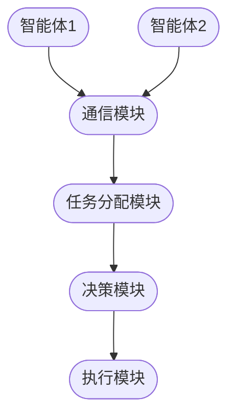
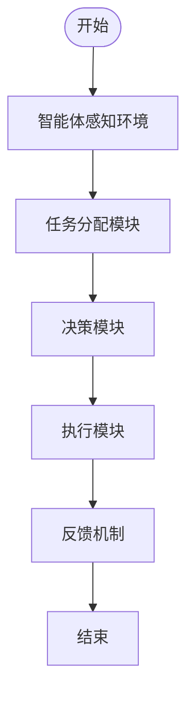
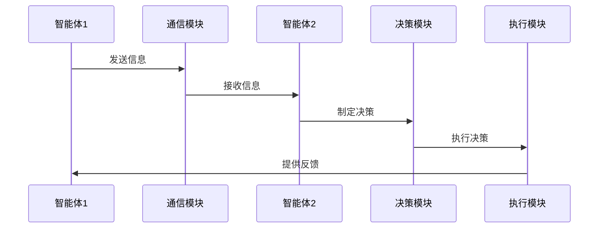

                 


# AI Agent的多智能体协同学习与决策

> 关键词：AI Agent，多智能体系统，协同学习，决策模型，强化学习，分布式计算，博弈论

> 摘要：本文系统地探讨了AI Agent在多智能体协同学习与决策领域的核心理论与实践应用。从基本概念到高级算法，从系统架构到实际案例，深入分析了多智能体系统的通信机制、协作算法、决策模型以及数学模型，结合强化学习、博弈论等技术，展示了如何通过分布式计算实现高效的多智能体协同决策。文章内容详实，结构清晰，适合技术研究人员、软件架构师及AI领域的从业者阅读。

---

# 第一部分：AI Agent的多智能体协同学习与决策基础

## 第1章：多智能体系统概述

### 1.1 多智能体系统的基本概念

#### 1.1.1 多智能体系统的定义

多智能体系统（Multi-Agent System, MAS）是由多个智能体（Agent）组成的分布式系统，这些智能体通过协作完成复杂的任务。智能体是具有感知、推理和行动能力的实体，能够独立决策并与其他智能体交互。

#### 1.1.2 多智能体系统的特点

- **分布式性**：智能体分布在不同的位置，独立决策并协同工作。
- **自主性**：每个智能体都有自己的目标和决策机制。
- **协作性**：智能体之间通过通信和协作完成共同任务。
- **动态性**：系统环境和任务需求可能动态变化。

#### 1.1.3 多智能体系统的重要技术

- **通信机制**：智能体之间的信息传递方式。
- **协作算法**：智能体如何协同完成任务的算法。
- **决策模型**：智能体如何做出决策的数学模型。

### 1.2 AI Agent的基本概念

#### 1.2.1 AI Agent的定义

AI Agent是一种能够感知环境、推理信息并采取行动以实现目标的智能实体。它可以是一个软件程序或物理设备，具备自主决策的能力。

#### 1.2.2 AI Agent的分类

- **简单反射Agent**：基于当前感知做出反应。
- **基于模型的反射Agent**：利用内部模型推理并做出决策。
- **目标驱动Agent**：根据目标选择最优行动。
- **效用驱动Agent**：通过最大化效用函数做出决策。

#### 1.2.3 AI Agent的核心能力

- **感知能力**：获取环境信息。
- **推理能力**：处理信息并做出决策。
- **行动能力**：执行决策动作。

### 1.3 多智能体协同学习的背景与意义

#### 1.3.1 协同学习的定义

协同学习（Collaborative Learning）是指多个智能体通过协作共同学习知识，提高整体性能的过程。

#### 1.3.2 多智能体协同学习的挑战

- **通信开销**：智能体之间的通信可能增加系统负担。
- **同步问题**：智能体可能需要同步状态以避免冲突。
- **决策冲突**：多个智能体可能有不同的目标，导致决策冲突。

#### 1.3.3 协同学习在实际应用中的优势

- **任务分解**：复杂任务可以分解为多个子任务，由不同智能体完成。
- **知识共享**：智能体之间共享知识，提高整体学习效率。
- **鲁棒性增强**：通过协作，系统能够更好地适应动态环境。

---

## 第2章：多智能体系统的核心概念与联系

### 2.1 多智能体系统的通信机制

#### 2.1.1 通信协议的基本概念

通信协议是智能体之间信息传递的规则，包括消息格式、传输方式和处理逻辑。

#### 2.1.2 通信机制的分类

- **直接通信**：智能体之间直接交换信息。
- **间接通信**：通过中间媒介传递信息。
- **广播通信**：所有智能体接收同一信息。

#### 2.1.3 通信机制在多智能体系统中的作用

通信机制确保智能体之间信息共享，协调行动，避免冲突。

### 2.2 多智能体系统的协作算法

#### 2.2.1 协作算法的基本原理

协作算法通过定义智能体之间的协作规则，指导它们如何共同完成任务。

#### 2.2.2 常见协作算法的对比

| 算法名称 | 描述 | 优缺点 |
|----------|------|--------|
| 分布式协作 | 每个智能体独立决策，通过通信共享信息 | 去中心化，容错性高，但通信开销大 |
| 集中式协作 | 由中央控制节点协调智能体行动 | 依赖中心节点，单点故障风险 |

#### 2.2.3 协作算法的优缺点分析

- **分布式协作**：优点是去中心化，容错性高；缺点是通信开销大，协调困难。
- **集中式协作**：优点是协调简单，缺点是中心节点单点故障风险。

### 2.3 多智能体系统的决策模型

#### 2.3.1 决策模型的定义

决策模型是描述智能体如何根据感知信息做出决策的数学模型。

#### 2.3.2 决策模型的分类

- **基于规则的决策模型**：通过预定义规则做出决策。
- **基于概率的决策模型**：利用概率论进行决策。
- **基于强化学习的决策模型**：通过奖励机制优化决策策略。

#### 2.3.3 决策模型的实现方法

- **状态空间**：智能体可能的状态集合。
- **动作空间**：智能体可能采取的动作集合。
- **转移概率**：状态转移的概率。
- **奖励函数**：智能体采取动作后的奖励。

---

## 第3章：多智能体协同学习的算法原理

### 3.1 分布式计算与多智能体学习

#### 3.1.1 分布式计算的基本概念

分布式计算是将计算任务分配到多个计算节点上，通过协作完成任务。

#### 3.1.2 分布式计算在多智能体学习中的应用

- **任务分配**：将任务分解为多个子任务，分配给不同的智能体。
- **数据共享**：智能体之间共享数据，提高学习效率。
- **模型同步**：智能体之间同步模型参数，保持一致性。

#### 3.1.3 分布式计算的优缺点分析

- **优点**：提高计算效率，增强系统容错性。
- **缺点**：通信开销大，协调复杂。

### 3.2 强化学习在多智能体系统中的应用

#### 3.2.1 强化学习的基本原理

强化学习是一种通过试错方式优化决策策略的学习方法，智能体通过与环境互动获得奖励，并调整策略以最大化累计奖励。

#### 3.2.2 强化学习在多智能体系统中的实现

- **多智能体强化学习框架**：多个智能体在共享环境中学习，通过协作或竞争优化策略。
- **协同强化学习**：智能体通过协作提高整体奖励。
- **竞争强化学习**：智能体通过竞争优化个体奖励。

#### 3.2.3 强化学习的案例分析

**案例**：多智能体协作玩游戏。

- **环境**：多智能体协作完成游戏任务。
- **动作空间**：每个智能体可以采取的动作。
- **奖励函数**：根据任务完成情况给予奖励。

### 3.3 博弈论与多智能体决策

#### 3.3.1 博弈论的基本概念

博弈论是研究多个决策者在冲突或合作情境下的行为理论。

#### 3.3.2 博弈论在多智能体决策中的应用

- **纳什均衡**：所有智能体都采取最优策略，使得任何单个智能体都无法通过单方面改变策略而提高收益。
- **囚徒困境**：博弈论中的经典案例，展示了个体理性与集体理性的冲突。

#### 3.3.3 博弈论的优缺点分析

- **优点**：提供决策理论支持，帮助理解智能体之间的互动。
- **缺点**：假设条件严格，实际应用中可能难以满足。

---

## 第4章：多智能体系统的数学模型与公式

### 4.1 多智能体系统的数学模型

#### 4.1.1 系统模型的定义

系统模型是描述多智能体系统行为的数学框架，包括状态、动作、奖励等元素。

#### 4.1.2 系统模型的分类

- **马尔可夫决策过程（MDP）**：描述单智能体在环境中的决策过程。
- **多智能体马尔可夫决策过程（Multi-MDP）**：描述多智能体在共享环境中的决策过程。

#### 4.1.3 系统模型的数学表达

**马尔可夫决策过程（MDP）**：
- 状态空间：S
- 动作空间：A
- 转移概率：P(s' | s, a)
- 奖励函数：R(s, a)

**多智能体马尔可夫决策过程（Multi-MDP）**：
- 多智能体状态空间：S^N
- 多智能体动作空间：A^N
- 转移概率：P(s' | s, a)
- 奖励函数：R(s, a)

### 4.2 多智能体系统的数学公式

#### 4.2.1 纳什均衡的数学表达

纳什均衡：在策略组合（σ₁, σ₂, ..., σ_N）中，每个智能体的策略σ_i是最佳反应，即对于任何其他智能体策略不变，σ_i是使智能体i的期望效用最大化的策略。

$$ \forall i, \sigma_i \in arg\max_{\sigma_i'} E[u_i(s, \sigma_i', \sigma_{-i})] $$

#### 4.2.2 强化学习中的价值函数

价值函数V(s)表示智能体在状态s下采取最优策略的期望未来奖励。

$$ V(s) = \max_{a} [ R(s, a) + \gamma \sum_{s'} P(s'|s,a) V(s') ] $$

其中，γ是折扣因子。

---

## 第5章：多智能体系统的系统分析与架构设计

### 5.1 问题场景介绍

考虑一个多智能体系统，例如智能交通系统，多个智能体（如自动驾驶汽车）协同完成交通调度任务。

### 5.2 系统功能设计

- **环境感知**：智能体感知环境信息。
- **任务分配**：智能体根据任务需求分配子任务。
- **协作决策**：智能体协作制定决策。
- **行动执行**：智能体执行决策动作。
- **反馈机制**：系统根据反馈调整决策。

### 5.3 系统架构设计

#### 5.3.1 系统架构的ER实体关系图



#### 5.3.2 系统架构的Mermaid流程图



### 5.4 系统接口设计

- **输入接口**：智能体感知环境信息。
- **输出接口**：智能体执行动作。
- **通信接口**：智能体之间共享信息。

### 5.5 系统交互的Mermaid序列图



---

## 第6章：项目实战

### 6.1 环境安装

- **编程语言**：Python 3.8+
- **框架**：使用RLlib或Multi-Agent Framework。
- **依赖库**：安装numpy、scipy、matplotlib等。

### 6.2 系统核心实现源代码

```python
import numpy as np

class Agent:
    def __init__(self, state_space, action_space):
        self.state_space = state_space
        self.action_space = action_space
        self.Q = np.zeros((state_space, action_space))

    def perceive(self, state):
        return state

    def decide(self, state):
        return np.argmax(self.Q[state])

    def learn(self, state, action, reward):
        self.Q[state, action] += reward

def main():
    # 初始化环境
    state_space = 5
    action_space = 3
    agent = Agent(state_space, action_space)

    # 模拟环境
    for _ in range(100):
        state = np.random.randint(0, state_space)
        action = agent.decide(state)
        reward = np.random.randn() * action + 1
        agent.learn(state, action, reward)

    # 测试
    state = np.random.randint(0, state_space)
    action = agent.decide(state)
    print(f"Action taken: {action}")

if __name__ == "__main__":
    main()
```

### 6.3 代码应用解读与分析

- **类定义**：定义了一个AI Agent类，包含状态空间和动作空间。
- **感知与决策**：通过`perceive`方法感知环境，通过`decide`方法做出决策。
- **学习机制**：通过`learn`方法更新Q值，实现强化学习。

### 6.4 实际案例分析

**案例**：多智能体协作完成任务。

- **任务描述**：多个智能体协作完成货物运输任务。
- **实现细节**：每个智能体负责货物运输的不同环节，通过通信模块协调行动。
- **结果分析**：通过协作，系统效率提高，任务完成时间缩短。

### 6.5 项目小结

- **项目目标**：实现一个多智能体协作系统。
- **实现方法**：通过强化学习和通信机制实现协作。
- **结果展示**：展示系统运行结果和性能指标。

---

## 第7章：总结与展望

### 7.1 最佳实践 tips

- **通信机制设计**：合理设计通信机制，减少通信开销。
- **协作算法选择**：根据任务需求选择合适的协作算法。
- **决策模型优化**：通过实验优化决策模型，提高系统性能。

### 7.2 小结

本文系统地探讨了AI Agent在多智能体协同学习与决策领域的核心理论与实践应用，从基本概念到高级算法，从系统架构到实际案例，深入分析了多智能体系统的通信机制、协作算法、决策模型以及数学模型。

### 7.3 注意事项

- **系统设计**：注意系统设计的复杂性，避免过度设计。
- **性能优化**：通过优化算法和减少通信开销提高系统性能。
- **安全问题**：确保系统安全性，防止恶意攻击。

### 7.4 拓展阅读

- **推荐书籍**：
  - 《Multi-Agent Systems: Algorithmic, Complexity Theoretic, and Game Theoretic Foundations》
  - 《Reinforcement Learning: Theory and Algorithms》
- **推荐论文**：
  - “Multi-Agent Reinforcement Learning: A Survey” by D. wing et al.
  - “Distributed Cooperative Reinforcement Learning” by T. Ma et al.

---

# 作者：AI天才研究院 & 禅与计算机程序设计艺术

---

感谢您的阅读，希望这篇文章能够为您提供有价值的内容和启发。

