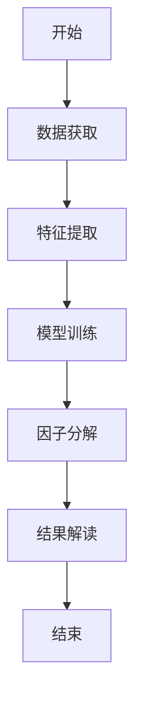
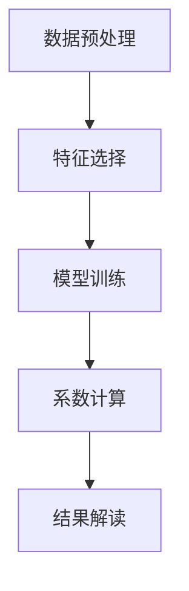
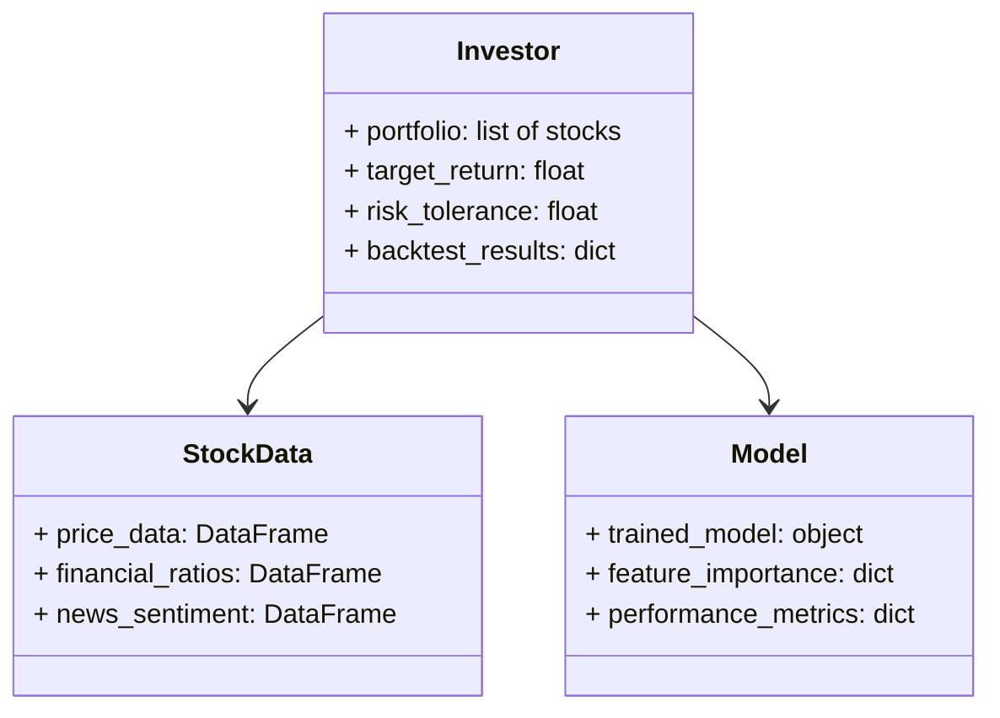
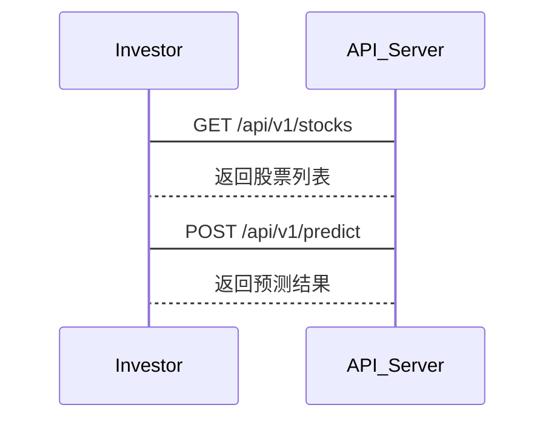

                 


# AI驱动的价值投资策略性能归因

## 关键词：AI驱动，价值投资，性能归因，因子模型，机器学习，投资策略

## 摘要：  
本文深入探讨了AI在价值投资策略中的应用，重点分析了如何利用AI技术进行投资策略的性能归因。通过结合因子模型和机器学习算法，本文提出了一个系统化的解决方案，详细阐述了从数据获取、特征工程、模型训练到结果解读的完整流程。同时，本文还通过实际案例分析，展示了如何通过性能归因优化投资策略，为投资者提供了可操作的指导和建议。

---

# 第1章: 价值投资与AI驱动的必要性

## 1.1 价值投资的基本概念

### 1.1.1 价值投资的定义  
价值投资是一种以低于内在价值的价格买入优质股票的投资策略，其核心在于寻找市场低估的公司，长期持有以实现超额收益。  

### 1.1.2 价值投资的核心理念  
价值投资强调基本面分析，重点关注企业的财务状况、行业地位、竞争优势等因素，追求长期稳定的回报。  

### 1.1.3 价值投资在现代金融中的地位  
随着市场波动加剧和信息不对称问题的凸显，价值投资在现代金融中的地位日益重要，但传统方法的效率和精度已无法满足需求。

---

## 1.2 AI驱动在投资中的必要性

### 1.2.1 传统投资分析的局限性  
传统价值投资依赖人工分析，耗时且容易受到主观因素影响，难以处理海量数据和复杂市场环境。  

### 1.2.2 AI在投资分析中的优势  
AI能够快速处理海量数据，发现隐藏的模式和趋势，提供实时反馈，显著提高了投资分析的效率和准确性。  

### 1.2.3 价值投资与AI结合的前景  
通过AI技术优化价值投资策略，能够更精准地识别低估资产，降低投资风险，提升收益。

---

## 1.3 性能归因的核心概念

### 1.3.1 性能归因的定义  
性能归因是指将投资组合的收益分解为各个因子或成分的贡献，以识别驱动收益的关键因素。  

### 1.3.2 性能归因在投资中的作用  
性能归因能够帮助投资者评估策略的有效性，优化投资组合，并及时发现潜在风险。  

### 1.3.3 价值投资策略中的性能归因  
在价值投资中，性能归因能够量化各因子对投资收益的贡献，为策略调整提供数据支持。

---

## 1.4 本章小结  
本章介绍了价值投资的基本概念、AI在投资中的必要性以及性能归因的核心概念，为后续分析奠定了基础。

---

# 第2章: 核心概念与联系

## 2.1 价值投资策略的因子模型

### 2.1.1 常见的因子模型  
- **CAPM模型**：基于资产的系统性风险进行定价。  
- **Fama-French三因子模型**：扩展了CAPM，引入规模和价值因子。  
- **五因子模型**：进一步加入动量、流动性等因子。  

### 2.1.2 因子模型的属性特征对比  
以下表格对比了常见因子模型的核心属性：  

| 模型名称     | 核心因子         | 适用场景               |
|--------------|------------------|------------------------|
| CAPM         | 市场风险          | 系统性风险分析         |
| Fama-French  | 市场风险、规模、价值 | 多因子分析             |
| 五因子模型    | 市场风险、规模、价值、动量、流动性 | 综合因子分析           |

### 2.1.3 ER实体关系图架构  
以下是实体关系图的Mermaid表示：  

```mermaid
erDiagram
    investor <--- invests --- stock
    stock --> hasAttribute --- factor
    factor --> influences --- performance
```

---

## 2.2 AI算法在性能归因中的应用

### 2.2.1 常用AI算法简介  
- **线性回归**：用于分析因子对收益的线性影响。  
- **随机森林**：用于特征重要性分析。  
- **神经网络**：用于非线性关系建模。  

### 2.2.2 算法与因子模型的结合  
通过将因子模型与AI算法结合，能够更准确地识别因子对收益的贡献。  

### 2.2.3 性能归因的流程图  
以下是性能归因的流程图：  



---

## 2.3 本章小结  
本章通过对比因子模型和AI算法，展示了它们在性能归因中的应用，为后续的算法设计提供了理论基础。

---

# 第3章: 算法原理与数学模型

## 3.1 算法原理

### 3.1.1 回归分析  
回归分析用于分析因子与收益之间的关系，常用线性回归模型：  
$$ y = \beta_0 + \beta_1x_1 + \beta_2x_2 + \cdots + \beta_nx_n + \epsilon $$  

### 3.1.2 聚类分析  
聚类分析用于将相似的资产归为一类，便于分析其共同特征。  

### 3.1.3 算法流程图  
以下是回归分析的流程图：  



---

## 3.2 数学模型与公式

### 3.2.1 CAPM模型  
CAPM模型的公式为：  
$$ R_i = R_f + \beta_i(R_m - R_f) $$  
其中，$R_i$ 是资产的预期收益，$R_f$ 是无风险利率，$\beta_i$ 是资产的系统性风险系数，$R_m$ 是市场预期收益。

### 3.2.2 Fama-French三因子模型  
Fama-French模型的公式为：  
$$ R_i = R_f + \beta_1(R_m - R_f) + \beta_2(SMB) + \beta_3(HML) $$  
其中，SMB是小市值溢价，HML是高盈利能力溢价。

---

## 3.3 实际案例分析

### 3.3.1 案例背景  
假设我们有一个包含100只股票的投资组合，需要分析各因子对收益的贡献。

### 3.3.2 数据分析与处理  
使用Python对数据进行清洗和特征提取：  

```python
import pandas as pd

# 数据加载
data = pd.read_csv('stock_data.csv')

# 数据清洗
data.dropna(inplace=True)
data = pd.get_dummies(data)
```

### 3.3.3 模型实现与结果解读  
通过随机森林模型分析各因子的重要性：  

```python
from sklearn.ensemble import RandomForestRegressor

# 模型训练
model = RandomForestRegressor()
model.fit(X_train, y_train)

# 特征重要性分析
importances = pd.Series(model.feature_importances_, index=X.columns)
importances = importances.sort_values(ascending=False)
print(importances)
```

---

## 3.4 本章小结  
本章详细讲解了回归分析和聚类分析的算法原理，并通过实际案例展示了如何使用这些算法进行性能归因。

---

# 第4章: 系统分析与架构设计

## 4.1 问题场景介绍

### 4.1.1 投资策略分析  
分析价值投资策略的各个步骤，包括数据获取、特征提取、模型训练等。

### 4.1.2 数据获取与处理  
从多个数据源获取股票数据，并进行清洗和预处理。

### 4.1.3 模型训练与部署  
训练AI模型，并将其部署到投资系统中进行实时分析。

---

## 4.2 系统功能设计

### 4.2.1 领域模型设计  
以下是领域模型的Mermaid表示：  



### 4.2.2 系统架构设计  
以下是系统架构的Mermaid表示：  

```mermaid
archi
    计算机
    本地服务器
    云计算平台
    数据库
    网络连接
```

---

## 4.3 系统接口设计

### 4.3.1 API接口设计  
- **GET /api/v1/stocks**：获取股票列表。  
- **POST /api/v1/predict**：预测股票收益。  

### 4.3.2 系统交互流程图  
以下是系统交互的Mermaid序列图：  



---

## 4.4 本章小结  
本章通过系统设计展示了如何将AI技术应用于价值投资策略的性能归因，为后续的系统实现提供了指导。

---

# 第5章: 项目实战

## 5.1 环境安装

### 5.1.1 安装Python环境  
使用Anaconda安装Python 3.8及以上版本。

### 5.1.2 安装依赖库  
安装以下库：  
```bash
pip install pandas numpy scikit-learn
```

---

## 5.2 系统核心实现源代码

### 5.2.1 数据获取与预处理  
```python
import pandas as pd
import numpy as np

# 数据获取
data = pd.read_csv('stock_data.csv')

# 数据清洗
data.dropna(inplace=True)
data = pd.get_dummies(data)
```

### 5.2.2 模型实现  
```python
from sklearn.ensemble import RandomForestRegressor
from sklearn.model_selection import train_test_split

# 数据分割
X = data.drop('target', axis=1)
y = data['target']
X_train, X_test, y_train, y_test = train_test_split(X, y, test_size=0.2)

# 模型训练
model = RandomForestRegressor()
model.fit(X_train, y_train)

# 模型预测
y_pred = model.predict(X_test)
```

### 5.2.3 性能评估  
```python
from sklearn.metrics import mean_squared_error

# 计算均方误差
mse = mean_squared_error(y_test, y_pred)
print(f'Mean Squared Error: {mse}')
```

---

## 5.3 实际案例分析

### 5.3.1 案例背景  
分析一只股票在过去一年的收益情况。

### 5.3.2 数据分析与处理  
```python
# 提取股票数据
stock_data = data[data['stock_id'] == 'AAPL']
```

### 5.3.3 模型实现与结果解读  
```python
# 预测股票收益
predicted_return = model.predict(stock_data[['features']])
print(f'Predicted Return: {predicted_return}')
```

---

## 5.4 本章小结  
本章通过实际案例展示了如何使用Python代码实现AI驱动的价值投资策略性能归因。

---

# 第6章: 最佳实践与小结

## 6.1 最佳实践

### 6.1.1 数据质量的重要性  
确保数据的准确性和完整性，避免因数据问题导致的错误分析。

### 6.1.2 模型选择的策略  
根据具体问题选择合适的模型，避免盲目追求复杂性。

### 6.1.3 持续监控与优化  
定期监控模型性能，并根据市场变化进行优化。

---

## 6.2 小结

### 6.2.1 本章总结  
通过AI技术，我们可以更高效地进行价值投资策略的性能归因，优化投资组合，提升收益。

### 6.2.2 未来展望  
随着AI技术的不断发展，价值投资策略的性能归因将更加精准和智能化。

---

# 附录

## 附录A: 数据来源与获取方法  
数据来源包括股票市场的历史数据、财务报表数据和新闻 sentiment 数据。

## 附录B: 工具安装指南  
安装Python和相关库的详细步骤。

## 附录C: 参考文献  
1. Fama, E. F., & French, K. R. (1993). Common risk factors in returns on stocks and bonds.  
2. Lintner, J. (1965). The valuation of risk assets and portfolios in financial economics: Intertemporal portfolio theory.  

---

# 作者：AI天才研究院 & 禅与计算机程序设计艺术

