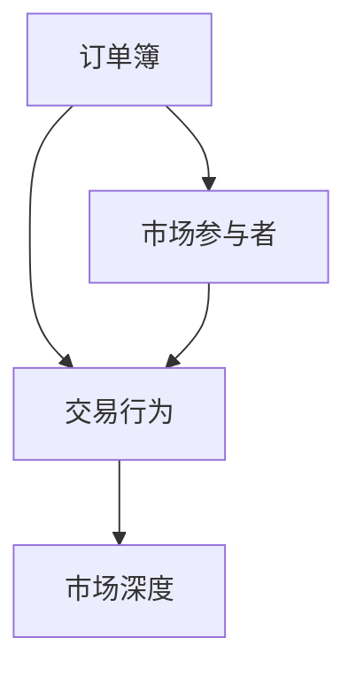
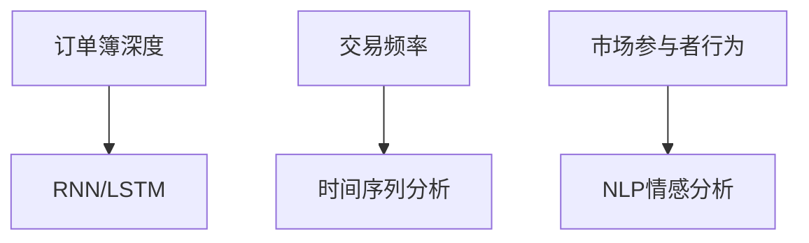
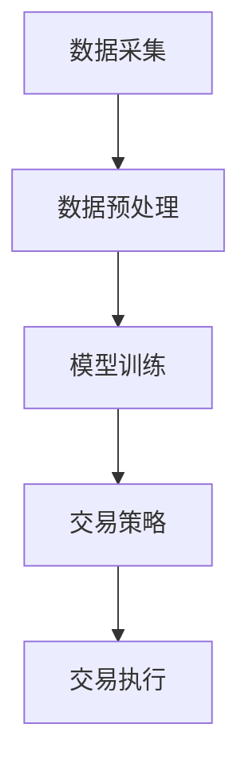
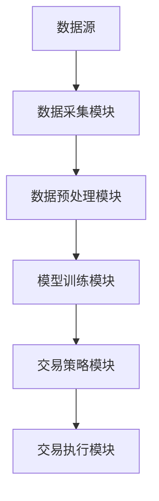
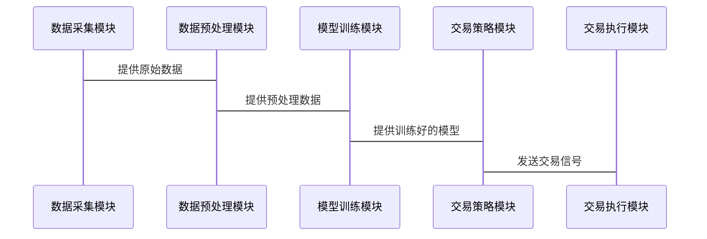

                 


# AI驱动的市场微观结构分析

> 关键词：AI技术、市场微观结构、机器学习、深度学习、时间序列分析、LSTM、NLP、市场预测、金融交易、算法交易

> 摘要：本文将深入探讨AI技术如何驱动市场微观结构分析，从核心概念、算法原理到系统实现，逐步分析AI在金融市场微观结构中的应用。通过详细讲解时间序列分析、机器学习模型和深度学习模型，结合系统架构设计和实际项目案例，揭示AI技术在市场预测、交易策略优化等领域的巨大潜力。

---

# 第一部分: AI驱动的市场微观结构分析基础

## 第1章: AI驱动的市场微观结构分析概述

### 1.1 市场微观结构分析的背景与意义

#### 1.1.1 传统市场微观结构分析的局限性
传统的市场微观结构分析主要依赖于人工分析和统计方法，存在以下问题：
- 数据量有限，难以捕捉高频交易中的微小波动。
- 分析效率低，难以实时处理大量数据。
- 模型复杂度低，难以应对市场的非线性变化。

#### 1.1.2 AI技术如何赋能市场微观结构分析
AI技术的引入为市场微观结构分析带来了革命性的变化：
- 利用深度学习模型，可以从海量数据中提取非线性特征。
- 通过自然语言处理（NLP），可以分析新闻、社交媒体等非结构化数据对市场的影响。
- 基于强化学习的交易策略，可以在复杂市场环境中实现动态优化。

#### 1.1.3 市场微观结构分析的现实需求与应用价值
市场微观结构分析在金融领域的应用价值包括：
- 提高交易效率，优化交易策略。
- 预测市场波动，降低交易风险。
- 支持高频交易，捕捉短期市场机会。

---

### 1.2 AI驱动的市场微观结构分析的核心概念

#### 1.2.1 市场微观结构的基本定义
市场微观结构是指市场的参与者、交易规则和市场机制等组成的复杂系统。核心要素包括：
- 订单簿（Order Book）：记录当前市场上所有未成交的订单。
- 交易行为（Trading Behavior）：市场的参与者如何下单、成交和撤单。
- 市场深度（Market Depth）：衡量市场在某一价格水平上的交易量和流动性。

#### 1.2.2 AI技术在市场微观结构分析中的作用
AI技术通过以下方式赋能市场微观结构分析：
- 从高频交易数据中提取特征，识别市场异动。
- 利用机器学习模型预测市场波动。
- 通过NLP分析新闻、社交媒体等外部信息对市场的影响。

#### 1.2.3 核心概念之间的关系与联系
市场微观结构的核心要素与AI技术的关系可以通过以下表格和图示表示：

**核心概念对比表格：**
```mermaid
table
| 市场微观结构特征 | AI技术对应 |
|------------------|------------|
| 订单簿深度       | RNN/LSTM   |
| 交易频率         | 时间序列分析 |
| 市场参与者行为   | NLP情感分析 |
```

**核心概念的关系图：**


---

### 1.3 本章小结

#### 1.3.1 本章主要内容回顾
本章介绍了市场微观结构分析的背景、核心概念以及AI技术在其中的作用，强调了AI技术对金融市场分析的革命性影响。

#### 1.3.2 下一章的预览
下一章将详细讲解AI驱动的市场微观结构分析的核心概念与联系，包括市场微观结构的核心要素和AI技术的算法原理。

---

## 第2章: AI驱动的市场微观结构分析的核心概念与联系

### 2.1 市场微观结构的核心要素

#### 2.1.1 订单簿（Order Book）
订单簿是市场微观结构的核心数据源，记录了当前市场上所有未成交的订单，包括买单和卖单的价格和数量。订单簿的深度分析可以帮助交易者预测市场的短期走势。

#### 2.1.2 交易行为（Trading Behavior）
交易行为分析是研究市场参与者如何下单、成交和撤单。通过分析交易行为，可以识别市场中的主力资金流向和交易情绪。

#### 2.1.3 市场深度（Market Depth）
市场深度反映了市场在某一价格水平上的交易量和流动性。深度分析可以帮助交易者判断市场的买卖力量对比。

#### 2.1.4 市场参与者的类型
市场参与者包括机构投资者、散户、高频交易算法等。不同类型的参与者在市场微观结构中的行为特征不同，需要针对性地分析。

---

### 2.2 AI技术的核心算法与模型

#### 2.2.1 机器学习算法
- 线性回归：用于预测价格趋势。
- 支持向量机（SVM）：用于分类交易信号。
- 随机森林：用于特征选择和市场预测。

#### 2.2.2 深度学习模型
- RNN：适合处理时间序列数据。
- LSTM：用于捕捉时间序列中的长期依赖关系。
- Transformer：用于处理并行数据，如新闻文本。

#### 2.2.3 自然语言处理（NLP）技术
- 用于分析新闻、社交媒体等非结构化数据，预测市场情绪和趋势。

---

### 2.3 核心概念的对比与联系

#### 2.3.1 市场微观结构与AI技术的对比分析
通过对比分析，可以发现AI技术在处理复杂市场数据和预测市场趋势方面的优势。

#### 2.3.2 市场微观结构特征与AI模型的对应关系
以下是市场微观结构特征与AI模型的对应关系：



---

#### 2.3.3 使用 Mermaid 绘制的概念属性特征对比表格
```mermaid
table
| 市场微观结构特征 | AI技术对应 |
|------------------|------------|
| 订单簿深度       | RNN/LSTM   |
| 交易频率         | 时间序列分析 |
| 市场参与者行为   | NLP情感分析 |
```

---

### 2.4 本章小结

#### 2.4.1 核心概念的总结
本章详细介绍了市场微观结构的核心要素和AI技术的核心算法，揭示了它们之间的对应关系。

#### 2.4.2 下一章的预览
下一章将从算法原理的角度，详细讲解AI驱动的市场微观结构分析的技术实现，包括时间序列分析、机器学习模型和深度学习模型的具体实现方法。

---

## 第3章: AI驱动的市场微观结构分析的算法原理

### 3.1 时间序列分析算法

#### 3.1.1 ARIMA模型
ARIMA（自回归积分滑动平均）模型是一种经典的统计模型，用于分析和预测时间序列数据。其基本公式为：
$$ ARIMA(p, d, q) = y_t - \phi_1 y_{t-1} - \dots - \phi_p y_{t-p} + \theta_1 \epsilon_{t-1} + \dots + \theta_q \epsilon_{t-q} $$

#### 3.1.2 LSTM网络
LSTM（长短期记忆网络）是一种特殊的RNN结构，适合处理长序列数据。以下是LSTM的基本结构：
$$
i_t = \sigma(w_i x_t + u_i h_{t-1})
$$
$$
f_t = \sigma(w_f x_t + u_f h_{t-1})
$$
$$
o_t = \sigma(w_o x_t + u_o h_{t-1})
$$
$$
g_t = \tanh(w_g x_t + u_g h_{t-1})
$$
$$
h_t = i_t g_t + f_t h_{t-1}
$$
$$
s_t = o_t \tanh(s_t)
$$

#### 3.1.3 算法实现的代码示例
以下是使用Python实现的LSTM模型代码示例：
```python
import numpy as np
from keras.models import Sequential
from keras.layers import LSTM, Dense

# 创建数据集
X = np.random.random((1000, 1, 1))
y = np.random.random((1000, 1))

# 定义模型
model = Sequential()
model.add(LSTM(64, input_shape=(1, 1)))
model.add(Dense(1, activation='linear'))

# 编译模型
model.compile(loss='mean_squared_error', optimizer='adam')

# 训练模型
model.fit(X, y, epochs=50, batch_size=32)
```

---

### 3.2 机器学习模型

#### 3.2.1 支持向量机（SVM）
SVM用于分类和回归问题，其数学模型如下：
$$
y = sign(w \cdot x + b)
$$

#### 3.2.2 随机森林
随机森林是一种集成学习算法，通过构建多个决策树并集成结果来提高模型的泛化能力。

#### 3.2.3 算法实现的代码示例
以下是使用Python实现的随机森林分类器代码示例：
```python
from sklearn.ensemble import RandomForestClassifier

# 创建数据集
X = np.random.random((100, 4))
y = np.random.randint(0, 2, 100)

# 定义模型
model = RandomForestClassifier(n_estimators=100)

# 训练模型
model.fit(X, y)

# 预测结果
print(model.predict(X[:10]))
```

---

### 3.3 深度学习模型

#### 3.3.1 Transformer模型
Transformer模型是一种基于自注意力机制的深度学习模型，广泛应用于自然语言处理领域。其数学模型如下：
$$
\text{Attention}(Q, K, V) = \text{softmax}\left(\frac{QK^T}{\sqrt{d_k}}\right)V
$$

#### 3.3.2 算法实现的代码示例
以下是使用PyTorch实现的Transformer模型代码示例：
```python
import torch
from torch import nn

# 定义多头注意力机制
class MultiHeadAttention(nn.Module):
    def __init__(self, embed_dim, num_heads):
        super().__init__()
        self.num_heads = num_heads
        self.head_size = embed_dim // num_heads
        self.key = nn.Linear(embed_dim, embed_dim)
        self.query = nn.Linear(embed_dim, embed_dim)
        self.value = nn.Linear(embed_dim, embed_dim)

    def forward(self, x, mask=None):
        batch_size, seq_len, embed_dim = x.size()
        k = self.key(x).view(batch_size, seq_len, self.num_heads, self.head_size)
        q = self.query(x).view(batch_size, seq_len, self.num_heads, self.head_size)
        v = self.value(x).view(batch_size, seq_len, self.num_heads, self.head_size)

        # 计算注意力权重
        attention = (q @ k.transpose(-2, -1)) * (1 / (self.head_size ** 0.5))
        if mask is not None:
            attention = attention.masked_fill(mask == 0, -float('inf'))
        attention = nn.functional.softmax(attention, dim=-1)
        out = (attention @ v).view(batch_size, seq_len, embed_dim)
        return out

# 初始化模型
model = MultiHeadAttention(embed_dim=512, num_heads=8)
```

---

### 3.4 本章小结

#### 3.4.1 算法原理的总结
本章详细讲解了时间序列分析、机器学习模型和深度学习模型的算法原理，包括ARIMA、LSTM、SVM和Transformer等模型的数学公式和代码实现。

#### 3.4.2 下一章的预览
下一章将从系统架构设计的角度，详细讲解AI驱动的市场微观结构分析的实现方案，包括系统功能设计、架构设计和接口设计。

---

## 第4章: AI驱动的市场微观结构分析的系统架构与实现

### 4.1 系统功能设计

#### 4.1.1 系统功能模块
系统功能模块包括：
- 数据采集模块：从交易系统和新闻源获取数据。
- 数据预处理模块：清洗和转换数据。
- 模型训练模块：训练AI模型。
- 交易策略模块：基于模型预测结果生成交易信号。

#### 4.1.2 系统功能流程图


---

### 4.2 系统架构设计

#### 4.2.1 系统架构图
以下是系统的整体架构图：


#### 4.2.2 系统接口设计
系统接口包括：
- 数据接口：与交易系统和新闻源对接。
- 模型接口：与AI模型训练平台对接。
- 交易接口：与交易执行系统对接。

---

### 4.3 系统交互流程图

#### 4.3.1 交易策略模块的交互流程


---

### 4.4 本章小结

#### 4.4.1 系统架构设计的总结
本章详细讲解了AI驱动的市场微观结构分析系统的功能设计、架构设计和交互流程，为实际项目的实施提供了理论基础。

#### 4.4.2 下一章的预览
下一章将从项目实战的角度，详细讲解AI驱动的市场微观结构分析的实际应用，包括环境配置、代码实现和案例分析。

---

## 第5章: AI驱动的市场微观结构分析的项目实战与应用

### 5.1 项目背景与目标

#### 5.1.1 项目背景
本项目旨在利用AI技术分析市场微观结构，优化交易策略，提高交易效率。

#### 5.1.2 项目目标
- 实现市场微观结构数据的采集和预处理。
- 构建AI模型，预测市场波动和交易机会。
- 实现交易策略的自动化执行。

---

### 5.2 项目环境配置

#### 5.2.1 系统环境
- 操作系统：Linux/Windows/macOS
- Python版本：3.8及以上
- 需要安装的库：NumPy、Pandas、TensorFlow、PyTorch、Keras、scikit-learn

#### 5.2.2 数据源配置
- 数据采集接口：与交易系统和新闻源对接。
- 数据存储：使用数据库或文件存储。

---

### 5.3 项目核心实现

#### 5.3.1 数据采集模块
```python
import requests

def fetch_data(api_url):
    response = requests.get(api_url)
    data = response.json()
    return data
```

#### 5.3.2 数据预处理模块
```python
import pandas as pd

def preprocess_data(data):
    df = pd.DataFrame(data)
    df = df.dropna()
    df['date'] = pd.to_datetime(df['date'])
    return df
```

#### 5.3.3 模型训练模块
```python
from tensorflow.keras.models import Sequential
from tensorflow.keras.layers import LSTM, Dense

def train_model(train_data):
    model = Sequential()
    model.add(LSTM(64, input_shape=(1, 1)))
    model.add(Dense(1))
    model.compile(loss='mean_squared_error', optimizer='adam')
    model.fit(train_data, epochs=50, batch_size=32)
    return model
```

#### 5.3.4 交易策略模块
```python
def generate_signals(model, test_data):
    predictions = model.predict(test_data)
    signals = []
    for i in range(len(predictions)):
        if predictions[i] > 0.5:
            signals.append(1)
        else:
            signals.append(0)
    return signals
```

---

### 5.4 项目案例分析

#### 5.4.1 数据分析与可视化
使用Matplotlib进行数据分析和可视化：
```python
import matplotlib.pyplot as plt

data = preprocess_data(fetch_data(api_url))
plt.plot(data['price'], label='Market Price')
plt.xlabel('Time')
plt.ylabel('Price')
plt.legend()
plt.show()
```

#### 5.4.2 模型预测与结果分析
模型预测结果的可视化：
```python
import numpy as np

predictions = generate_signals(model, test_data)
plt.plot(test_data, label='Actual Price')
plt.plot(predictions, label='Predicted Price')
plt.xlabel('Time')
plt.ylabel('Price')
plt.legend()
plt.show()
```

---

### 5.5 项目小结

#### 5.5.1 项目实现的总结
本章通过实际项目案例，详细讲解了AI驱动的市场微观结构分析的环境配置、代码实现和结果分析。

#### 5.5.2 最佳实践 tips
- 数据预处理是关键，确保数据质量和完整性。
- 模型调优是优化预测性能的重要步骤。
- 交易策略的实现需要结合市场实际情况。

---

## 第6章: 总结与展望

### 6.1 本章总结

#### 6.1.1 核心内容回顾
本文从AI驱动的市场微观结构分析的背景、核心概念、算法原理到系统实现和项目实战，进行了全面的分析和讲解。

#### 6.1.2 AI技术的潜力与挑战
AI技术在市场微观结构分析中的潜力巨大，但也面临数据隐私、模型解释性和计算资源等挑战。

---

### 6.2 未来展望

#### 6.2.1 技术发展趋势
- 更复杂的深度学习模型（如Transformer）的应用。
- 多模态数据（文本、图像、语音）的融合分析。
- 自动化交易系统的智能化升级。

#### 6.2.2 市场需求与应用场景
- 高频交易中的市场微观结构分析。
- 机构投资者的智能投顾服务。
- 风险控制与市场预测。

---

## 作者：AI天才研究院/AI Genius Institute & 禅与计算机程序设计艺术 /Zen And The Art of Computer Programming

---

通过以上内容，我们系统地探讨了AI驱动的市场微观结构分析的核心概念、算法原理和系统实现，并通过实际项目案例展示了其应用价值。希望本文能够为读者提供有价值的参考和启发，进一步推动AI技术在金融市场中的应用与发展。

