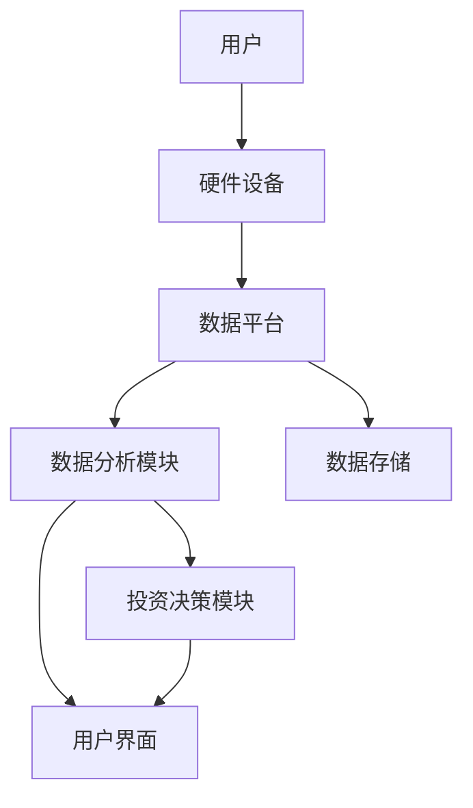

                 


# 价值投资中的智能穿戴设备生态系统分析

> 关键词：价值投资，智能穿戴设备，生态系统分析，数据驱动决策，投资策略，系统架构

> 摘要：本文从智能穿戴设备的发展历程和价值投资的基本概念出发，分析了智能穿戴设备生态系统的核心概念与联系，详细讲解了数据采集与处理、算法原理、系统架构设计等技术细节，并通过实际案例展示了如何将智能穿戴设备数据应用于价值投资分析，最后总结了最佳实践和未来发展方向。

---

# 第一部分: 价值投资中的智能穿戴设备生态系统概述

## 第1章: 智能穿戴设备与价值投资概述

### 1.1 智能穿戴设备的发展历程

#### 1.1.1 智能穿戴设备的定义与分类

智能穿戴设备（Wearable Devices）是指可以佩戴在身上，并通过传感器、处理器和通信技术与外部设备连接，实现数据采集、处理和传输的智能设备。根据功能的不同，智能穿戴设备可以分为以下几类：

- **健康监测类**：如智能手表、健康手环，主要用于监测心率、血压、体温等健康指标。
- **运动追踪类**：如运动手环、智能运动鞋，主要用于记录运动数据，如步数、距离、卡路里消耗等。
- **通讯类**：如智能手表、智能眼镜，支持通话、短信、社交媒体互动等功能。
- **时尚装饰类**：如智能珠宝、智能服装，兼具时尚功能与智能技术。

#### 1.1.2 智能穿戴设备的核心技术

智能穿戴设备的核心技术包括以下几个方面：

1. **传感器技术**：用于采集人体生理数据和环境数据，如加速度传感器、心率传感器、温度传感器等。
2. **低功耗技术**：由于设备需要长时间佩戴，电池续航能力是关键，因此需要采用低功耗芯片和优化的系统设计。
3. **通信技术**：支持蓝牙、Wi-Fi、NFC等无线通信技术，实现数据的实时传输。
4. **数据处理技术**：通过嵌入式系统对采集的数据进行处理和分析，并通过云端或本地应用提供反馈。

#### 1.1.3 智能穿戴设备的市场现状

近年来，随着技术的进步和人们对健康管理、运动追踪需求的增加，智能穿戴设备市场快速增长。根据市场研究机构的数据，全球智能穿戴设备市场在2023年达到XX亿美元，预计未来几年将以XX%的年复合增长率增长。主要厂商包括苹果（Apple Watch）、谷歌（Fitbit）、三星（Galaxy Watch）、华为（Huawei Watch）等。

---

### 1.2 价值投资的基本概念

#### 1.2.1 价值投资的定义与特点

价值投资是一种投资策略，旨在通过分析企业的基本面（如财务状况、行业地位、盈利能力等）来寻找被市场低估的投资标的。其核心理念是“买入低于内在价值的资产”，并长期持有，等待其价值回归。

价值投资的特点包括：

1. **长期视角**：关注企业的长期盈利能力，而非短期市场波动。
2. **基本面分析**：通过财务报表、行业趋势等数据评估企业的内在价值。
3. **安全边际**：买入价格低于内在价值，以降低投资风险。

#### 1.2.2 价值投资的核心理念

价值投资的核心理念是寻找市场中被低估的优质企业，并长期持有。投资者需要具备对企业基本面的深刻理解，以及对市场情绪的独立判断能力。价值投资并不意味着盲目寻找低价股票，而是通过深入研究找到具有持续竞争优势和良好管理团队的企业。

#### 1.2.3 智能穿戴设备与价值投资的结合

智能穿戴设备的普及为价值投资提供了新的数据来源。通过分析智能穿戴设备采集的用户行为数据、健康数据和运动数据，投资者可以更全面地了解企业的市场表现、用户粘性以及潜在的市场机会。

---

### 1.3 智能穿戴设备生态系统的基本结构

#### 1.3.1 生态系统的定义与构成

智能穿戴设备生态系统是一个由硬件、软件、数据和服务构成的复杂系统。其核心要素包括：

1. **硬件设备**：如智能手表、健康手环等，用于数据采集。
2. **传感器技术**：用于采集人体生理数据和环境数据。
3. **数据处理与分析**：通过嵌入式系统或云端平台对数据进行处理和分析。
4. **用户界面**：通过手机应用、网页界面等方式向用户展示分析结果。
5. **服务与应用**：如健康咨询、运动计划、保险服务等，基于数据分析提供增值服务。

#### 1.3.2 生态系统之间的关系与协同

智能穿戴设备生态系统中的各个要素相互依存，共同构成了一个闭环。硬件设备采集数据，通过通信技术传输到云端平台，平台对数据进行处理和分析，并通过用户界面向用户展示结果。同时，分析结果可以反过来优化硬件设计和服务内容，形成良性循环。

---

## 第2章: 智能穿戴设备数据与价值投资分析

### 2.1 智能穿戴设备数据的采集与处理

#### 2.1.1 数据采集的定义与方法

数据采集是指通过传感器等硬件设备获取用户生理数据和环境数据的过程。常见的数据采集方法包括：

1. **被动采集**：设备自动采集数据，无需用户干预。
2. **主动采集**：用户通过手动操作设备或应用输入数据。

#### 2.1.2 数据清洗与预处理

在数据分析之前，需要对采集到的数据进行清洗和预处理，以确保数据的准确性和完整性。常见的数据清洗步骤包括：

1. **去除噪声**：通过滤波算法消除传感器噪声。
2. **填补缺失值**：对于缺失的数据点，可以通过插值方法进行填补。
3. **标准化处理**：将数据标准化到统一的范围，便于后续分析。

#### 2.1.3 数据存储与管理

智能穿戴设备的数据通常需要存储在本地设备或云端平台中。常见的数据存储方式包括：

1. **本地存储**：将数据存储在设备本地，便于快速访问。
2. **云端存储**：将数据上传到云端，便于集中管理和分析。

---

### 2.2 智能穿戴设备数据的分析方法

#### 2.2.1 数据分析的定义与分类

数据分析是指通过对数据的处理、分析和解释，发现数据背后的趋势、模式和关联。常见的数据分析方法包括：

1. **描述性分析**：通过统计方法描述数据的基本特征，如均值、方差等。
2. **诊断性分析**：通过数据挖掘技术发现数据中的异常点和潜在问题。
3. **预测性分析**：通过时间序列分析和机器学习模型预测未来趋势。
4. **规范性分析**：通过优化算法提出数据驱动的决策建议。

#### 2.2.2 统计分析与数据可视化

统计分析是数据分析的重要方法之一，通过统计方法可以发现数据中的规律和趋势。常见的统计分析方法包括：

1. **时间序列分析**：分析数据随时间的变化趋势。
2. **回归分析**：研究变量之间的关系。
3. **聚类分析**：将相似的数据点分组，发现潜在的模式。

数据可视化是将数据分析结果以图形化的方式展示出来，便于理解和沟通。常见的数据可视化工具包括Tableau、Power BI、Python的matplotlib库等。

#### 2.2.3 数据挖掘与机器学习的应用

数据挖掘是从大量数据中提取有价值信息的过程，而机器学习则是通过算法训练模型，实现数据的自动分析和预测。在智能穿戴设备数据中，机器学习可以应用于以下场景：

1. **用户行为分析**：通过机器学习模型预测用户的健康状况和运动习惯。
2. **市场趋势预测**：通过分析历史数据，预测智能穿戴设备市场的未来趋势。
3. **风险评估**：通过分析用户的健康数据，评估潜在的健康风险。

---

### 2.3 价值投资中的数据驱动决策

#### 2.3.1 数据在价值投资中的作用

数据在价值投资中扮演着越来越重要的角色。通过智能穿戴设备的数据，投资者可以更全面地了解企业的市场表现和用户需求。例如：

1. **用户粘性分析**：通过分析用户使用智能穿戴设备的频率，评估企业的用户粘性。
2. **市场潜力分析**：通过分析目标市场的健康状况和运动习惯，评估智能穿戴设备的市场潜力。
3. **竞争对手分析**：通过对比竞争对手的市场份额和用户反馈，制定更有竞争力的投资策略。

#### 2.3.2 数据驱动的投资策略

数据驱动的投资策略是一种基于数据分析的投资方法，通过分析数据发现投资机会和风险。常见的数据驱动投资策略包括：

1. **量化投资**：通过算法交易和大数据分析，寻找市场的套利机会。
2. **基本面分析**：通过分析企业的财务数据和市场数据，评估企业的内在价值。
3. **情绪分析**：通过分析社交媒体和新闻数据，评估市场的短期情绪波动。

#### 2.3.3 数据分析在投资决策中的应用

在价值投资中，数据分析可以帮助投资者做出更明智的决策。例如：

1. **数据验证**：通过数据分析验证企业的财务数据和市场数据，确保数据的准确性。
2. **风险评估**：通过数据分析评估投资标的的潜在风险，制定风险管理策略。
3. **投资组合优化**：通过数据分析优化投资组合，降低投资风险，提高收益。

---

## 第3章: 智能穿戴设备生态系统的核心概念

### 3.1 数据流与信息传递

#### 3.1.1 数据流的定义与特点

数据流是指数据从采集到处理、分析和最终应用的整个过程。数据流的特点包括：

1. **实时性**：数据流通常是实时的，能够快速响应用户需求。
2. **连续性**：数据流是一个连续的过程，从数据采集到数据应用，环环相扣。
3. **多样性**：数据流中的数据类型多样，包括结构化数据和非结构化数据。

#### 3.1.2 数据流的分类与应用场景

数据流可以根据不同的标准进行分类，常见的分类方式包括：

1. **实时数据流**：数据实时生成并传输，如智能手表的心率数据。
2. **批量数据流**：数据定期批量传输，如每天晚上上传的运动数据。
3. **结构化数据流**：数据以结构化形式传输，如JSON格式。
4. **非结构化数据流**：数据以非结构化形式传输，如文本、图像等。

数据流的应用场景包括：

1. **实时监控**：通过实时数据流监控用户健康状况和设备运行状态。
2. **历史分析**：通过历史数据流分析用户行为和市场趋势。
3. **预测分析**：通过实时数据流和历史数据流预测未来趋势。

---

### 3.2 系统架构与模块划分

#### 3.2.1 系统架构的定义与特点

系统架构是指系统的整体结构和组成部分。智能穿戴设备生态系统的架构通常包括以下模块：

1. **数据采集模块**：负责采集用户生理数据和环境数据。
2. **数据处理模块**：对采集到的数据进行清洗、转换和存储。
3. **数据分析模块**：通过统计分析和机器学习算法对数据进行分析。
4. **用户界面模块**：将分析结果以图形化的方式展示给用户。
5. **服务与应用模块**：基于分析结果提供增值服务，如健康咨询、运动计划等。

#### 3.2.2 系统架构的设计原则

系统架构设计的原则包括：

1. **模块化设计**：将系统划分为独立的模块，便于开发和维护。
2. **可扩展性**：系统架构应具有良好的扩展性，能够适应未来的需求变化。
3. **高可用性**：系统架构应具有高可用性，能够保证数据的实时性和可靠性。
4. **安全性**：系统架构应具备数据安全性和用户隐私保护能力。

#### 3.2.3 系统架构的实现方案

系统架构的实现方案可以根据具体需求进行定制。以下是一个典型的智能穿戴设备生态系统的架构设计：

1. **数据采集模块**：通过智能穿戴设备的传感器采集用户数据，并通过蓝牙或Wi-Fi将数据传输到本地设备或云端平台。
2. **数据处理模块**：对采集到的数据进行清洗、转换和存储，支持结构化和非结构化数据的处理。
3. **数据分析模块**：通过统计分析和机器学习算法对数据进行分析，发现数据中的趋势和关联。
4. **用户界面模块**：通过手机应用、网页界面等方式向用户展示分析结果，并提供交互功能。
5. **服务与应用模块**：基于分析结果提供增值服务，如健康咨询、运动计划、保险服务等。

---

## 第4章: 智能穿戴设备生态系统中的算法原理

### 4.1 时间序列分析

#### 4.1.1 时间序列分析的定义与特点

时间序列分析是一种通过分析数据随时间变化的趋势，发现数据中的规律和模式的方法。时间序列分析的特点包括：

1. **时间依赖性**：数据的值与时间有关，通常具有趋势和周期性。
2. **连续性**：数据是连续的，可以通过滑动窗口等方法进行分析。
3. **预测性**：时间序列分析可以用于预测未来的数据值。

#### 4.1.2 时间序列分析的数学模型

时间序列分析的数学模型主要包括以下几种：

1. **ARIMA模型**：自回归积分滑动平均模型，适用于线性时间序列数据。
2. **LSTM模型**：长短期记忆网络，适用于非线性时间序列数据。
3. **GARCH模型**：广义自回归条件异方差模型，适用于金融时间序列数据。

#### 4.1.3 时间序列分析在智能穿戴设备中的应用

时间序列分析在智能穿戴设备中的应用包括：

1. **健康监测**：通过分析心率、血压等数据，预测用户的健康状况。
2. **运动分析**：通过分析运动数据，预测用户的运动表现和潜在风险。
3. **市场趋势预测**：通过分析市场数据，预测智能穿戴设备的市场趋势。

---

### 4.2 机器学习算法的应用

#### 4.2.1 机器学习算法的定义与特点

机器学习算法是一种通过数据训练模型，实现数据自动分析和预测的方法。机器学习算法的特点包括：

1. **数据驱动**：机器学习算法依赖于大量数据进行训练，数据的质量直接影响模型的性能。
2. **自动学习**：机器学习算法能够自动从数据中学习规律，无需手动编程。
3. **可扩展性**：机器学习算法能够处理大规模数据，具有良好的扩展性。

#### 4.2.2 常见的机器学习算法

常见的机器学习算法包括：

1. **监督学习**：如线性回归、支持向量机（SVM）、随机森林等。
2. **无监督学习**：如聚类分析、主成分分析（PCA）等。
3. **深度学习**：如卷积神经网络（CNN）、循环神经网络（RNN）、长短期记忆网络（LSTM）等。

#### 4.2.3 机器学习算法在智能穿戴设备中的应用

机器学习算法在智能穿戴设备中的应用包括：

1. **用户行为分析**：通过机器学习模型分析用户的健康状况和运动习惯。
2. **市场趋势预测**：通过机器学习模型预测智能穿戴设备的市场趋势。
3. **风险评估**：通过机器学习模型评估用户的健康风险和投资风险。

---

## 第5章: 智能穿戴设备生态系统中的系统分析与架构设计

### 5.1 系统分析与问题场景介绍

#### 5.1.1 问题场景介绍

智能穿戴设备生态系统是一个复杂的系统，涉及硬件、软件、数据和服务等多个方面。在实际应用中，可能会遇到以下问题：

1. **数据采集问题**：如何保证数据采集的准确性和实时性。
2. **数据处理问题**：如何高效地处理和存储海量数据。
3. **数据分析问题**：如何从数据中提取有价值的信息，支持投资决策。
4. **系统安全性问题**：如何保证系统的数据安全和用户隐私。

#### 5.1.2 项目介绍

本项目旨在通过智能穿戴设备的数据分析，支持价值投资决策。项目的核心目标包括：

1. **数据采集**：通过智能穿戴设备采集用户生理数据和运动数据。
2. **数据分析**：通过统计分析和机器学习算法分析数据，发现投资机会和风险。
3. **投资决策**：基于数据分析结果，制定投资策略，优化投资组合。

---

### 5.2 系统功能设计

#### 5.2.1 领域模型设计

以下是智能穿戴设备生态系统领域的模型设计：


#### 5.2.2 系统架构设计

以下是智能穿戴设备生态系统的架构设计：



---

## 第6章: 项目实战与案例分析

### 6.1 项目实战

#### 6.1.1 环境安装与配置

在进行项目实战之前，需要进行环境安装与配置。以下是常用的工具和库：

1. **数据采集工具**：如智能手表、运动手环等。
2. **数据处理工具**：Python的Pandas库、NumPy库。
3. **数据分析工具**：Python的Scikit-learn库、TensorFlow库。
4. **数据可视化工具**：Python的Matplotlib库、Seaborn库。

#### 6.1.2 核心代码实现

以下是项目的核心代码实现：

```python
import pandas as pd
import numpy as np
from sklearn.model_selection import train_test_split
from sklearn.linear_model import LinearRegression
from sklearn.metrics import mean_squared_error

# 数据加载
data = pd.read_csv('wearable_data.csv')

# 数据预处理
X = data.drop('target', axis=1)
y = data['target']

# 数据划分
X_train, X_test, y_train, y_test = train_test_split(X, y, test_size=0.2, random_state=42)

# 模型训练
model = LinearRegression()
model.fit(X_train, y_train)

# 模型预测
y_pred = model.predict(X_test)

# 模型评估
mse = mean_squared_error(y_test, y_pred)
print('均方误差:', mse)
```

---

### 6.2 案例分析

#### 6.2.1 案例背景介绍

假设我们是一家专注于智能穿戴设备的投资机构，希望通过分析智能穿戴设备的数据，寻找具有投资价值的企业。

#### 6.2.2 数据分析与结果解读

通过分析智能穿戴设备的数据，我们可以发现以下投资机会：

1. **用户粘性**：通过分析用户使用智能手表的频率，评估企业的用户粘性。
2. **市场潜力**：通过分析目标市场的健康状况和运动习惯，评估智能穿戴设备的市场潜力。
3. **竞争对手分析**：通过对比竞争对手的市场份额和用户反馈，制定更有竞争力的投资策略。

#### 6.2.3 投资策略优化

基于数据分析结果，我们可以优化投资策略：

1. **投资组合优化**：通过数据分析优化投资组合，降低投资风险，提高收益。
2. **风险管理**：通过数据分析评估潜在风险，制定风险管理策略。
3. **长期投资**：通过分析企业的长期盈利能力，制定长期投资策略。

---

## 第7章: 总结与展望

### 7.1 总结

智能穿戴设备的普及为价值投资提供了新的数据来源和分析工具。通过智能穿戴设备的数据分析，投资者可以更全面地了解企业的市场表现和用户需求，制定更科学的投资策略。本文从智能穿戴设备的发展历程、价值投资的基本概念出发，分析了智能穿戴设备生态系统的核心概念与联系，详细讲解了数据采集与处理、算法原理、系统架构设计等技术细节，并通过实际案例展示了如何将智能穿戴设备数据应用于价值投资分析。

### 7.2 展望

未来，随着智能穿戴设备技术的不断进步和数据分析方法的不断创新，智能穿戴设备在价值投资中的应用将更加广泛和深入。以下是未来的发展方向：

1. **数据融合**：通过融合多源数据，提高数据分析的准确性和全面性。
2. **算法优化**：通过优化算法，提高数据分析的效率和准确性。
3. **智能化决策**：通过智能化决策支持系统，实现投资决策的自动化和智能化。
4. **隐私保护**：随着智能穿戴设备的普及，数据隐私和安全问题将更加重要，需要采取更严格的隐私保护措施。

---

## 作者信息

作者：AI天才研究院/AI Genius Institute & 禅与计算机程序设计艺术 /Zen And The Art of Computer Programming

---

本文通过详细分析智能穿戴设备生态系统的核心概念与联系，为价值投资者提供了新的数据来源和分析工具，帮助投资者更科学地制定投资策略。希望本文能够为智能穿戴设备与价值投资的结合提供有价值的参考和启发。

