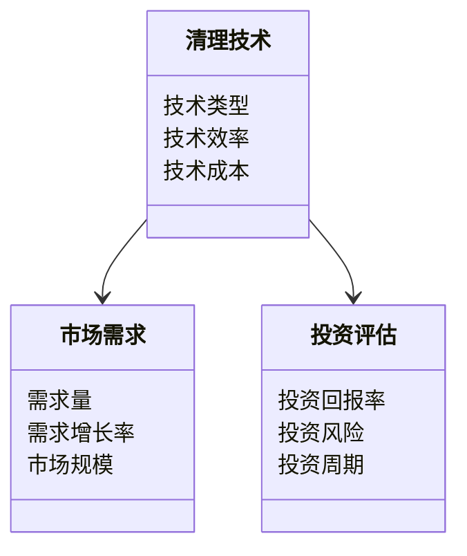
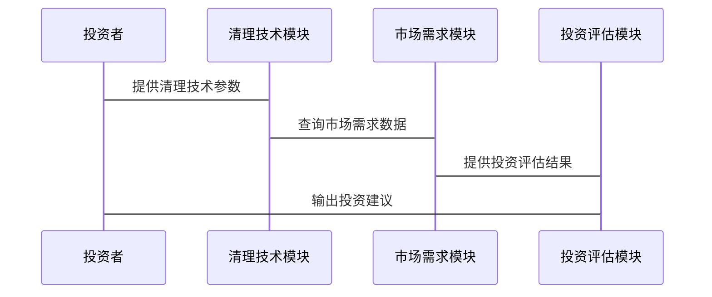

                 


# 价值投资中的海洋塑料污染清理技术前景

## 关键词：价值投资、海洋塑料污染、清理技术、经济分析、技术前景

## 摘要：本文从价值投资的视角，深入分析海洋塑料污染清理技术的经济价值和市场前景。通过技术与经济的结合，探讨如何通过价值投资的方法评估和选择有潜力的清理技术，为投资者提供科学的决策依据。文章结合实际案例，详细阐述了清理技术的市场需求、成本收益分析、投资回报周期等关键因素，为价值投资者提供了全面的技术和经济分析框架。

---

# 第一部分: 背景介绍

## 第1章: 海洋塑料污染清理技术的背景与问题

### 1.1 海洋塑料污染的现状

#### 1.1.1 海洋塑料污染的定义与范围
海洋塑料污染是指由于人类活动产生的塑料制品通过各种途径进入海洋环境，导致海洋生态系统受到破坏的现象。根据联合国环境规划署（UNEP）的数据，全球每年约有800万吨塑料垃圾进入海洋，这些塑料垃圾对海洋生态系统、渔业资源、旅游业和人类健康造成了严重威胁。

#### 1.1.2 全球海洋塑料污染的统计数据
- 每年进入海洋的塑料垃圾总量约为800万吨。
- 80%的塑料垃圾来自陆地，20%来自海洋活动。
- 海洋中的塑料垃圾总量预计在2050年达到10亿吨。

#### 1.1.3 海洋塑料污染对生态系统的危害
- 生态破坏：塑料垃圾对海洋生物造成物理伤害，例如误食塑料导致消化系统堵塞。
- 生物多样性丧失：塑料垃圾的积累影响海洋生物的栖息地，导致生物多样性的减少。
- 化学污染：塑料中的添加剂和化学物质在环境中释放，对海洋生物造成毒害。

### 1.2 价值投资的基本概念

#### 1.2.1 价值投资的定义与核心理念
价值投资是一种投资策略，强调以低于资产内在价值的价格购买具有长期竞争优势的企业。其核心理念是寻找市场低估的资产，并通过长期持有实现超额收益。价值投资强调基本面分析，包括企业的财务状况、行业地位、盈利能力等。

#### 1.2.2 价值投资与技术分析的区别
- 价值投资：关注企业的内在价值，强调基本面分析。
- 技术分析：关注市场的价格走势，通过技术指标预测价格变化。

#### 1.2.3 价值投资在环保领域的应用前景
随着全球对环境保护的重视，环保技术的投资需求不断增加。价值投资者可以通过分析环保企业的基本面，寻找具有竞争优势的环保技术企业进行投资。

### 1.3 海洋塑料污染清理技术的经济价值

#### 1.3.1 清理技术的市场需求分析
- 渔业损失：海洋塑料污染导致鱼类死亡，影响渔业产值。
- 旅游业影响：海洋塑料污染破坏海滩和海洋景观，影响旅游业收入。
- 公共健康：塑料垃圾中的有害物质可能通过食物链对人体健康造成威胁。

#### 1.3.2 清理技术的成本与收益评估
- 成本分析：清理技术的研发和实施成本较高，但随着技术进步，成本逐渐降低。
- 收益分析：清理技术可以带来环境效益和经济效益，例如减少渔业损失和旅游业收入。

#### 1.3.3 清理技术的可持续性与投资回报周期
- 可持续性：清理技术的长期应用可以实现环境效益和经济效益的双赢。
- 投资回报周期：清理技术的投资回报周期较长，但随着市场需求的增加，投资回报率逐步提高。

## 第2章: 问题背景与问题描述

### 2.1 海洋塑料污染的多维分析

#### 2.1.1 环境维度: 生态破坏与生物多样性丧失
- 生态破坏：塑料垃圾对海洋生态系统造成严重破坏，影响海洋生物的栖息地。
- 生物多样性丧失：塑料垃圾的积累导致海洋生物种类减少，影响生态平衡。

#### 2.1.2 经济维度: 渔业损失与旅游业影响
- 渔业损失：海洋塑料污染导致鱼类死亡，影响渔业产值。
- 旅游业影响：海洋塑料污染破坏海滩和海洋景观，影响旅游业收入。

#### 2.1.3 社会维度: 公共健康与社会责任
- 公共健康：塑料垃圾中的有害物质可能通过食物链对人体健康造成威胁。
- 社会责任：企业和社会应承担保护海洋环境的责任。

### 2.2 问题解决的路径

#### 2.2.1 技术创新: 清理技术的研发与优化
- 技术创新：研发更高效、更低成本的海洋塑料污染清理技术。
- 技术优化：改进现有清理技术，提高清理效率和降低成本。

#### 2.2.2 市场驱动: 企业社会责任与绿色投资
- 企业社会责任：企业应积极承担保护海洋环境的责任，减少塑料垃圾的使用。
- 绿色投资：投资者应关注环保企业，支持绿色技术的发展。

#### 2.2.3 政策支持: 政府补贴与行业规范
- 政府补贴：政府应提供资金支持，鼓励企业和个人参与海洋塑料污染清理。
- 行业规范：制定行业标准，规范塑料制品的生产和使用。

### 2.3 问题的边界与外延

#### 2.3.1 技术边界: 清理技术的适用范围与限制
- 技术适用范围：清理技术适用于浅海水域和近岸海域的塑料污染。
- 技术限制：清理技术在深海区域和大范围污染中的应用效果有限。

#### 2.3.2 市场外延: 全球化视角下的市场机会
- 全球市场需求：随着全球海洋塑料污染问题的加剧，国际市场对清理技术的需求不断增加。
- 区域市场机会：不同地区对清理技术的需求存在差异，投资者应关注特定区域的市场机会。

#### 2.3.3 社会外延: 公众参与与环保意识提升
- 公众参与：公众应积极参与环保活动，减少塑料垃圾的使用。
- 环保意识提升：通过教育和宣传，提高公众对海洋塑料污染问题的认识。

## 第3章: 核心概念与联系

### 3.1 核心概念的原理

#### 3.1.1 海洋塑料污染的形成机制
- 垃圾排放：塑料制品通过各种途径进入海洋环境。
- 物理迁移：塑料垃圾在海洋中随洋流扩散，形成大规模的污染区域。
- 化学分解：塑料垃圾在海洋中逐渐分解，释放有害物质。

#### 3.1.2 清理技术的分类与特点
- 分类：物理清理、化学清理、生物清理。
- 特点：物理清理成本低，但效率有限；化学清理效果好，但可能对环境造成二次污染；生物清理环保，但成本较高。

#### 3.1.3 价值投资的评估标准
- 财务状况：企业的盈利能力、资产负债情况。
- 行业地位：企业在行业中的竞争地位。
- 市场前景：技术的市场需求和增长潜力。

### 3.2 核心概念的属性特征对比

| **属性**       | **清理技术**             | **价值投资**             |
|----------------|--------------------------|--------------------------|
| 技术属性       | 清理效率                 | 财务状况                 |
| 经济属性       | 成本与收益               | 投资回报率               |
| 市场需求       | 市场需求与供给能力       | 技术的市场需求           |
| 可持续性       | 环境效益与经济效益       | 投资的可持续性           |

### 3.3 ER实体关系图

```mermaid
er
    MarinePollution
    has
    CleaningTechnology
    has
    InvestmentValue
    has
    MarketDemand
```

---

# 第二部分: 核心概念与联系

## 第4章: 核心概念的属性特征对比

### 4.1 核心概念的原理

#### 4.1.1 海洋塑料污染的形成机制
- 垃圾排放：塑料制品通过各种途径进入海洋环境。
- 物理迁移：塑料垃圾在海洋中随洋流扩散，形成大规模的污染区域。
- 化学分解：塑料垃圾在海洋中逐渐分解，释放有害物质。

#### 4.1.2 清理技术的分类与特点
- 分类：物理清理、化学清理、生物清理。
- 特点：物理清理成本低，但效率有限；化学清理效果好，但可能对环境造成二次污染；生物清理环保，但成本较高。

#### 4.1.3 价值投资的评估标准
- 财务状况：企业的盈利能力、资产负债情况。
- 行业地位：企业在行业中的竞争地位。
- 市场前景：技术的市场需求和增长潜力。

### 4.2 核心概念的属性特征对比

| **属性**       | **清理技术**             | **价值投资**             |
|----------------|--------------------------|--------------------------|
| 技术属性       | 清理效率                 | 财务状况                 |
| 经济属性       | 成本与收益               | 投资回报率               |
| 市场需求       | 市场需求与供给能力       | 技术的市场需求           |
| 可持续性       | 环境效益与经济效益       | 投资的可持续性           |

### 4.3 ER实体关系图

```mermaid
er
    MarinePollution
    has
    CleaningTechnology
    has
    InvestmentValue
    has
    MarketDemand
```

---

# 第三部分: 算法原理

## 第5章: 清理技术的市场需求预测

### 5.1 数据建模与预测

#### 5.1.1 数据来源
- 历史数据：过去几年全球海洋塑料污染的数据。
- 当前数据：各地区的塑料污染现状。
- 预测数据：基于现有数据建立模型，预测未来市场需求。

#### 5.1.2 数据预处理
- 清洗数据：去除异常值和缺失值。
- 转换数据：将数据标准化，便于模型训练。

#### 5.1.3 数据建模
- 使用线性回归模型预测市场需求。
- 使用时间序列模型（如ARIMA）预测未来的市场需求。

#### 5.1.4 模型评估
- 评估模型的准确性和可靠性。
- 通过交叉验证优化模型参数。

### 5.2 需求预测的数学模型

$$
\text{需求预测} = \beta_0 + \beta_1 \times \text{历史需求} + \epsilon
$$

其中：
- $\beta_0$ 是截距项。
- $\beta_1$ 是历史需求的回归系数。
- $\epsilon$ 是误差项。

### 5.3 代码实现

```python
import pandas as pd
from sklearn.linear_model import LinearRegression
from sklearn.metrics import mean_squared_error

# 加载数据
data = pd.read_csv('marine_pollution.csv')

# 数据预处理
data = data.dropna()
data = (data - data.mean()) / data.std()

# 训练模型
model = LinearRegression()
model.fit(data[['历史需求']], data['未来需求'])

# 预测需求
predictions = model.predict(data[['历史需求']])
print('预测值:', predictions)

# 评估模型
print('均方误差:', mean_squared_error(data['未来需求'], predictions))
```

---

# 第四部分: 系统分析与架构设计

## 第6章: 清理技术的系统架构

### 6.1 问题场景介绍

#### 6.1.1 问题场景
- 系统需要实现对海洋塑料污染清理技术的需求预测和投资评估。
- 用户包括投资者、企业和社会组织。

#### 6.1.2 系统目标
- 提供清理技术的市场需求预测。
- 提供技术的经济评估和投资建议。
- 支持决策者制定环保政策和投资计划。

### 6.2 系统功能设计

#### 6.2.1 领域模型



#### 6.2.2 系统架构设计


#### 6.2.3 系统接口设计

- 输入接口：清理技术参数、市场需求数据。
- 输出接口：投资评估结果、需求预测报告。

#### 6.2.4 系统交互设计



---

# 第五部分: 项目实战

## 第7章: 清理技术的投资分析

### 7.1 项目环境安装

#### 7.1.1 工具安装
- 安装Python和相关库（如pandas、scikit-learn）。
- 安装Jupyter Notebook用于数据分析和可视化。

#### 7.1.2 数据获取
- 下载海洋塑料污染相关数据集。
- 数据来源：公开数据库、学术研究、政府报告。

### 7.2 系统核心实现

#### 7.2.1 数据分析

```python
import pandas as pd
import numpy as np
from sklearn.linear_model import LinearRegression
from sklearn.metrics import mean_squared_error

# 加载数据
data = pd.read_csv('marine_pollution.csv')

# 数据预处理
data = data.dropna()
data = (data - data.mean()) / data.std()

# 训练模型
model = LinearRegression()
model.fit(data[['历史需求']], data['未来需求'])

# 预测需求
predictions = model.predict(data[['历史需求']])
print('预测值:', predictions)

# 评估模型
print('均方误差:', mean_squared_error(data['未来需求'], predictions))
```

#### 7.2.2 投资评估

$$
\text{投资回报率} = \frac{\text{净收益}}{\text{初始投资}} \times 100\%
$$

### 7.3 实际案例分析

#### 7.3.1 案例背景
- 某公司开发了一种新型海洋塑料污染清理技术，市场需求预测显示未来五年需求将增长30%。

#### 7.3.2 数据分析与评估
- 历史数据：过去五年市场需求增长率为15%。
- 预测数据：未来五年需求增长率预测为30%。
- 投资回报率：预计投资回报周期为三年，年回报率为20%。

#### 7.3.3 投资建议
- 建议投资者长期持有该公司的股票，因其技术具有较大的市场需求和较高的投资回报率。

### 7.4 项目小结

#### 7.4.1 项目总结
- 清理技术的市场需求预测模型可以帮助投资者做出科学的投资决策。
- 通过价值投资的方法，投资者可以找到具有长期竞争优势的环保技术企业进行投资。

#### 7.4.2 项目经验
- 数据分析是投资决策的重要工具。
- 价值投资需要结合技术分析和市场分析，才能做出准确的投资判断。

---

# 第六部分: 总结

## 第8章: 总结与展望

### 8.1 小结

- 本文从价值投资的视角，分析了海洋塑料污染清理技术的经济价值和市场前景。
- 通过技术与经济的结合，探讨了如何通过价值投资的方法评估和选择有潜力的清理技术。
- 文章结合实际案例，详细阐述了清理技术的市场需求、成本收益分析、投资回报周期等关键因素。

### 8.2 注意事项

- 投资者应关注环保企业的基本面，选择具有长期竞争优势的企业进行投资。
- 清理技术的投资回报周期较长，投资者应具备长期投资的耐心和信心。
- 投资者应关注政策变化和技术进步，及时调整投资策略。

### 8.3 最佳实践

- 投资者应定期进行投资组合的调整，以应对市场变化和企业状况的变化。
- 投资者应关注环保领域的创新技术，寻找具有竞争优势的环保企业进行投资。
- 投资者应积极参与环保活动，提高环保意识，推动环保技术的发展。

### 8.4 拓展阅读

- 《The Intelligent Investor》：深入理解价值投资的理论与实践。
- 《Clean Seas: The Future of Marine Pollution Control》：探讨海洋污染控制的最新技术与市场前景。

---

# 作者：AI天才研究院/AI Genius Institute & 禅与计算机程序设计艺术/Zen And The Art of Computer Programming

---

以上是《价值投资中的海洋塑料污染清理技术前景》的完整目录大纲和部分章节内容，您可以根据需要继续撰写其他章节的内容。

