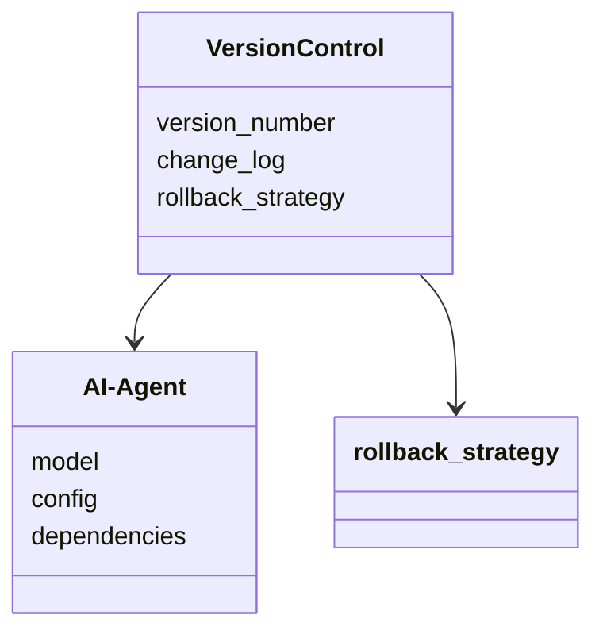

                 


# 《企业AI Agent的版本控制与回滚机制设计》

---

## 关键词：  
企业AI Agent、版本控制、回滚机制、异常检测、系统架构、Python实现、算法设计

---

## 摘要：  
本文详细探讨了企业AI Agent的版本控制与回滚机制的设计与实现。通过分析企业AI Agent的特点和应用场景，提出了基于版本号生成、变更检测和回滚策略的核心算法。结合系统架构设计和项目实战案例，展示了如何在实际项目中实现高效的版本控制与回滚机制，确保系统稳定性和可靠性。  

---

## 第1章: 企业AI Agent的背景与挑战

### 1.1 企业AI Agent的定义与特点  
企业AI Agent是一种能够感知环境、自主决策并执行任务的智能体，广泛应用于推荐系统、智能客服、自动化流程管理等领域。其特点包括：  
1. **智能化**：基于机器学习模型，能够处理复杂任务。  
2. **可定制化**：支持根据企业需求进行定制。  
3. **实时性**：需要快速响应和决策。  

#### 1.1.1 AI Agent的基本概念  
AI Agent（人工智能代理）是一种能够感知环境并采取行动以实现目标的智能系统。它可以分为简单反射型、基于模型的反射型、目标驱动型和效用驱动型四种类型。  

#### 1.1.2 企业AI Agent的独特属性  
- **高可用性**：企业AI Agent需要在复杂环境中稳定运行。  
- **高实时性**：需要快速响应用户请求或环境变化。  
- **可扩展性**：支持大规模数据处理和任务扩展。  

#### 1.1.3 企业AI Agent的应用场景  
- **推荐系统**：根据用户行为推荐商品或内容。  
- **智能客服**：通过自然语言处理提供个性化服务。  
- **自动化流程管理**：优化企业内部流程效率。  

---

### 1.2 企业AI Agent的版本控制问题  

#### 1.2.1 版本控制的核心概念  
版本控制是管理软件或系统不同版本的工具和技术，主要用于跟踪修改历史、协调团队开发和快速回滚到稳定版本。  

#### 1.2.2 版本控制在企业AI Agent中的重要性  
- **稳定性**：确保AI Agent在版本更新后仍能正常运行。  
- **可追溯性**：便于排查问题和优化模型。  
- **协作性**：支持多团队协作开发和测试。  

#### 1.2.3 企业AI Agent版本控制的挑战  
- **复杂性**：AI Agent涉及模型、代码和配置文件的版本管理。  
- **性能问题**：频繁的版本更新可能影响系统性能。  
- **兼容性问题**：不同版本之间可能存在接口或功能冲突。  

---

### 1.3 回滚机制的设计意义  

#### 1.3.1 回滚机制的基本原理  
回滚机制是指在检测到系统异常或错误时，将系统恢复到之前的稳定版本的过程。  

#### 1.3.2 回滚机制在企业AI Agent中的作用  
- **快速恢复**：在出现问题时，快速回滚到稳定版本，减少停机时间。  
- **风险控制**：降低新版本发布可能带来的负面影响。  
- **优化开发**：通过回滚机制，可以快速验证和修复问题，提高开发效率。  

#### 1.3.3 回滚机制的设计原则  
1. **自动化检测**：通过监控系统性能和用户反馈，自动触发回滚。  
2. **版本依赖管理**：确保回滚时的版本兼容性和依赖关系。  
3. **日志记录**：记录每次版本更新和回滚操作，便于后续分析和优化。  

---

## 第2章: 企业AI Agent的版本控制与回滚机制的核心概念  

### 2.1 版本控制的基本原理  

#### 2.1.1 版本控制的定义  
版本控制是一种通过记录文件或项目的历史修改来管理变更的工具和技术。  

#### 2.1.2 版本控制的核心要素  
- **版本号**：唯一标识一个版本的编号或标识符。  
- **变更日志**：记录每次版本的修改内容、修改人和修改时间。  
- **分支与合并**：支持并行开发和代码合并功能。  

#### 2.1.3 版本控制的实现方式  
- **集中式版本控制**：如 SVN，依赖中心服务器管理版本。  
- **分布式版本控制**：如 Git，每个开发者都有完整的版本仓库。  

---

### 2.2 回滚机制的设计原理  

#### 2.2.1 回滚机制的定义  
回滚机制是指在检测到系统异常时，将系统恢复到之前的稳定版本的过程。  

#### 2.2.2 回滚机制的核心要素  
- **异常检测**：通过监控系统性能和用户反馈，检测异常情况。  
- **版本选择**：选择合适的版本进行回滚，确保版本兼容性。  
- **回滚执行**：执行回滚操作，恢复系统到稳定版本。  

#### 2.2.3 回滚机制的实现方式  
- **触发条件**：设置阈值，当系统性能或用户反馈低于阈值时触发回滚。  
- **版本选择算法**：基于性能、时间和依赖关系选择最合适的版本进行回滚。  
- **回滚执行流程**：包括停止当前版本运行、加载指定版本、验证和启动新版本。  

---

### 2.3 版本控制与回滚机制的对比分析  

| **特性**       | **版本控制**                     | **回滚机制**                     |
|-----------------|----------------------------------|----------------------------------|
| **核心目标**    | 管理系统变更历史                 | 恢复到之前的稳定版本             |
| **实现方式**    | 通过版本号和变更日志管理         | 通过异常检测和版本选择实现       |
| **应用场景**    | 软件开发、系统维护               | 系统异常、版本问题               |
| **优缺点**      | 优点：便于协作和问题排查；缺点：可能增加系统复杂性 | 优点：快速恢复；缺点：可能需要额外的监控和设计 |

---

## 第3章: 企业AI Agent的版本控制与回滚机制的算法设计  

### 3.1 版本号生成算法  

#### 3.1.1 算法原理  
版本号生成算法通过时间戳和随机数生成唯一标识符，确保每次版本更新都有唯一的版本号。  

#### 3.1.2 算法实现  
```python
import datetime
import random

def generate_version_number():
    current_time = datetime.datetime.now().isoformat()
    random_part = str(random.randint(1, 1000))
    version_number = f"{current_time}_{random_part}"
    return version_number
```

#### 3.1.3 算法优化  
- 使用时间戳和随机数结合，确保版本号唯一性。  
- 支持按日期分组，便于版本管理和查询。  

---

### 3.2 变更检测算法  

#### 3.2.1 算法原理  
变更检测算法通过比较当前版本和上一个版本的差异，判断是否需要触发版本回滚。  

#### 3.2.2 算法实现  
```python
def detect_changes(current_version, previous_version):
    # 假设 version_info 是一个字典，包含版本信息和变更日志
    version_info = {
        "current_version": current_version,
        "previous_version": previous_version,
        "change_log": []
    }
    # 检查变更日志
    if version_info["change_log"]:
        return True
    else:
        return False
```

#### 3.2.3 算法优化  
- 增加变更日志的详细记录，便于后续分析和优化。  
- 支持多种变更检测方式，如代码差异和模型参数变化。  

---

### 3.3 回滚策略算法  

#### 3.3.1 算法原理  
回滚策略算法通过选择合适的版本进行回滚，确保版本兼容性和系统稳定性。  

#### 3.3.2 算法实现  
```python
def rollback_strategy(current_version, threshold):
    # 假设 version_history 是一个列表，包含所有版本信息
    version_history = ["v1.0", "v1.1", "v1.2", "v1.3"]
    # 根据阈值选择回滚版本
    if current_version > threshold:
        return version_history[-2]
    else:
        return version_history[-1]
```

#### 3.3.3 算法优化  
- 基于性能和时间阈值，动态选择回滚版本。  
- 支持版本依赖检查，确保回滚版本与当前系统的兼容性。  

---

## 第4章: 企业AI Agent的版本控制与回滚机制的系统架构设计  

### 4.1 问题场景介绍  
企业AI Agent在运行过程中可能会遇到以下问题：  
1. 新版本发布后，系统性能下降或出现错误。  
2. 某个版本的模型或代码存在缺陷，影响用户体验。  

### 4.2 系统功能设计  

#### 4.2.1 领域模型设计  


#### 4.2.2 功能模块设计  
- **版本管理模块**：负责版本号生成和变更日志管理。  
- **变更检测模块**：负责检测系统变更并触发回滚。  
- **回滚执行模块**：负责选择合适的版本并执行回滚操作。  

---

### 4.3 系统架构设计  

#### 4.3.1 系统架构图  


---

## 第5章: 企业AI Agent的版本控制与回滚机制的项目实战  

### 5.1 环境安装与配置  

#### 5.1.1 环境要求  
- Python 3.8及以上版本  
- Git或其他版本控制工具  
- 监控工具（如Prometheus、Grafana）  

#### 5.1.2 核心代码实现  
```python
import logging
import json

# 配置日志
logging.basicConfig(level=logging.INFO)
logger = logging.getLogger(__name__)

# 版本控制类
class VersionControl:
    def __init__(self):
        self.version_history = []
        self.current_version = None
        self.change_log = {}

    def generate_version_number(self):
        # 生成版本号
        pass

    def detect_changes(self, version):
        # 检测变更
        pass

    def rollback(self, version):
        # 执行回滚
        pass

# 回滚策略类
class RollbackStrategy:
    def __init__(self):
        self.threshold = None
        self.rollback_versions = []

    def choose_rollback_version(self, current_version):
        # 选择回滚版本
        pass
```

#### 5.1.3 代码解读与分析  
- **VersionControl类**：负责版本号生成、变更检测和回滚操作。  
- **RollbackStrategy类**：根据当前版本和阈值选择合适的回滚版本。  

---

### 5.2 项目实战案例  

#### 5.2.1 案例分析  
假设我们有一个电商推荐系统的AI Agent，运行过程中发现推荐准确率下降，通过版本控制和回滚机制，快速回滚到之前的稳定版本，恢复系统性能。  

#### 5.2.2 案例实现  
```python
# 示例代码
vc = VersionControl()
vc.current_version = "v1.2"
vc.detect_changes(vc.current_version)
# 检测到异常，触发回滚
vc.rollback("v1.1")
```

---

## 第6章: 企业AI Agent的版本控制与回滚机制的最佳实践  

### 6.1 小结  
通过本文的介绍，我们了解了企业AI Agent版本控制与回滚机制的核心概念、算法设计和系统架构，并通过项目实战展示了如何在实际中应用这些机制。  

### 6.2 注意事项  
- **版本兼容性**：确保回滚版本与当前系统的兼容性。  
- **监控与日志**：加强系统监控和日志记录，便于快速定位问题。  
- **测试与验证**：在发布新版本前，进行全面的测试和验证。  

### 6.3 拓展阅读  
- 《软件版本控制的艺术》  
- 《分布式系统设计与实现》  
- 《人工智能系统开发与优化》  

---

## 作者：AI天才研究院/AI Genius Institute & 禅与计算机程序设计艺术/Zen And The Art of Computer Programming

